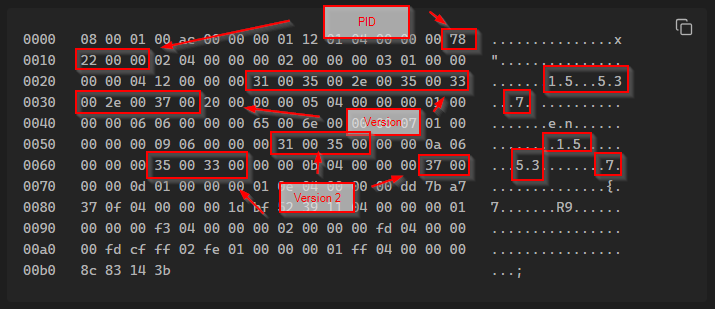

# ptracesecurity
**https://twitter.com/ptracesecurity/status/1842822140384448967 _at 2024-10-06, 07:00:10_**
<blockquote>
TeamViewer User to Kernel Elevation of Privilege PoC. CVE-2024-7479 and CVE-2024-7481. ZDI-24-1289 and ZDI-24-1290. TV-2024-1006. https://t.co/HhuHAsLaxv  #Pentesting #Vulnerability  #CyberSecurity #Infosec https://t.co/OlTCSEmU4F
</blockquote>

* https://github.com/PeterGabaldon/CVE-2024-7479_CVE-2024-7481

<table><tr>
<td></td>
</table></tr>
<table><tr>
<td>Quotes: <code>0</code></td>
<td>Replies: <code>4</code></td>
<td>Retweets: <code>10</code></td>
<td>Favorites: <code>33</code></td>
</tr></table>

---

# 7h3h4ckv157
**https://twitter.com/7h3h4ckv157/status/1842651748378574966 _at 2024-10-05, 19:43:06_**
<blockquote>
Zimbra - Remote Command Execution (CVE-2024-45519) - by @Chocapikk_ 

Source: https://t.co/1Qqr2qiLfZ https://t.co/3FxpJ1D13P
</blockquote>

* https://github.com/Chocapikk/CVE-2024-45519

<table><tr>
<td></td>
</table></tr>
<table><tr>
<td>Quotes: <code>0</code></td>
<td>Replies: <code>1</code></td>
<td>Retweets: <code>40</code></td>
<td>Favorites: <code>263</code></td>
</tr></table>

---

# cyber_advising
**https://twitter.com/cyber_advising/status/1842202508682260520 _at 2024-10-04, 13:57:59_**
<blockquote>
CVE-2024-7479 &amp; CVE-2024-7481: exploit proof of concept of a vulnerability in TeamViewer that enables an unprivileged user to load an arbitrary Kernel Driver into the system.

PoC
https://t.co/VpW1aNdYW5 https://t.co/BDepFjWMiN
</blockquote>

* https://github.com/PeterGabaldon/CVE-2024-7479_CVE-2024-7481

<table><tr>
<td></td>
</table></tr>
<table><tr>
<td>Quotes: <code>4</code></td>
<td>Replies: <code>7</code></td>
<td>Retweets: <code>197</code></td>
<td>Favorites: <code>772</code></td>
</tr></table>

---

# cyber_advising
**https://twitter.com/cyber_advising/status/1842096555500716105 _at 2024-10-04, 06:56:57_**
<blockquote>
RT @orange_8361: Remember CVE-2024-4577, the PHP-CGI RCE bypass? Actually, the Best-Fit 'feature' also impacts non-CJK codepages such as lo…
</blockquote>

<table><tr>
<td>Quotes: <code>0</code></td>
<td>Replies: <code>0</code></td>
<td>Retweets: <code>69</code></td>
<td>Favorites: <code>0</code></td>
</tr></table>

---

# kmkz_security
**https://twitter.com/kmkz_security/status/1841892650179273017 _at 2024-10-03, 17:26:43_**
<blockquote>
RT @Dinosn: PoC Exploit Releases for Zimbra RCE Flaw CVE-2024-45519: Mass Exploitation Detected https://t.co/nc3n8SPZjo
</blockquote>

* https://securityonline.info/poc-exploit-releases-for-zimbra-rce-flaw-cve-2024-45519-mass-exploitation-detected/

<table><tr>
<td>Quotes: <code>0</code></td>
<td>Replies: <code>0</code></td>
<td>Retweets: <code>51</code></td>
<td>Favorites: <code>0</code></td>
</tr></table>

---

# 0xdea
**https://twitter.com/0xdea/status/1841780875026981195 _at 2024-10-03, 10:02:33_**
<blockquote>
RT @orange_8361: Remember CVE-2024-4577, the PHP-CGI RCE bypass? Actually, the Best-Fit 'feature' also impacts non-CJK codepages such as lo…
</blockquote>

<table><tr>
<td>Quotes: <code>0</code></td>
<td>Replies: <code>0</code></td>
<td>Retweets: <code>60</code></td>
<td>Favorites: <code>0</code></td>
</tr></table>

---

# Dinosn
**https://twitter.com/Dinosn/status/1841678856022798430 _at 2024-10-03, 03:17:10_**
<blockquote>
0-Day Flaw CVE-2024-38200 in Microsoft Office Exposes NTLMv2 Hashes: PoC Exploit Released https://t.co/J2fWzJzkZe
</blockquote>

* https://securityonline.info/0-day-flaw-cve-2024-38200-in-microsoft-office-exposes-ntlmv2-hashes-poc-exploit-released/

<table><tr>
<td>Quotes: <code>0</code></td>
<td>Replies: <code>0</code></td>
<td>Retweets: <code>33</code></td>
<td>Favorites: <code>85</code></td>
</tr></table>

---

# BleepinComputer
**https://twitter.com/BleepinComputer/status/1841552709943529783 _at 2024-10-02, 18:55:55_**
<blockquote>
Critical Ivanti Endpoint Manager vulnerability (CVE-2024-29824) with public exploit code now actively used in remote code execution attacks - @serghei
https://t.co/OsRM5x6BHq
</blockquote>

* https://www.bleepingcomputer.com/news/security/critical-ivanti-rce-flaw-with-public-exploit-now-used-in-attacks/

<table><tr>
<td>Quotes: <code>5</code></td>
<td>Replies: <code>0</code></td>
<td>Retweets: <code>55</code></td>
<td>Favorites: <code>102</code></td>
</tr></table>

---

# kmkz_security
**https://twitter.com/kmkz_security/status/1841521826020884500 _at 2024-10-02, 16:53:11_**
<blockquote>
RT @orange_8361: Remember CVE-2024-4577, the PHP-CGI RCE bypass? Actually, the Best-Fit 'feature' also impacts non-CJK codepages such as lo…
</blockquote>

<table><tr>
<td>Quotes: <code>0</code></td>
<td>Replies: <code>0</code></td>
<td>Retweets: <code>67</code></td>
<td>Favorites: <code>0</code></td>
</tr></table>

---

# SinSinology
**https://twitter.com/SinSinology/status/1841516562148163925 _at 2024-10-02, 16:32:16_**
<blockquote>
(CVE-2024-8885 🔥) At @watchtowrcyber I reported a Local Privilege Escalation in Sophos EDR leading to SYSTEM⏫
https://t.co/AoTPji2CaP https://t.co/yhIXoPp7h3
</blockquote>

* https://www.sophos.com/en-us/security-advisories/sophos-sa-20241002-cde-lpe

<table><tr>
<td></td>
</table></tr>
<table><tr>
<td>Quotes: <code>1</code></td>
<td>Replies: <code>10</code></td>
<td>Retweets: <code>28</code></td>
<td>Favorites: <code>159</code></td>
</tr></table>

---

# elhackernet
**https://twitter.com/elhackernet/status/1841474105691767280 _at 2024-10-02, 13:43:34_**
<blockquote>
🚨Vulnerabilidad crítica en Zimbra

➡️ CVE-2024-45519 (RCE)
https://t.co/esOiyD9q6e https://t.co/8ujpljp1nq
</blockquote>

* https://blog.projectdiscovery.io/zimbra-remote-code-execution/

<table><tr>
<td></td>
</table></tr>
<table><tr>
<td>Quotes: <code>0</code></td>
<td>Replies: <code>0</code></td>
<td>Retweets: <code>17</code></td>
<td>Favorites: <code>40</code></td>
</tr></table>

---

# TheHackersNews
**https://twitter.com/TheHackersNews/status/1841452032151974242 _at 2024-10-02, 12:15:51_**
<blockquote>
🚨 A critical #vulnerability, CosmicSting (CVE-2024-34102), has hit 5% of Adobe Commerce &amp; Magento stores.

7 hacker groups are injecting malicious scripts.

Details here: https://t.co/jvrvhsPbgJ

Patching isn’t enough—rotate your encryption keys now!

#cybersecurity
</blockquote>

* https://thehackernews.com/2024/10/alert-adobe-commerce-and-magento-stores.html

<table><tr>
<td>Quotes: <code>1</code></td>
<td>Replies: <code>1</code></td>
<td>Retweets: <code>12</code></td>
<td>Favorites: <code>39</code></td>
</tr></table>

---

# Dinosn
**https://twitter.com/Dinosn/status/1841201179402846375 _at 2024-10-01, 19:39:03_**
<blockquote>
Zimbra - Remote Command Execution (CVE-2024-45519) https://t.co/7eexZpA55t
</blockquote>

* https://www.reddit.com/r/netsec/comments/1ftojbr/zimbra_remote_command_execution_cve202445519/

<table><tr>
<td>Quotes: <code>0</code></td>
<td>Replies: <code>0</code></td>
<td>Retweets: <code>10</code></td>
<td>Favorites: <code>40</code></td>
</tr></table>

---

# sekurlsa_pw
**https://twitter.com/sekurlsa_pw/status/1841129017799258472 _at 2024-10-01, 14:52:19_**
<blockquote>
PoC and wirte-up for CVE-2024-38200: Microsoft Office NTLMv2 Disclosure Vulnerability 
https://t.co/ciHkPHPj1f

Patch: https://t.co/RUSNlgm078 https://t.co/z3l7DdvyUv
</blockquote>

* https://github.com/passtheticket/CVE-2024-38200
* https://msrc.microsoft.com/update-guide/vulnerability/CVE-2024-38200

<table><tr>
<td></td>
</table></tr>
<table><tr>
<td>Quotes: <code>2</code></td>
<td>Replies: <code>2</code></td>
<td>Retweets: <code>44</code></td>
<td>Favorites: <code>172</code></td>
</tr></table>

---

# cyb3rops
**https://twitter.com/cyb3rops/status/1841036635296653427 _at 2024-10-01, 08:45:13_**
<blockquote>
RT @JusticeRage: If you're using @Zimbra, mass-exploitation of CVE-2024-45519 has begun. Patch yesterday.

Malicious emails are coming from…
</blockquote>

<table><tr>
<td>Quotes: <code>0</code></td>
<td>Replies: <code>0</code></td>
<td>Retweets: <code>41</code></td>
<td>Favorites: <code>0</code></td>
</tr></table>

---

# 0xor0ne
**https://twitter.com/0xor0ne/status/1841010207163322638 _at 2024-10-01, 07:00:12_**
<blockquote>
Exploitation of a type confusion vulnerability in v8 (Chrome, CVE-2024-5830)

https://t.co/d0ZT5O8vHK

Credits @mmolgtm

#infosec #chrome https://t.co/yIZJHp8FyP
</blockquote>

* https://github.blog/security/vulnerability-research/from-object-transition-to-rce-in-the-chrome-renderer/

<table><tr>
<td></td>
<td></td>
</table></tr>
<table><tr>
<td>Quotes: <code>0</code></td>
<td>Replies: <code>0</code></td>
<td>Retweets: <code>7</code></td>
<td>Favorites: <code>37</code></td>
</tr></table>

---

# kmkz_security
**https://twitter.com/kmkz_security/status/1841006000049946876 _at 2024-10-01, 06:43:29_**
<blockquote>
RT @0xor0ne: Exploitation of a type confusion vulnerability in v8 (Chrome, CVE-2024-5830)

https://t.co/d0ZT5O8vHK

Credits @mmolgtm

#info…
</blockquote>

* https://github.blog/security/vulnerability-research/from-object-transition-to-rce-in-the-chrome-renderer/

<table><tr>
<td>Quotes: <code>0</code></td>
<td>Replies: <code>0</code></td>
<td>Retweets: <code>42</code></td>
<td>Favorites: <code>0</code></td>
</tr></table>

---

# the_yellow_fall
**https://twitter.com/the_yellow_fall/status/1840930948092969451 _at 2024-10-01, 01:45:15_**
<blockquote>
A serious vulnerability, dubbed #KartLANPwn (CVE-2024-45200), has been identified in the wildly popular Nintendo game Mario Kart 8 Deluxe, putting millions of players at risk of remote code execution (RCE) during multiplayer sessions. PoC Published

https://t.co/IzGV1KBIQe
</blockquote>

* https://securityonline.info/kartlanpwn-cve-2024-45200-exploits-mario-kart-8-deluxe-lan-play-feature-for-rce/

<table><tr>
<td>Quotes: <code>0</code></td>
<td>Replies: <code>1</code></td>
<td>Retweets: <code>15</code></td>
<td>Favorites: <code>57</code></td>
</tr></table>

---

