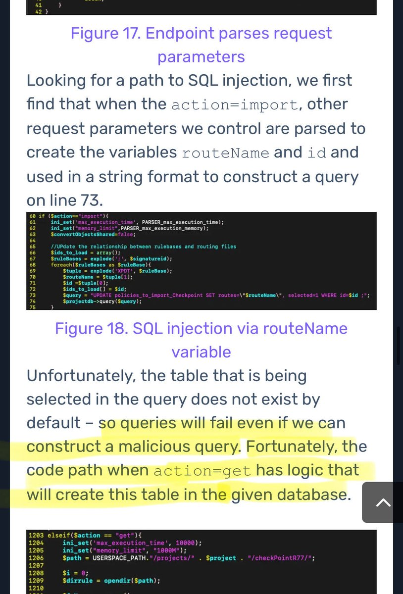
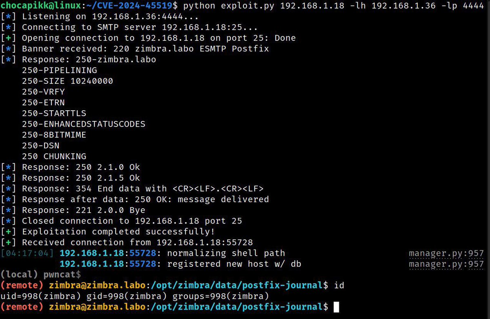

# TheHackersNews
**https://twitter.com/TheHackersNews/status/1846504587962052755 _at 2024-10-16, 10:52:54_**
<blockquote>
🔥 One click, and chaos begins!

North Korean APT group ScarCruft has been linked to the exploitation of a zero-day Windows flaw (CVE-2024-38178), targeting unpatched Internet Explorer Mode in Edge, infecting devices with RokRAT malware.

Read: https://t.co/7473o7Gf9r

#infosec
</blockquote>

* https://thehackernews.com/2024/10/north-korean-scarcruft-exploits-windows.html

<table><tr>
<td>Quotes: <code>0</code></td>
<td>Replies: <code>2</code></td>
<td>Retweets: <code>22</code></td>
<td>Favorites: <code>45</code></td>
</tr></table>

---

# TheHackersNews
**https://twitter.com/TheHackersNews/status/1846417578987606155 _at 2024-10-16, 05:07:10_**
<blockquote>
🛡️ GitHub has released urgent security updates to fix a critical flaw (CVE-2024-9487) with a CVSS score of 9.5!

This bug allows unauthorized access by bypassing SAML SSO authentication—an immediate threat to your enterprise.

Details: https://t.co/gn7I8wf5TM

#infosec
</blockquote>

* https://thehackernews.com/2024/10/github-patches-critical-flaw-in.html

<table><tr>
<td>Quotes: <code>4</code></td>
<td>Replies: <code>3</code></td>
<td>Retweets: <code>62</code></td>
<td>Favorites: <code>117</code></td>
</tr></table>

---

# TheHackersNews
**https://twitter.com/TheHackersNews/status/1846414856456429758 _at 2024-10-16, 04:56:21_**
<blockquote>
💥 A critical flaw in SolarWinds Web Help Desk (CVE-2024-28987) has been actively exploited, and it involves hard-coded credentials that allow attackers to access sensitive help desk tickets.

Learn more: https://t.co/CFeKwQ1zTj

#infosec #cybersecurity
</blockquote>

* https://thehackernews.com/2024/10/cisa-warns-of-active-exploitation-in.html

<table><tr>
<td>Quotes: <code>0</code></td>
<td>Replies: <code>1</code></td>
<td>Retweets: <code>34</code></td>
<td>Favorites: <code>75</code></td>
</tr></table>

---

# hosselot
**https://twitter.com/hosselot/status/1846228724049383632 _at 2024-10-15, 16:36:43_**
<blockquote>
Mozilla fixed an almost similar ITW use-after-free vulnerability in Firefox several years ago (CVE-2016-9079). It happens during SVG animation handling with no JS callback involved!

A nice write-up by rapid7:
https://t.co/LpKuchYV5m

Mozilla bug entry:
https://t.co/wlvz389F0R
</blockquote>

* https://web.archive.org/web/20210804164844/https://www.rapid7.com/blog/post/2016/12/29/a-friendly-fireside-foray-into-a-firefox-fracas/
* https://bugzilla.mozilla.org/show_bug.cgi?id=1321066

<table><tr>
<td>Quotes: <code>0</code></td>
<td>Replies: <code>1</code></td>
<td>Retweets: <code>16</code></td>
<td>Favorites: <code>67</code></td>
</tr></table>

---

# piedpiper1616
**https://twitter.com/piedpiper1616/status/1846008791818818021 _at 2024-10-15, 02:02:47_**
<blockquote>
RT @watchtowrcyber: Some Fortinet Nday.. for now.... :-) CVE-2024-23113

https://t.co/Y10rZ8D0KC
</blockquote>

* https://labs.watchtowr.com/fortinet-fortigate-cve-2024-23113-a-super-complex-vulnerability-in-a-super-secure-appliance-in-2024/

<table><tr>
<td>Quotes: <code>0</code></td>
<td>Replies: <code>0</code></td>
<td>Retweets: <code>45</code></td>
<td>Favorites: <code>0</code></td>
</tr></table>

---

# ptracesecurity
**https://twitter.com/ptracesecurity/status/1845996801637101575 _at 2024-10-15, 01:15:09_**
<blockquote>
Fortinet FortiGate CVE-2024-23113 - A Super Complex Vulnerability In A Super Secure Appliance In 2024 https://t.co/GfsDCgdXVF  #Pentesting #CyberSecurity #Infosec https://t.co/QYZWorO8Vp
</blockquote>

* https://labs.watchtowr.com/fortinet-fortigate-cve-2024-23113-a-super-complex-vulnerability-in-a-super-secure-appliance-in-2024/

<table><tr>
<td></td>
<td></td>
<td></td>
</table></tr>
<table><tr>
<td>Quotes: <code>0</code></td>
<td>Replies: <code>0</code></td>
<td>Retweets: <code>12</code></td>
<td>Favorites: <code>40</code></td>
</tr></table>

---

# kmkz_security
**https://twitter.com/kmkz_security/status/1845924747441254846 _at 2024-10-14, 20:28:50_**
<blockquote>
RT @watchtowrcyber: Some Fortinet Nday.. for now.... :-) CVE-2024-23113

https://t.co/Y10rZ8D0KC
</blockquote>

* https://labs.watchtowr.com/fortinet-fortigate-cve-2024-23113-a-super-complex-vulnerability-in-a-super-secure-appliance-in-2024/

<table><tr>
<td>Quotes: <code>0</code></td>
<td>Replies: <code>0</code></td>
<td>Retweets: <code>46</code></td>
<td>Favorites: <code>0</code></td>
</tr></table>

---

# TheHackersNews
**https://twitter.com/TheHackersNews/status/1845750632902189212 _at 2024-10-14, 08:56:57_**
<blockquote>
Veeam Backup flaw targeted for #ransomware attacks—CVE-2024-40711 exploited!

This flaw allows attackers to create local admin accounts, granting them full control to deploy ransomware like Akira and Fog.

Learn how to defend against active threats: https://t.co/nsJyoUrmae
</blockquote>

* https://thehackernews.com/2024/10/critical-veeam-vulnerability-exploited.html

<table><tr>
<td>Quotes: <code>0</code></td>
<td>Replies: <code>1</code></td>
<td>Retweets: <code>55</code></td>
<td>Favorites: <code>120</code></td>
</tr></table>

---

# TheHackersNews
**https://twitter.com/TheHackersNews/status/1845712642108981436 _at 2024-10-14, 06:26:00_**
<blockquote>
🔔 Update: The Tor Project has issued an emergency update (v13.5.7) to address CVE-2024-9680, a Firefox flaw currently under active exploitation, reportedly targeting Tor Browser users.

https://t.co/Agj4ZbBBOB

It may allow control of the browser but likely won't affect Tails'
</blockquote>

* https://thehackernews.com/2024/10/mozilla-warns-of-active-exploitation-in.html

<table><tr>
<td>Quotes: <code>4</code></td>
<td>Replies: <code>2</code></td>
<td>Retweets: <code>66</code></td>
<td>Favorites: <code>138</code></td>
</tr></table>

---

# TheHackersNews
**https://twitter.com/TheHackersNews/status/1845399506298286202 _at 2024-10-13, 09:41:42_**
<blockquote>
Iranian threat actor OilRig is exploiting a Windows Kernel #vulnerability (CVE-2024-30088) to gain SYSTEM privileges, enabling backdoor deployment and data theft.

Learn how to protect your systems now https://t.co/rKGvWw33NO

#cybersecurity #hacking #malware
</blockquote>

* https://thehackernews.com/2024/10/oilrig-exploits-windows-kernel-flaw-in.html

<table><tr>
<td>Quotes: <code>3</code></td>
<td>Replies: <code>1</code></td>
<td>Retweets: <code>103</code></td>
<td>Favorites: <code>171</code></td>
</tr></table>

---

# ptracesecurity
**https://twitter.com/ptracesecurity/status/1845260706653827411 _at 2024-10-13, 00:30:10_**
<blockquote>
Windows Wi-Fi Driver RCE Vulnerability – CVE-2024-30078 https://t.co/DxjvKNQpOw  #Pentesting #Vulnerability  #CyberSecurity #Infosec https://t.co/C5B6NDrKHW
</blockquote>

* https://www.crowdfense.com/windows-wi-fi-driver-rce-vulnerability-cve-2024-30078/

<table><tr>
<td></td>
<td></td>
<td></td>
<td></td>
</table></tr>
<table><tr>
<td>Quotes: <code>0</code></td>
<td>Replies: <code>0</code></td>
<td>Retweets: <code>25</code></td>
<td>Favorites: <code>90</code></td>
</tr></table>

---

# hackerfantastic
**https://twitter.com/hackerfantastic/status/1845190559930961926 _at 2024-10-12, 19:51:26_**
<blockquote>
RT @blackorbird: Asian APT group used this Firefox 0day vulnerability for nearly half a year for watering hole attacks
CVE-2024-9680
https:…
</blockquote>

<table><tr>
<td>Quotes: <code>0</code></td>
<td>Replies: <code>0</code></td>
<td>Retweets: <code>42</code></td>
<td>Favorites: <code>0</code></td>
</tr></table>

---

# ptracesecurity
**https://twitter.com/ptracesecurity/status/1845090841536143658 _at 2024-10-12, 13:15:11_**
<blockquote>
Windows Wi-Fi Driver RCE Vulnerability – CVE-2024-30078  https://t.co/DxjvKNQpOw  #Pentesting #Vulnerability #Windows #CyberSecurity #Infosec https://t.co/F8V0tPE7zf
</blockquote>

* https://www.crowdfense.com/windows-wi-fi-driver-rce-vulnerability-cve-2024-30078/

<table><tr>
<td></td>
<td></td>
<td></td>
<td></td>
</table></tr>
<table><tr>
<td>Quotes: <code>0</code></td>
<td>Replies: <code>0</code></td>
<td>Retweets: <code>12</code></td>
<td>Favorites: <code>42</code></td>
</tr></table>

---

# cyber_advising
**https://twitter.com/cyber_advising/status/1845077168784658929 _at 2024-10-12, 12:20:51_**
<blockquote>
CVE-2024-9570: A vulnerability was found in D-Link DIR-619L B1 2.06 and classified as critical. Affected by this issue is the function formEasySetTimezone of the file /goform/formEasySetTimezone. 

PoC
https://t.co/hxBtJxLyVN https://t.co/BnqII8UAX3
</blockquote>

* https://github.com/dylvie/CVE-2024-9570_D-Link-DIR-619L-bof

<table><tr>
<td></td>
</table></tr>
<table><tr>
<td>Quotes: <code>0</code></td>
<td>Replies: <code>3</code></td>
<td>Retweets: <code>33</code></td>
<td>Favorites: <code>88</code></td>
</tr></table>

---

# kmkz_security
**https://twitter.com/kmkz_security/status/1845032247931396508 _at 2024-10-12, 09:22:21_**
<blockquote>
RT @piedpiper1616: GitHub - rvizx/CVE-2024-42640: Unauthenticated Remote Code Execution via Angular-Base64-Upload Library - https://t.co/8H…
</blockquote>

* 

<table><tr>
<td>Quotes: <code>0</code></td>
<td>Replies: <code>0</code></td>
<td>Retweets: <code>32</code></td>
<td>Favorites: <code>0</code></td>
</tr></table>

---

# piedpiper1616
**https://twitter.com/piedpiper1616/status/1844994418128060865 _at 2024-10-12, 06:52:02_**
<blockquote>
GitHub - rvizx/CVE-2024-42640: Unauthenticated Remote Code Execution via Angular-Base64-Upload Library - https://t.co/8HJI4BlNOz
</blockquote>

* https://github.com/rvizx/CVE-2024-42640

<table><tr>
<td>Quotes: <code>0</code></td>
<td>Replies: <code>0</code></td>
<td>Retweets: <code>30</code></td>
<td>Favorites: <code>102</code></td>
</tr></table>

---

# HunterMapping
**https://twitter.com/HunterMapping/status/1844991212480029011 _at 2024-10-12, 06:39:17_**
<blockquote>
🚨Alert🚨CVE-2024-37404: Ivanti Connect Secure - Authenticated RCE via OpenSSL CRLF Injection
🔥PoC: https://t.co/ZOQmvreUoJ
📊 2.4M+ Services are found on https://t.co/ysWb28BTvF yearly
🔗Hunter Link: https://t.co/PWBEkvpQU0
👇Search Query
HUNTER:/product.name="Ivanti Connect https://t.co/C7vaMJdncn
</blockquote>

* https://blog.amberwolf.com/blog/2024/october/cve-2024-37404-ivanti-connect-secure-authenticated-rce-via-openssl-crlf-injection/
* http://hunter.how
* https://hunter.how/list?searchValue=product.name%3D%22Ivanti%20Connect%20Secure%22

<table><tr>
<td></td>
</table></tr>
<table><tr>
<td>Quotes: <code>0</code></td>
<td>Replies: <code>3</code></td>
<td>Retweets: <code>24</code></td>
<td>Favorites: <code>113</code></td>
</tr></table>

---

# binitamshah
**https://twitter.com/binitamshah/status/1844699509202559360 _at 2024-10-11, 11:20:10_**
<blockquote>
Proof of Concept Exploit for CVE-2024-9464 : https://t.co/MJdY8KUVOJ 

Palo Alto Expedition: From N-Day to Full Compromise : https://t.co/skvf12XotI https://t.co/Vj3AEWDRfR
</blockquote>

* https://github.com/horizon3ai/CVE-2024-9464
* https://www.horizon3.ai/attack-research/palo-alto-expedition-from-n-day-to-full-compromise/

<table><tr>
<td></td>
</table></tr>
<table><tr>
<td>Quotes: <code>0</code></td>
<td>Replies: <code>1</code></td>
<td>Retweets: <code>87</code></td>
<td>Favorites: <code>338</code></td>
</tr></table>

---

# kmkz_security
**https://twitter.com/kmkz_security/status/1844635143958360270 _at 2024-10-11, 07:04:24_**
<blockquote>
RT @reverseame: Windows Wi-Fi Driver RCE Vulnerability – CVE-2024-30078 #Windows #WiFiDriver #RCEVulnerability #CVE-2024-30078 #Crowdfense…
</blockquote>

<table><tr>
<td>Quotes: <code>0</code></td>
<td>Replies: <code>0</code></td>
<td>Retweets: <code>53</code></td>
<td>Favorites: <code>0</code></td>
</tr></table>

---

# TheHackersNews
**https://twitter.com/TheHackersNews/status/1844626821431578911 _at 2024-10-11, 06:31:20_**
<blockquote>
🚩 A critical security flaw in #GitLab (CVE-2024-9164) could allow attackers to run CI/CD pipelines on unauthorized branches.

Find details here: https://t.co/YCBIt4cZ1T

Update your instance ASAP to avoid becoming the next victim.

#cybersecurity #devops
</blockquote>

* https://thehackernews.com/2024/10/new-critical-gitlab-vulnerability-could.html

<table><tr>
<td>Quotes: <code>3</code></td>
<td>Replies: <code>1</code></td>
<td>Retweets: <code>28</code></td>
<td>Favorites: <code>56</code></td>
</tr></table>

---

# ptracesecurity
**https://twitter.com/ptracesecurity/status/1844562344786980936 _at 2024-10-11, 02:15:07_**
<blockquote>
Patch Tuesday Diffing: CVE-2024-20696 - Windows Libarchive RCE https://t.co/UECZFSUpED  #Pentesting #Windows  #CyberSecurity #Infosec https://t.co/tPii1ir9LC
</blockquote>

* https://clearbluejar.github.io/posts/patch-tuesday-diffing-cve-2024-20696-windows-libarchive-rce/

<table><tr>
<td></td>
<td></td>
<td></td>
<td></td>
</table></tr>
<table><tr>
<td>Quotes: <code>1</code></td>
<td>Replies: <code>0</code></td>
<td>Retweets: <code>13</code></td>
<td>Favorites: <code>34</code></td>
</tr></table>

---

# x0rz
**https://twitter.com/x0rz/status/1844431004972482881 _at 2024-10-10, 17:33:14_**
<blockquote>
RT @cyb3rops: Omg … reading this report by
@Horizon3Attack
on PaloAlto‘s Expedition RCE CVE-2024-9464 (and others) seriously shakes any rem…
</blockquote>

<table><tr>
<td>Quotes: <code>0</code></td>
<td>Replies: <code>0</code></td>
<td>Retweets: <code>125</code></td>
<td>Favorites: <code>0</code></td>
</tr></table>

---

# GHSecurityLab
**https://twitter.com/GHSecurityLab/status/1844407944512774611 _at 2024-10-10, 16:01:36_**
<blockquote>
GHSL-2022-085: Java deserialization leading to RCE in pac4j-core - CVE-2023-25581 https://t.co/2qcYwPaCYk
</blockquote>

* https://securitylab.github.com/advisories/GHSL-2022-085_pac4j/

<table><tr>
<td>Quotes: <code>0</code></td>
<td>Replies: <code>2</code></td>
<td>Retweets: <code>11</code></td>
<td>Favorites: <code>38</code></td>
</tr></table>

---

# piedpiper1616
**https://twitter.com/piedpiper1616/status/1844403894434279820 _at 2024-10-10, 15:45:30_**
<blockquote>
Analyst CVE-2024-8698 on KeyCloak - https://t.co/DRUTEx80cS
</blockquote>

* https://huydoppa.hashnode.dev/analyst-cve-2024-8698-keycloak-with-zero-knowledge-about-keycloak

<table><tr>
<td>Quotes: <code>1</code></td>
<td>Replies: <code>0</code></td>
<td>Retweets: <code>30</code></td>
<td>Favorites: <code>96</code></td>
</tr></table>

---

# TheHackersNews
**https://twitter.com/TheHackersNews/status/1844350312016118170 _at 2024-10-10, 12:12:35_**
<blockquote>
A critical unpatched #vulnerability (CVE-2024-9441) in the Nice Linear eMerge E3 access controller has been uncovered, carrying a CVSS score of 9.8, with proof-of-concept exploits already circulating.

Learn more: https://t.co/TbQR90q0ce

#infosec #cybersecurity
</blockquote>

* https://thehackernews.com/2024/10/experts-warn-of-critical-unpatched.html

<table><tr>
<td>Quotes: <code>1</code></td>
<td>Replies: <code>1</code></td>
<td>Retweets: <code>38</code></td>
<td>Favorites: <code>64</code></td>
</tr></table>

---

# cyb3rops
**https://twitter.com/cyb3rops/status/1844289319084945886 _at 2024-10-10, 08:10:13_**
<blockquote>
Omg … reading this report by
@Horizon3Attack
on PaloAlto‘s Expedition RCE CVE-2024-9464 (and others) seriously shakes any remaining trust in their software. Every chapter feels like a slap in their face.
https://t.co/LOg490bfEL https://t.co/3YN5YwhdN5
</blockquote>

* https://www.horizon3.ai/attack-research/palo-alto-expedition-from-n-day-to-full-compromise/

<table><tr>
<td></td>
<td></td>
<td></td>
<td></td>
</table></tr>
<table><tr>
<td>Quotes: <code>6</code></td>
<td>Replies: <code>10</code></td>
<td>Retweets: <code>122</code></td>
<td>Favorites: <code>433</code></td>
</tr></table>

---

# TheHackersNews
**https://twitter.com/TheHackersNews/status/1844253342735925625 _at 2024-10-10, 05:47:16_**
<blockquote>
⚠️ Cyber Alerts:

—Fortinet CVE-2024-23113 actively exploited, patch by Oct 30!
—Palo Alto Expedition vulnerable to SQL &amp; OS injection.
—Cisco patches critical bug in Nexus Dashboard Fabric Controller.

Read: https://t.co/b7vOqgCVRe

Critical systems must be patched immediately.
</blockquote>

* https://thehackernews.com/2024/10/cisa-warns-of-critical-fortinet-flaw-as.html

<table><tr>
<td>Quotes: <code>0</code></td>
<td>Replies: <code>1</code></td>
<td>Retweets: <code>63</code></td>
<td>Favorites: <code>108</code></td>
</tr></table>

---

# TheHackersNews
**https://twitter.com/TheHackersNews/status/1844233197678362662 _at 2024-10-10, 04:27:13_**
<blockquote>
🚨 Warning: A critical #vulnerability (CVE-2024-9680) in Firefox is being actively exploited.

Don’t wait—ensure your browsers are updated now to protect against potential remote code execution.

Learn more: https://t.co/Agj4ZbBBOB

#cybersecurity #hacking
</blockquote>

* https://thehackernews.com/2024/10/mozilla-warns-of-active-exploitation-in.html

<table><tr>
<td>Quotes: <code>12</code></td>
<td>Replies: <code>12</code></td>
<td>Retweets: <code>244</code></td>
<td>Favorites: <code>401</code></td>
</tr></table>

---

# piedpiper1616
**https://twitter.com/piedpiper1616/status/1844162983561515299 _at 2024-10-09, 23:48:12_**
<blockquote>
RT @binitamshah: PoC  for CVE-2023-52447 released -  A Linux Kernel Flaw Enabling Container Escape : https://t.co/UHqpWTinfW
</blockquote>

* https://github.com/google/security-research/blob/master/pocs/linux/kernelctf/CVE-2023-52447_cos/docs/exploit.md

<table><tr>
<td>Quotes: <code>0</code></td>
<td>Replies: <code>0</code></td>
<td>Retweets: <code>41</code></td>
<td>Favorites: <code>0</code></td>
</tr></table>

---

# piedpiper1616
**https://twitter.com/piedpiper1616/status/1844162672176279614 _at 2024-10-09, 23:46:58_**
<blockquote>
RT @Horizon3Attack: Our latest post detailing compromising the #PaloAlto #Expedition. While investigating CVE-2024-5910, we discovered and…
</blockquote>

<table><tr>
<td>Quotes: <code>0</code></td>
<td>Replies: <code>0</code></td>
<td>Retweets: <code>78</code></td>
<td>Favorites: <code>0</code></td>
</tr></table>

---

# cyb3rops
**https://twitter.com/cyb3rops/status/1844121074965061802 _at 2024-10-09, 21:01:41_**
<blockquote>
RT @sekurlsa_pw: CVE-2024-38124: Predict the name of the New Domain controller and become Domain Admin. Reminds me of sAMAccountName Spoofi…
</blockquote>

<table><tr>
<td>Quotes: <code>0</code></td>
<td>Replies: <code>0</code></td>
<td>Retweets: <code>91</code></td>
<td>Favorites: <code>0</code></td>
</tr></table>

---

# momika233
**https://twitter.com/momika233/status/1844075123110027285 _at 2024-10-09, 17:59:05_**
<blockquote>
CVE-2024-9464: Palo Alto Expedition Authenticated Command Injection
https://t.co/zqgA0Db700
</blockquote>

* https://github.com/horizon3ai/CVE-2024-9464

<table><tr>
<td>Quotes: <code>0</code></td>
<td>Replies: <code>0</code></td>
<td>Retweets: <code>8</code></td>
<td>Favorites: <code>48</code></td>
</tr></table>

---

# wvuuuuuuuuuuuuu
**https://twitter.com/wvuuuuuuuuuuuuu/status/1844062624033669575 _at 2024-10-09, 17:09:25_**
<blockquote>
RT @Horizon3Attack: Our latest post detailing compromising the #PaloAlto #Expedition. While investigating CVE-2024-5910, we discovered and…
</blockquote>

<table><tr>
<td>Quotes: <code>0</code></td>
<td>Replies: <code>0</code></td>
<td>Retweets: <code>116</code></td>
<td>Favorites: <code>0</code></td>
</tr></table>

---

# binitamshah
**https://twitter.com/binitamshah/status/1844023619334320505 _at 2024-10-09, 14:34:25_**
<blockquote>
PoC  for CVE-2023-52447 released -  A Linux Kernel Flaw Enabling Container Escape : https://t.co/UHqpWTinfW
</blockquote>

* https://github.com/google/security-research/blob/master/pocs/linux/kernelctf/CVE-2023-52447_cos/docs/exploit.md

<table><tr>
<td>Quotes: <code>0</code></td>
<td>Replies: <code>2</code></td>
<td>Retweets: <code>62</code></td>
<td>Favorites: <code>257</code></td>
</tr></table>

---

# hosselot
**https://twitter.com/hosselot/status/1844021741506740596 _at 2024-10-09, 14:26:58_**
<blockquote>
The fix for Mozilla Firefox In-The-Wild use-after-free vulnerability in Animation timeline (CVE-2024-9680 [1923344]):
https://t.co/MaJEW7nze9
</blockquote>

* https://github.com/mozilla/gecko-dev/commit/7a85a111b5f42cdc07f438e36f9597c4c6dc1d48

<table><tr>
<td>Quotes: <code>1</code></td>
<td>Replies: <code>2</code></td>
<td>Retweets: <code>11</code></td>
<td>Favorites: <code>48</code></td>
</tr></table>

---

# TheHackersNews
**https://twitter.com/TheHackersNews/status/1843907805008552386 _at 2024-10-09, 06:54:13_**
<blockquote>
👉 Microsoft has released patches for 118 vulnerabilities, two of which (CVE-2024-43572 and CVE-2024-43573) are being actively exploited in the wild.

Find details here: https://t.co/JZETALKYFs

Ensure your systems are protected—apply these patches ASAP!

#cybersecurity #infosec
</blockquote>

* https://thehackernews.com/2024/10/microsoft-issues-security-update-fixing.html

<table><tr>
<td>Quotes: <code>2</code></td>
<td>Replies: <code>1</code></td>
<td>Retweets: <code>39</code></td>
<td>Favorites: <code>72</code></td>
</tr></table>

---

# 1ZRR4H
**https://twitter.com/1ZRR4H/status/1843778083138208142 _at 2024-10-08, 22:18:45_**
<blockquote>
RT @ryanaraine: The zero-day, tagged as CVE-2024-43572, is  a remote code execution issue in Microsoft Management Console. Redmond says att…
</blockquote>

<table><tr>
<td>Quotes: <code>0</code></td>
<td>Replies: <code>0</code></td>
<td>Retweets: <code>35</code></td>
<td>Favorites: <code>0</code></td>
</tr></table>

---

# hackerfantastic
**https://twitter.com/hackerfantastic/status/1843776113258180773 _at 2024-10-08, 22:10:55_**
<blockquote>
RT @ryanaraine: The zero-day, tagged as CVE-2024-43572, is  a remote code execution issue in Microsoft Management Console. Redmond says att…
</blockquote>

<table><tr>
<td>Quotes: <code>0</code></td>
<td>Replies: <code>0</code></td>
<td>Retweets: <code>43</code></td>
<td>Favorites: <code>0</code></td>
</tr></table>

---

# ryanaraine
**https://twitter.com/ryanaraine/status/1843728004264137137 _at 2024-10-08, 18:59:45_**
<blockquote>
The zero-day, tagged as CVE-2024-43572, is  a remote code execution issue in Microsoft Management Console. Redmond says attackers are rigging  Microsoft Saved Console (MSC) files to execute remote code on targeted Windows systems.
https://t.co/nGyZwHer25
</blockquote>

* https://www.securityweek.com/patch-tuesday-microsoft-confirms-exploited-zero-day-in-windows-management-console/

<table><tr>
<td>Quotes: <code>3</code></td>
<td>Replies: <code>1</code></td>
<td>Retweets: <code>68</code></td>
<td>Favorites: <code>152</code></td>
</tr></table>

---

# wvuuuuuuuuuuuuu
**https://twitter.com/wvuuuuuuuuuuuuu/status/1843709569094361165 _at 2024-10-08, 17:46:30_**
<blockquote>
RT @Chocapikk_: exploit + lab setup for CVE-2024-45519

https://t.co/twEOqIFZMn https://t.co/dJrPESiRJH
</blockquote>

* https://github.com/Chocapikk/CVE-2024-45519

<table><tr>
<td></td>
</table></tr>
<table><tr>
<td>Quotes: <code>0</code></td>
<td>Replies: <code>0</code></td>
<td>Retweets: <code>144</code></td>
<td>Favorites: <code>0</code></td>
</tr></table>

---

# wvuuuuuuuuuuuuu
**https://twitter.com/wvuuuuuuuuuuuuu/status/1843700716336230718 _at 2024-10-08, 17:11:19_**
<blockquote>
RT @buffaloverflow: Just published an advisory for CVE-2024-37404, an interesting CRLF issue leading to RCE in Ivanti Connect Secure! 🧐🐛

G…
</blockquote>

<table><tr>
<td>Quotes: <code>0</code></td>
<td>Replies: <code>0</code></td>
<td>Retweets: <code>50</code></td>
<td>Favorites: <code>0</code></td>
</tr></table>

---

# buffaloverflow
**https://twitter.com/buffaloverflow/status/1843673151664009337 _at 2024-10-08, 15:21:47_**
<blockquote>
Just published an advisory for CVE-2024-37404, an interesting CRLF issue leading to RCE in Ivanti Connect Secure! 🧐🐛

Get the technical details on the @AmberWolfSec blog👇

https://t.co/ChmrC70lE0
</blockquote>

* https://blog.amberwolf.com/blog/2024/october/cve-2024-37404-ivanti-connect-secure-authenticated-rce-via-openssl-crlf-injection/

<table><tr>
<td>Quotes: <code>1</code></td>
<td>Replies: <code>0</code></td>
<td>Retweets: <code>46</code></td>
<td>Favorites: <code>128</code></td>
</tr></table>

---

# TheHackersNews
**https://twitter.com/TheHackersNews/status/1843503670044115225 _at 2024-10-08, 04:08:20_**
<blockquote>
🔐 Qualcomm releases urgent security updates, including a critical patch for CVE-2024-43047—a flaw currently being exploited in the wild.

Learn more 👉 https://t.co/xBRVAlVOsW

Qualcomm urges OEMs to deploy the update ASAP.

#cybersecurity #infosec
</blockquote>

* https://thehackernews.com/2024/10/qualcomm-urges-oems-to-patch-critical.html

<table><tr>
<td>Quotes: <code>3</code></td>
<td>Replies: <code>4</code></td>
<td>Retweets: <code>71</code></td>
<td>Favorites: <code>125</code></td>
</tr></table>

---

# Synacktiv
**https://twitter.com/Synacktiv/status/1843257946236674404 _at 2024-10-07, 11:51:55_**
<blockquote>
GitLab recently released a patch for the Ruby-SAML / GitLab Authentication Bypass (CVE-2024-45409). Our ninjas @alexisdanizan and @b1two_ analyzed the patch and wrote the exploit code! https://t.co/RaP8lKDh8o
</blockquote>

* https://github.com/synacktiv/CVE-2024-45409

<table><tr>
<td>Quotes: <code>0</code></td>
<td>Replies: <code>0</code></td>
<td>Retweets: <code>31</code></td>
<td>Favorites: <code>119</code></td>
</tr></table>

---

# binitamshah
**https://twitter.com/binitamshah/status/1843233217069081034 _at 2024-10-07, 10:13:39_**
<blockquote>
GitLab Authentication Bypass (CVE-2024-45409) : https://t.co/Q48P9kfPzf 
 credits @rootxharsh @iamnoooob https://t.co/PwHEPmBP8p
</blockquote>

* https://blog.projectdiscovery.io/ruby-saml-gitlab-auth-bypass/

<table><tr>
<td></td>
</table></tr>
<table><tr>
<td>Quotes: <code>1</code></td>
<td>Replies: <code>0</code></td>
<td>Retweets: <code>39</code></td>
<td>Favorites: <code>157</code></td>
</tr></table>

---

# TheHackersNews
**https://twitter.com/TheHackersNews/status/1843223494865346938 _at 2024-10-07, 09:35:01_**
<blockquote>
A critical security flaw in Apache Avro SDK (CVE-2024-47561) threatens large-scale data processing systems. 

Ensure your systems are patched to avoid arbitrary code execution risks.

Details here: https://t.co/9ebAKi27zL

#infosec #cybersecurity
</blockquote>

* https://thehackernews.com/2024/10/critical-apache-avro-sdk-flaw-allows.html

<table><tr>
<td>Quotes: <code>3</code></td>
<td>Replies: <code>1</code></td>
<td>Retweets: <code>33</code></td>
<td>Favorites: <code>77</code></td>
</tr></table>

---

# HackingTeam1
**https://twitter.com/HackingTeam1/status/1842902284851642681 _at 2024-10-06, 12:18:38_**
<blockquote>
exploit + lab setup for CVE-2024-45519 🔥

Github

#Cve #Exploit https://t.co/jUchsIMLqK
</blockquote>

<table><tr>
<td></td>
</table></tr>
<table><tr>
<td>Quotes: <code>0</code></td>
<td>Replies: <code>1</code></td>
<td>Retweets: <code>39</code></td>
<td>Favorites: <code>250</code></td>
</tr></table>

---

# piedpiper1616
**https://twitter.com/piedpiper1616/status/1842896351916699766 _at 2024-10-06, 11:55:04_**
<blockquote>
Ruby-SAML / GitLab Authentication Bypass (CVE-2024-45409) - https://t.co/soCUzAS2lD
</blockquote>

* https://blog.projectdiscovery.io/ruby-saml-gitlab-auth-bypass/

<table><tr>
<td>Quotes: <code>0</code></td>
<td>Replies: <code>0</code></td>
<td>Retweets: <code>11</code></td>
<td>Favorites: <code>39</code></td>
</tr></table>

---

# ptracesecurity
**https://twitter.com/ptracesecurity/status/1842822140384448967 _at 2024-10-06, 07:00:10_**
<blockquote>
TeamViewer User to Kernel Elevation of Privilege PoC. CVE-2024-7479 and CVE-2024-7481. ZDI-24-1289 and ZDI-24-1290. TV-2024-1006. https://t.co/HhuHAsLaxv  #Pentesting #Vulnerability  #CyberSecurity #Infosec https://t.co/OlTCSEmU4F
</blockquote>

* https://github.com/PeterGabaldon/CVE-2024-7479_CVE-2024-7481

<table><tr>
<td></td>
</table></tr>
<table><tr>
<td>Quotes: <code>0</code></td>
<td>Replies: <code>4</code></td>
<td>Retweets: <code>10</code></td>
<td>Favorites: <code>33</code></td>
</tr></table>

---

# 7h3h4ckv157
**https://twitter.com/7h3h4ckv157/status/1842651748378574966 _at 2024-10-05, 19:43:06_**
<blockquote>
Zimbra - Remote Command Execution (CVE-2024-45519) - by @Chocapikk_ 

Source: https://t.co/1Qqr2qiLfZ https://t.co/3FxpJ1D13P
</blockquote>

* https://github.com/Chocapikk/CVE-2024-45519

<table><tr>
<td></td>
</table></tr>
<table><tr>
<td>Quotes: <code>0</code></td>
<td>Replies: <code>1</code></td>
<td>Retweets: <code>40</code></td>
<td>Favorites: <code>263</code></td>
</tr></table>

---

# ptracesecurity
**https://twitter.com/ptracesecurity/status/1842640959072264598 _at 2024-10-05, 19:00:13_**
<blockquote>
4 exploits, 1 bug: exploiting cve-2024-20017 4 different ways https://t.co/rrq20Hhlo2   #Pentesting #exploit #Vulnerability  #CyberSecurity #Infosec https://t.co/dGm5kmsuOg
</blockquote>

* https://blog.coffinsec.com/0day/2024/08/30/exploiting-CVE-2024-20017-four-different-ways.html

<table><tr>
<td></td>
<td></td>
<td></td>
<td></td>
</table></tr>
<table><tr>
<td>Quotes: <code>0</code></td>
<td>Replies: <code>0</code></td>
<td>Retweets: <code>15</code></td>
<td>Favorites: <code>47</code></td>
</tr></table>

---

# httpvoid0x2f
**https://twitter.com/httpvoid0x2f/status/1842520432219423043 _at 2024-10-05, 11:01:18_**
<blockquote>
Checkout our new blogpost! In this post we talk about SAML and the recent Ruby-SAML Auth bypass.

CVE-2024-45409: Ruby-SAML Auth Bypass in GitLab

https://t.co/VYZ3YG0oXD https://t.co/ka6FjXvsyZ
</blockquote>

* https://blog.projectdiscovery.io/ruby-saml-gitlab-auth-bypass/

<table><tr>
<td></td>
</table></tr>
<table><tr>
<td>Quotes: <code>3</code></td>
<td>Replies: <code>3</code></td>
<td>Retweets: <code>155</code></td>
<td>Favorites: <code>544</code></td>
</tr></table>

---

# kmkz_security
**https://twitter.com/kmkz_security/status/1842516552396017862 _at 2024-10-05, 10:45:53_**
<blockquote>
RT @pdiscoveryio: 🚨 CVE-2024-45409: SAML Auth Bypass in GitLab

We just reversed a critical Ruby-SAML vuln affecting GitLab! 🔓

✅ Detailed…
</blockquote>

<table><tr>
<td>Quotes: <code>0</code></td>
<td>Replies: <code>0</code></td>
<td>Retweets: <code>58</code></td>
<td>Favorites: <code>0</code></td>
</tr></table>

---

# steventseeley
**https://twitter.com/steventseeley/status/1842511911184691397 _at 2024-10-05, 10:27:26_**
<blockquote>
RT @pdiscoveryio: 🚨 CVE-2024-45409: SAML Auth Bypass in GitLab

We just reversed a critical Ruby-SAML vuln affecting GitLab! 🔓

✅ Detailed…
</blockquote>

<table><tr>
<td>Quotes: <code>0</code></td>
<td>Replies: <code>0</code></td>
<td>Retweets: <code>58</code></td>
<td>Favorites: <code>0</code></td>
</tr></table>

---

# pdnuclei
**https://twitter.com/pdnuclei/status/1842489750663442791 _at 2024-10-05, 08:59:23_**
<blockquote>
RT @pdiscoveryio: 🚨 CVE-2024-45409: SAML Auth Bypass in GitLab

We just reversed a critical Ruby-SAML vuln affecting GitLab! 🔓

✅ Detailed…
</blockquote>

<table><tr>
<td>Quotes: <code>0</code></td>
<td>Replies: <code>0</code></td>
<td>Retweets: <code>58</code></td>
<td>Favorites: <code>0</code></td>
</tr></table>

---

# kmkz_security
**https://twitter.com/kmkz_security/status/1842483484238983460 _at 2024-10-05, 08:34:28_**
<blockquote>
RT @Chocapikk_: exploit + lab setup for CVE-2024-45519

https://t.co/twEOqIFZMn https://t.co/dJrPESiRJH
</blockquote>

* https://github.com/Chocapikk/CVE-2024-45519

<table><tr>
<td></td>
</table></tr>
<table><tr>
<td>Quotes: <code>0</code></td>
<td>Replies: <code>0</code></td>
<td>Retweets: <code>136</code></td>
<td>Favorites: <code>0</code></td>
</tr></table>

---

# TheHackersNews
**https://twitter.com/TheHackersNews/status/1842427630437773634 _at 2024-10-05, 04:52:32_**
<blockquote>
Apple has released critical iOS and iPadOS updates addressing a #vulnerability (CVE-2024-44204) that could expose your passwords via VoiceOver #technology.

Read: https://t.co/lG1aBnB75m

#iPhone XS and later, plus iPads from the Pro, Air, and Mini series, are impacted.

#infosec
</blockquote>

* https://thehackernews.com/2024/10/apple-releases-critical-ios-and-ipados.html

<table><tr>
<td>Quotes: <code>10</code></td>
<td>Replies: <code>3</code></td>
<td>Retweets: <code>96</code></td>
<td>Favorites: <code>173</code></td>
</tr></table>

---

# ptracesecurity
**https://twitter.com/ptracesecurity/status/1842377182540107973 _at 2024-10-05, 01:32:04_**
<blockquote>
Unauthenticated SSRF (CVE-2024-41570) on Havoc C2 teamserver via spoofed demon agent https://t.co/OU5FYk6cBB  #Pentesting #CyberSecurity #Infosec https://t.co/B381p2kt0C
</blockquote>

* https://blog.chebuya.com/posts/server-side-request-forgery-on-havoc-c2/

<table><tr>
<td></td>
</table></tr>
<table><tr>
<td>Quotes: <code>0</code></td>
<td>Replies: <code>2</code></td>
<td>Retweets: <code>5</code></td>
<td>Favorites: <code>34</code></td>
</tr></table>

---

# kmkz_security
**https://twitter.com/kmkz_security/status/1842330135426654505 _at 2024-10-04, 22:25:07_**
<blockquote>
RT @0xor0ne: Introduction to Chrome exploitation (architecture, v8 pipeline, CVE-2023-4069)

https://t.co/pS6WgfabP1

Credits @matteomalvic…
</blockquote>

* https://www.matteomalvica.com/blog/2024/06/05/intro-v8-exploitation-maglev/

<table><tr>
<td>Quotes: <code>0</code></td>
<td>Replies: <code>0</code></td>
<td>Retweets: <code>47</code></td>
<td>Favorites: <code>0</code></td>
</tr></table>

---

# _r_netsec
**https://twitter.com/_r_netsec/status/1842232738562379968 _at 2024-10-04, 15:58:06_**
<blockquote>
0-Click RCE in MediaTek Wi-Fi Chipsets — 4 exploits, 1 bug: exploiting CVE-2024-20017 4 different ways https://t.co/D0PoFJTKOC
</blockquote>

* https://blog.coffinsec.com/0day/2024/08/30/exploiting-CVE-2024-20017-four-different-ways.html

<table><tr>
<td>Quotes: <code>0</code></td>
<td>Replies: <code>0</code></td>
<td>Retweets: <code>17</code></td>
<td>Favorites: <code>73</code></td>
</tr></table>

---

# cyber_advising
**https://twitter.com/cyber_advising/status/1842202508682260520 _at 2024-10-04, 13:57:59_**
<blockquote>
CVE-2024-7479 &amp; CVE-2024-7481: exploit proof of concept of a vulnerability in TeamViewer that enables an unprivileged user to load an arbitrary Kernel Driver into the system.

PoC
https://t.co/VpW1aNdYW5 https://t.co/BDepFjWMiN
</blockquote>

* https://github.com/PeterGabaldon/CVE-2024-7479_CVE-2024-7481

<table><tr>
<td></td>
</table></tr>
<table><tr>
<td>Quotes: <code>4</code></td>
<td>Replies: <code>7</code></td>
<td>Retweets: <code>197</code></td>
<td>Favorites: <code>772</code></td>
</tr></table>

---

# reverseame
**https://twitter.com/reverseame/status/1842152211087774075 _at 2024-10-04, 10:38:07_**
<blockquote>
CVE-2024-38063: poc for CVE-2024-38063 (RCE in tcpip.sys) #GitHub #CVE-2024-38063 #RCE #tcpip.sys #poc https://t.co/2xibtWRFxC
</blockquote>

* https://github.com/ynwarcs/CVE-2024-38063

<table><tr>
<td>Quotes: <code>0</code></td>
<td>Replies: <code>1</code></td>
<td>Retweets: <code>19</code></td>
<td>Favorites: <code>46</code></td>
</tr></table>

---

# cyber_advising
**https://twitter.com/cyber_advising/status/1842096555500716105 _at 2024-10-04, 06:56:57_**
<blockquote>
RT @orange_8361: Remember CVE-2024-4577, the PHP-CGI RCE bypass? Actually, the Best-Fit 'feature' also impacts non-CJK codepages such as lo…
</blockquote>

<table><tr>
<td>Quotes: <code>0</code></td>
<td>Replies: <code>0</code></td>
<td>Retweets: <code>69</code></td>
<td>Favorites: <code>0</code></td>
</tr></table>

---

# Dinosn
**https://twitter.com/Dinosn/status/1842047280251375822 _at 2024-10-04, 03:41:09_**
<blockquote>
Authd Vulnerability (CVE-2024-9313) Allows User Impersonation on Ubuntu Systems https://t.co/FRS1bo9U4x
</blockquote>

* https://securityonline.info/authd-vulnerability-cve-2024-9313-allows-user-impersonation-on-ubuntu-systems/

<table><tr>
<td>Quotes: <code>0</code></td>
<td>Replies: <code>0</code></td>
<td>Retweets: <code>34</code></td>
<td>Favorites: <code>87</code></td>
</tr></table>

---

# kmkz_security
**https://twitter.com/kmkz_security/status/1841892650179273017 _at 2024-10-03, 17:26:43_**
<blockquote>
RT @Dinosn: PoC Exploit Releases for Zimbra RCE Flaw CVE-2024-45519: Mass Exploitation Detected https://t.co/nc3n8SPZjo
</blockquote>

* https://securityonline.info/poc-exploit-releases-for-zimbra-rce-flaw-cve-2024-45519-mass-exploitation-detected/

<table><tr>
<td>Quotes: <code>0</code></td>
<td>Replies: <code>0</code></td>
<td>Retweets: <code>51</code></td>
<td>Favorites: <code>0</code></td>
</tr></table>

---

# 0xdea
**https://twitter.com/0xdea/status/1841780875026981195 _at 2024-10-03, 10:02:33_**
<blockquote>
RT @orange_8361: Remember CVE-2024-4577, the PHP-CGI RCE bypass? Actually, the Best-Fit 'feature' also impacts non-CJK codepages such as lo…
</blockquote>

<table><tr>
<td>Quotes: <code>0</code></td>
<td>Replies: <code>0</code></td>
<td>Retweets: <code>60</code></td>
<td>Favorites: <code>0</code></td>
</tr></table>

---

# Dinosn
**https://twitter.com/Dinosn/status/1841678856022798430 _at 2024-10-03, 03:17:10_**
<blockquote>
0-Day Flaw CVE-2024-38200 in Microsoft Office Exposes NTLMv2 Hashes: PoC Exploit Released https://t.co/J2fWzJzkZe
</blockquote>

* https://securityonline.info/0-day-flaw-cve-2024-38200-in-microsoft-office-exposes-ntlmv2-hashes-poc-exploit-released/

<table><tr>
<td>Quotes: <code>0</code></td>
<td>Replies: <code>0</code></td>
<td>Retweets: <code>33</code></td>
<td>Favorites: <code>85</code></td>
</tr></table>

---

# BleepinComputer
**https://twitter.com/BleepinComputer/status/1841552709943529783 _at 2024-10-02, 18:55:55_**
<blockquote>
Critical Ivanti Endpoint Manager vulnerability (CVE-2024-29824) with public exploit code now actively used in remote code execution attacks - @serghei
https://t.co/OsRM5x6BHq
</blockquote>

* https://www.bleepingcomputer.com/news/security/critical-ivanti-rce-flaw-with-public-exploit-now-used-in-attacks/

<table><tr>
<td>Quotes: <code>5</code></td>
<td>Replies: <code>0</code></td>
<td>Retweets: <code>55</code></td>
<td>Favorites: <code>102</code></td>
</tr></table>

---

# kmkz_security
**https://twitter.com/kmkz_security/status/1841521826020884500 _at 2024-10-02, 16:53:11_**
<blockquote>
RT @orange_8361: Remember CVE-2024-4577, the PHP-CGI RCE bypass? Actually, the Best-Fit 'feature' also impacts non-CJK codepages such as lo…
</blockquote>

<table><tr>
<td>Quotes: <code>0</code></td>
<td>Replies: <code>0</code></td>
<td>Retweets: <code>67</code></td>
<td>Favorites: <code>0</code></td>
</tr></table>

---

# SinSinology
**https://twitter.com/SinSinology/status/1841516562148163925 _at 2024-10-02, 16:32:16_**
<blockquote>
(CVE-2024-8885 🔥) At @watchtowrcyber I reported a Local Privilege Escalation in Sophos EDR leading to SYSTEM⏫
https://t.co/AoTPji2CaP https://t.co/yhIXoPp7h3
</blockquote>

* https://www.sophos.com/en-us/security-advisories/sophos-sa-20241002-cde-lpe

<table><tr>
<td></td>
</table></tr>
<table><tr>
<td>Quotes: <code>1</code></td>
<td>Replies: <code>10</code></td>
<td>Retweets: <code>28</code></td>
<td>Favorites: <code>159</code></td>
</tr></table>

---

# elhackernet
**https://twitter.com/elhackernet/status/1841474105691767280 _at 2024-10-02, 13:43:34_**
<blockquote>
🚨Vulnerabilidad crítica en Zimbra

➡️ CVE-2024-45519 (RCE)
https://t.co/esOiyD9q6e https://t.co/8ujpljp1nq
</blockquote>

* https://blog.projectdiscovery.io/zimbra-remote-code-execution/

<table><tr>
<td></td>
</table></tr>
<table><tr>
<td>Quotes: <code>0</code></td>
<td>Replies: <code>0</code></td>
<td>Retweets: <code>17</code></td>
<td>Favorites: <code>40</code></td>
</tr></table>

---

# TheHackersNews
**https://twitter.com/TheHackersNews/status/1841452032151974242 _at 2024-10-02, 12:15:51_**
<blockquote>
🚨 A critical #vulnerability, CosmicSting (CVE-2024-34102), has hit 5% of Adobe Commerce &amp; Magento stores.

7 hacker groups are injecting malicious scripts.

Details here: https://t.co/jvrvhsPbgJ

Patching isn’t enough—rotate your encryption keys now!

#cybersecurity
</blockquote>

* https://thehackernews.com/2024/10/alert-adobe-commerce-and-magento-stores.html

<table><tr>
<td>Quotes: <code>1</code></td>
<td>Replies: <code>1</code></td>
<td>Retweets: <code>12</code></td>
<td>Favorites: <code>39</code></td>
</tr></table>

---

# Dinosn
**https://twitter.com/Dinosn/status/1841201179402846375 _at 2024-10-01, 19:39:03_**
<blockquote>
Zimbra - Remote Command Execution (CVE-2024-45519) https://t.co/7eexZpA55t
</blockquote>

* https://www.reddit.com/r/netsec/comments/1ftojbr/zimbra_remote_command_execution_cve202445519/

<table><tr>
<td>Quotes: <code>0</code></td>
<td>Replies: <code>0</code></td>
<td>Retweets: <code>10</code></td>
<td>Favorites: <code>40</code></td>
</tr></table>

---

# sekurlsa_pw
**https://twitter.com/sekurlsa_pw/status/1841129017799258472 _at 2024-10-01, 14:52:19_**
<blockquote>
PoC and wirte-up for CVE-2024-38200: Microsoft Office NTLMv2 Disclosure Vulnerability 
https://t.co/ciHkPHPj1f

Patch: https://t.co/RUSNlgm078 https://t.co/z3l7DdvyUv
</blockquote>

* https://github.com/passtheticket/CVE-2024-38200
* https://msrc.microsoft.com/update-guide/vulnerability/CVE-2024-38200

<table><tr>
<td></td>
</table></tr>
<table><tr>
<td>Quotes: <code>2</code></td>
<td>Replies: <code>2</code></td>
<td>Retweets: <code>44</code></td>
<td>Favorites: <code>172</code></td>
</tr></table>

---

# cyb3rops
**https://twitter.com/cyb3rops/status/1841036635296653427 _at 2024-10-01, 08:45:13_**
<blockquote>
RT @JusticeRage: If you're using @Zimbra, mass-exploitation of CVE-2024-45519 has begun. Patch yesterday.

Malicious emails are coming from…
</blockquote>

<table><tr>
<td>Quotes: <code>0</code></td>
<td>Replies: <code>0</code></td>
<td>Retweets: <code>41</code></td>
<td>Favorites: <code>0</code></td>
</tr></table>

---

# 0xor0ne
**https://twitter.com/0xor0ne/status/1841010207163322638 _at 2024-10-01, 07:00:12_**
<blockquote>
Exploitation of a type confusion vulnerability in v8 (Chrome, CVE-2024-5830)

https://t.co/d0ZT5O8vHK

Credits @mmolgtm

#infosec #chrome https://t.co/yIZJHp8FyP
</blockquote>

* https://github.blog/security/vulnerability-research/from-object-transition-to-rce-in-the-chrome-renderer/

<table><tr>
<td></td>
<td></td>
</table></tr>
<table><tr>
<td>Quotes: <code>0</code></td>
<td>Replies: <code>0</code></td>
<td>Retweets: <code>7</code></td>
<td>Favorites: <code>37</code></td>
</tr></table>

---

# kmkz_security
**https://twitter.com/kmkz_security/status/1841006000049946876 _at 2024-10-01, 06:43:29_**
<blockquote>
RT @0xor0ne: Exploitation of a type confusion vulnerability in v8 (Chrome, CVE-2024-5830)

https://t.co/d0ZT5O8vHK

Credits @mmolgtm

#info…
</blockquote>

* https://github.blog/security/vulnerability-research/from-object-transition-to-rce-in-the-chrome-renderer/

<table><tr>
<td>Quotes: <code>0</code></td>
<td>Replies: <code>0</code></td>
<td>Retweets: <code>42</code></td>
<td>Favorites: <code>0</code></td>
</tr></table>

---

# the_yellow_fall
**https://twitter.com/the_yellow_fall/status/1840930948092969451 _at 2024-10-01, 01:45:15_**
<blockquote>
A serious vulnerability, dubbed #KartLANPwn (CVE-2024-45200), has been identified in the wildly popular Nintendo game Mario Kart 8 Deluxe, putting millions of players at risk of remote code execution (RCE) during multiplayer sessions. PoC Published

https://t.co/IzGV1KBIQe
</blockquote>

* https://securityonline.info/kartlanpwn-cve-2024-45200-exploits-mario-kart-8-deluxe-lan-play-feature-for-rce/

<table><tr>
<td>Quotes: <code>0</code></td>
<td>Replies: <code>1</code></td>
<td>Retweets: <code>15</code></td>
<td>Favorites: <code>57</code></td>
</tr></table>

---

