# Dinosn
**https://twitter.com/Dinosn/status/1862369599376794024 _at 2024-11-29, 05:34:48_**
<blockquote>
Zero-Day in Active Directory Certificate Services: Researcher Exposes CVE-2024-49019 with PoC https://t.co/qk4u6i7jR1
</blockquote>

* https://securityonline.info/zero-day-in-active-directory-certificate-services-researcher-exposes-cve-2024-49019-with-poc/

<table><tr>
<td>Quotes: <code>1</code></td>
<td>Replies: <code>1</code></td>
<td>Retweets: <code>131</code></td>
<td>Favorites: <code>381</code></td>
</tr></table>

---

# Dinosn
**https://twitter.com/Dinosn/status/1861617194292941157 _at 2024-11-27, 03:45:00_**
<blockquote>
macOS Vulnerability (CVE-2023-32428) Grants Root Access, PoC Published https://t.co/REwku94M7o
</blockquote>

* https://securityonline.info/macos-vulnerability-cve-2023-32428-grants-root-access-poc-published/

<table><tr>
<td>Quotes: <code>5</code></td>
<td>Replies: <code>5</code></td>
<td>Retweets: <code>146</code></td>
<td>Favorites: <code>452</code></td>
</tr></table>

---

# blackorbird
**https://twitter.com/blackorbird/status/1861433251543556420 _at 2024-11-26, 15:34:05_**
<blockquote>
RomCom/Storm-0978 exploits Firefox and Windows zero days in the wild

Firefox 0day CVE-2024-9680 + Windows privilege escalation 0day CVE‑2024‑49039

https://t.co/KH7ZsfNTm4 https://t.co/x4g519A0sO
</blockquote>

* https://www.welivesecurity.com/en/eset-research/romcom-exploits-firefox-and-windows-zero-days-in-the-wild/

<table><tr>
<td>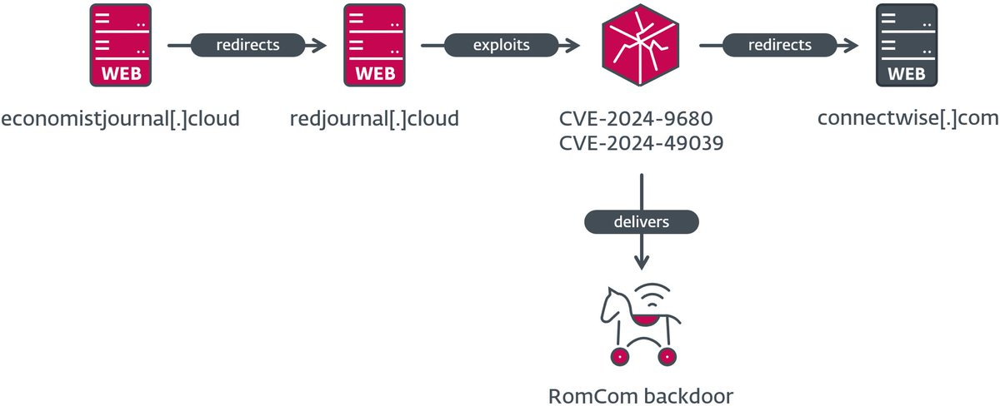</td>
</table></tr>
<table><tr>
<td>Quotes: <code>0</code></td>
<td>Replies: <code>0</code></td>
<td>Retweets: <code>41</code></td>
<td>Favorites: <code>67</code></td>
</tr></table>

---

# Dinosn
**https://twitter.com/Dinosn/status/1860895983216767018 _at 2024-11-25, 03:59:10_**
<blockquote>
CVE-2024-11477: 7-Zip Vulnerability Allows Remote Code Execution https://t.co/7WTVH56NzT
</blockquote>

* https://securityonline.info/cve-2024-11477-7-zip-vulnerability-allows-remote-code-execution-update-now/

<table><tr>
<td>Quotes: <code>30</code></td>
<td>Replies: <code>22</code></td>
<td>Retweets: <code>537</code></td>
<td>Favorites: <code>2059</code></td>
</tr></table>

---

# pdnuclei
**https://twitter.com/pdnuclei/status/1860649937052266685 _at 2024-11-24, 11:41:28_**
<blockquote>
Detect Sitecore RCE (CVE-2024-46938) with Nuclei 🚀

🔹 Nuclei Template: https://t.co/0ZphvIlDdC by @DhiyaneshDK 
🔹 Research: https://t.co/xp5Nf5icVm by @assetnote 

#hackwithautomation #Cybersecurity #AppSec #BugBounty https://t.co/6V12paoFJk
</blockquote>

* https://cloud.projectdiscovery.io/?template=CVE-2024-46938
* https://www.assetnote.io/resources/research/leveraging-an-order-of-operations-bug-to-achieve-rce-in-sitecore-8-x---10-x

<table><tr>
<td>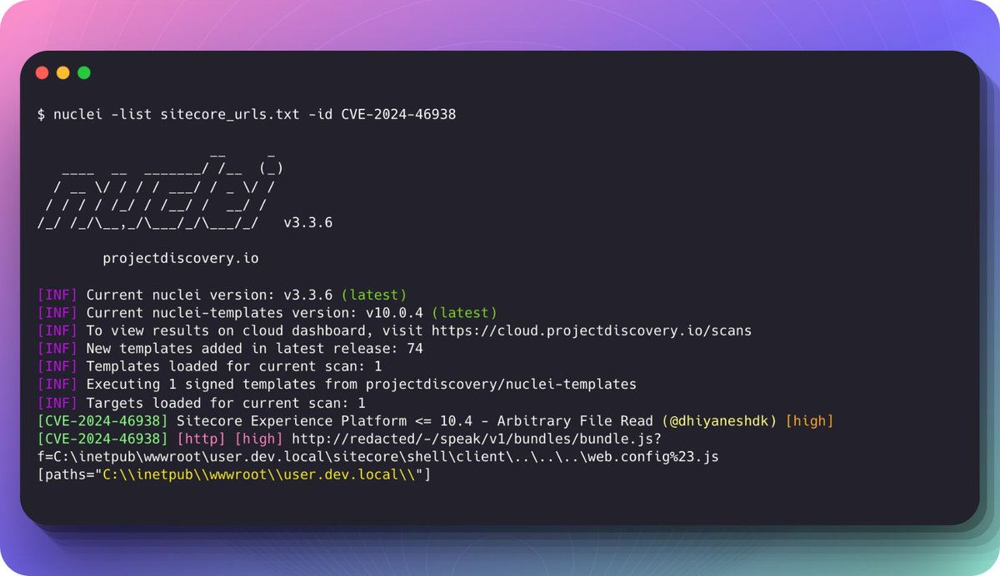</td>
</table></tr>
<table><tr>
<td>Quotes: <code>0</code></td>
<td>Replies: <code>2</code></td>
<td>Retweets: <code>72</code></td>
<td>Favorites: <code>287</code></td>
</tr></table>

---

# elhackernet
**https://twitter.com/elhackernet/status/1859243414966948328 _at 2024-11-20, 14:32:27_**
<blockquote>
CVE-2024-52940 : AnyDesk IP Leak Vulnerability 

https://t.co/RzTEcjsUAw https://t.co/xA3w2Ba7ih
</blockquote>

* https://github.com/ebrasha/abdal-anydesk-remote-ip-detector/blob/main/README.md

<table><tr>
<td>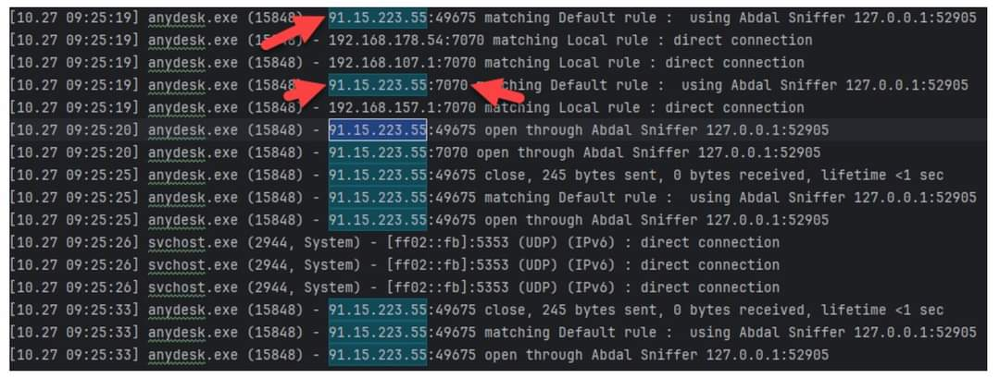</td>
</table></tr>
<table><tr>
<td>Quotes: <code>5</code></td>
<td>Replies: <code>5</code></td>
<td>Retweets: <code>106</code></td>
<td>Favorites: <code>319</code></td>
</tr></table>

---

# stephenfewer
**https://twitter.com/stephenfewer/status/1858913571402309827 _at 2024-11-19, 16:41:47_**
<blockquote>
We now have a @metasploit exploit module in the pull queue for the PAN-OS management interface unauthenticated RCE exploit chain (CVE-2024-0012 + CVE-2024-9474), based upon the technical analysis published today by @watchtowrcyber. https://t.co/dk7XXN7s1O https://t.co/xpu4iNn0A5
</blockquote>

* https://github.com/rapid7/metasploit-framework/pull/19663

<table><tr>
<td>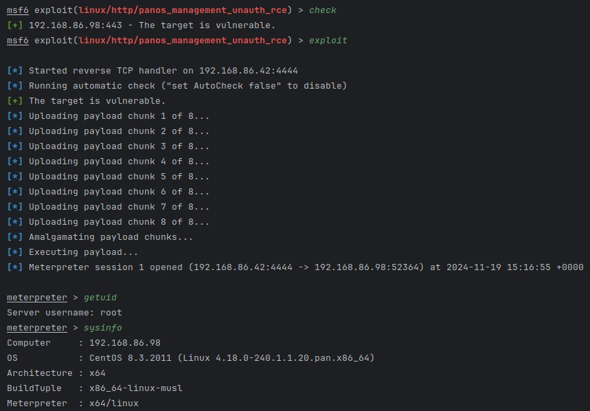</td>
</table></tr>
<table><tr>
<td>Quotes: <code>6</code></td>
<td>Replies: <code>4</code></td>
<td>Retweets: <code>112</code></td>
<td>Favorites: <code>314</code></td>
</tr></table>

---

# JoshuaProvoste
**https://twitter.com/JoshuaProvoste/status/1858910306140893268 _at 2024-11-19, 16:28:48_**
<blockquote>
0-click RCE (Unauthenticated / Pre-auth) Exploit for CVE-2024-51791 (Unrestricted File Upload + Brute Forcing) 🤓 #BugBounty #WordPress #Hacking https://t.co/98LgOw00XT
</blockquote>

<table><tr>
<td></td>
<td>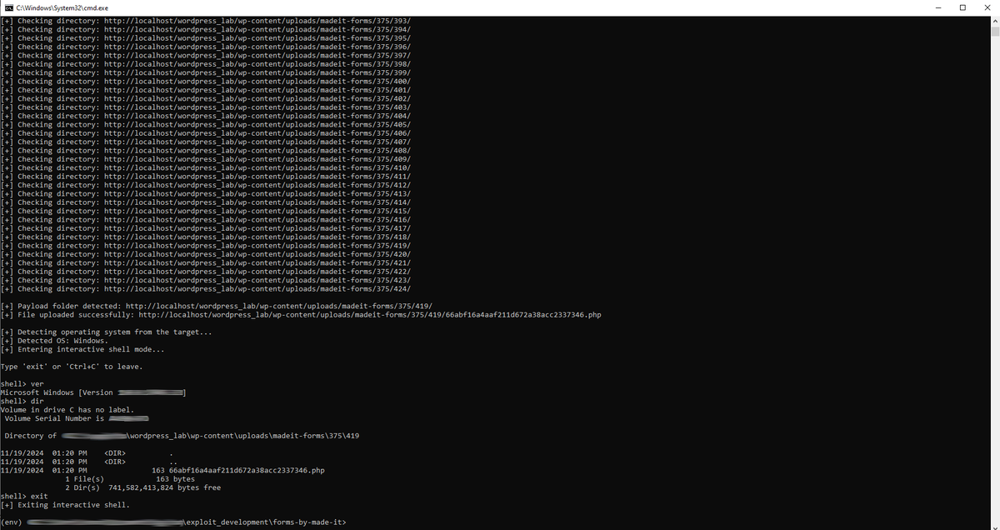</td>
</table></tr>
<table><tr>
<td>Quotes: <code>0</code></td>
<td>Replies: <code>4</code></td>
<td>Retweets: <code>45</code></td>
<td>Favorites: <code>288</code></td>
</tr></table>

---

# HunterMapping
**https://twitter.com/HunterMapping/status/1858786225601077650 _at 2024-11-19, 08:15:45_**
<blockquote>
🚨Alert🚨CVE-2024-47575: Fortinet Fortimanager Unauthenticated Remote Code Execution AKA FortiJump
🔥PoC &amp; Deep Dive: https://t.co/KrEvYPIZG9
🧐Git Link: :  https://t.co/aOdodYPJZZ
📊 9.9K+ Services are found on https://t.co/ysWb28BTvF yearly.
🔗Hunter Link: https://t.co/BAJVDUAtPy
</blockquote>

* https://labs.watchtowr.com/hop-skip-fortijump-fortijumphigher-cve-2024-23113-cve-2024-47575/
* https://github.com/watchtowrlabs/Fortijump-Exploit-CVE-2024-47575
* http://hunter.how

<table><tr>
<td></td>
</table></tr>
<table><tr>
<td>Quotes: <code>0</code></td>
<td>Replies: <code>1</code></td>
<td>Retweets: <code>21</code></td>
<td>Favorites: <code>68</code></td>
</tr></table>

---

# JoshuaProvoste
**https://twitter.com/JoshuaProvoste/status/1858329238153072668 _at 2024-11-18, 01:59:51_**
<blockquote>
0-Click RCE (Unauthenticated/Pre-Auth) Exploit for CVE-2024-9932 😇 #Wordpress #BugBounty https://t.co/noLpQn4Tnn
</blockquote>

<table><tr>
<td>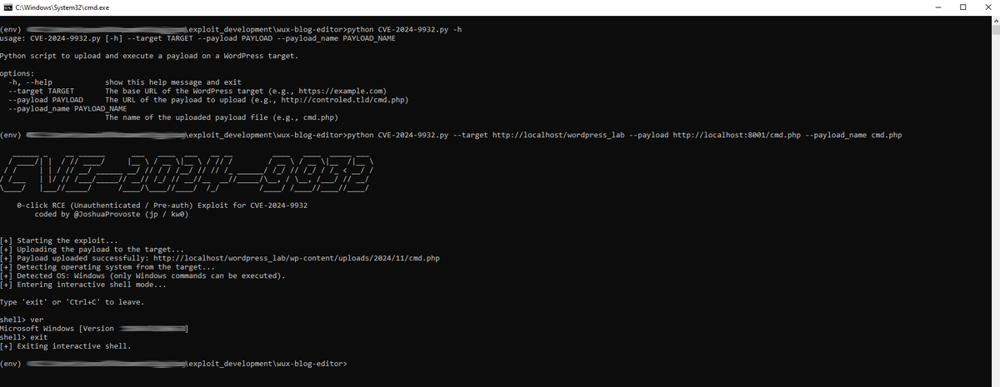</td>
</table></tr>
<table><tr>
<td>Quotes: <code>1</code></td>
<td>Replies: <code>5</code></td>
<td>Retweets: <code>72</code></td>
<td>Favorites: <code>417</code></td>
</tr></table>

---

# blackorbird
**https://twitter.com/blackorbird/status/1856983846866358586 _at 2024-11-14, 08:53:44_**
<blockquote>
Analysis of the URL File Zero-Day Vulnerability 
CVE-2024-43451
https://t.co/eKgRnbD1pd https://t.co/WeOOv5k5Py
</blockquote>

* https://github.com/blackorbird/APT_REPORT/blob/master/Exploit/Zero-day-cve-2024-4351-report.pdf

<table><tr>
<td>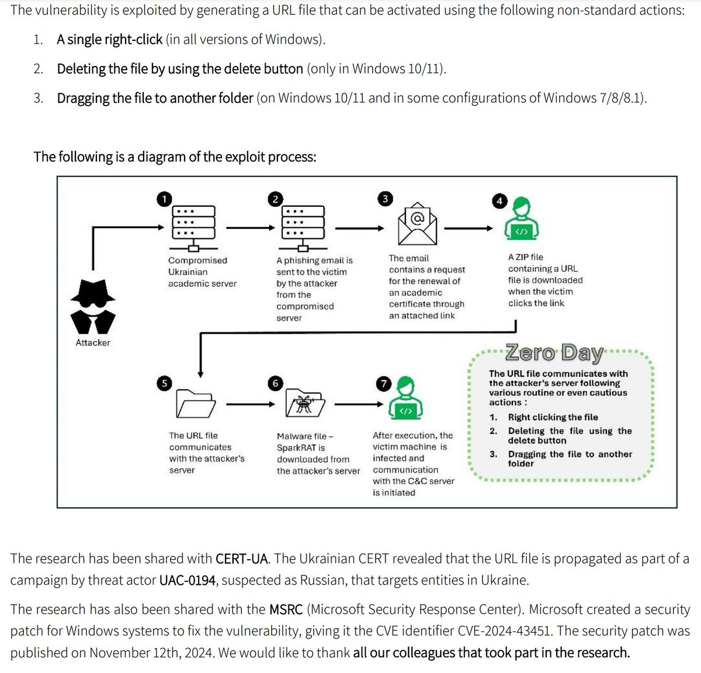</td>
<td></td>
<td>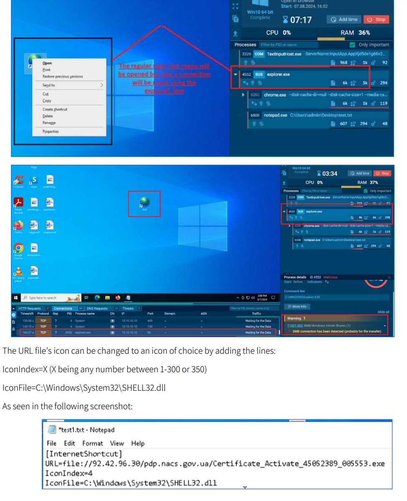</td>
<td>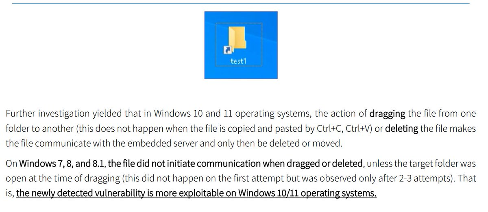</td>
</table></tr>
<table><tr>
<td>Quotes: <code>1</code></td>
<td>Replies: <code>2</code></td>
<td>Retweets: <code>85</code></td>
<td>Favorites: <code>274</code></td>
</tr></table>

---

# alisaesage
**https://twitter.com/alisaesage/status/1856002410143220074 _at 2024-11-11, 15:53:52_**
<blockquote>
JavaScript Engines are everywhere and I know how to hack them [my PoC for FoxitPDF JavaScript UaF CVE-2024-28888] https://t.co/5FfBpoBgCq
</blockquote>

<table><tr>
<td>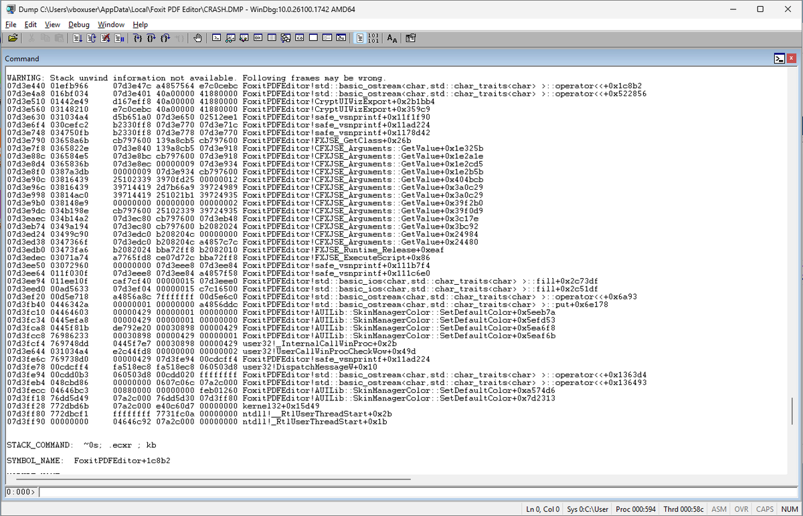</td>
</table></tr>
<table><tr>
<td>Quotes: <code>0</code></td>
<td>Replies: <code>4</code></td>
<td>Retweets: <code>41</code></td>
<td>Favorites: <code>336</code></td>
</tr></table>

---

# SeguInfo
**https://twitter.com/SeguInfo/status/1854619625335492879 _at 2024-11-07, 20:19:10_**
<blockquote>
¿Utilizas #Zimbra?
Deberías leer esto!

Remote Command Execution (CVE-2024-45519 - CVSS 9.8)
Versiones: 8.8.15 - 10.1.0
https://t.co/EWq876GY16
https://t.co/M2AAEf2jmy

¿Por qué? Porque hay un exploit y un template de Nuclei:
https://t.co/QlKprtrFsr
</blockquote>

* https://blog.projectdiscovery.io/zimbra-remote-code-execution/
* https://wiki.zimbra.com/wiki/Zimbra_Security_Advisories
* https://darkwebinformer.com/cve-2024-45519-zimbra-postjournal-exploit-setup/

<table><tr>
<td>Quotes: <code>0</code></td>
<td>Replies: <code>2</code></td>
<td>Retweets: <code>14</code></td>
<td>Favorites: <code>40</code></td>
</tr></table>

---

# 0xor0ne
**https://twitter.com/0xor0ne/status/1854192055532089737 _at 2024-11-06, 16:00:09_**
<blockquote>
Analysis of Windows nwifi.sys Wi-Fi driver vulnerability (CVE-2024-30078)

https://t.co/5LeswHywYW

#windows #infosec https://t.co/rUjZIPjJnL
</blockquote>

* https://www.crowdfense.com/windows-wi-fi-driver-rce-vulnerability-cve-2024-30078/

<table><tr>
<td>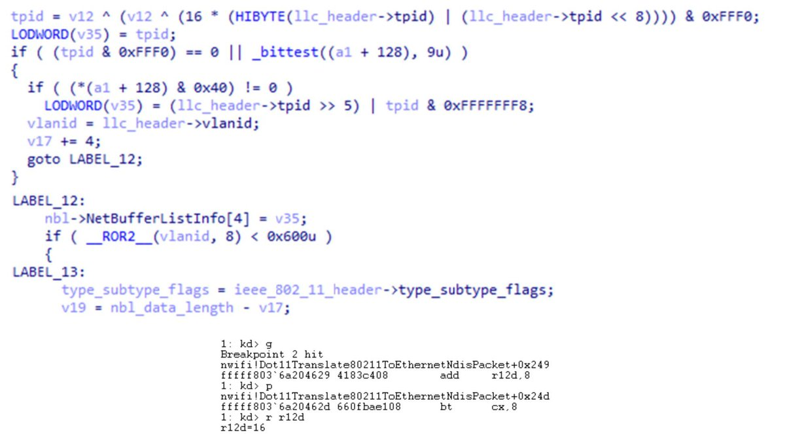</td>
<td>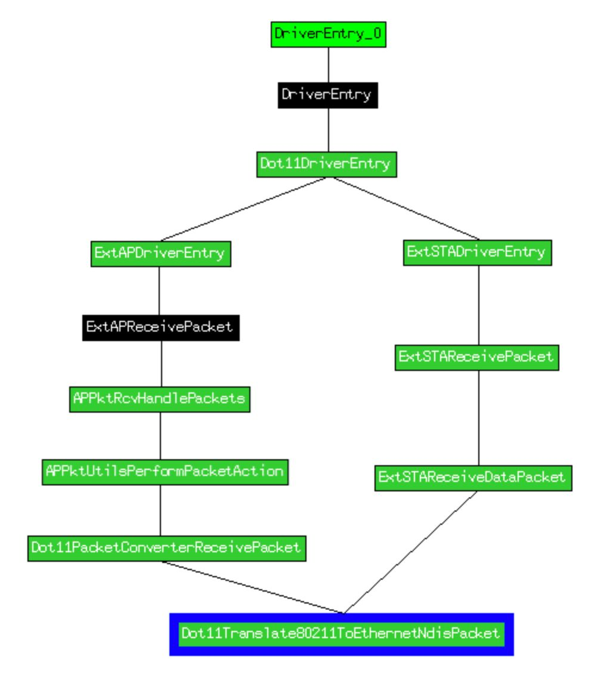</td>
</table></tr>
<table><tr>
<td>Quotes: <code>1</code></td>
<td>Replies: <code>0</code></td>
<td>Retweets: <code>69</code></td>
<td>Favorites: <code>263</code></td>
</tr></table>

---

# TheHackersNews
**https://twitter.com/TheHackersNews/status/1853733036635873509 _at 2024-11-05, 09:36:11_**
<blockquote>
Synology has released a patch for a critical zero-day vulnerability (CVE-2024-10443) affecting millions of NAS devices, which allows remote code execution without user interaction.

Read: https://t.co/i0EPEMJpvg

#infosec #cybersecurity #hacking
</blockquote>

* https://thehackernews.com/2024/11/synology-urges-patch-for-critical-zero.html

<table><tr>
<td>Quotes: <code>4</code></td>
<td>Replies: <code>1</code></td>
<td>Retweets: <code>56</code></td>
<td>Favorites: <code>99</code></td>
</tr></table>

---

# TheHackersNews
**https://twitter.com/TheHackersNews/status/1853643200734384446 _at 2024-11-05, 03:39:12_**
<blockquote>
Google warns of active exploitation of CVE-2024-43093 in Android.

This #vulnerability allows unauthorized access to critical directories, emphasizing the need for timely updates and patching processes.

https://t.co/JAVNWAroDa

#cybersecurity #infosec
</blockquote>

* https://thehackernews.com/2024/11/google-warns-of-actively-exploited-cve.html

<table><tr>
<td>Quotes: <code>3</code></td>
<td>Replies: <code>2</code></td>
<td>Retweets: <code>75</code></td>
<td>Favorites: <code>125</code></td>
</tr></table>

---

# kmkz_security
**https://twitter.com/kmkz_security/status/1853537456894697749 _at 2024-11-04, 20:39:01_**
<blockquote>
RT @SinSinology: 🔥💀After 40 hours of constant reversing of weird looking c++ and no sleep, I Finally cooked the 
CVE-2024-47575 fortimanage…
</blockquote>

<table><tr>
<td>Quotes: <code>0</code></td>
<td>Replies: <code>0</code></td>
<td>Retweets: <code>180</code></td>
<td>Favorites: <code>0</code></td>
</tr></table>

---

# wvuuuuuuuuuuuuu
**https://twitter.com/wvuuuuuuuuuuuuu/status/1853321691931333037 _at 2024-11-04, 06:21:39_**
<blockquote>
RT @SinSinology: 🔥💀After 40 hours of constant reversing of weird looking c++ and no sleep, I Finally cooked the 
CVE-2024-47575 fortimanage…
</blockquote>

<table><tr>
<td>Quotes: <code>0</code></td>
<td>Replies: <code>0</code></td>
<td>Retweets: <code>167</code></td>
<td>Favorites: <code>0</code></td>
</tr></table>

---

# chompie1337
**https://twitter.com/chompie1337/status/1853272931427635363 _at 2024-11-04, 03:07:53_**
<blockquote>
RT @SinSinology: 🔥💀After 40 hours of constant reversing of weird looking c++ and no sleep, I Finally cooked the 
CVE-2024-47575 fortimanage…
</blockquote>

<table><tr>
<td>Quotes: <code>0</code></td>
<td>Replies: <code>0</code></td>
<td>Retweets: <code>180</code></td>
<td>Favorites: <code>0</code></td>
</tr></table>

---

# SinSinology
**https://twitter.com/SinSinology/status/1853264091940347986 _at 2024-11-04, 02:32:46_**
<blockquote>
🔥💀After 40 hours of constant reversing of weird looking c++ and no sleep, I Finally cooked the 
CVE-2024-47575 fortimanager unauthenticated RCE 🩸
</blockquote>

<table><tr>
<td>Quotes: <code>3</code></td>
<td>Replies: <code>23</code></td>
<td>Retweets: <code>180</code></td>
<td>Favorites: <code>1112</code></td>
</tr></table>

---

# zoomeye_team
**https://twitter.com/zoomeye_team/status/1853013113727291685 _at 2024-11-03, 09:55:28_**
<blockquote>
🚨🚨CVE-2024-38094: Microsoft SharePoint RCE Bug Exploited to Breach Corporate Network
⚠️An attacker who accessed a server without authorization and moved laterally across the network, compromising the entire domain.

ZoomEye Dork👉app:"Microsoft SharePoint"
73k+ results are https://t.co/QXfzfJHbkW
</blockquote>

<table><tr>
<td></td>
</table></tr>
<table><tr>
<td>Quotes: <code>0</code></td>
<td>Replies: <code>0</code></td>
<td>Retweets: <code>17</code></td>
<td>Favorites: <code>39</code></td>
</tr></table>

---

# CyberWarship
**https://twitter.com/CyberWarship/status/1852719313808969858 _at 2024-11-02, 14:28:00_**
<blockquote>
''Grafana Vulnerability CVE-2024-9264: PoC Exploit Released for 9.9-Rated Critical Flaw''

#infosec #pentest #redteam #blueteam
https://t.co/RyQaw29P2S
</blockquote>

* https://securityonline.info/grafana-vulnerability-cve-2024-9264-poc-released-for-9-9-rated-critical-flaw/

<table><tr>
<td>Quotes: <code>0</code></td>
<td>Replies: <code>1</code></td>
<td>Retweets: <code>20</code></td>
<td>Favorites: <code>42</code></td>
</tr></table>

---

# pdnuclei
**https://twitter.com/pdnuclei/status/1852319844387185149 _at 2024-11-01, 12:00:39_**
<blockquote>
RT @DhiyaneshDK: 🚀Detect Apache Solr Authentication Bypass 
(CVE-2024-45216) with @pdnuclei

Template: https://t.co/0vO0wA7gja

Research by…
</blockquote>

* https://cloud.projectdiscovery.io/?template=CVE-2024-45216

<table><tr>
<td>Quotes: <code>0</code></td>
<td>Replies: <code>0</code></td>
<td>Retweets: <code>39</code></td>
<td>Favorites: <code>0</code></td>
</tr></table>

---

# DhiyaneshDK
**https://twitter.com/DhiyaneshDK/status/1852317524278280364 _at 2024-11-01, 11:51:26_**
<blockquote>
🚀Detect Apache Solr Authentication Bypass 
(CVE-2024-45216) with @pdnuclei

Template: https://t.co/0vO0wA7gja

Research by https://t.co/SwKLQBnnGW  

#hackwithautomation #bugbounty #cybersecurity https://t.co/pK9VM08X4T
</blockquote>

* https://cloud.projectdiscovery.io/?template=CVE-2024-45216
* https://shfsec.com/cve-2024-45216-authentication-bypass-in-apache-solr

<table><tr>
<td></td>
</table></tr>
<table><tr>
<td>Quotes: <code>0</code></td>
<td>Replies: <code>0</code></td>
<td>Retweets: <code>21</code></td>
<td>Favorites: <code>135</code></td>
</tr></table>

---

