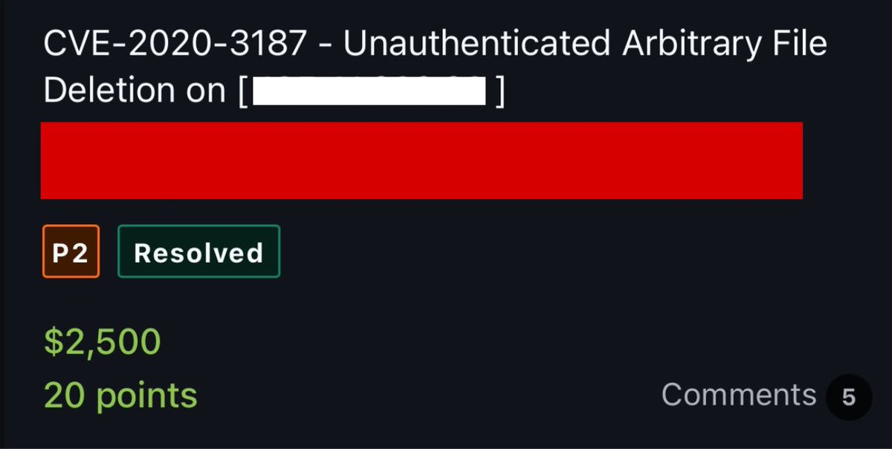
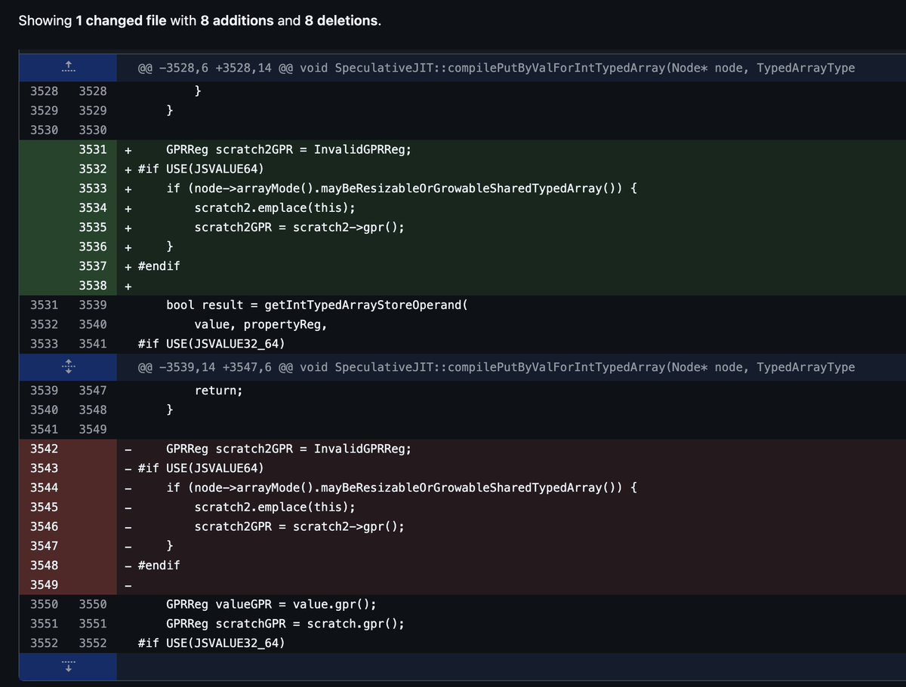
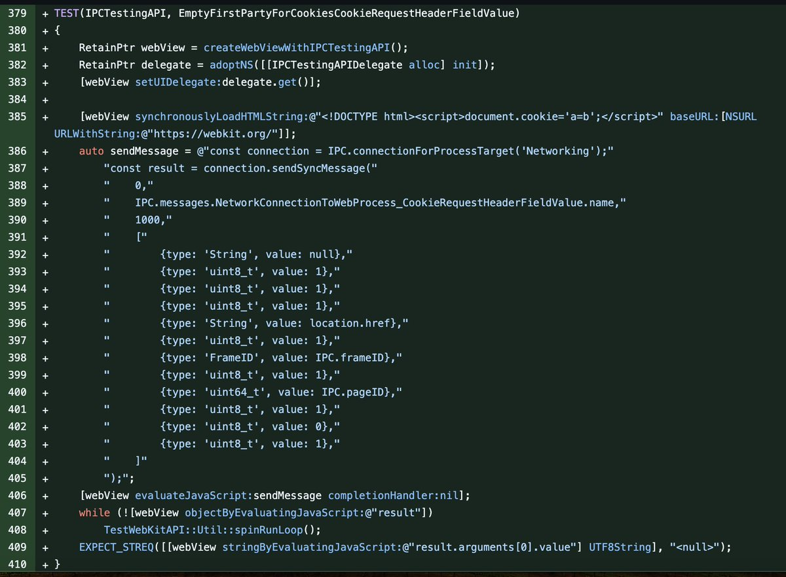
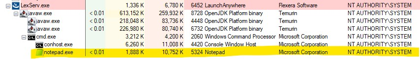
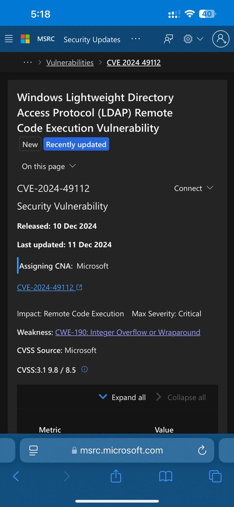
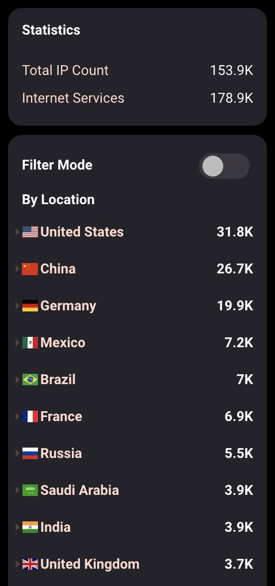
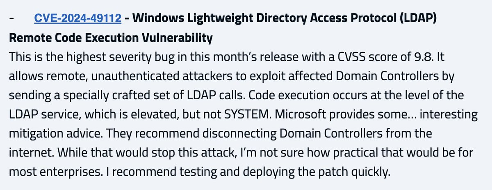

# Dinosn
**https://twitter.com/Dinosn/status/1871422491429900322 _at 2024-12-24, 05:07:45_**
<blockquote>
PoC Exploit Released for CVE-2024-30085: Windows Elevation of Privilege Vulnerability https://t.co/atlD3UUkYm
</blockquote>

* https://securityonline.info/poc-exploit-released-for-cve-2024-30085-windows-elevation-of-privilege-vulnerability/

<table><tr>
<td>Quotes: <code>0</code></td>
<td>Replies: <code>1</code></td>
<td>Retweets: <code>78</code></td>
<td>Favorites: <code>304</code></td>
</tr></table>

---

# Raman_Mohurle
**https://twitter.com/Raman_Mohurle/status/1870031062212194447 _at 2024-12-20, 08:58:43_**
<blockquote>
Found very Interesting CVE-2020-3187 - https://t.co/Yx8olsjNfv

Impact : Unauth attacker is able to delete any file on server ( ex - deleting login page can affect users in absence of login page )

Reference Report - https://t.co/RAAeKG0ilX

#bugbountytips  #bugcrowd https://t.co/syQcptSlGY
</blockquote>

* https://nvd.nist.gov/vuln/detail/cve-2020-3187
* https://hackerone.com/reports/987090

<table><tr>
<td></td>
</table></tr>
<table><tr>
<td>Quotes: <code>0</code></td>
<td>Replies: <code>10</code></td>
<td>Retweets: <code>19</code></td>
<td>Favorites: <code>246</code></td>
</tr></table>

---

# alisaesage
**https://twitter.com/alisaesage/status/1869377297670873217 _at 2024-12-18, 13:40:53_**
<blockquote>
I am looking at latest 0-Day exploit attack on Safari (11.2024):

CVE-2024-44308: JavaScriptCore DFG compiler logic issue to RCE - nothing new here
CVE-2024-44309: WebKit Data Isolation bypass

The thing is, there is no sandbox escapes in disclosure. Cve 44309 is a limited CSP https://t.co/S0pVQ4eP6E
</blockquote>

<table><tr>
<td></td>
<td></td>
</table></tr>
<table><tr>
<td>Quotes: <code>2</code></td>
<td>Replies: <code>10</code></td>
<td>Retweets: <code>69</code></td>
<td>Favorites: <code>343</code></td>
</tr></table>

---

# stephenfewer
**https://twitter.com/stephenfewer/status/1868594948377039309 _at 2024-12-16, 09:52:07_**
<blockquote>
We have published our @rapid7 analysis of the new Cleo vuln, now known as CVE-2024-55956. An unauthenticated file write affecting LexiCom, VLTrader, and Harmony versions 5.8.0.23 and below, that can be leveraged to achieve unauth RCE. Full analysis here: https://t.co/KuTfeHIGif https://t.co/uQRbUeD6ML
</blockquote>

* https://attackerkb.com/topics/geR0H8dgrE/cve-2024-55956/rapid7-analysis

<table><tr>
<td></td>
</table></tr>
<table><tr>
<td>Quotes: <code>2</code></td>
<td>Replies: <code>4</code></td>
<td>Retweets: <code>29</code></td>
<td>Favorites: <code>87</code></td>
</tr></table>

---

# h4x0r_dz
**https://twitter.com/h4x0r_dz/status/1868511192085581975 _at 2024-12-16, 04:19:18_**
<blockquote>
CVE-2024-49112, Windows LDAP Remote Code Execution Vulnerability

https://t.co/NwuKCtgbsk https://t.co/2RIPXkHl0V
</blockquote>

* https://msrc.microsoft.com/update-guide/vulnerability/CVE-2024-49112

<table><tr>
<td></td>
</table></tr>
<table><tr>
<td>Quotes: <code>1</code></td>
<td>Replies: <code>2</code></td>
<td>Retweets: <code>17</code></td>
<td>Favorites: <code>141</code></td>
</tr></table>

---

# HunterMapping
**https://twitter.com/HunterMapping/status/1868506025067712648 _at 2024-12-16, 03:58:46_**
<blockquote>
🆕CVE-2024-49112🆕🔥🔥Microsoft has disclosed details of a critical Remote Code Execution (RCE) vulnerability that affects the Windows Lightweight Directory Access Protocol (LDAP). The vulnerability has a CVSS score of 9.8.
📊 178.9k+ ldap and ldaps Services are found on https://t.co/8xfXln7ize
</blockquote>

<table><tr>
<td></td>
</table></tr>
<table><tr>
<td>Quotes: <code>3</code></td>
<td>Replies: <code>3</code></td>
<td>Retweets: <code>94</code></td>
<td>Favorites: <code>280</code></td>
</tr></table>

---

# 7h3h4ckv157
**https://twitter.com/7h3h4ckv157/status/1867796522915536927 _at 2024-12-14, 04:59:27_**
<blockquote>
CVE-2024-49112 🚨🔥

Critical RCE vulnerability affecting the Windows LDAP Client with a CVSS score of 9.8. This vulnerability could allow an unprivileged attacker to run arbitrary code on an Active Directory Server by sending a specialized set of LDAP calls to the server.
</blockquote>

<table><tr>
<td>Quotes: <code>6</code></td>
<td>Replies: <code>10</code></td>
<td>Retweets: <code>95</code></td>
<td>Favorites: <code>525</code></td>
</tr></table>

---

# TalBeerySec
**https://twitter.com/TalBeerySec/status/1867097961907257346 _at 2024-12-12, 06:43:37_**
<blockquote>
Unauthenticated Remote Code Execution (RCE) on Domain Controllers (DC).
It does not get worse than that. Probably will be included in #ransomware campaigns.
Any technical analysis of CVE-2024-49112 published? 
CC: @gentilkiwi @harmj0y @_wald0 https://t.co/JOL9w1KDOc
</blockquote>

<table><tr>
<td></td>
</table></tr>
<table><tr>
<td>Quotes: <code>16</code></td>
<td>Replies: <code>16</code></td>
<td>Retweets: <code>180</code></td>
<td>Favorites: <code>649</code></td>
</tr></table>

---

# Dinosn
**https://twitter.com/Dinosn/status/1865969577970086120 _at 2024-12-09, 03:59:50_**
<blockquote>
Windows Zero-Day Vulnerability CVE-2024-38193 Exploited in the Wild: PoC Published https://t.co/I632HOYUe7
</blockquote>

* https://securityonline.info/windows-zero-day-vulnerability-cve-2024-38193-exploited-in-the-wild-poc-published/

<table><tr>
<td>Quotes: <code>2</code></td>
<td>Replies: <code>1</code></td>
<td>Retweets: <code>131</code></td>
<td>Favorites: <code>401</code></td>
</tr></table>

---

# the_yellow_fall
**https://twitter.com/the_yellow_fall/status/1865945639097680036 _at 2024-12-09, 02:24:42_**
<blockquote>
Windows Zero-Day Vulnerability CVE-2024-38193 Exploited in the Wild: PoC Published

Explore the in-depth analysis of CVE-2024-38193, a critical use-after-free flaw in the afd.sys Windows driver. Understand the exploitation process and potential impact
https://t.co/LVTO0tdkcr
</blockquote>

* https://securityonline.info/windows-zero-day-vulnerability-cve-2024-38193-exploited-in-the-wild-poc-published/

<table><tr>
<td>Quotes: <code>0</code></td>
<td>Replies: <code>0</code></td>
<td>Retweets: <code>19</code></td>
<td>Favorites: <code>52</code></td>
</tr></table>

---

# LukeGix
**https://twitter.com/LukeGix/status/1863984088559812929 _at 2024-12-03, 16:30:12_**
<blockquote>
I published a post describing the exploitation process for CVE-2024-38193, a use-after-free vulnerability in the afd.sys Windows driver. Hope you enjoy it! :) 

https://t.co/tzazvZxOqp
</blockquote>

* https://blog.exodusintel.com/2024/12/02/windows-sockets-from-registered-i-o-to-system-privileges/

<table><tr>
<td>Quotes: <code>0</code></td>
<td>Replies: <code>5</code></td>
<td>Retweets: <code>107</code></td>
<td>Favorites: <code>290</code></td>
</tr></table>

---

# Dinosn
**https://twitter.com/Dinosn/status/1863821954903326765 _at 2024-12-03, 05:45:56_**
<blockquote>
Zero-Day Exploit Code Released for Windows Task Scheduler Flaw (CVE-2024-49039), Actively Exploited by RomCom Group https://t.co/XRrouZUz7O
</blockquote>

* https://securityonline.info/zero-day-exploit-code-released-for-windows-task-scheduler-flaw-cve-2024-49039-actively-exploited-by-romcom-group/

<table><tr>
<td>Quotes: <code>4</code></td>
<td>Replies: <code>1</code></td>
<td>Retweets: <code>112</code></td>
<td>Favorites: <code>329</code></td>
</tr></table>

---

