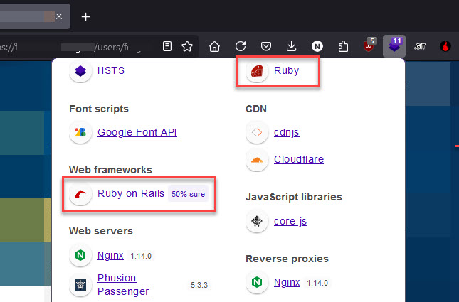
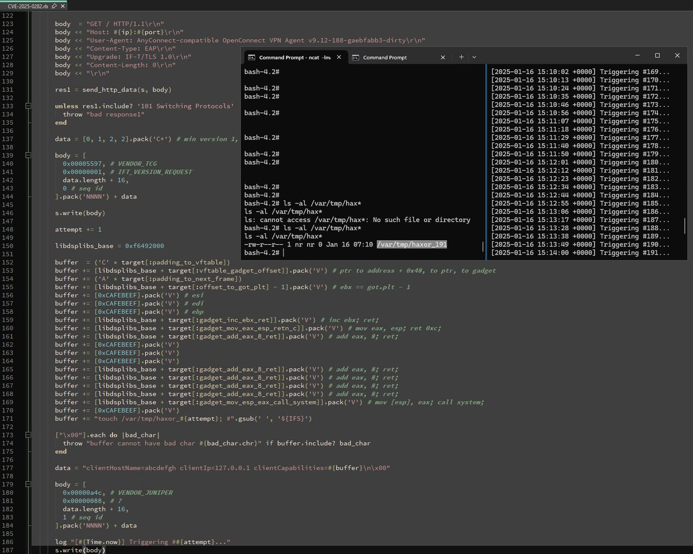
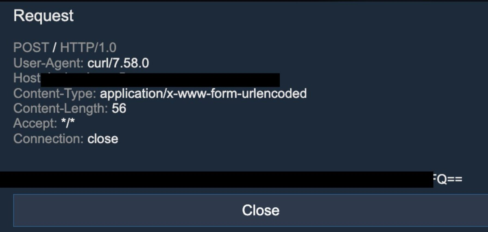
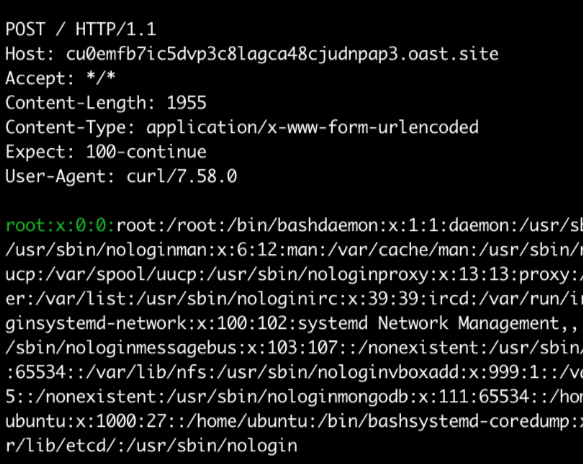
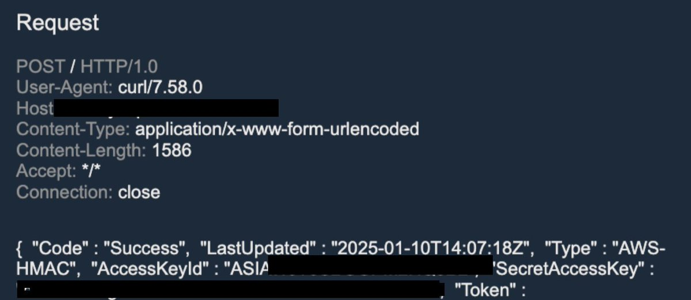
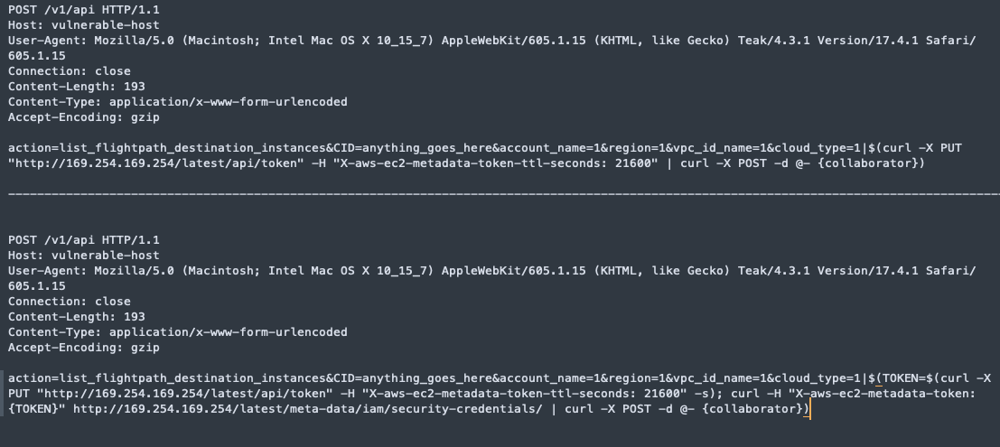
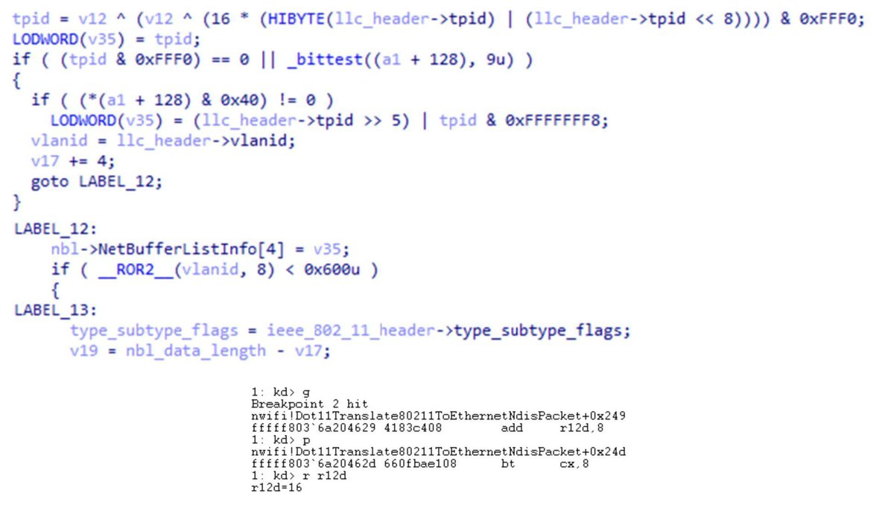
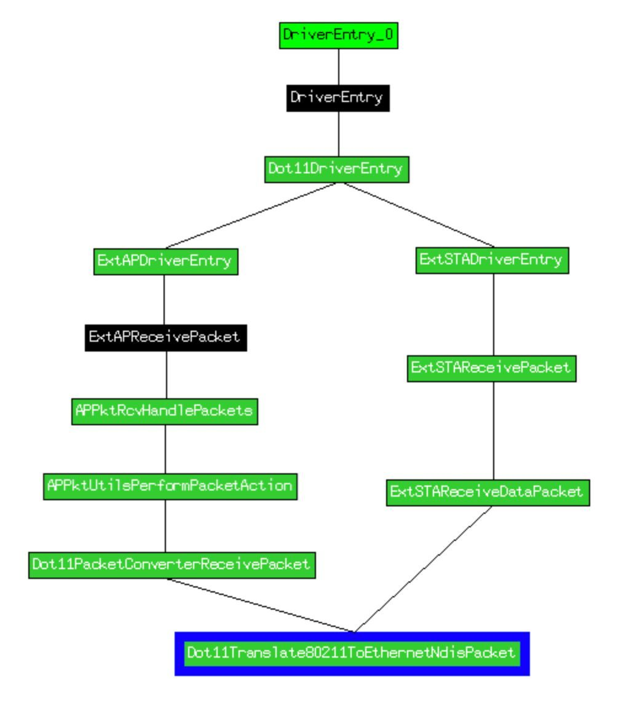
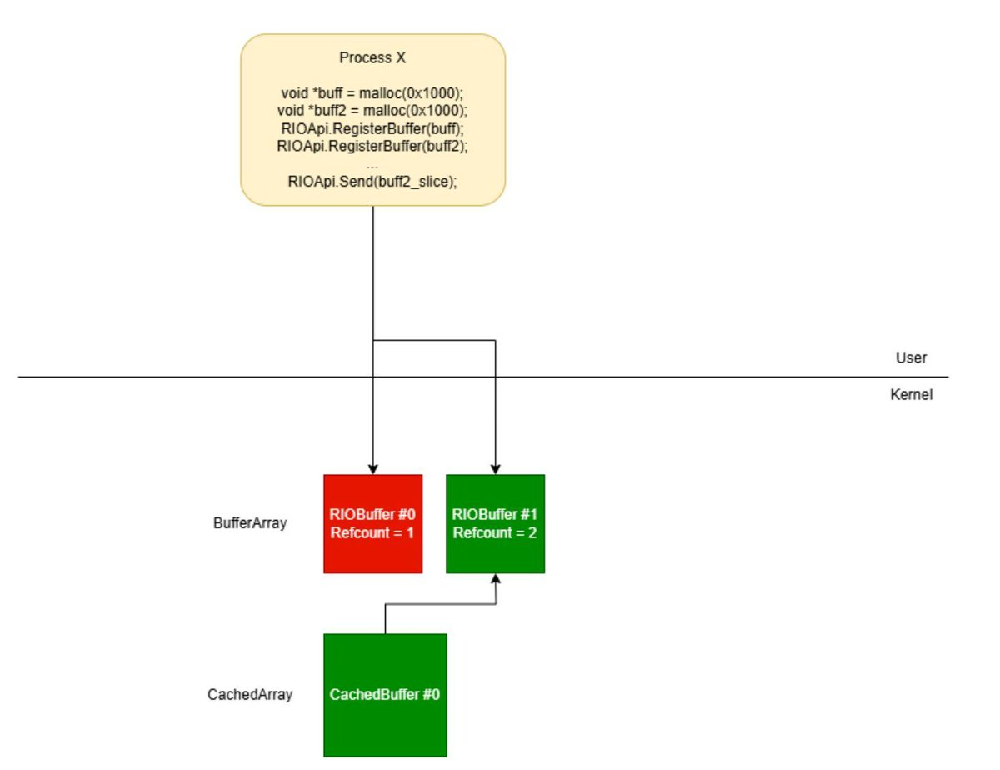
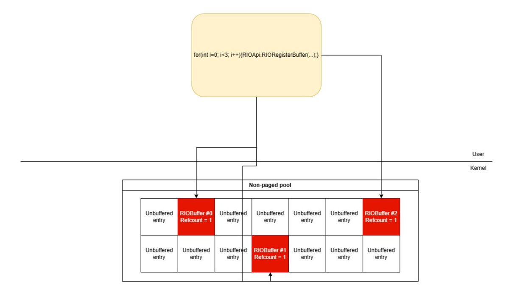

# USCERT_gov
**https://twitter.com/USCERT_gov/status/1884668209518768559 _at 2025-01-29, 18:21:31_**
<blockquote>
🛡️ We added #Apple use-after-free vulnerability CVE-2025-24085, affecting multiple Apple products, to our Known Exploited Vulnerabilities Catalog. Visit https://t.co/dOIn6I9vuB &amp; apply mitigations to protect your org from cyberattacks. #Cybersecurity #InfoSec https://t.co/5V0LxoJm0z
</blockquote>

* https://bit.ly/3ZqTVlz

<table><tr>
<td></td>
</table></tr>
<table><tr>
<td>Quotes: <code>6</code></td>
<td>Replies: <code>5</code></td>
<td>Retweets: <code>41</code></td>
<td>Favorites: <code>70</code></td>
</tr></table>

---

# nav1n0x
**https://twitter.com/nav1n0x/status/1882321903022477332 _at 2025-01-23, 06:58:08_**
<blockquote>
If your target uses Rails, look for Action View CVE-2019-5418 - File Content Disclosure vuln. Although this is an old bug, it can still be found.

Intercept the request in Burp and replace the Accept header with: `Accept: ../../../../../../../../../../etc/passwd{{` #bugbountytips https://t.co/gpOlT37pvB
</blockquote>

<table><tr>
<td></td>
</table></tr>
<table><tr>
<td>Quotes: <code>3</code></td>
<td>Replies: <code>16</code></td>
<td>Retweets: <code>241</code></td>
<td>Favorites: <code>1087</code></td>
</tr></table>

---

# HunterMapping
**https://twitter.com/HunterMapping/status/1882270363431891441 _at 2025-01-23, 03:33:20_**
<blockquote>
🚨Alert🚨 CVE-2025-21298 : Windows OLE Remote Code Execution Vulnerability
🔥PoC:https://t.co/gPzMsqZM61
🧐Deep Dive : https://t.co/L4k5UbKK5q
📊 1.2M+ Services are found on the https://t.co/ysWb28Crld yearly.
🔗Hunter Link:https://t.co/D4e39xFXWj
👇Query
HUNTER https://t.co/MKb39RDviW
</blockquote>

* https://github.com/ynwarcs/CVE-2025-21298
* https://redcytadel.com/cve-2025-21298-and-the-risks-of-windows-ole-zero-click-rce/
* http://hunter.how
* https://hunter.how/list?searchValue=product.name%3D%22Outlook%20Web%20App%22

<table><tr>
<td></td>
</table></tr>
<table><tr>
<td>Quotes: <code>0</code></td>
<td>Replies: <code>0</code></td>
<td>Retweets: <code>51</code></td>
<td>Favorites: <code>168</code></td>
</tr></table>

---

# stephenfewer
**https://twitter.com/stephenfewer/status/1879918238945177719 _at 2025-01-16, 15:46:50_**
<blockquote>
I wrote a PoC for the recent Ivanti Connect Secure stack buffer overflow, CVE-2025-0282, based on the exploitation strategy @watchtowrcyber published, along with an assessment of exploitability given the lack of a suitable info leak to break ASLR: https://t.co/uCJehEMO25 https://t.co/E6PXLGXSMX
</blockquote>

* https://attackerkb.com/assessments/2c7673d5-c3c5-4f02-ba7c-4fa0927b06ac

<table><tr>
<td></td>
</table></tr>
<table><tr>
<td>Quotes: <code>3</code></td>
<td>Replies: <code>8</code></td>
<td>Retweets: <code>104</code></td>
<td>Favorites: <code>394</code></td>
</tr></table>

---

# yarden_shafir
**https://twitter.com/yarden_shafir/status/1879340852654551053 _at 2025-01-15, 01:32:30_**
<blockquote>
Today Microsoft fixed 6 kernel address leaks that I reported

CVE-2025-21316
CVE-2025-21317
CVE-2025-21318
CVE-2025-21319
CVE-2025-21320
CVE-2025-21321
</blockquote>

<table><tr>
<td>Quotes: <code>9</code></td>
<td>Replies: <code>47</code></td>
<td>Retweets: <code>113</code></td>
<td>Favorites: <code>2374</code></td>
</tr></table>

---

# naglinagli
**https://twitter.com/naglinagli/status/1878148526753931401 _at 2025-01-11, 18:34:37_**
<blockquote>
🚨The new unauthenticated RCE affecting Aviatrix Controllers (CVE-2024-50603) is the real deal - with a single POST request 🫠 and a super trivial exploit, it takes less than 30 seconds to:

1. Collect all Aviatrix Controllers over the internet
2. Validate exploitability with https://t.co/crxPSAHk3N
</blockquote>

<table><tr>
<td></td>
<td></td>
<td></td>
<td></td>
</table></tr>
<table><tr>
<td>Quotes: <code>1</code></td>
<td>Replies: <code>1</code></td>
<td>Retweets: <code>40</code></td>
<td>Favorites: <code>290</code></td>
</tr></table>

---

# stephenfewer
**https://twitter.com/stephenfewer/status/1876684988713934931 _at 2025-01-07, 17:39:03_**
<blockquote>
We now have a @metasploit RCE exploit module in the pull queue for CVE-2024-55956 - an unauthenticated file write vulnerability affecting Cleo LexiCom, VLTrader, and Harmony which was exploited in the wild last month as 0day: https://t.co/GBpgXj9fsS https://t.co/XHlDyeEqHv
</blockquote>

* https://github.com/rapid7/metasploit-framework/pull/19793

<table><tr>
<td></td>
</table></tr>
<table><tr>
<td>Quotes: <code>1</code></td>
<td>Replies: <code>4</code></td>
<td>Retweets: <code>59</code></td>
<td>Favorites: <code>198</code></td>
</tr></table>

---

# 0xor0ne
**https://twitter.com/0xor0ne/status/1875950426756952222 _at 2025-01-05, 17:00:09_**
<blockquote>
CVE-2024-30078: vulnerability in Windows nwifi.sys Wi-Fi driver

https://t.co/0XHxr8Bcrq

#windows #infosec https://t.co/cJ0YLH680a
</blockquote>

* https://crowdfense.com/windows-wi-fi-driver-rce-vulnerability-cve-2024-30078/

<table><tr>
<td></td>
<td></td>
</table></tr>
<table><tr>
<td>Quotes: <code>0</code></td>
<td>Replies: <code>1</code></td>
<td>Retweets: <code>69</code></td>
<td>Favorites: <code>300</code></td>
</tr></table>

---

# 0xor0ne
**https://twitter.com/0xor0ne/status/1874727361360392409 _at 2025-01-02, 08:00:08_**
<blockquote>
Exploiting a use-after-free vulnerability in the afd.sys Windows driver (CVE-2024-38193)

https://t.co/Q7TBBY7qM9

Credits Luca Ginex

#windows #infosec https://t.co/exTJUgeCH7
</blockquote>

* https://blog.exodusintel.com/2024/12/02/

<table><tr>
<td></td>
<td></td>
</table></tr>
<table><tr>
<td>Quotes: <code>0</code></td>
<td>Replies: <code>0</code></td>
<td>Retweets: <code>51</code></td>
<td>Favorites: <code>160</code></td>
</tr></table>

---

