# 0xor0ne
**https://twitter.com/0xor0ne/status/1894296281616359792 _at 2025-02-25, 08:00:02_**
<blockquote>
Unauthenticated Remote Code Execution vulnerability in Ivanti Secure (VPN) (CVE-2025-0282)

https://t.co/g7Xg4ib4HC

#infosec #ivanti https://t.co/1NHZRMEZ6r
</blockquote>

* https://labs.watchtowr.com/exploitation-walkthrough-and-techniques-ivanti-connect-secure-rce-cve-2025-0282/

<table><tr>
<td></td>
</table></tr>
<table><tr>
<td>Quotes: <code>0</code></td>
<td>Replies: <code>0</code></td>
<td>Retweets: <code>49</code></td>
<td>Favorites: <code>183</code></td>
</tr></table>

---

# YShahinzadeh
**https://twitter.com/YShahinzadeh/status/1892985645405995258 _at 2025-02-21, 17:12:02_**
<blockquote>
do not overlook SSTI, I asked the team for the flaw (I was curious how SSIT could even occur these days) and they told me that they were vulnerable to CVE-2024-56326 :-] https://t.co/tbKv6upuoW
</blockquote>

<table><tr>
<td>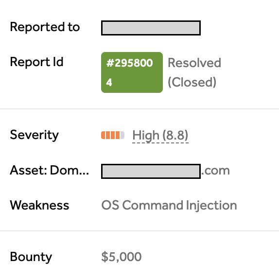</td>
</table></tr>
<table><tr>
<td>Quotes: <code>0</code></td>
<td>Replies: <code>9</code></td>
<td>Retweets: <code>15</code></td>
<td>Favorites: <code>475</code></td>
</tr></table>

---

# HackingTeam1
**https://twitter.com/HackingTeam1/status/1891912587270332461 _at 2025-02-18, 18:08:05_**
<blockquote>
🖼 AnyDesk — Local Privilege Escalation (CVE-2024-12754)

🔗 Source:
https://t.co/nzRxuYhTp0

#windows #anydesk #lpe #cve https://t.co/24uCGue4HN
</blockquote>

* https://mansk1es.gitbook.io/AnyDesk_CVE-2024-12754

<table><tr>
<td>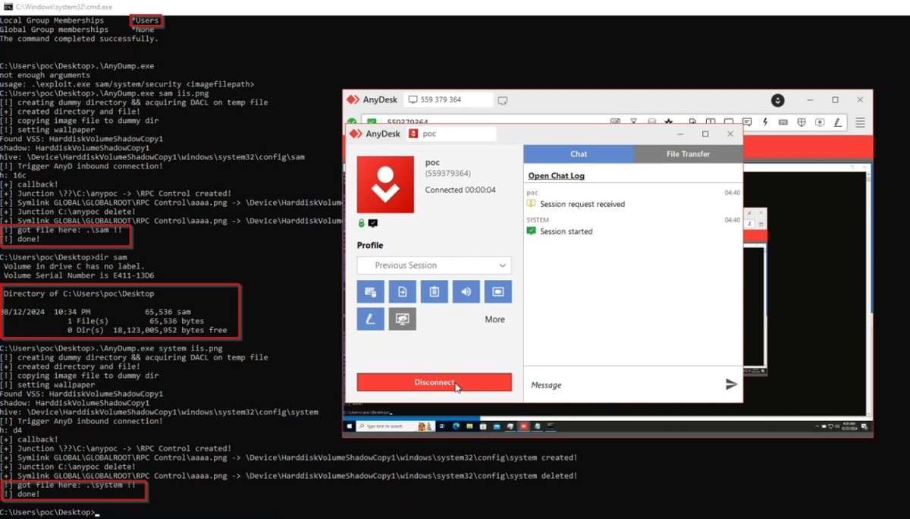</td>
</table></tr>
<table><tr>
<td>Quotes: <code>2</code></td>
<td>Replies: <code>0</code></td>
<td>Retweets: <code>118</code></td>
<td>Favorites: <code>523</code></td>
</tr></table>

---

# binitamshah
**https://twitter.com/binitamshah/status/1890936076828619126 _at 2025-02-16, 01:27:47_**
<blockquote>
First analysis of Apple's USB Restricted Mode bypass (CVE-2025-24200) : https://t.co/j2PNpJJKQ4 https://t.co/G7v5qN8JWt
</blockquote>

* https://blog.quarkslab.com/first-analysis-of-apples-usb-restricted-mode-bypass-cve-2025-24200.html

<table><tr>
<td>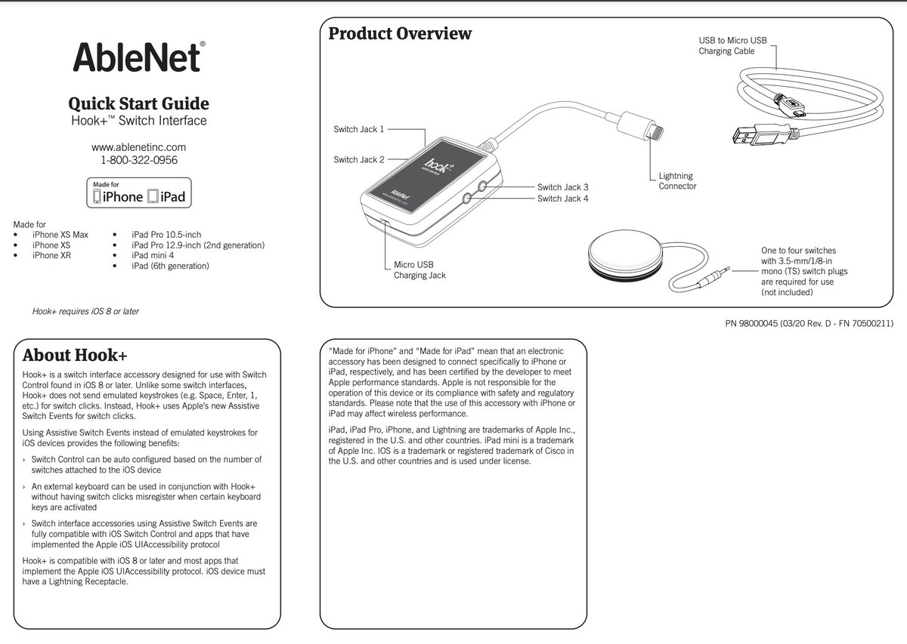</td>
</table></tr>
<table><tr>
<td>Quotes: <code>2</code></td>
<td>Replies: <code>2</code></td>
<td>Retweets: <code>82</code></td>
<td>Favorites: <code>266</code></td>
</tr></table>

---

# binitamshah
**https://twitter.com/binitamshah/status/1890470539061330020 _at 2025-02-14, 18:37:54_**
<blockquote>
Weaponizing Background Images for Information Disclosure &amp;&amp; LPE : AnyDesk CVE-2024-12754, ZDI-24-1711 : https://t.co/kmEgVvGmKl https://t.co/BYm9k51xRW
</blockquote>

* https://mansk1es.gitbook.io/AnyDesk_CVE-2024-12754

<table><tr>
<td>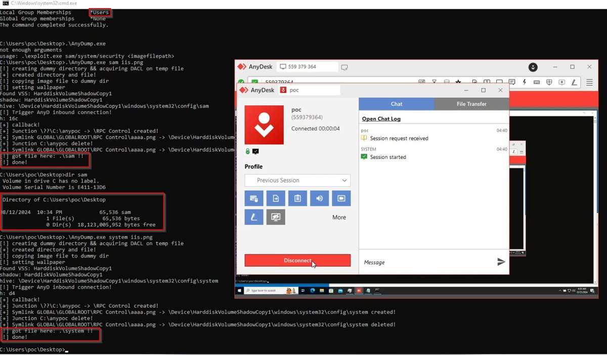</td>
</table></tr>
<table><tr>
<td>Quotes: <code>0</code></td>
<td>Replies: <code>0</code></td>
<td>Retweets: <code>13</code></td>
<td>Favorites: <code>37</code></td>
</tr></table>

---

# cyber_advising
**https://twitter.com/cyber_advising/status/1890069368836591870 _at 2025-02-13, 16:03:47_**
<blockquote>
CVE-2025-0108: authentication bypass in the Palo Alto Networks PAN-OS software enables an unauthenticated attacker with network access to the management web..
https://t.co/bxXFmrNzGA https://t.co/CCIjgh6GHY
</blockquote>

* https://exploitfinder.com/dbexploit/exploit.html?id=CVE-2025-0108&type=GitAI&returnTab=github-ai

<table><tr>
<td>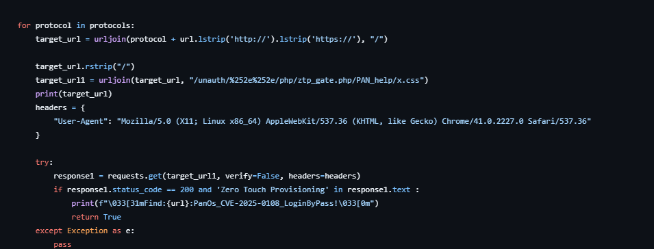</td>
</table></tr>
<table><tr>
<td>Quotes: <code>0</code></td>
<td>Replies: <code>0</code></td>
<td>Retweets: <code>8</code></td>
<td>Favorites: <code>33</code></td>
</tr></table>

---

# 0xor0ne
**https://twitter.com/0xor0ne/status/1890068571335675909 _at 2025-02-13, 16:00:37_**
<blockquote>
nftables subsystem exploitation (CVE-2024-26581) (use-after-free in Linux kernel)

https://t.co/YX0UdVreSu

#Linux #cybersecurity https://t.co/2ly9J4ByEF
</blockquote>

* https://github.com/google/security-research/blob/master/pocs/linux/kernelctf/CVE-2024-26581_lts_cos_mitigation/docs/exploit.md

<table><tr>
<td>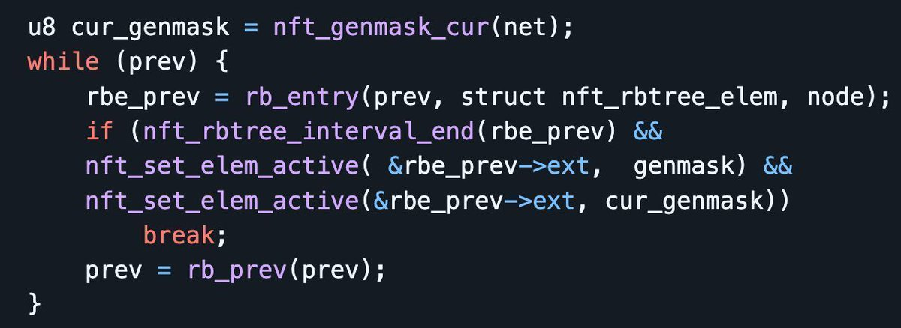</td>
<td>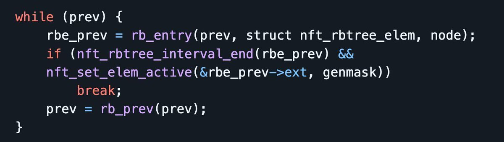</td>
</table></tr>
<table><tr>
<td>Quotes: <code>0</code></td>
<td>Replies: <code>1</code></td>
<td>Retweets: <code>30</code></td>
<td>Favorites: <code>140</code></td>
</tr></table>

---

# elhackernet
**https://twitter.com/elhackernet/status/1888964523454795881 _at 2025-02-10, 14:53:32_**
<blockquote>
Vulnerabilidad en AnyDesk

PoC disponible
https://t.co/Rx2bfHGilO

CVE-2024-12754

https://t.co/Aj4PENSGcD https://t.co/W3XAOFtdZD
</blockquote>

* https://github.com/CICADA8-Research/Penetration/tree/main/POCs/CVE-2024-12754
* https://securityonline.info/anydesk-exploit-alert-cve-2024-12754-enables-privilege-escalation-poc-available/

<table><tr>
<td>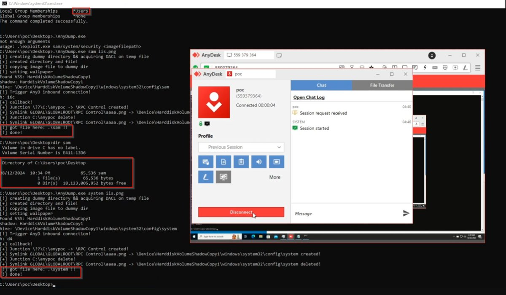</td>
</table></tr>
<table><tr>
<td>Quotes: <code>11</code></td>
<td>Replies: <code>5</code></td>
<td>Retweets: <code>232</code></td>
<td>Favorites: <code>866</code></td>
</tr></table>

---

# Dinosn
**https://twitter.com/Dinosn/status/1888791682050609428 _at 2025-02-10, 03:26:43_**
<blockquote>
AnyDesk Exploit Alert: CVE-2024-12754 Enables Privilege Escalation—PoC Available https://t.co/FG2xFyrHWx
</blockquote>

* https://securityonline.info/anydesk-exploit-alert-cve-2024-12754-enables-privilege-escalation-poc-available/

<table><tr>
<td>Quotes: <code>2</code></td>
<td>Replies: <code>1</code></td>
<td>Retweets: <code>144</code></td>
<td>Favorites: <code>403</code></td>
</tr></table>

---

# hakivvi
**https://twitter.com/hakivvi/status/1888295286595801442 _at 2025-02-08, 18:34:13_**
<blockquote>
Just finished my writeup about CVE-2025-23369, an interesting SAML authentication bypass on GitHub Enterprise Server I reported last year. you can read about it here: https://t.co/Ee61EoACtE https://t.co/mYNjXhExlp
</blockquote>

* https://repzret.blogspot.com/2025/02/abusing-libxml2-quirks-to-bypass-saml.html

<table><tr>
<td>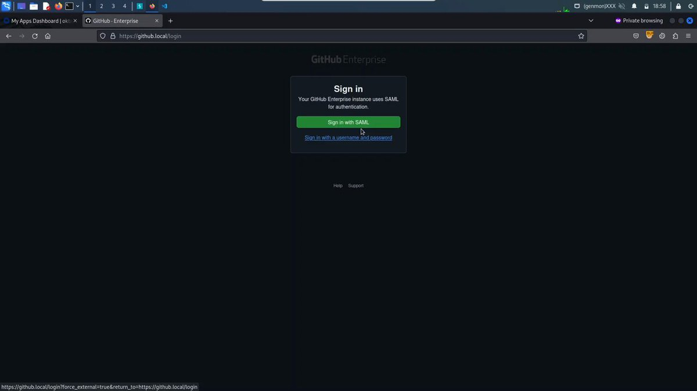</td>
</table></tr>
<table><tr>
<td>Quotes: <code>4</code></td>
<td>Replies: <code>9</code></td>
<td>Retweets: <code>94</code></td>
<td>Favorites: <code>454</code></td>
</tr></table>

---

# LetsDefendIO
**https://twitter.com/LetsDefendIO/status/1888222002089017805 _at 2025-02-08, 13:43:01_**
<blockquote>
⚠️ Another CVE SOC Alert: Windows OLE Zero-Click RCE Exploitation Detected

CVE: CVE-2025-21298 
Type: Malware
Difficulty: Medium
Event ID: 314 https://t.co/vwe2FCwf5p
</blockquote>

<table><tr>
<td>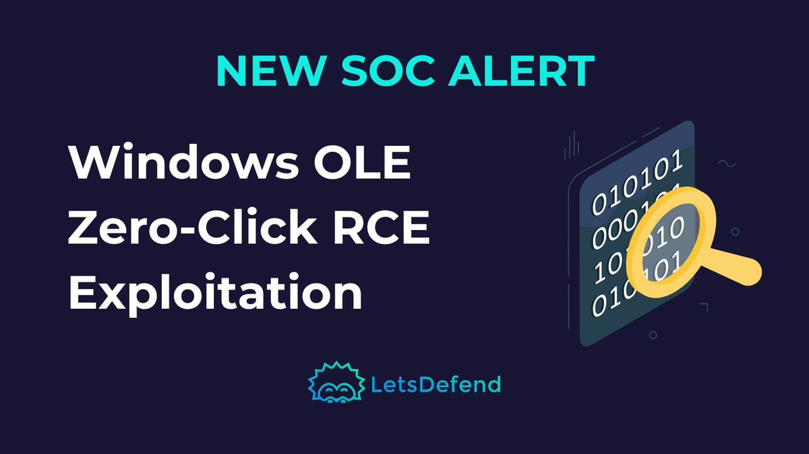</td>
</table></tr>
<table><tr>
<td>Quotes: <code>0</code></td>
<td>Replies: <code>0</code></td>
<td>Retweets: <code>4</code></td>
<td>Favorites: <code>42</code></td>
</tr></table>

---

# HunterMapping
**https://twitter.com/HunterMapping/status/1888143668025889126 _at 2025-02-08, 08:31:45_**
<blockquote>
🚨Alert🚨 CVE-2024-21413 (CVSS 9.8) : Microsoft Outlook RCE Vulnerability
🔥PoC:https://t.co/SxTcZTI6mE
📊 1.1M+ Services are found on the https://t.co/ysWb28BTvF yearly.
🔗Hunter Link:https://t.co/D4e39xFq6L
👇Query
HUNTER : https://t.co/q9rtuGfZuz="Outlook Web App"
FOFA : https://t.co/kdFzA9wEvu
</blockquote>

* https://github.com/xaitax/CVE-2024-21413-Microsoft-Outlook-Remote-Code-Execution-Vulnerability
* http://hunter.how
* https://hunter.how/list?searchValue=product.name%3D%22Outlook%20Web%20App%22
* http://product.name

<table><tr>
<td>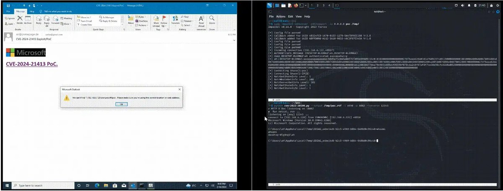</td>
</table></tr>
<table><tr>
<td>Quotes: <code>1</code></td>
<td>Replies: <code>1</code></td>
<td>Retweets: <code>62</code></td>
<td>Favorites: <code>158</code></td>
</tr></table>

---

# USCERT_gov
**https://twitter.com/USCERT_gov/status/1887934116353462620 _at 2025-02-07, 18:39:04_**
<blockquote>
Trimble released security updates for a deserialization vulnerability CVE-2025-0994 impacting its Cityworks Server AMS. This enables threat actors to conduct remote code execution against a customer’s Microsoft IIS web server. Apply updates &amp; learn more 👉 https://t.co/TyBvD9evaQ https://t.co/Bqxe5mVe7r
</blockquote>

* https://bit.ly/3zHsPI9

<table><tr>
<td></td>
</table></tr>
<table><tr>
<td>Quotes: <code>3</code></td>
<td>Replies: <code>3</code></td>
<td>Retweets: <code>15</code></td>
<td>Favorites: <code>39</code></td>
</tr></table>

---

# gothburz
**https://twitter.com/gothburz/status/1886800745590096249 _at 2025-02-04, 15:35:27_**
<blockquote>
We identified a new #ZeroDay vulnerability exploiting 7-Zip (CVE-2025-0411) being actively exploited in-the-wild on September 25th, 2024. Russian groups utilized this vulnerability, deploying SmokeLoader for espionage operations targeting #Ukraine during the ongoing https://t.co/4OtiNphGUN
</blockquote>

<table><tr>
<td>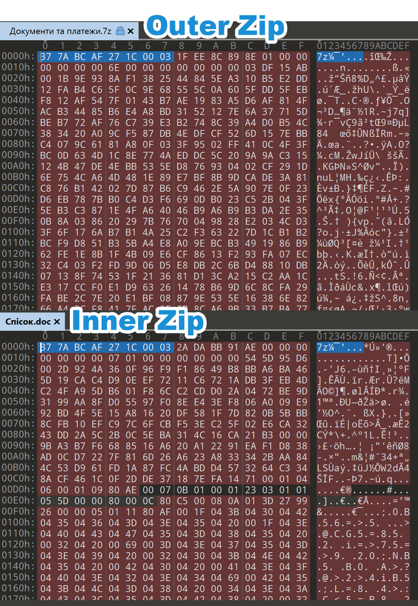</td>
<td></td>
</table></tr>
<table><tr>
<td>Quotes: <code>7</code></td>
<td>Replies: <code>6</code></td>
<td>Retweets: <code>134</code></td>
<td>Favorites: <code>567</code></td>
</tr></table>

---

# Dinosn
**https://twitter.com/Dinosn/status/1886613525109338502 _at 2025-02-04, 03:11:30_**
<blockquote>
Privilege Escalation in Active Directory Domain Services: CVE-2025-21293 Exploit Revealed with PoC Code https://t.co/Pa6sgy5j0N
</blockquote>

* https://securityonline.info/privilege-escalation-in-active-directory-domain-services-cve-2025-21293-exploit-revealed-with-poc-code/

<table><tr>
<td>Quotes: <code>1</code></td>
<td>Replies: <code>2</code></td>
<td>Retweets: <code>126</code></td>
<td>Favorites: <code>391</code></td>
</tr></table>

---

# 0xor0ne
**https://twitter.com/0xor0ne/status/1886444565055340804 _at 2025-02-03, 16:00:07_**
<blockquote>
Exploiting an unauthenticated Remote Code Execution vulnerability in Ivanti Secure (VPN) (CVE-2025-0282)

https://t.co/g7Xg4ib4HC

#cybersecurity #ivanti https://t.co/J7Nevy5dwf
</blockquote>

* https://labs.watchtowr.com/exploitation-walkthrough-and-techniques-ivanti-connect-secure-rce-cve-2025-0282/

<table><tr>
<td>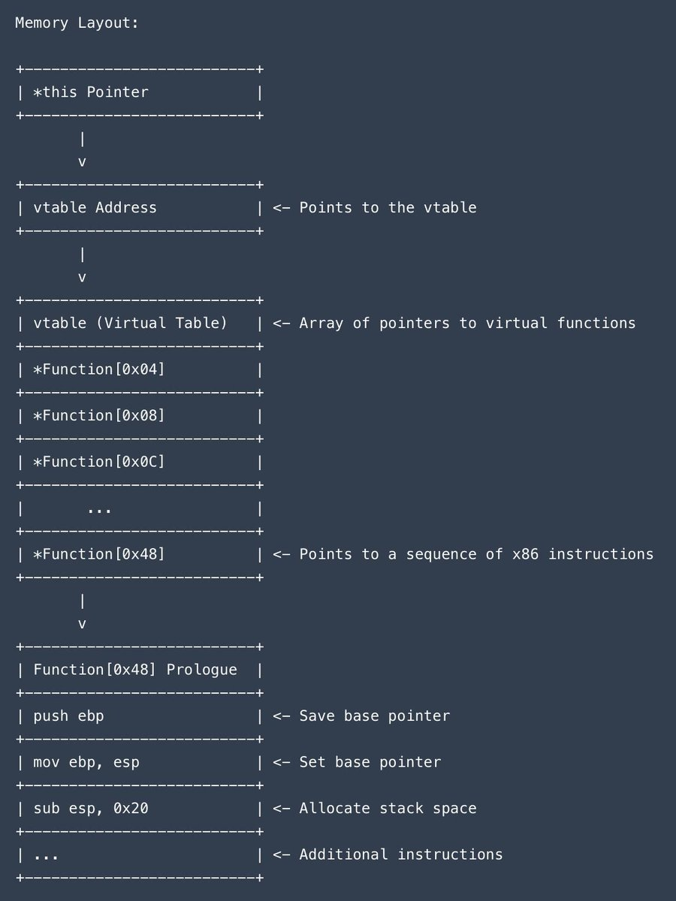</td>
</table></tr>
<table><tr>
<td>Quotes: <code>0</code></td>
<td>Replies: <code>1</code></td>
<td>Retweets: <code>66</code></td>
<td>Favorites: <code>276</code></td>
</tr></table>

---

