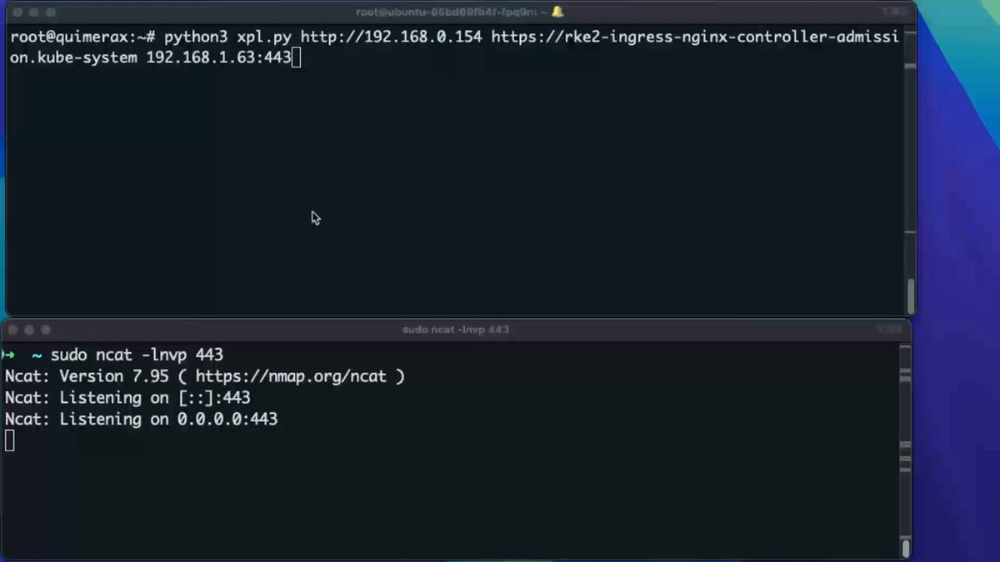
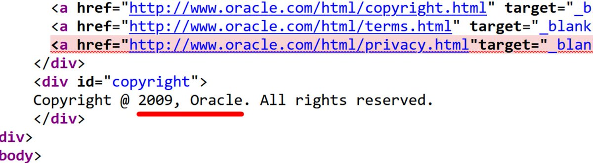
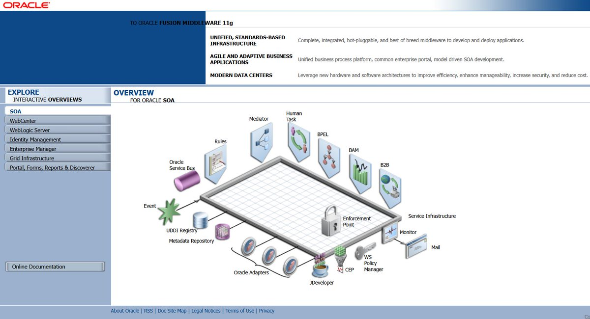
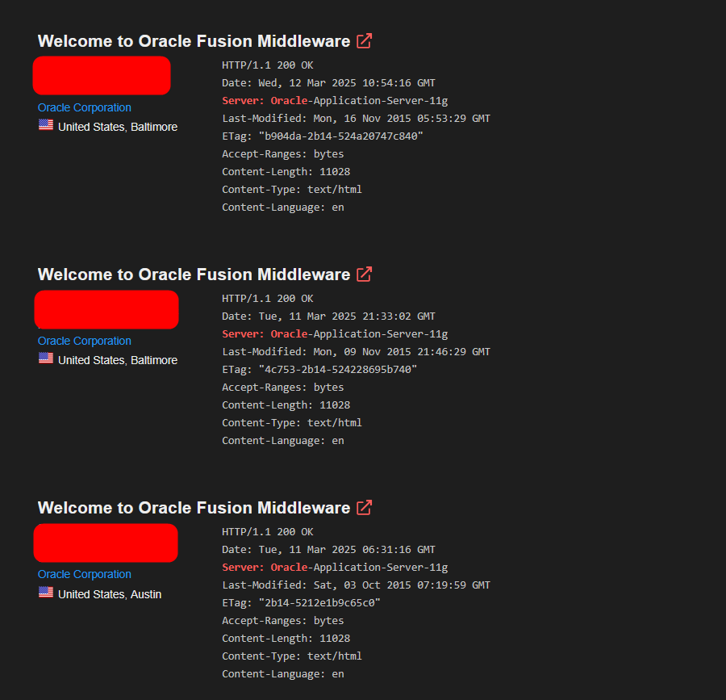
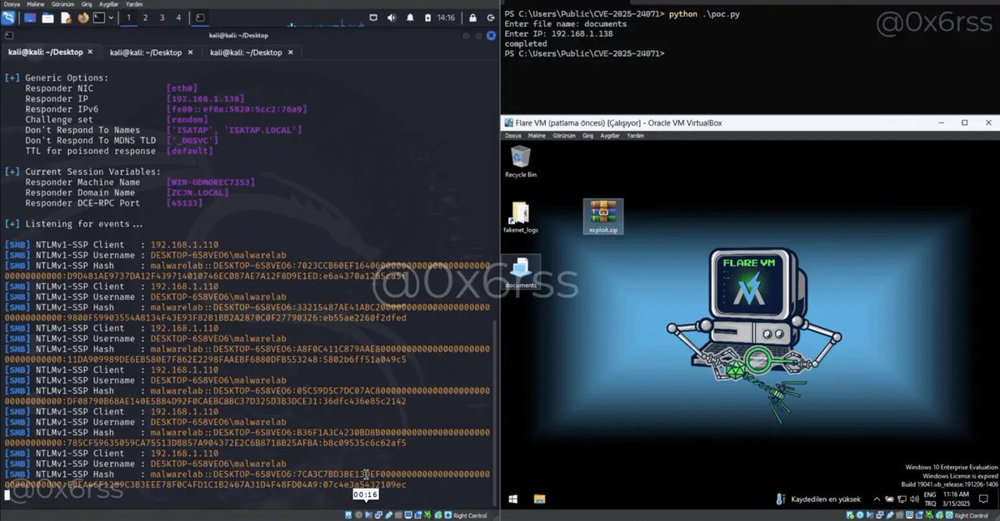
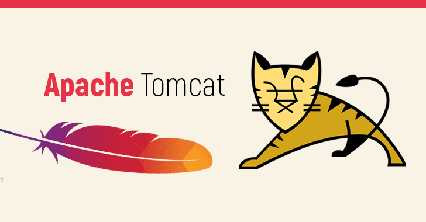
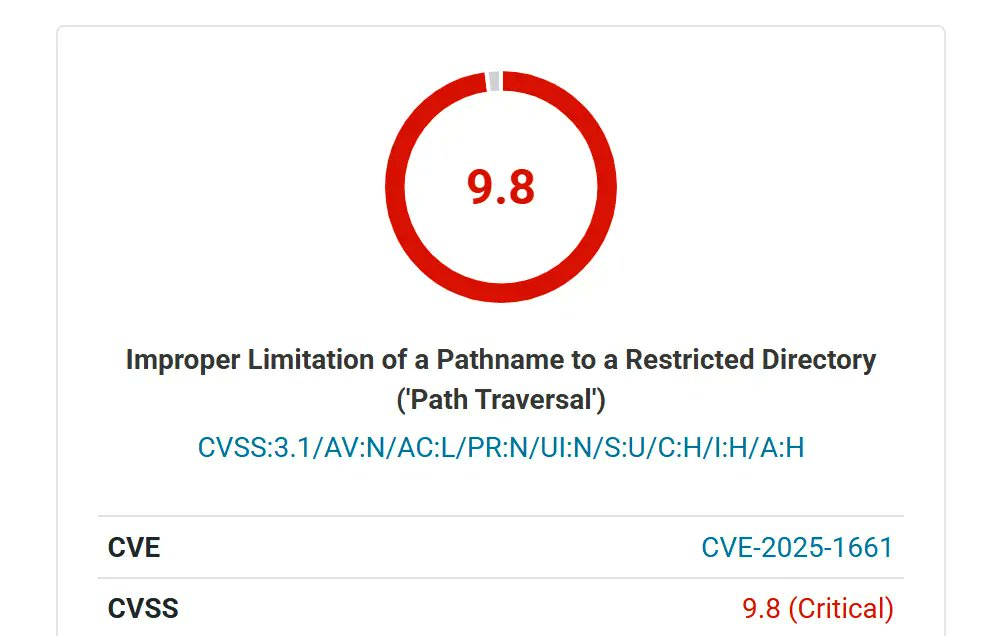
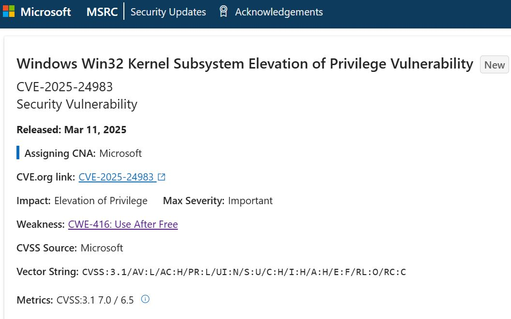
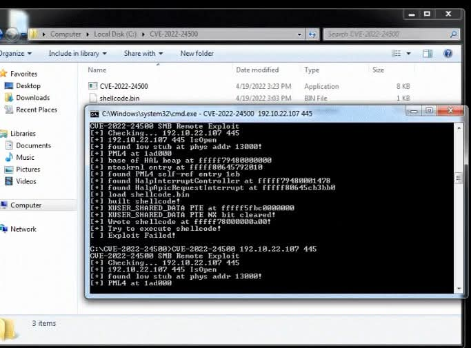

# Dinosn
**https://twitter.com/Dinosn/status/1905310171519484073 _at 2025-03-27, 17:25:18_**
<blockquote>
CVE-2025-2857: New Firefox Sandbox Escape Emerges Following Active Exploitation of CVE-2025-2783 https://t.co/BcZaEdrIQB
</blockquote>

* https://securityonline.info/cve-2025-2857-new-firefox-sandbox-escape-emerges-following-active-exploitation-of-cve-2025-2783/

<table><tr>
<td>Quotes: <code>0</code></td>
<td>Replies: <code>0</code></td>
<td>Retweets: <code>16</code></td>
<td>Favorites: <code>49</code></td>
</tr></table>

---

# carlos_crowsec
**https://twitter.com/carlos_crowsec/status/1904939487224050162 _at 2025-03-26, 16:52:20_**
<blockquote>
Our team has just successfully reproduced the IngressNightmare vulnerability (CVE-2025-1097, CVE-2025-1098, CVE-2025-24514, and CVE-2025-1974) and created a custom exploit achieving RCE.

It's a Pre-Auth RCE affecting Ingress NGINX that allows complete cluster takeover. We'll https://t.co/eifX4Ykl9S
</blockquote>

<table><tr>
<td></td>
</table></tr>
<table><tr>
<td>Quotes: <code>6</code></td>
<td>Replies: <code>14</code></td>
<td>Retweets: <code>212</code></td>
<td>Favorites: <code>914</code></td>
</tr></table>

---

# TheHackersNews
**https://twitter.com/TheHackersNews/status/1904759585497637010 _at 2025-03-26, 04:57:28_**
<blockquote>
🚨 Chrome zero-day exploited in the wild...

Google patches CVE-2025-2783, a high-severity flaw in Chrome for Windows—actively used in attacks on Russian orgs.

👀 Update Chrome now | Details: https://t.co/TnC5eSNP31
</blockquote>

* https://thehackernews.com/2025/03/zero-day-alert-google-releases-chrome.html

<table><tr>
<td>Quotes: <code>8</code></td>
<td>Replies: <code>4</code></td>
<td>Retweets: <code>125</code></td>
<td>Favorites: <code>230</code></td>
</tr></table>

---

# oct0xor
**https://twitter.com/oct0xor/status/1904647921489842322 _at 2025-03-25, 21:33:45_**
<blockquote>
We (me + @2igosha) have discovered a new Google Chrome 0-day that is being used in targeted attacks to deliver sophisticated spyware 🔥🔥🔥. It was just fixed as CVE-2025-2783 and we are revealing the first details about it and “Operation ForumTroll” https://t.co/apx0oXZ6be
</blockquote>

* https://securelist.com/operation-forumtroll/115989/

<table><tr>
<td>Quotes: <code>9</code></td>
<td>Replies: <code>9</code></td>
<td>Retweets: <code>101</code></td>
<td>Favorites: <code>283</code></td>
</tr></table>

---

# 1ZRR4H
**https://twitter.com/1ZRR4H/status/1904301690519532019 _at 2025-03-24, 22:37:57_**
<blockquote>
So, rose87168 said he used CVE-2021-35587 to compromise the login[.]us2[.]oraclecloud[.]com server. Oracle then denied the attack and remains silent but quickly disconnected the server from the Internet (probably to investigate? also unknown). 

The problem is that Oracle has, at https://t.co/uLu4itUBD5
</blockquote>

<table><tr>
<td></td>
<td></td>
<td></td>
</table></tr>
<table><tr>
<td>Quotes: <code>3</code></td>
<td>Replies: <code>5</code></td>
<td>Retweets: <code>88</code></td>
<td>Favorites: <code>284</code></td>
</tr></table>

---

# blank_cold
**https://twitter.com/blank_cold/status/1903578976414753246 _at 2025-03-22, 22:46:09_**
<blockquote>
the research paper is out:

Next.js and the corrupt middleware: the authorizing artifact

result of a collaboration with @inzo____ that led to CVE-2025-29927 (9.1-critical)

https://t.co/GZkbnr6o9H

enjoy the read! https://t.co/KyfY8a3suR
</blockquote>

* https://zhero-web-sec.github.io/research-and-things/nextjs-and-the-corrupt-middleware

<table><tr>
<td></td>
</table></tr>
<table><tr>
<td>Quotes: <code>38</code></td>
<td>Replies: <code>72</code></td>
<td>Retweets: <code>448</code></td>
<td>Favorites: <code>1629</code></td>
</tr></table>

---

# HunterMapping
**https://twitter.com/HunterMapping/status/1902624267164156068 _at 2025-03-20, 07:32:28_**
<blockquote>
🚨Alert🚨 CVE-2025-24071:Microsoft Windows File Explorer Spoofing Vulnerability
🔥PoC from @0x6rss :https://t.co/OOjT2qvDDe
📊 246M+ Services are found on the https://t.co/ysWb28Crld yearly.
🔗Hunter Link:https://t.co/CyIRQG2Aqw
👇Query
HUNTER : https://t.co/q9rtuGgxk7="Windows https://t.co/g8YoDDYmKV
</blockquote>

* https://github.com/0x6rss/CVE-2025-24071_PoC
* http://hunter.how
* https://hunter.how/list?searchValue=product.name%3D%22Windows%20Server%22
* http://product.name

<table><tr>
<td></td>
</table></tr>
<table><tr>
<td>Quotes: <code>0</code></td>
<td>Replies: <code>0</code></td>
<td>Retweets: <code>20</code></td>
<td>Favorites: <code>57</code></td>
</tr></table>

---

# TheHackersNews
**https://twitter.com/TheHackersNews/status/1901682279937929632 _at 2025-03-17, 17:09:21_**
<blockquote>
🚨 Apache Tomcat Under Attack.

Hackers are actively exploiting CVE-2025-24813 just 30 hours after disclosure.

🔹 RCE &amp; Info Disclosure Risk
🔹 No Authentication Needed
🔹 Attackers Upload &amp; Execute Malicious Files

⚠️ Delaying could mean backdoors, config tampering &amp; full https://t.co/IIJWCB6tN2
</blockquote>

<table><tr>
<td></td>
</table></tr>
<table><tr>
<td>Quotes: <code>7</code></td>
<td>Replies: <code>5</code></td>
<td>Retweets: <code>145</code></td>
<td>Favorites: <code>349</code></td>
</tr></table>

---

# elhackernet
**https://twitter.com/elhackernet/status/1899805883686666567 _at 2025-03-12, 12:53:14_**
<blockquote>
Una vulnerabilidad crítica expone más de 100.000 sitios  con el plugin de WordPress para WooCommerce

➡️ HUSKY – WooCommerce Products Filter Professional - WOOF

⚠️ CVE-2025-1661 permite LFI (Local File Inclusion)
https://t.co/FPb57iq38p https://t.co/mz7LjVSHN0
</blockquote>

* https://securityonline.info/critical-flaw-exposes-100000-woocommerce-sites-unauthenticated-file-inclusion-threatens-total-takeover/

<table><tr>
<td></td>
<td></td>
</table></tr>
<table><tr>
<td>Quotes: <code>3</code></td>
<td>Replies: <code>1</code></td>
<td>Retweets: <code>73</code></td>
<td>Favorites: <code>187</code></td>
</tr></table>

---

# TheHackersNews
**https://twitter.com/TheHackersNews/status/1899672744742002959 _at 2025-03-12, 04:04:11_**
<blockquote>
🚨 Apple just patched a zero-day under active attack!

CVE-2025-24201 lets hackers escape the WebKit sandbox—Apple calls the exploit “extremely sophisticated.”

Targeted? Unknown
Duration? Unknown

But if you use an iPhone, Mac, or Vision Pro—update NOW.

📲 Details: https://t.co/m1y1jYuQr0
</blockquote>

<table><tr>
<td></td>
</table></tr>
<table><tr>
<td>Quotes: <code>7</code></td>
<td>Replies: <code>4</code></td>
<td>Retweets: <code>125</code></td>
<td>Favorites: <code>270</code></td>
</tr></table>

---

# ESETresearch
**https://twitter.com/ESETresearch/status/1899508656258875756 _at 2025-03-11, 17:12:09_**
<blockquote>
#ESETresearch has discovered a zero day exploit abusing #CVE-2025-24983 vulnerability in Windows Kernel to elevate privileges (#LPE). First seen in the wild in March 2023, the exploit was deployed through #PipeMagic backdoor on the compromised machines. 1/4 https://t.co/qCOgYiltfs
</blockquote>

<table><tr>
<td></td>
</table></tr>
<table><tr>
<td>Quotes: <code>7</code></td>
<td>Replies: <code>3</code></td>
<td>Retweets: <code>73</code></td>
<td>Favorites: <code>198</code></td>
</tr></table>

---

# elhackernet
**https://twitter.com/elhackernet/status/1899002586155421757 _at 2025-03-10, 07:41:12_**
<blockquote>
CVE-2022-24500 : Exploit Windows SMB Remote Code Execution Vulnerability https://t.co/GmzGzS2F6u https://t.co/2Dsq5eml0X
</blockquote>

* https://github.com/0xZipp0/CVE-2022-24500

<table><tr>
<td></td>
</table></tr>
<table><tr>
<td>Quotes: <code>3</code></td>
<td>Replies: <code>5</code></td>
<td>Retweets: <code>157</code></td>
<td>Favorites: <code>596</code></td>
</tr></table>

---

# the_yellow_fall
**https://twitter.com/the_yellow_fall/status/1896388124877729964 _at 2025-03-03, 02:32:16_**
<blockquote>
Windows Hyper-V Zero-Day CVE-2025-21333: PoC Drops, SYSTEM Access Exposed

Explore the CVE-2025-21333 #PoC exploit revealing a zero-day vulnerability in #Windows Hyper-V that allows SYSTEM privilege escalation.
https://t.co/RqcG6xPxW0
</blockquote>

* https://securityonline.info/windows-hyper-v-zero-day-cve-2025-21333-poc-drops-system-access-exposed/

<table><tr>
<td>Quotes: <code>1</code></td>
<td>Replies: <code>1</code></td>
<td>Retweets: <code>83</code></td>
<td>Favorites: <code>315</code></td>
</tr></table>

---

