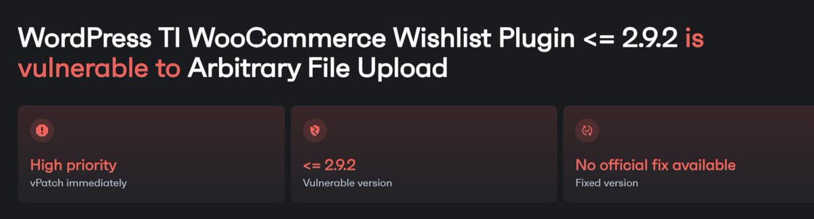
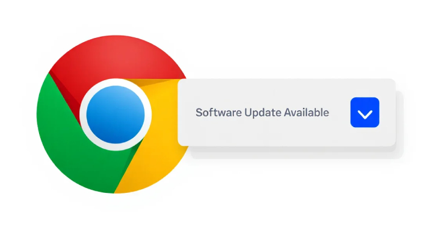
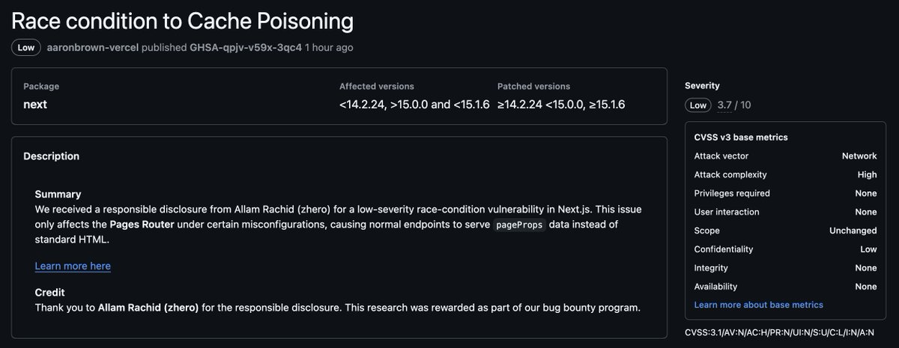

# HunterMapping
**https://twitter.com/HunterMapping/status/1928028638404046996 _at 2025-05-29, 10:00:23_**
<blockquote>
🚨Alert🚨CVE-2025-47577 : Unrestricted Upload of File with Dangerous Type vulnerability in TemplateInvaders TI WooCommerce Wishlist
📊 81.5K+Services are found on the https://t.co/ysWb28Crld yearly.
🔗Hunter Link:https://t.co/qKwadUASBp
👇Query
HUNTER : https://t.co/neEnWF3gSZ
</blockquote>

* http://hunter.how
* https://hunter.how/list?searchValue=product.name%3D%22TI%20WooCommerce%20Wishlist%22

<table><tr>
<td></td>
<td></td>
</table></tr>
<table><tr>
<td>Quotes: <code>0</code></td>
<td>Replies: <code>1</code></td>
<td>Retweets: <code>29</code></td>
<td>Favorites: <code>86</code></td>
</tr></table>

---

# wazuh
**https://twitter.com/wazuh/status/1925221333207588939 _at 2025-05-21, 16:05:09_**
<blockquote>
CVE-2025-4664 is a zero-day vulnerability recently discovered to affect Google Chrome and Chromium web browsers on Windows and Linux endpoints, respectively. 

Read on: https://t.co/2ALJMMDOMw

#InformationSecurity #CyberSecurity #OpenSource
</blockquote>

* https://ow.ly/8TT250VWuV3

<table><tr>
<td>Quotes: <code>0</code></td>
<td>Replies: <code>0</code></td>
<td>Retweets: <code>15</code></td>
<td>Favorites: <code>40</code></td>
</tr></table>

---

# TheHackersNews
**https://twitter.com/TheHackersNews/status/1922899618871820729 _at 2025-05-15, 06:19:29_**
<blockquote>
🚨 Warning: A new high-severity Google Chrome flaw is being actively exploited in the wild.

CVE-2025-4664 allows attackers to steal sensitive data like account credentials via crafted HTML + image traps.

It affects Chrome &lt; 136.0.7103.113 — and likely other Chromium-based https://t.co/uMUVftLdfq
</blockquote>

<table><tr>
<td></td>
</table></tr>
<table><tr>
<td>Quotes: <code>7</code></td>
<td>Replies: <code>4</code></td>
<td>Retweets: <code>113</code></td>
<td>Favorites: <code>237</code></td>
</tr></table>

---

# blank_cold
**https://twitter.com/blank_cold/status/1922787432392450154 _at 2025-05-14, 22:53:42_**
<blockquote>
with the security advisory published, I should publish my paper within a few hours

Race-Condition to Cache Poisoning - CVE-2025-32421 on @nextjs 

partially leading to the bypass of my previous vulnerability the CVE-2024-46982 https://t.co/bQq01hn8Hl
</blockquote>

<table><tr>
<td></td>
</table></tr>
<table><tr>
<td>Quotes: <code>1</code></td>
<td>Replies: <code>14</code></td>
<td>Retweets: <code>33</code></td>
<td>Favorites: <code>411</code></td>
</tr></table>

---

# TheHackersNews
**https://twitter.com/TheHackersNews/status/1919438844333621713 _at 2025-05-05, 17:07:36_**
<blockquote>
🚨 Zero-click. Wormable. Network-spreading.

New flaws in Apple’s AirPlay protocol (🔓 AirBorne) could let hackers hijack your device without a click—then ride your Wi-Fi into corporate networks.

CVE-2025-24252 + CVE-2025-24132 = silent RCE across Macs, TVs, speakers. Just being https://t.co/i7ZMYVfhlD
</blockquote>

<table><tr>
<td></td>
</table></tr>
<table><tr>
<td>Quotes: <code>8</code></td>
<td>Replies: <code>3</code></td>
<td>Retweets: <code>109</code></td>
<td>Favorites: <code>244</code></td>
</tr></table>

---

# HunterMapping
**https://twitter.com/HunterMapping/status/1928028638404046996 _at 2025-05-29, 10:00:23_**
<blockquote>
🚨Alert🚨CVE-2025-47577 : Unrestricted Upload of File with Dangerous Type vulnerability in TemplateInvaders TI WooCommerce Wishlist
📊 81.5K+Services are found on the https://t.co/ysWb28Crld yearly.
🔗Hunter Link:https://t.co/qKwadUASBp
👇Query
HUNTER : https://t.co/neEnWF3gSZ
</blockquote>

* http://hunter.how
* https://hunter.how/list?searchValue=product.name%3D%22TI%20WooCommerce%20Wishlist%22

<table><tr>
<td></td>
<td></td>
</table></tr>
<table><tr>
<td>Quotes: <code>0</code></td>
<td>Replies: <code>1</code></td>
<td>Retweets: <code>29</code></td>
<td>Favorites: <code>86</code></td>
</tr></table>

---

# wazuh
**https://twitter.com/wazuh/status/1925221333207588939 _at 2025-05-21, 16:05:09_**
<blockquote>
CVE-2025-4664 is a zero-day vulnerability recently discovered to affect Google Chrome and Chromium web browsers on Windows and Linux endpoints, respectively. 

Read on: https://t.co/2ALJMMDOMw

#InformationSecurity #CyberSecurity #OpenSource
</blockquote>

* https://ow.ly/8TT250VWuV3

<table><tr>
<td>Quotes: <code>0</code></td>
<td>Replies: <code>0</code></td>
<td>Retweets: <code>15</code></td>
<td>Favorites: <code>40</code></td>
</tr></table>

---

# TheHackersNews
**https://twitter.com/TheHackersNews/status/1922899618871820729 _at 2025-05-15, 06:19:29_**
<blockquote>
🚨 Warning: A new high-severity Google Chrome flaw is being actively exploited in the wild.

CVE-2025-4664 allows attackers to steal sensitive data like account credentials via crafted HTML + image traps.

It affects Chrome &lt; 136.0.7103.113 — and likely other Chromium-based https://t.co/uMUVftLdfq
</blockquote>

<table><tr>
<td></td>
</table></tr>
<table><tr>
<td>Quotes: <code>7</code></td>
<td>Replies: <code>4</code></td>
<td>Retweets: <code>113</code></td>
<td>Favorites: <code>237</code></td>
</tr></table>

---

# blank_cold
**https://twitter.com/blank_cold/status/1922787432392450154 _at 2025-05-14, 22:53:42_**
<blockquote>
with the security advisory published, I should publish my paper within a few hours

Race-Condition to Cache Poisoning - CVE-2025-32421 on @nextjs 

partially leading to the bypass of my previous vulnerability the CVE-2024-46982 https://t.co/bQq01hn8Hl
</blockquote>

<table><tr>
<td></td>
</table></tr>
<table><tr>
<td>Quotes: <code>1</code></td>
<td>Replies: <code>14</code></td>
<td>Retweets: <code>33</code></td>
<td>Favorites: <code>411</code></td>
</tr></table>

---

# TheHackersNews
**https://twitter.com/TheHackersNews/status/1919438844333621713 _at 2025-05-05, 17:07:36_**
<blockquote>
🚨 Zero-click. Wormable. Network-spreading.

New flaws in Apple’s AirPlay protocol (🔓 AirBorne) could let hackers hijack your device without a click—then ride your Wi-Fi into corporate networks.

CVE-2025-24252 + CVE-2025-24132 = silent RCE across Macs, TVs, speakers. Just being https://t.co/i7ZMYVfhlD
</blockquote>

<table><tr>
<td></td>
</table></tr>
<table><tr>
<td>Quotes: <code>8</code></td>
<td>Replies: <code>3</code></td>
<td>Retweets: <code>109</code></td>
<td>Favorites: <code>244</code></td>
</tr></table>

---

# HunterMapping
**https://twitter.com/HunterMapping/status/1928028638404046996 _at 2025-05-29, 10:00:23_**
<blockquote>
🚨Alert🚨CVE-2025-47577 : Unrestricted Upload of File with Dangerous Type vulnerability in TemplateInvaders TI WooCommerce Wishlist
📊 81.5K+Services are found on the https://t.co/ysWb28Crld yearly.
🔗Hunter Link:https://t.co/qKwadUASBp
👇Query
HUNTER : https://t.co/neEnWF3gSZ
</blockquote>

* http://hunter.how
* https://hunter.how/list?searchValue=product.name%3D%22TI%20WooCommerce%20Wishlist%22

<table><tr>
<td></td>
<td></td>
</table></tr>
<table><tr>
<td>Quotes: <code>0</code></td>
<td>Replies: <code>1</code></td>
<td>Retweets: <code>29</code></td>
<td>Favorites: <code>86</code></td>
</tr></table>

---

# wazuh
**https://twitter.com/wazuh/status/1925221333207588939 _at 2025-05-21, 16:05:09_**
<blockquote>
CVE-2025-4664 is a zero-day vulnerability recently discovered to affect Google Chrome and Chromium web browsers on Windows and Linux endpoints, respectively. 

Read on: https://t.co/2ALJMMDOMw

#InformationSecurity #CyberSecurity #OpenSource
</blockquote>

* https://ow.ly/8TT250VWuV3

<table><tr>
<td>Quotes: <code>0</code></td>
<td>Replies: <code>0</code></td>
<td>Retweets: <code>15</code></td>
<td>Favorites: <code>40</code></td>
</tr></table>

---

# TheHackersNews
**https://twitter.com/TheHackersNews/status/1922899618871820729 _at 2025-05-15, 06:19:29_**
<blockquote>
🚨 Warning: A new high-severity Google Chrome flaw is being actively exploited in the wild.

CVE-2025-4664 allows attackers to steal sensitive data like account credentials via crafted HTML + image traps.

It affects Chrome &lt; 136.0.7103.113 — and likely other Chromium-based https://t.co/uMUVftLdfq
</blockquote>

<table><tr>
<td></td>
</table></tr>
<table><tr>
<td>Quotes: <code>7</code></td>
<td>Replies: <code>4</code></td>
<td>Retweets: <code>113</code></td>
<td>Favorites: <code>237</code></td>
</tr></table>

---

# blank_cold
**https://twitter.com/blank_cold/status/1922787432392450154 _at 2025-05-14, 22:53:42_**
<blockquote>
with the security advisory published, I should publish my paper within a few hours

Race-Condition to Cache Poisoning - CVE-2025-32421 on @nextjs 

partially leading to the bypass of my previous vulnerability the CVE-2024-46982 https://t.co/bQq01hn8Hl
</blockquote>

<table><tr>
<td></td>
</table></tr>
<table><tr>
<td>Quotes: <code>1</code></td>
<td>Replies: <code>14</code></td>
<td>Retweets: <code>33</code></td>
<td>Favorites: <code>411</code></td>
</tr></table>

---

# TheHackersNews
**https://twitter.com/TheHackersNews/status/1919438844333621713 _at 2025-05-05, 17:07:36_**
<blockquote>
🚨 Zero-click. Wormable. Network-spreading.

New flaws in Apple’s AirPlay protocol (🔓 AirBorne) could let hackers hijack your device without a click—then ride your Wi-Fi into corporate networks.

CVE-2025-24252 + CVE-2025-24132 = silent RCE across Macs, TVs, speakers. Just being https://t.co/i7ZMYVfhlD
</blockquote>

<table><tr>
<td></td>
</table></tr>
<table><tr>
<td>Quotes: <code>8</code></td>
<td>Replies: <code>3</code></td>
<td>Retweets: <code>109</code></td>
<td>Favorites: <code>244</code></td>
</tr></table>

---

# HunterMapping
**https://twitter.com/HunterMapping/status/1928028638404046996 _at 2025-05-29, 10:00:23_**
<blockquote>
🚨Alert🚨CVE-2025-47577 : Unrestricted Upload of File with Dangerous Type vulnerability in TemplateInvaders TI WooCommerce Wishlist
📊 81.5K+Services are found on the https://t.co/ysWb28Crld yearly.
🔗Hunter Link:https://t.co/qKwadUASBp
👇Query
HUNTER : https://t.co/neEnWF3gSZ
</blockquote>

* http://hunter.how
* https://t.co/ysWb28Crld
* https://hunter.how/list?searchValue=product.name%3D%22TI%20WooCommerce%20Wishlist%22
* https://t.co/qKwadUASBp

<table><tr>
<td></td>
<td></td>
</table></tr>
<table><tr>
<td>Quotes: <code>0</code></td>
<td>Replies: <code>1</code></td>
<td>Retweets: <code>29</code></td>
<td>Favorites: <code>86</code></td>
</tr></table>

---

# wazuh
**https://twitter.com/wazuh/status/1925221333207588939 _at 2025-05-21, 16:05:09_**
<blockquote>
CVE-2025-4664 is a zero-day vulnerability recently discovered to affect Google Chrome and Chromium web browsers on Windows and Linux endpoints, respectively. 

Read on: https://t.co/2ALJMMDOMw

#InformationSecurity #CyberSecurity #OpenSource
</blockquote>

* https://ow.ly/8TT250VWuV3
* https://t.co/2ALJMMDOMw

<table><tr>
<td>Quotes: <code>0</code></td>
<td>Replies: <code>0</code></td>
<td>Retweets: <code>15</code></td>
<td>Favorites: <code>40</code></td>
</tr></table>

---

# TheHackersNews
**https://twitter.com/TheHackersNews/status/1922899618871820729 _at 2025-05-15, 06:19:29_**
<blockquote>
🚨 Warning: A new high-severity Google Chrome flaw is being actively exploited in the wild.

CVE-2025-4664 allows attackers to steal sensitive data like account credentials via crafted HTML + image traps.

It affects Chrome &lt; 136.0.7103.113 — and likely other Chromium-based https://t.co/uMUVftLdfq
</blockquote>

<table><tr>
<td></td>
</table></tr>
<table><tr>
<td>Quotes: <code>7</code></td>
<td>Replies: <code>4</code></td>
<td>Retweets: <code>113</code></td>
<td>Favorites: <code>237</code></td>
</tr></table>

---

# blank_cold
**https://twitter.com/blank_cold/status/1922787432392450154 _at 2025-05-14, 22:53:42_**
<blockquote>
with the security advisory published, I should publish my paper within a few hours

Race-Condition to Cache Poisoning - CVE-2025-32421 on @nextjs 

partially leading to the bypass of my previous vulnerability the CVE-2024-46982 https://t.co/bQq01hn8Hl
</blockquote>

<table><tr>
<td></td>
</table></tr>
<table><tr>
<td>Quotes: <code>1</code></td>
<td>Replies: <code>14</code></td>
<td>Retweets: <code>33</code></td>
<td>Favorites: <code>411</code></td>
</tr></table>

---

# TheHackersNews
**https://twitter.com/TheHackersNews/status/1919438844333621713 _at 2025-05-05, 17:07:36_**
<blockquote>
🚨 Zero-click. Wormable. Network-spreading.

New flaws in Apple’s AirPlay protocol (🔓 AirBorne) could let hackers hijack your device without a click—then ride your Wi-Fi into corporate networks.

CVE-2025-24252 + CVE-2025-24132 = silent RCE across Macs, TVs, speakers. Just being https://t.co/i7ZMYVfhlD
</blockquote>

<table><tr>
<td></td>
</table></tr>
<table><tr>
<td>Quotes: <code>8</code></td>
<td>Replies: <code>3</code></td>
<td>Retweets: <code>109</code></td>
<td>Favorites: <code>244</code></td>
</tr></table>

---

# HunterMapping
**https://twitter.com/HunterMapping/status/1928028638404046996 _at 2025-05-29, 10:00:23_**
<blockquote>
🚨Alert🚨CVE-2025-47577 : Unrestricted Upload of File with Dangerous Type vulnerability in TemplateInvaders TI WooCommerce Wishlist
📊 81.5K+Services are found on the https://t.co/ysWb28Crld yearly.
🔗Hunter Link:https://t.co/qKwadUASBp
👇Query
HUNTER : https://t.co/neEnWF3gSZ
</blockquote>

* http://hunter.how
* https://hunter.how/list?searchValue=product.name%3D%22TI%20WooCommerce%20Wishlist%22

<table><tr>
<td></td>
<td></td>
</table></tr>
<table><tr>
<td>Quotes: <code>0</code></td>
<td>Replies: <code>1</code></td>
<td>Retweets: <code>29</code></td>
<td>Favorites: <code>86</code></td>
</tr></table>

---

# wazuh
**https://twitter.com/wazuh/status/1925221333207588939 _at 2025-05-21, 16:05:09_**
<blockquote>
CVE-2025-4664 is a zero-day vulnerability recently discovered to affect Google Chrome and Chromium web browsers on Windows and Linux endpoints, respectively. 

Read on: https://t.co/2ALJMMDOMw

#InformationSecurity #CyberSecurity #OpenSource
</blockquote>

* https://ow.ly/8TT250VWuV3

<table><tr>
<td>Quotes: <code>0</code></td>
<td>Replies: <code>0</code></td>
<td>Retweets: <code>15</code></td>
<td>Favorites: <code>40</code></td>
</tr></table>

---

# TheHackersNews
**https://twitter.com/TheHackersNews/status/1922899618871820729 _at 2025-05-15, 06:19:29_**
<blockquote>
🚨 Warning: A new high-severity Google Chrome flaw is being actively exploited in the wild.

CVE-2025-4664 allows attackers to steal sensitive data like account credentials via crafted HTML + image traps.

It affects Chrome &lt; 136.0.7103.113 — and likely other Chromium-based https://t.co/uMUVftLdfq
</blockquote>

<table><tr>
<td></td>
</table></tr>
<table><tr>
<td>Quotes: <code>7</code></td>
<td>Replies: <code>4</code></td>
<td>Retweets: <code>113</code></td>
<td>Favorites: <code>237</code></td>
</tr></table>

---

# blank_cold
**https://twitter.com/blank_cold/status/1922787432392450154 _at 2025-05-14, 22:53:42_**
<blockquote>
with the security advisory published, I should publish my paper within a few hours

Race-Condition to Cache Poisoning - CVE-2025-32421 on @nextjs 

partially leading to the bypass of my previous vulnerability the CVE-2024-46982 https://t.co/bQq01hn8Hl
</blockquote>

<table><tr>
<td></td>
</table></tr>
<table><tr>
<td>Quotes: <code>1</code></td>
<td>Replies: <code>14</code></td>
<td>Retweets: <code>33</code></td>
<td>Favorites: <code>411</code></td>
</tr></table>

---

# TheHackersNews
**https://twitter.com/TheHackersNews/status/1919438844333621713 _at 2025-05-05, 17:07:36_**
<blockquote>
🚨 Zero-click. Wormable. Network-spreading.

New flaws in Apple’s AirPlay protocol (🔓 AirBorne) could let hackers hijack your device without a click—then ride your Wi-Fi into corporate networks.

CVE-2025-24252 + CVE-2025-24132 = silent RCE across Macs, TVs, speakers. Just being https://t.co/i7ZMYVfhlD
</blockquote>

<table><tr>
<td></td>
</table></tr>
<table><tr>
<td>Quotes: <code>8</code></td>
<td>Replies: <code>3</code></td>
<td>Retweets: <code>109</code></td>
<td>Favorites: <code>244</code></td>
</tr></table>

---

# HunterMapping
**https://twitter.com/HunterMapping/status/1928028638404046996 _at 2025-05-29, 10:00:23_**
<blockquote>
🚨Alert🚨CVE-2025-47577 : Unrestricted Upload of File with Dangerous Type vulnerability in TemplateInvaders TI WooCommerce Wishlist
📊 81.5K+Services are found on the https://t.co/ysWb28Crld yearly.
🔗Hunter Link:https://t.co/qKwadUASBp
👇Query
HUNTER : https://t.co/neEnWF3gSZ
</blockquote>

* http://hunter.how
* https://hunter.how/list?searchValue=product.name%3D%22TI%20WooCommerce%20Wishlist%22

<table><tr>
<td></td>
<td></td>
</table></tr>
<table><tr>
<td>Quotes: <code>0</code></td>
<td>Replies: <code>1</code></td>
<td>Retweets: <code>29</code></td>
<td>Favorites: <code>86</code></td>
</tr></table>

---

# wazuh
**https://twitter.com/wazuh/status/1925221333207588939 _at 2025-05-21, 16:05:09_**
<blockquote>
CVE-2025-4664 is a zero-day vulnerability recently discovered to affect Google Chrome and Chromium web browsers on Windows and Linux endpoints, respectively. 

Read on: https://t.co/2ALJMMDOMw

#InformationSecurity #CyberSecurity #OpenSource
</blockquote>

* https://ow.ly/8TT250VWuV3

<table><tr>
<td>Quotes: <code>0</code></td>
<td>Replies: <code>0</code></td>
<td>Retweets: <code>15</code></td>
<td>Favorites: <code>40</code></td>
</tr></table>

---

# TheHackersNews
**https://twitter.com/TheHackersNews/status/1922899618871820729 _at 2025-05-15, 06:19:29_**
<blockquote>
🚨 Warning: A new high-severity Google Chrome flaw is being actively exploited in the wild.

CVE-2025-4664 allows attackers to steal sensitive data like account credentials via crafted HTML + image traps.

It affects Chrome &lt; 136.0.7103.113 — and likely other Chromium-based https://t.co/uMUVftLdfq
</blockquote>

<table><tr>
<td></td>
</table></tr>
<table><tr>
<td>Quotes: <code>7</code></td>
<td>Replies: <code>4</code></td>
<td>Retweets: <code>113</code></td>
<td>Favorites: <code>237</code></td>
</tr></table>

---

# blank_cold
**https://twitter.com/blank_cold/status/1922787432392450154 _at 2025-05-14, 22:53:42_**
<blockquote>
with the security advisory published, I should publish my paper within a few hours

Race-Condition to Cache Poisoning - CVE-2025-32421 on @nextjs 

partially leading to the bypass of my previous vulnerability the CVE-2024-46982 https://t.co/bQq01hn8Hl
</blockquote>

<table><tr>
<td></td>
</table></tr>
<table><tr>
<td>Quotes: <code>1</code></td>
<td>Replies: <code>14</code></td>
<td>Retweets: <code>33</code></td>
<td>Favorites: <code>411</code></td>
</tr></table>

---

# TheHackersNews
**https://twitter.com/TheHackersNews/status/1919438844333621713 _at 2025-05-05, 17:07:36_**
<blockquote>
🚨 Zero-click. Wormable. Network-spreading.

New flaws in Apple’s AirPlay protocol (🔓 AirBorne) could let hackers hijack your device without a click—then ride your Wi-Fi into corporate networks.

CVE-2025-24252 + CVE-2025-24132 = silent RCE across Macs, TVs, speakers. Just being https://t.co/i7ZMYVfhlD
</blockquote>

<table><tr>
<td></td>
</table></tr>
<table><tr>
<td>Quotes: <code>8</code></td>
<td>Replies: <code>3</code></td>
<td>Retweets: <code>109</code></td>
<td>Favorites: <code>244</code></td>
</tr></table>

---

# HunterMapping
**https://twitter.com/HunterMapping/status/1928028638404046996 _at 2025-05-29, 10:00:23_**
<blockquote>
🚨Alert🚨CVE-2025-47577 : Unrestricted Upload of File with Dangerous Type vulnerability in TemplateInvaders TI WooCommerce Wishlist
📊 81.5K+Services are found on the https://t.co/ysWb28Crld yearly.
🔗Hunter Link:https://t.co/qKwadUASBp
👇Query
HUNTER : https://t.co/neEnWF3gSZ
</blockquote>

* http://hunter.how
* https://hunter.how/list?searchValue=product.name%3D%22TI%20WooCommerce%20Wishlist%22

<table><tr>
<td></td>
<td></td>
</table></tr>
<table><tr>
<td>Quotes: <code>0</code></td>
<td>Replies: <code>1</code></td>
<td>Retweets: <code>29</code></td>
<td>Favorites: <code>86</code></td>
</tr></table>

---

# wazuh
**https://twitter.com/wazuh/status/1925221333207588939 _at 2025-05-21, 16:05:09_**
<blockquote>
CVE-2025-4664 is a zero-day vulnerability recently discovered to affect Google Chrome and Chromium web browsers on Windows and Linux endpoints, respectively. 

Read on: https://t.co/2ALJMMDOMw

#InformationSecurity #CyberSecurity #OpenSource
</blockquote>

* https://ow.ly/8TT250VWuV3

<table><tr>
<td>Quotes: <code>0</code></td>
<td>Replies: <code>0</code></td>
<td>Retweets: <code>15</code></td>
<td>Favorites: <code>40</code></td>
</tr></table>

---

# TheHackersNews
**https://twitter.com/TheHackersNews/status/1922899618871820729 _at 2025-05-15, 06:19:29_**
<blockquote>
🚨 Warning: A new high-severity Google Chrome flaw is being actively exploited in the wild.

CVE-2025-4664 allows attackers to steal sensitive data like account credentials via crafted HTML + image traps.

It affects Chrome &lt; 136.0.7103.113 — and likely other Chromium-based https://t.co/uMUVftLdfq
</blockquote>

<table><tr>
<td></td>
</table></tr>
<table><tr>
<td>Quotes: <code>7</code></td>
<td>Replies: <code>4</code></td>
<td>Retweets: <code>113</code></td>
<td>Favorites: <code>237</code></td>
</tr></table>

---

# blank_cold
**https://twitter.com/blank_cold/status/1922787432392450154 _at 2025-05-14, 22:53:42_**
<blockquote>
with the security advisory published, I should publish my paper within a few hours

Race-Condition to Cache Poisoning - CVE-2025-32421 on @nextjs 

partially leading to the bypass of my previous vulnerability the CVE-2024-46982 https://t.co/bQq01hn8Hl
</blockquote>

<table><tr>
<td></td>
</table></tr>
<table><tr>
<td>Quotes: <code>1</code></td>
<td>Replies: <code>14</code></td>
<td>Retweets: <code>33</code></td>
<td>Favorites: <code>411</code></td>
</tr></table>

---

# TheHackersNews
**https://twitter.com/TheHackersNews/status/1919438844333621713 _at 2025-05-05, 17:07:36_**
<blockquote>
🚨 Zero-click. Wormable. Network-spreading.

New flaws in Apple’s AirPlay protocol (🔓 AirBorne) could let hackers hijack your device without a click—then ride your Wi-Fi into corporate networks.

CVE-2025-24252 + CVE-2025-24132 = silent RCE across Macs, TVs, speakers. Just being https://t.co/i7ZMYVfhlD
</blockquote>

<table><tr>
<td></td>
</table></tr>
<table><tr>
<td>Quotes: <code>8</code></td>
<td>Replies: <code>3</code></td>
<td>Retweets: <code>109</code></td>
<td>Favorites: <code>244</code></td>
</tr></table>

---

