# v4bel
**https://twitter.com/v4bel/status/1939637206689460652 _at 2025-06-30, 10:48:41_**
<blockquote>
CVE-2025-38087: Linux Kernel Traffic Control TAPRIO Use-After-Free

This is a 64byte UAF write vuln I discovered for Pwn2Own.

However, I couldn’t reliably exploit it due to the extremely narrow race window, so I had no choice but to patch it 😥

https://t.co/h6P3IW1tFE
</blockquote>

* https://git.kernel.org/pub/scm/linux/kernel/git/torvalds/linux.git/commit/?id=b160766e26d4e2e2d6fe2294e0b02f92baefcec5

<table><tr>
<td>Quotes: <code>0</code></td>
<td>Replies: <code>2</code></td>
<td>Retweets: <code>19</code></td>
<td>Favorites: <code>108</code></td>
</tr></table>

---

# 0xor0ne
**https://twitter.com/0xor0ne/status/1939353451676254706 _at 2025-06-29, 16:01:08_**
<blockquote>
Exploiting a use after free (CVE-2025-1050) in the Sonos Era 300 (Pwn2Own 2024)

https://t.co/pBGDQtN87Q

Credits Jack Dates &amp; Markus Gaasedelen

#infosec #embedded https://t.co/yoOUn6TkdR
</blockquote>

* https://blog.ret2.io/2025/06/11/pwn2own-soho-2024-sonos-exploit/

<table><tr>
<td>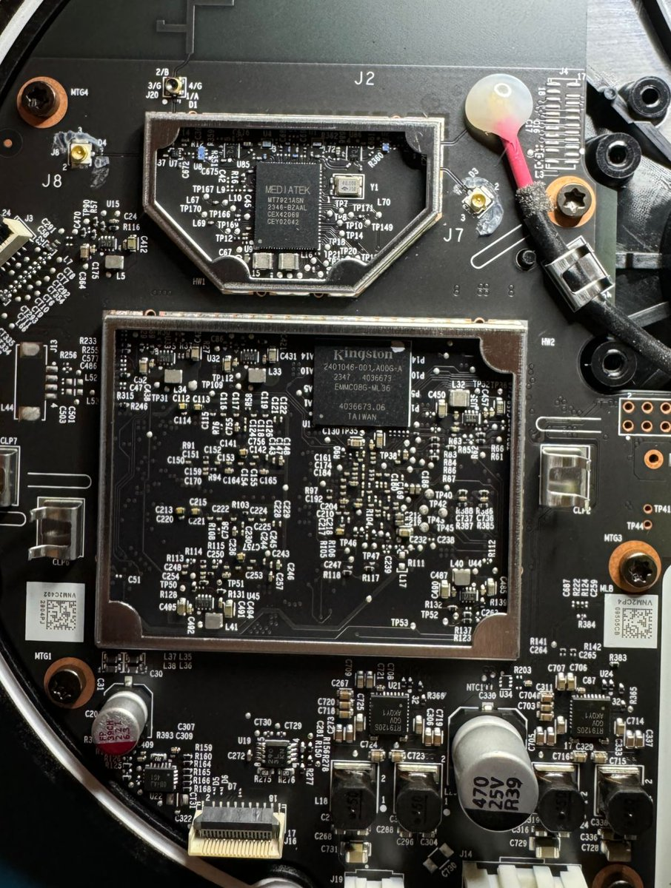</td>
<td>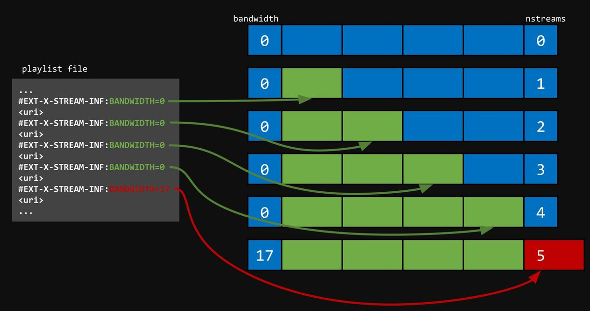</td>
</table></tr>
<table><tr>
<td>Quotes: <code>1</code></td>
<td>Replies: <code>0</code></td>
<td>Retweets: <code>37</code></td>
<td>Favorites: <code>213</code></td>
</tr></table>

---

# crowdfense
**https://twitter.com/crowdfense/status/1938235806142910735 _at 2025-06-26, 14:00:01_**
<blockquote>
The following vulnerabilities have been added to our feed:
- CVE-2025-32756: multiple Fortinet products Buffer Overflow RCE
- CVE-2025-47955: Windows RasMan LPE
- CVE-2025-1758: Kemp LoadMaster Stack Overflow DoS
https://t.co/Nw6eZdt4CA
https://t.co/85uWHVU04L
</blockquote>

* https://www.crowdfense.com/n-day-feed/
* https://youtu.be/CuY38zt5YKo?si=iAXjfSgtS8_1f5A7

<table><tr>
<td>Quotes: <code>2</code></td>
<td>Replies: <code>0</code></td>
<td>Retweets: <code>11</code></td>
<td>Favorites: <code>49</code></td>
</tr></table>

---

# filip_dragovic
**https://twitter.com/filip_dragovic/status/1937932750415086010 _at 2025-06-25, 17:55:47_**
<blockquote>
CVE-2025-49144: An elevation of privilege "vulnerability"
Requirement: You need to execute installer as admin 🤣🤣🤣
</blockquote>

<table><tr>
<td>Quotes: <code>8</code></td>
<td>Replies: <code>23</code></td>
<td>Retweets: <code>43</code></td>
<td>Favorites: <code>902</code></td>
</tr></table>

---

# pdnuclei
**https://twitter.com/pdnuclei/status/1937792553912250628 _at 2025-06-25, 08:38:41_**
<blockquote>
🚨 New Templates Bounty Issue 💰

CVE-2020-11984 - Apache HTTP Server - mod_proxy_uwsgi Info Disclosure &amp; RCE 💰 👾

Issue: https://t.co/XiBfrY58lC

#bugbounty #NucleiTemplates #cve #opensource
</blockquote>

* https://github.com/projectdiscovery/nuclei-templates/issues/12266

<table><tr>
<td>Quotes: <code>0</code></td>
<td>Replies: <code>0</code></td>
<td>Retweets: <code>17</code></td>
<td>Favorites: <code>72</code></td>
</tr></table>

---

# blackorbird
**https://twitter.com/blackorbird/status/1935254424789860703 _at 2025-06-18, 08:33:04_**
<blockquote>
#TaxOff #Team46
Chrome 0day CVE-2025-2783 Attack Detail
More IOCs
https://t.co/9uhXNMAg9B
Team46 ref:
https://t.co/MmgA0fyMmJ https://t.co/hLzMDy1dJu
</blockquote>

* https://global.ptsecurity.com/analytics/pt-esc-threat-intelligence/team46-and-taxoff-two-sides-of-the-same-coin
* https://habr.com/ru/companies/pt/articles/841176/

<table><tr>
<td>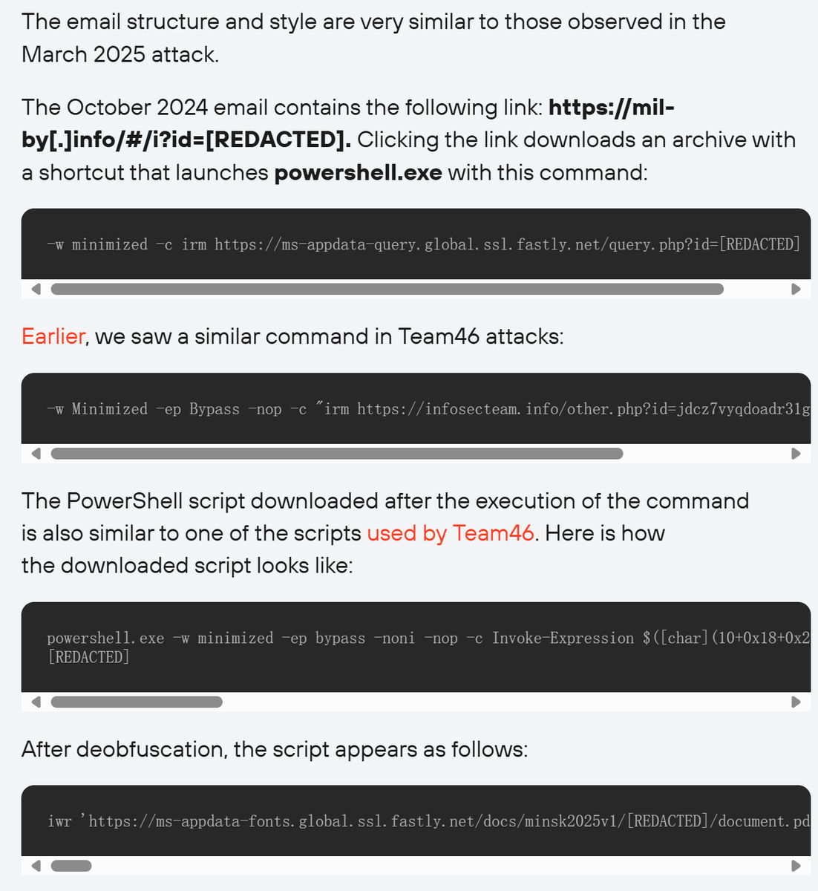</td>
<td>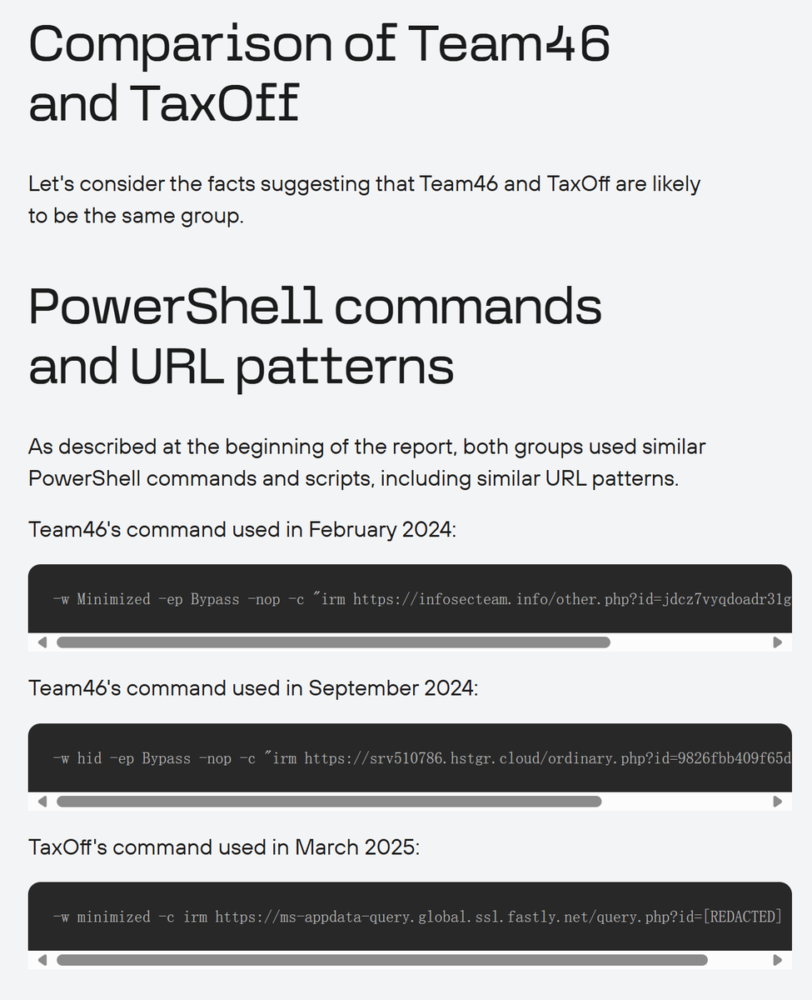</td>
</table></tr>
<table><tr>
<td>Quotes: <code>0</code></td>
<td>Replies: <code>0</code></td>
<td>Retweets: <code>34</code></td>
<td>Favorites: <code>77</code></td>
</tr></table>

---

# TheHackersNews
**https://twitter.com/TheHackersNews/status/1935054285055693171 _at 2025-06-17, 19:17:47_**
<blockquote>
🚨 A Chrome zero-day (CVE-2025-2783) was used in a live attack to drop a stealthy backdoor.

The hacker group TaxOff tricked targets with fake forum invites—one click, full compromise.

Here’s how the Trinper malware quietly hijacked systems ↓ https://t.co/t1sn34v15N
</blockquote>

* https://thehackernews.com/2025/06/google-chrome-zero-day-cve-2025-2783.html

<table><tr>
<td>Quotes: <code>6</code></td>
<td>Replies: <code>2</code></td>
<td>Retweets: <code>95</code></td>
<td>Favorites: <code>225</code></td>
</tr></table>

---

# Horizon3Attack
**https://twitter.com/Horizon3Attack/status/1934971046425178448 _at 2025-06-17, 13:47:02_**
<blockquote>
Checkout our new deep dive on CVE-2025-34508 -- a path traversal vulnerability in #ZendTo.
https://t.co/2NY1YdWiks https://t.co/TQcctHUups
</blockquote>

* https://horizon3.ai/attack-research/attack-blogs/cve-2025-34508-another-file-sharing-application-another-path-traversal/

<table><tr>
<td></td>
</table></tr>
<table><tr>
<td>Quotes: <code>0</code></td>
<td>Replies: <code>0</code></td>
<td>Retweets: <code>29</code></td>
<td>Favorites: <code>48</code></td>
</tr></table>

---

# TheMsterDoctor1
**https://twitter.com/TheMsterDoctor1/status/1934838961970536914 _at 2025-06-17, 05:02:10_**
<blockquote>
🚨 CVE-2025-3248 
Remote and unauthenticated attacker can send crafted HTTP requests to execute arbitrary code

Finding Targets

To find potential targets, use Fofa

•Fofa Dork: "Langflow"`

Cloning the Repository

First, clone the repository:

git clone https://t.co/I2SDG5bw8k https://t.co/KgRJcYl0tu
</blockquote>

* https://github.com/verylazytech/CVE-2025-3248

<table><tr>
<td>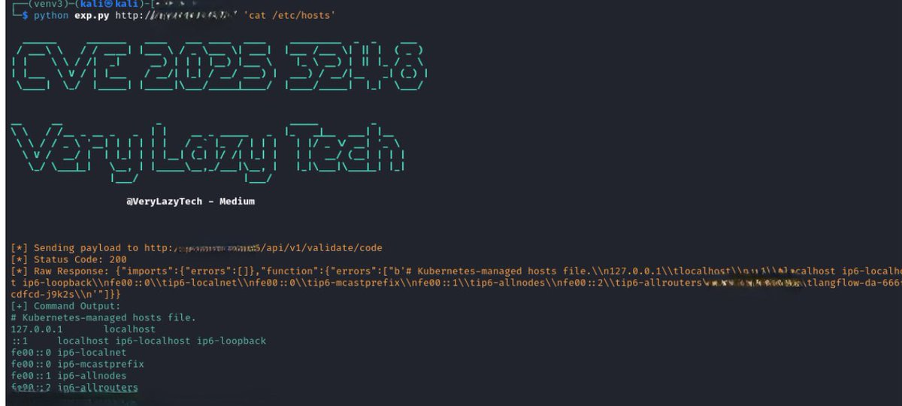</td>
<td>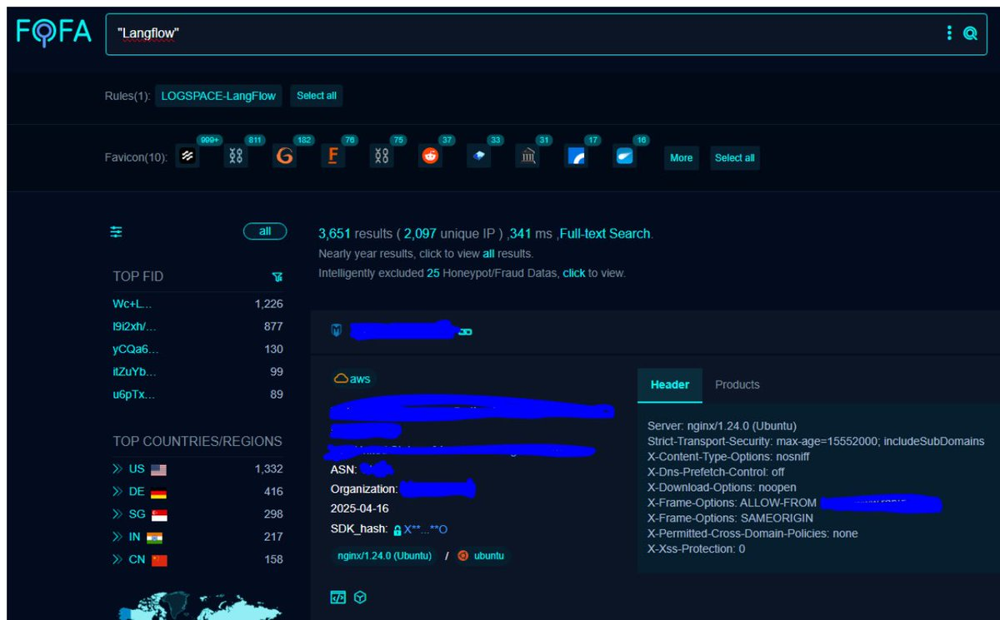</td>
</table></tr>
<table><tr>
<td>Quotes: <code>0</code></td>
<td>Replies: <code>0</code></td>
<td>Retweets: <code>26</code></td>
<td>Favorites: <code>90</code></td>
</tr></table>

---

# cyb3rops
**https://twitter.com/cyb3rops/status/1933556933472252154 _at 2025-06-13, 16:07:51_**
<blockquote>
PoC Exploit for the NTLM reflection SMB flaw CVE-2025-33073

https://t.co/tkgfd5UnEp https://t.co/itF4Yw4lEw
</blockquote>

* https://github.com/mverschu/CVE-2025-33073

<table><tr>
<td>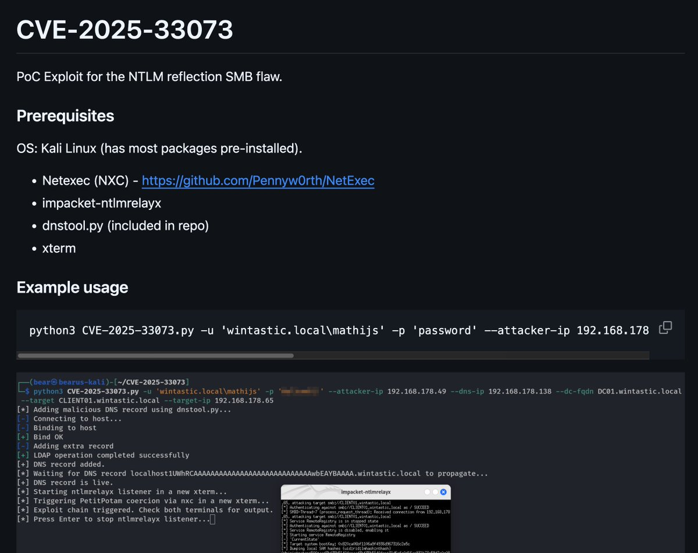</td>
</table></tr>
<table><tr>
<td>Quotes: <code>1</code></td>
<td>Replies: <code>8</code></td>
<td>Retweets: <code>196</code></td>
<td>Favorites: <code>676</code></td>
</tr></table>

---

# Minacris890M
**https://twitter.com/Minacris890M/status/1933260792020762788 _at 2025-06-12, 20:31:05_**
<blockquote>
Apple just patched a zero-day under active attack!
CVE-2025-24201 let hackers escape the WebKit 🦸🏻‍♂sandbox-Apple calls the exploit extremely sophisticated‼‼ https://t.co/ry7m84NALQ
</blockquote>

<table><tr>
<td>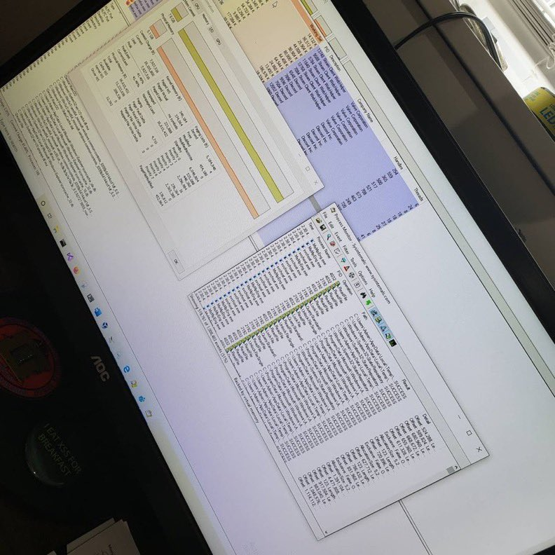</td>
</table></tr>
<table><tr>
<td>Quotes: <code>1</code></td>
<td>Replies: <code>2</code></td>
<td>Retweets: <code>35</code></td>
<td>Favorites: <code>222</code></td>
</tr></table>

---

# 0xor0ne
**https://twitter.com/0xor0ne/status/1933056932366934071 _at 2025-06-12, 07:01:01_**
<blockquote>
LLM (OpenAI’s o3) for vulnerability research. Zero day in Linux kernel’s SMB (CVE-2025-37899)

https://t.co/1UdtbL2MhZ

Credits @seanhn

#infsec #llm https://t.co/4Tsa3nFxLO
</blockquote>

* https://sean.heelan.io/2025/05/22/how-i-used-o3-to-find-cve-2025-37899-a-remote-zeroday-vulnerability-in-the-linux-kernels-smb-implementation/

<table><tr>
<td>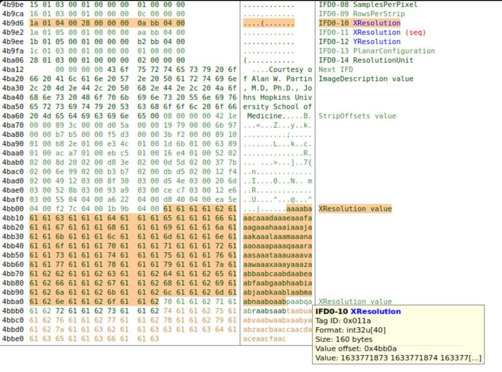</td>
<td>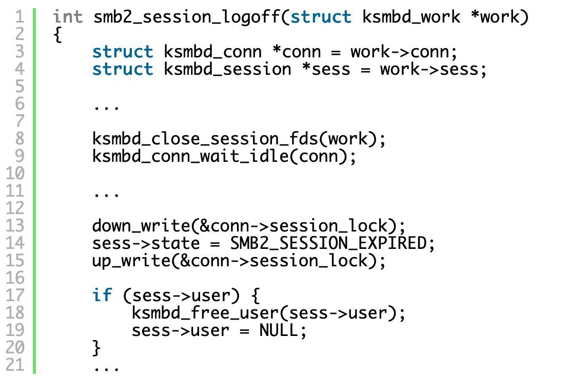</td>
</table></tr>
<table><tr>
<td>Quotes: <code>0</code></td>
<td>Replies: <code>3</code></td>
<td>Retweets: <code>69</code></td>
<td>Favorites: <code>295</code></td>
</tr></table>

---

# Synacktiv
**https://twitter.com/Synacktiv/status/1932748953961050198 _at 2025-06-11, 10:37:14_**
<blockquote>
Microsoft just released the patch for CVE-2025-33073, a critical vulnerability allowing a standard user to remotely compromise any machine with SMB signing not enforced! Checkout the details in the blogpost by @yaumn_ and @wil_fri3d.
https://t.co/EY5Z53w1ZT
</blockquote>

* https://www.synacktiv.com/publications/ntlm-reflection-is-dead-long-live-ntlm-reflection-an-in-depth-analysis-of-cve-2025

<table><tr>
<td>Quotes: <code>14</code></td>
<td>Replies: <code>5</code></td>
<td>Retweets: <code>262</code></td>
<td>Favorites: <code>599</code></td>
</tr></table>

---

# bohops
**https://twitter.com/bohops/status/1932542721886937153 _at 2025-06-10, 20:57:44_**
<blockquote>
CVE-2025-47956 - Windows Security App Spoofing Vulnerability

https://t.co/78nKn1twa0 https://t.co/0u1MjFnOg5
</blockquote>

* https://msrc.microsoft.com/update-guide/vulnerability/CVE-2025-47956

<table><tr>
<td></td>
</table></tr>
<table><tr>
<td>Quotes: <code>0</code></td>
<td>Replies: <code>2</code></td>
<td>Retweets: <code>14</code></td>
<td>Favorites: <code>90</code></td>
</tr></table>

---

# linkersec
**https://twitter.com/linkersec/status/1932069129814454664 _at 2025-06-09, 13:35:51_**
<blockquote>
Bypassing MTE with CVE-2025-0072

Article by @mmolgtm about exploiting a page use-after-free vulnerability in the ARM's Mali GPU driver in the code that manages userspace-mapped pages.

https://t.co/gLfxDrcIOB https://t.co/2Mgevk4Cka
</blockquote>

* https://github.blog/security/vulnerability-research/bypassing-mte-with-cve-2025-0072/

<table><tr>
<td>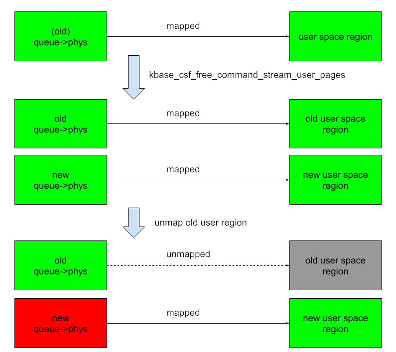</td>
</table></tr>
<table><tr>
<td>Quotes: <code>0</code></td>
<td>Replies: <code>1</code></td>
<td>Retweets: <code>19</code></td>
<td>Favorites: <code>83</code></td>
</tr></table>

---

# pdnuclei
**https://twitter.com/pdnuclei/status/1930774139696009268 _at 2025-06-05, 23:50:01_**
<blockquote>
🚨 CVE-2025-49113 – Authenticated RCE in Roundcube via unsafe deserialization in upload.php (via @FearsOff)

PoC-based detection template and full details in comments. https://t.co/W1MG1NbeqM
</blockquote>

<table><tr>
<td>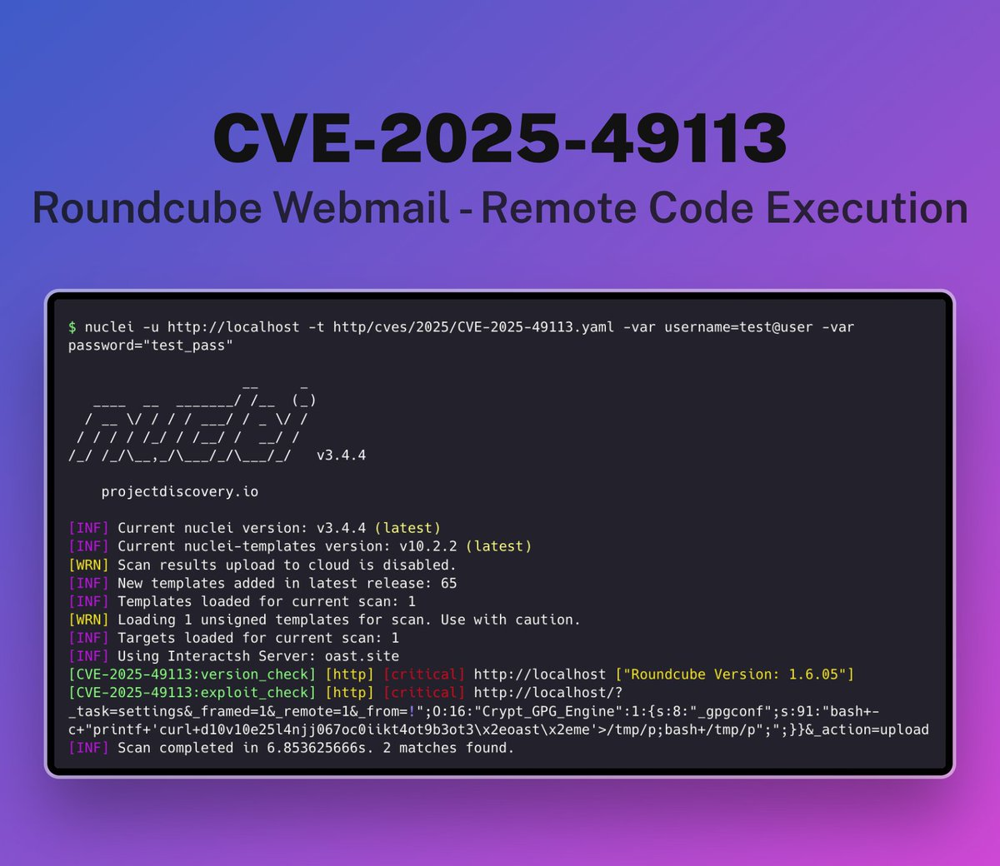</td>
</table></tr>
<table><tr>
<td>Quotes: <code>0</code></td>
<td>Replies: <code>2</code></td>
<td>Retweets: <code>76</code></td>
<td>Favorites: <code>376</code></td>
</tr></table>

---

# ptswarm
**https://twitter.com/ptswarm/status/1929940817679962141 _at 2025-06-03, 16:38:42_**
<blockquote>
⚠️ We’ve reproduced CVE-2025-49113 in Roundcube.

This vulnerability allows authenticated users to execute arbitrary commands via PHP object deserialization.

If you're running Roundcube — update immediately! https://t.co/iv3L56TRUB
</blockquote>

<table><tr>
<td>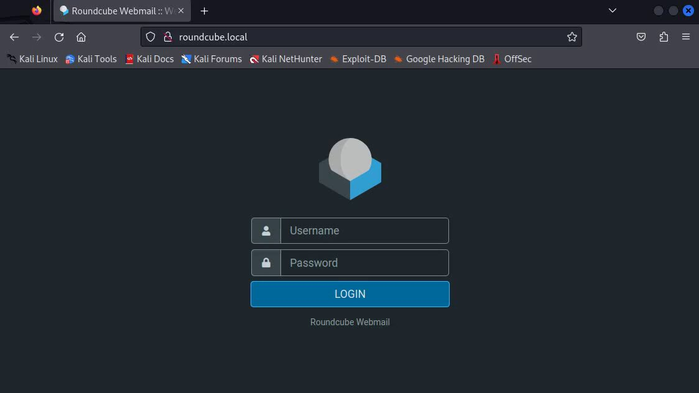</td>
</table></tr>
<table><tr>
<td>Quotes: <code>10</code></td>
<td>Replies: <code>7</code></td>
<td>Retweets: <code>116</code></td>
<td>Favorites: <code>523</code></td>
</tr></table>

---

# H4ckManac
**https://twitter.com/H4ckManac/status/1929812277890285823 _at 2025-06-03, 08:07:55_**
<blockquote>
🚨Zero-day Alert - PATCH NOW‼️

Google has released an emergency out-of-band patch to address a high-severity Chrome zero-day vulnerability tracked as CVE-2025-5419, which is actively exploited in the wild. 

The flaw is an out-of-bounds read and write vulnerability in Chrome’s https://t.co/g5oB1t7WHv
</blockquote>

<table><tr>
<td></td>
</table></tr>
<table><tr>
<td>Quotes: <code>3</code></td>
<td>Replies: <code>4</code></td>
<td>Retweets: <code>58</code></td>
<td>Favorites: <code>128</code></td>
</tr></table>

---

# TheHackersNews
**https://twitter.com/TheHackersNews/status/1929755732033130852 _at 2025-06-03, 04:23:14_**
<blockquote>
🚨 WARNING: Another Chrome zero-day exploited in the wild.

Google just patched CVE-2025-5419 — a high-severity V8 engine flaw found by its own Threat Analysis Group.

Attackers are already using it via malicious HTML pages.

Update Chrome NOW | Read: https://t.co/OgAGwctPpI
</blockquote>

* https://thehackernews.com/2025/06/new-chrome-zero-day-actively-exploited.html

<table><tr>
<td>Quotes: <code>47</code></td>
<td>Replies: <code>18</code></td>
<td>Retweets: <code>136</code></td>
<td>Favorites: <code>312</code></td>
</tr></table>

---

