# 0xor0ne
**https://twitter.com/0xor0ne/status/1950934804800721178 _at 2025-07-31, 15:01:18_**
<blockquote>
Exploiting CVE-2025-37752: array-Out-Of-Bounds vulnerability in the Linux network packet scheduler

https://t.co/UdEJrQyekL

#infosec #Linux https://t.co/d445rudk3F
</blockquote>

* https://syst3mfailure.io/two-bytes-of-madness/

<table><tr>
<td>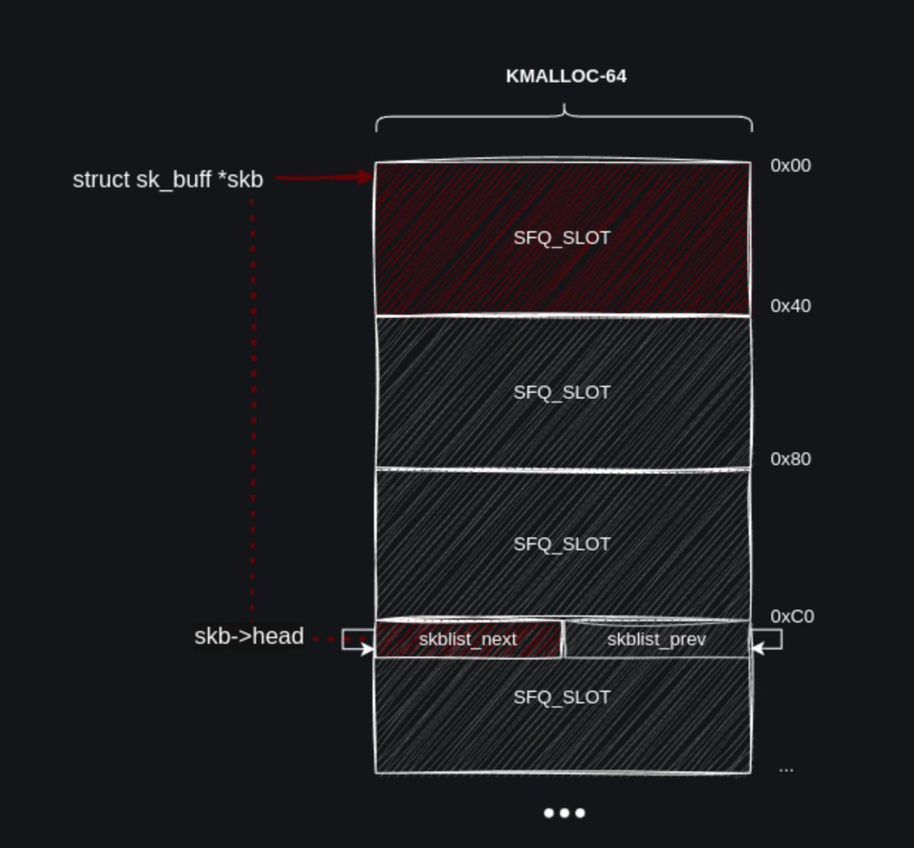</td>
<td>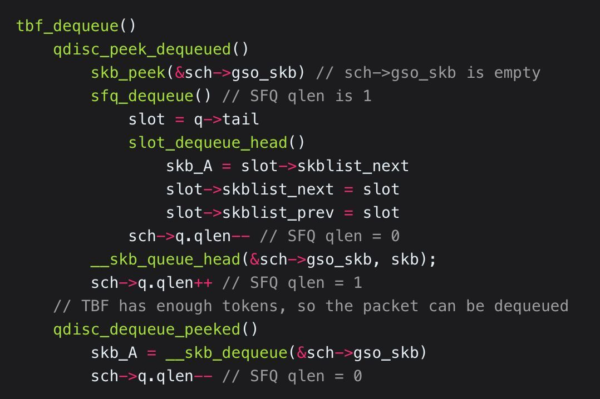</td>
</table></tr>
<table><tr>
<td>Quotes: <code>0</code></td>
<td>Replies: <code>3</code></td>
<td>Retweets: <code>46</code></td>
<td>Favorites: <code>245</code></td>
</tr></table>

---

# 0xor0ne
**https://twitter.com/0xor0ne/status/1950089057700028421 _at 2025-07-29, 07:00:36_**
<blockquote>
Vulnerability research using LLMs (OpenAI’s o3): Zero day in Linux kernel’s SMB (CVE-2025-37899)

https://t.co/1UdtbL2MhZ

Credits @seanhn

#infsec #llm https://t.co/XSFT3MEyIB
</blockquote>

* https://sean.heelan.io/2025/05/22/how-i-used-o3-to-find-cve-2025-37899-a-remote-zeroday-vulnerability-in-the-linux-kernels-smb-implementation/

<table><tr>
<td>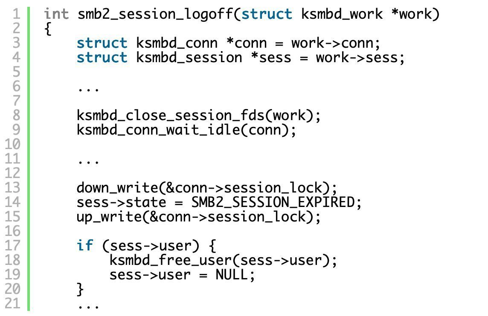</td>
<td>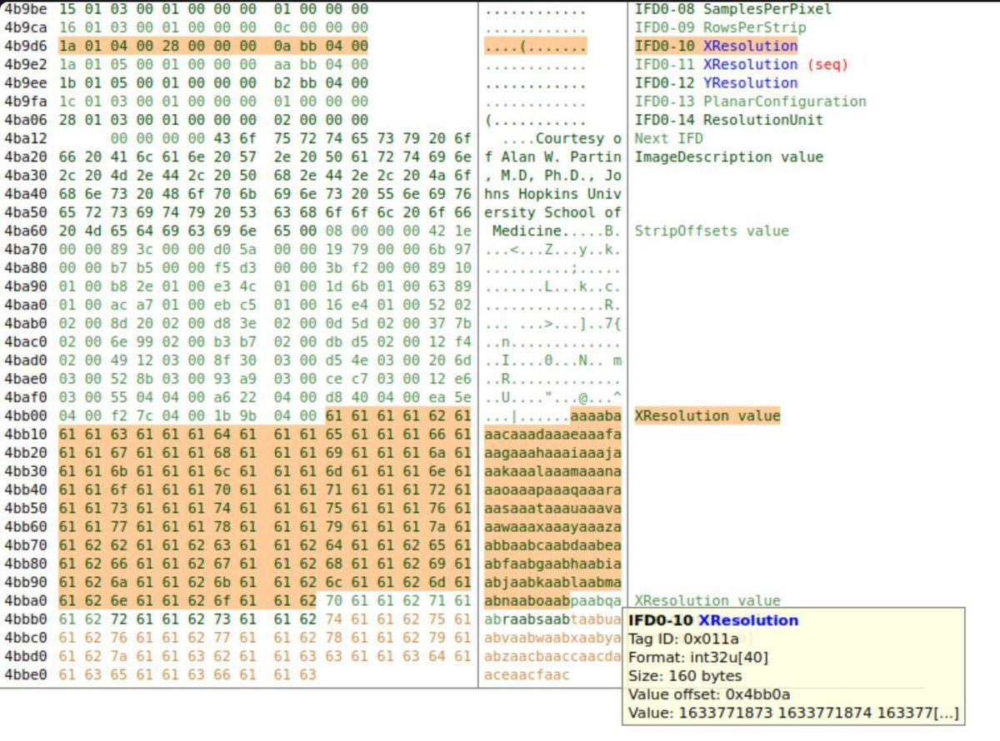</td>
</table></tr>
<table><tr>
<td>Quotes: <code>2</code></td>
<td>Replies: <code>1</code></td>
<td>Retweets: <code>76</code></td>
<td>Favorites: <code>329</code></td>
</tr></table>

---

# 0xor0ne
**https://twitter.com/0xor0ne/status/1948277133693903041 _at 2025-07-24, 07:00:40_**
<blockquote>
Exploiting a memory leak in Citrix NetScaler (CVE-2025-5777)

https://t.co/5hznj8s0WL

Credits @watchtowrcyber

#infosec https://t.co/uV5M8ZI74e
</blockquote>

* https://labs.watchtowr.com/how-much-more-must-we-bleed-citrix-netscaler-memory-disclosure-citrixbleed-2-cve-2025-5777/

<table><tr>
<td>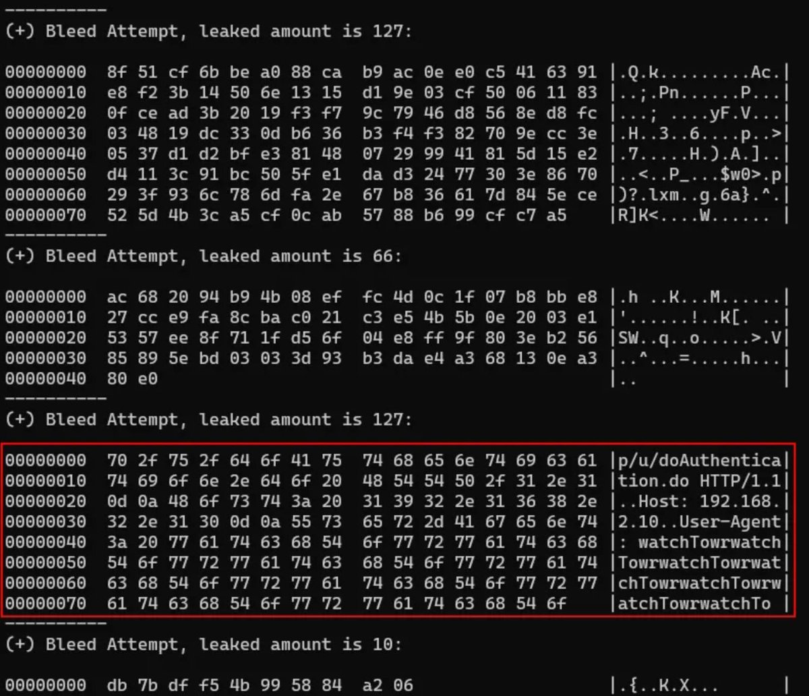</td>
<td></td>
</table></tr>
<table><tr>
<td>Quotes: <code>1</code></td>
<td>Replies: <code>5</code></td>
<td>Retweets: <code>34</code></td>
<td>Favorites: <code>168</code></td>
</tr></table>

---

# HunterMapping
**https://twitter.com/HunterMapping/status/1948206863574540417 _at 2025-07-24, 02:21:26_**
<blockquote>
🚨Alert🚨 :CVE-2025-2775&amp;CVE-2025-2776&amp;CVE-2025-2777 : Three Unauthenticated XML External Entity (XXE) Vulnerabilities in SysAid On-Prem
🔥PoC :https://t.co/KidlD1ZfMm
🧐Deep Dive :https://t.co/6rCTA2H7Dx
📊6.3K+ Services are found on the https://t.co/ysWb28BTvF yearly.
🔗Hunter https://t.co/v9stDXDqfV
</blockquote>

* https://github.com/watchtowrlabs/watchTowr-vs-SysAid-PreAuth-RCE-Chain
* https://labs.watchtowr.com/sysowned-your-friendly-rce-support-ticket/
* http://hunter.how

<table><tr>
<td>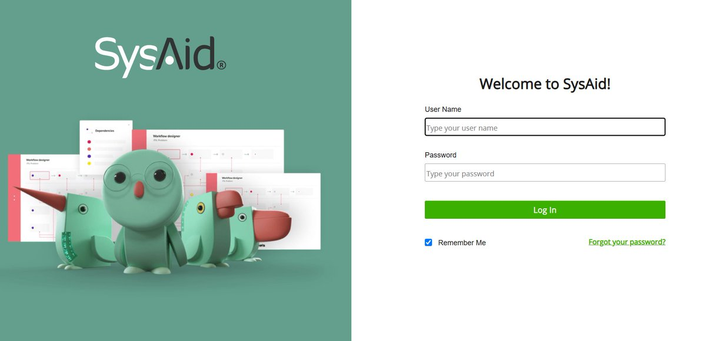</td>
</table></tr>
<table><tr>
<td>Quotes: <code>0</code></td>
<td>Replies: <code>1</code></td>
<td>Retweets: <code>26</code></td>
<td>Favorites: <code>86</code></td>
</tr></table>

---

# stephenfewer
**https://twitter.com/stephenfewer/status/1948009705881608612 _at 2025-07-23, 13:18:00_**
<blockquote>
We now have a (draft) @metasploit exploit module in the pull queue for the recent Microsoft SharePoint Server unauthenticated RCE zero-day (CVE-2025-53770), based on the in-the-wild exploit published a few days ago. Check it out here: https://t.co/J4EG2Wk5f5 https://t.co/euFcbFAeKi
</blockquote>

* https://github.com/rapid7/metasploit-framework/pull/20409

<table><tr>
<td>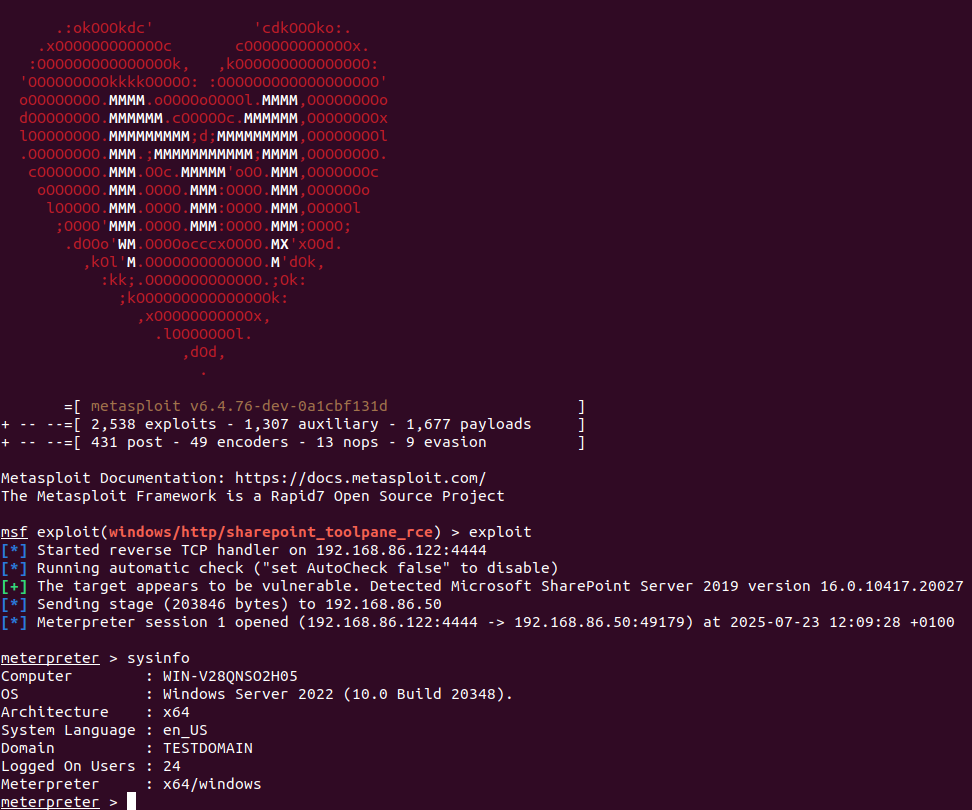</td>
</table></tr>
<table><tr>
<td>Quotes: <code>4</code></td>
<td>Replies: <code>8</code></td>
<td>Retweets: <code>147</code></td>
<td>Favorites: <code>499</code></td>
</tr></table>

---

# blackorbird
**https://twitter.com/blackorbird/status/1947529305229300057 _at 2025-07-22, 05:29:04_**
<blockquote>
A Brief Analysis of Chrome's 0day CVE-2025-6554 in the Wild 
https://t.co/is5wa9hyf2
</blockquote>

* https://ti.qianxin.com/blog/articles/a-brief-analysis-of-chrome-0day-cve-2025-6554-en/

<table><tr>
<td>Quotes: <code>0</code></td>
<td>Replies: <code>1</code></td>
<td>Retweets: <code>30</code></td>
<td>Favorites: <code>97</code></td>
</tr></table>

---

# cyber_advising
**https://twitter.com/cyber_advising/status/1947258401429368971 _at 2025-07-21, 11:32:35_**
<blockquote>
CVE-2025-49113 – Roundcube Webmail RCE Exploit 
https://t.co/tR5pyJwGD6 https://t.co/dS17s6pl0m
</blockquote>

* https://exploitfinder.com/dbexploit/exploit.html?id=CVE-2025-49113&type=GitAI&returnTab=github-ai

<table><tr>
<td>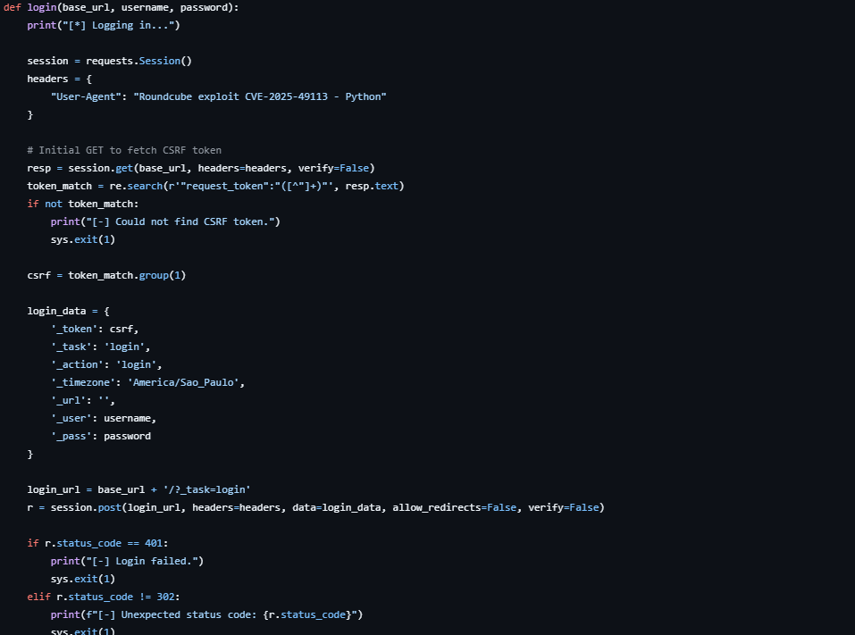</td>
</table></tr>
<table><tr>
<td>Quotes: <code>0</code></td>
<td>Replies: <code>2</code></td>
<td>Retweets: <code>65</code></td>
<td>Favorites: <code>244</code></td>
</tr></table>

---

# TheHackersNews
**https://twitter.com/TheHackersNews/status/1947137258525474964 _at 2025-07-21, 03:31:13_**
<blockquote>
🔥 ALERT ➟ Microsoft issues urgent security patches for critical SharePoint RCE flaw (CVE-2025-53770), now under active exploitation worldwide.

Hackers are bypassing MFA, stealing keys, and targeting banks, government agencies, hospitals &amp; more.

Details → https://t.co/MYAMR6D2u2
</blockquote>

<table><tr>
<td></td>
</table></tr>
<table><tr>
<td>Quotes: <code>17</code></td>
<td>Replies: <code>4</code></td>
<td>Retweets: <code>157</code></td>
<td>Favorites: <code>360</code></td>
</tr></table>

---

# TodayCyberNews
**https://twitter.com/TodayCyberNews/status/1946888961064108303 _at 2025-07-20, 11:04:34_**
<blockquote>
CVE-2025-25257 - FortiWeb Unauthenticated SQLi to RCE 💣

🔴 TIPO: SQLI + RCE
🔍 DORK (Zoomeye):

app="FortiWeb WAF"

💣 EXPLOIT:
https://t.co/AO9iSmjURp

#rce #github #exploit #sqli https://t.co/asFzdWxecK
</blockquote>

* https://github.com/watchtowrlabs/watchTowr-vs-FortiWeb-CVE-2025-25257

<table><tr>
<td>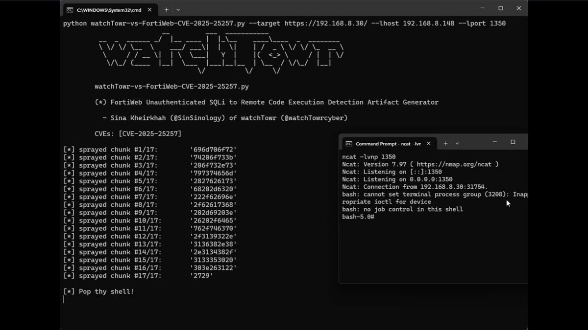</td>
</table></tr>
<table><tr>
<td>Quotes: <code>0</code></td>
<td>Replies: <code>1</code></td>
<td>Retweets: <code>67</code></td>
<td>Favorites: <code>299</code></td>
</tr></table>

---

# Unit42_Intel
**https://twitter.com/Unit42_Intel/status/1946654044316905883 _at 2025-07-19, 19:31:05_**
<blockquote>
We are observing active global exploitation of critical Microsoft SharePoint vulns CVE-2025-49704 and CVE-2025-49706. 

Orgs worldwide are being targeted. Patch immediately. The exploits are real, in-the-wild and pose a serious threat.

IoCs we've seen: https://t.co/Yp3KaWRtCz https://t.co/OOmwNoOIKq
</blockquote>

* https://bit.ly/4kQZS2e

<table><tr>
<td></td>
</table></tr>
<table><tr>
<td>Quotes: <code>9</code></td>
<td>Replies: <code>5</code></td>
<td>Retweets: <code>121</code></td>
<td>Favorites: <code>303</code></td>
</tr></table>

---

# SinSinology
**https://twitter.com/SinSinology/status/1946106882575200326 _at 2025-07-18, 07:16:52_**
<blockquote>
🩸My 2nd LPE (CVE-2025-7433) in Sophos EDR/XDR is finally out!
https://t.co/urVpsGIS0d https://t.co/5NUNIOwBp5
</blockquote>

* https://www.sophos.com/en-us/security-advisories/sophos-sa-20250717-cix-lpe

<table><tr>
<td>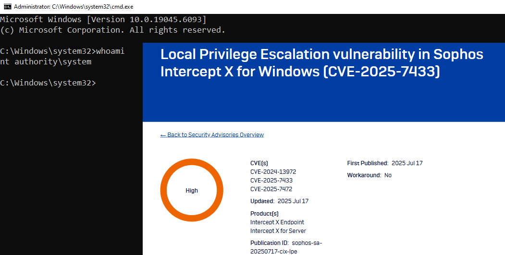</td>
</table></tr>
<table><tr>
<td>Quotes: <code>0</code></td>
<td>Replies: <code>1</code></td>
<td>Retweets: <code>30</code></td>
<td>Favorites: <code>221</code></td>
</tr></table>

---

# linkersec
**https://twitter.com/linkersec/status/1945943224704438669 _at 2025-07-17, 20:26:33_**
<blockquote>
CVE-2023-52927 - Turning a Forgotten Syzkaller Report into kCTF Exploit

Article by @seadragnol about finding an unfixed netfilter use-after-free bug reported by syzbot. The researcher exploited it to pwn the kernelCTF COS instance.

https://t.co/2KMWA3nJJM https://t.co/f2zkqa2hLF
</blockquote>

* https://seadragnol.github.io/posts/CVE-2023-52927/

<table><tr>
<td>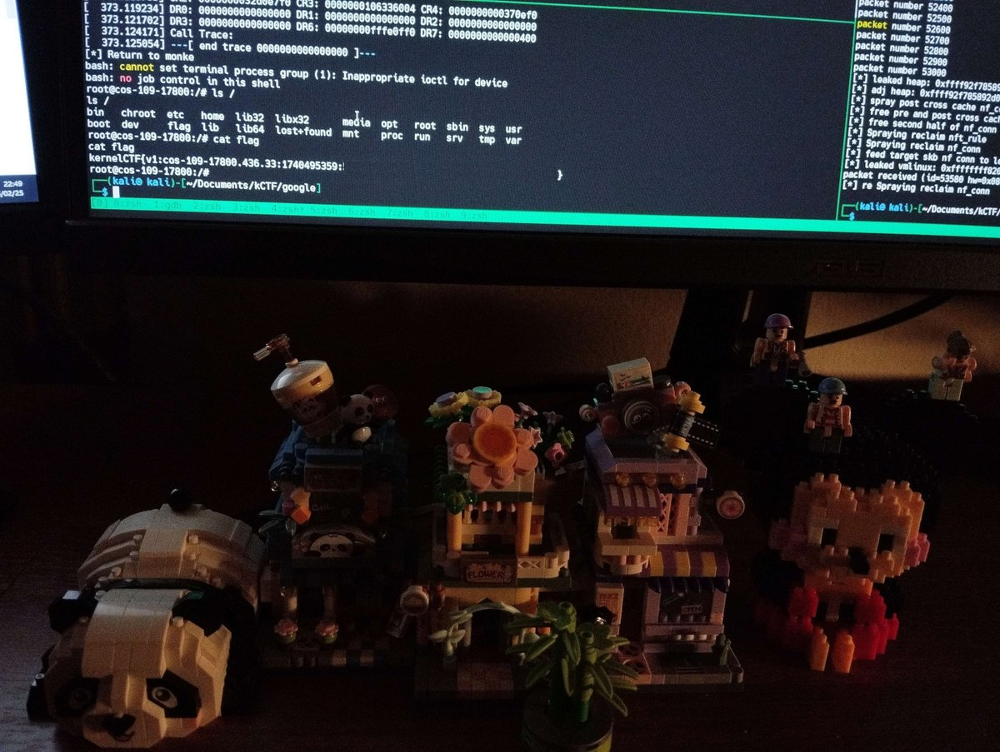</td>
</table></tr>
<table><tr>
<td>Quotes: <code>0</code></td>
<td>Replies: <code>0</code></td>
<td>Retweets: <code>38</code></td>
<td>Favorites: <code>128</code></td>
</tr></table>

---

# H4ckManac
**https://twitter.com/H4ckManac/status/1945429281468826055 _at 2025-07-16, 10:24:19_**
<blockquote>
🚨Chrome Zero-day Alert: PATCH NOW‼️

Google released an emergency security update for Chrome to patch CVE-2025-6558, a high-severity zero-day vulnerability (CVSS 8.8) that is actively exploited in the wild. 

The flaw resides in Chrome’s ANGLE and GPU components, where https://t.co/wCiFgtUXK7
</blockquote>

<table><tr>
<td></td>
</table></tr>
<table><tr>
<td>Quotes: <code>4</code></td>
<td>Replies: <code>1</code></td>
<td>Retweets: <code>49</code></td>
<td>Favorites: <code>80</code></td>
</tr></table>

---

# SecuriTeam_SSD
**https://twitter.com/SecuriTeam_SSD/status/1945404569216766213 _at 2025-07-16, 08:46:07_**
<blockquote>
Want to learn about Chrome exploitation and the role of WebAssembly in it?

In our new article, we'll break down the world of WASM, how it interacts with V8, and use CVE-2024-2887 as a case study to show how flaws in WASM can lead to remote code execution.

Read it here:
</blockquote>

<table><tr>
<td>Quotes: <code>2</code></td>
<td>Replies: <code>2</code></td>
<td>Retweets: <code>36</code></td>
<td>Favorites: <code>286</code></td>
</tr></table>

---

# TheHackersNews
**https://twitter.com/TheHackersNews/status/1945393129445572941 _at 2025-07-16, 08:00:40_**
<blockquote>
⚠️ WARNING - Google Chrome Zero-Day Alert!

A new exploit is hitting users right now — CVE-2025-6558 lets attackers break out of the browser sandbox.

Update Chrome ASAP → https://t.co/3oy1UjWjG8

(Edge, Brave, Opera users: you're not safe either.)
</blockquote>

* https://thehackernews.com/2025/07/urgent-google-releases-critical-chrome.html

<table><tr>
<td>Quotes: <code>21</code></td>
<td>Replies: <code>11</code></td>
<td>Retweets: <code>173</code></td>
<td>Favorites: <code>405</code></td>
</tr></table>

---

# ksg93rd
**https://twitter.com/ksg93rd/status/1943708455128215904 _at 2025-07-11, 16:26:22_**
<blockquote>
#exploit
1⃣  CVE-2025-5959:
Type Confusion in V8 in Google Chrome - https://t.co/YlFKlI5woW
2⃣  CVE-2025-47812:
Wing FTP Server RCE Exploit - https://t.co/QIMvUFvKEI
3⃣  SailPoint IQService - 
RCE via Default Encryption Key - https://t.co/sl0odlvVQ5
4⃣  CVE-2025-5777 (CitrixBleed
</blockquote>

* https://linz04.github.io/2025/06/20/CVE-2025-5959
* https://github.com/4m3rr0r/CVE-2025-47812-poc
* https://github.com/NetSPI/set_sail

<table><tr>
<td>Quotes: <code>0</code></td>
<td>Replies: <code>0</code></td>
<td>Retweets: <code>33</code></td>
<td>Favorites: <code>126</code></td>
</tr></table>

---

# HunterMapping
**https://twitter.com/HunterMapping/status/1943509881056825489 _at 2025-07-11, 03:17:18_**
<blockquote>
🚨Alert🚨 CVE-2025-49704 : Microsoft SharePoint Remote Code Execution Vulnerability
📊24.9K Services are found on the https://t.co/ysWb28Crld yearly.
🔗Hunter Link:https://t.co/EDWFkA2tPf
👇Query
HUNTER : https://t.co/q9rtuGgxk7="SharePoint Server"
📰Refer:https://t.co/VQPzeYomUT https://t.co/Tz8TRWSSAh
</blockquote>

* http://hunter.how
* https://hunter.how/list?searchValue=product.name%3D%22SharePoint%20Server%22
* http://product.name
* https://msrc.microsoft.com/update-guide/vulnerability/CVE-2025-49704

<table><tr>
<td></td>
</table></tr>
<table><tr>
<td>Quotes: <code>0</code></td>
<td>Replies: <code>0</code></td>
<td>Retweets: <code>45</code></td>
<td>Favorites: <code>131</code></td>
</tr></table>

---

# elhackernet
**https://twitter.com/elhackernet/status/1943392326992433458 _at 2025-07-10, 19:30:11_**
<blockquote>
🚨 Vulnerabilidad de día cero en Microsoft SQL Server expone datos confidenciales en la red

⚠️CVE-2025-49719

CVSS:3.1/AV:N/AC:L/PR:N/UI:N/S:U/C:H/I:N/A:N
https://t.co/Gg5HCn08bn https://t.co/PoK3rrMDOs
</blockquote>

* https://cybersecuritynews.com/microsoft-sql-server-0-day-vulnerability/

<table><tr>
<td></td>
</table></tr>
<table><tr>
<td>Quotes: <code>5</code></td>
<td>Replies: <code>4</code></td>
<td>Retweets: <code>161</code></td>
<td>Favorites: <code>476</code></td>
</tr></table>

---

# bughuntar
**https://twitter.com/bughuntar/status/1943220020000981299 _at 2025-07-10, 08:05:30_**
<blockquote>
💥CitrixBleed 2 (CVE-2025-5777) PoC just dropped!
Memory leaks ➡️ creds ➡️ full pwn
Tool: https://t.co/RFBYnTZAJ6
Writeup: https://t.co/34yEIfw8pP

#0day #infosec #bugbounty
Patch NOW! 👇 https://t.co/VsUKHDKzVu
</blockquote>

* https://github.com/bughuntar/CVE-2025-5777
* https://bughuntar.medium.com/citrixbleed-2-cve-2025-5777-from-research-to-real-world-exploitation-and-tool-development-c0bead425cee

<table><tr>
<td>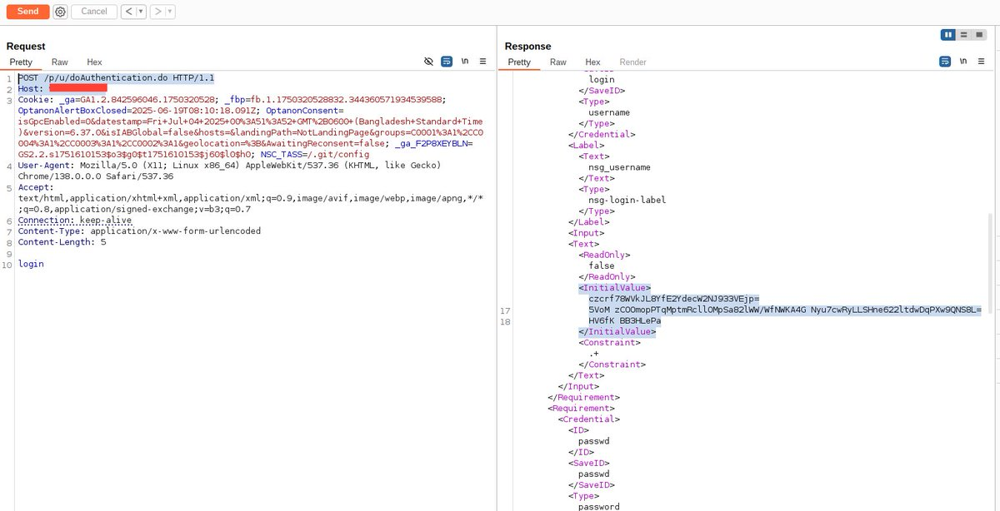</td>
</table></tr>
<table><tr>
<td>Quotes: <code>0</code></td>
<td>Replies: <code>1</code></td>
<td>Retweets: <code>20</code></td>
<td>Favorites: <code>81</code></td>
</tr></table>

---

# HunterMapping
**https://twitter.com/HunterMapping/status/1942767728391250153 _at 2025-07-09, 02:08:15_**
<blockquote>
🚨Alert🚨 CVE-2025-49719(Zero-day):Microsoft SQL Server Information Disclosure Vulnerability
📊2.9M Services are found on the https://t.co/ysWb28Crld yearly.
🔗Hunter Link:https://t.co/mD8Fxp9Ffz
👇Query
HUNTER : protocol=="mssql"
📰Refer:https://t.co/AoIcJyjOhU https://t.co/cm71yWFBHF
</blockquote>

* http://hunter.how
* https://hunter.how/list?searchValue=protocol%3D%3D%22mssql%22
* https://msrc.microsoft.com/update-guide/vulnerability/CVE-2025-49719

<table><tr>
<td></td>
</table></tr>
<table><tr>
<td>Quotes: <code>0</code></td>
<td>Replies: <code>1</code></td>
<td>Retweets: <code>8</code></td>
<td>Favorites: <code>39</code></td>
</tr></table>

---

# win3zz
**https://twitter.com/win3zz/status/1942595912402100287 _at 2025-07-08, 14:45:31_**
<blockquote>
CVE-2025-5777 Citrix NetScaler Memory Leak 
Severity: CRITICAL ⚠️
PoC: https://t.co/ryPhgorpmP https://t.co/1ggdzL5lNR
</blockquote>

* https://github.com/win3zz/CVE-2025-5777

<table><tr>
<td>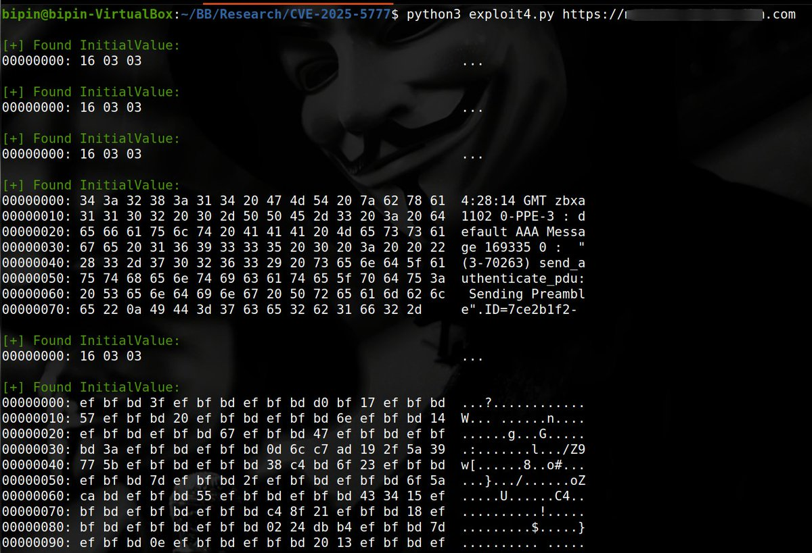</td>
</table></tr>
<table><tr>
<td>Quotes: <code>0</code></td>
<td>Replies: <code>0</code></td>
<td>Retweets: <code>66</code></td>
<td>Favorites: <code>221</code></td>
</tr></table>

---

# infosec_au
**https://twitter.com/infosec_au/status/1942493598823637245 _at 2025-07-08, 07:58:58_**
<blockquote>
Whenever I audit C# code, I look for benign file operations such as File.Exists(), especially if there's a preceding Path.Combine(). Read about how we leaked NTLM hashes pre-authentication in DotNetNuke (CVE-2025-52488) due to a perfect storm of issues. https://t.co/yuFuFWfCO8 https://t.co/RomNkZTegr
</blockquote>

* https://slcyber.io/assetnote-security-research-center/abusing-windows-net-quirks-and-unicode-normalization-to-exploit-dnn-dotnetnuke/

<table><tr>
<td>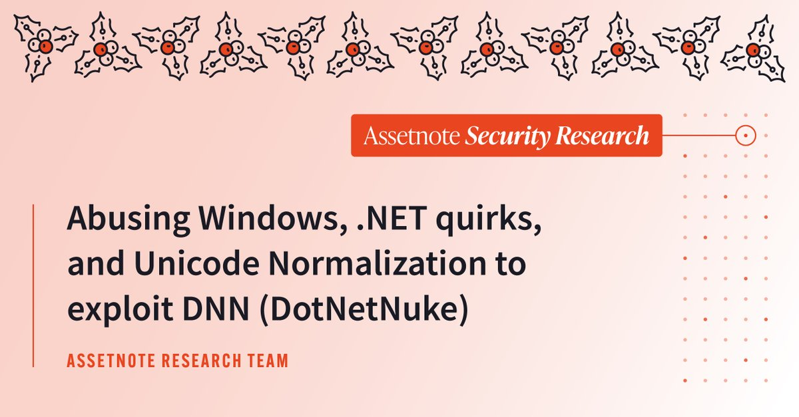</td>
</table></tr>
<table><tr>
<td>Quotes: <code>1</code></td>
<td>Replies: <code>3</code></td>
<td>Retweets: <code>70</code></td>
<td>Favorites: <code>265</code></td>
</tr></table>

---

# HunterMapping
**https://twitter.com/HunterMapping/status/1940602025110298625 _at 2025-07-03, 02:42:32_**
<blockquote>
🚨Alert🚨 CVE-2025-49493:Akamai CloudTest Allows File Inclusion via XML External Entity (XXE) injection.
🧐Deep Dive from @Xbow : https://t.co/d3gnxahGwh
🔥PoC : https://t.co/aiKo0ifupw
📊316 Services are found on the https://t.co/ysWb28Crld yearly.
🔗Hunter https://t.co/CGEEZjThn8
</blockquote>

* https://xbow.com/blog/xbow-akamai-cloudtest-xxe/
* https://github.com/MuhammadWaseem29/CVE-2025-49493-Poc
* http://hunter.how

<table><tr>
<td>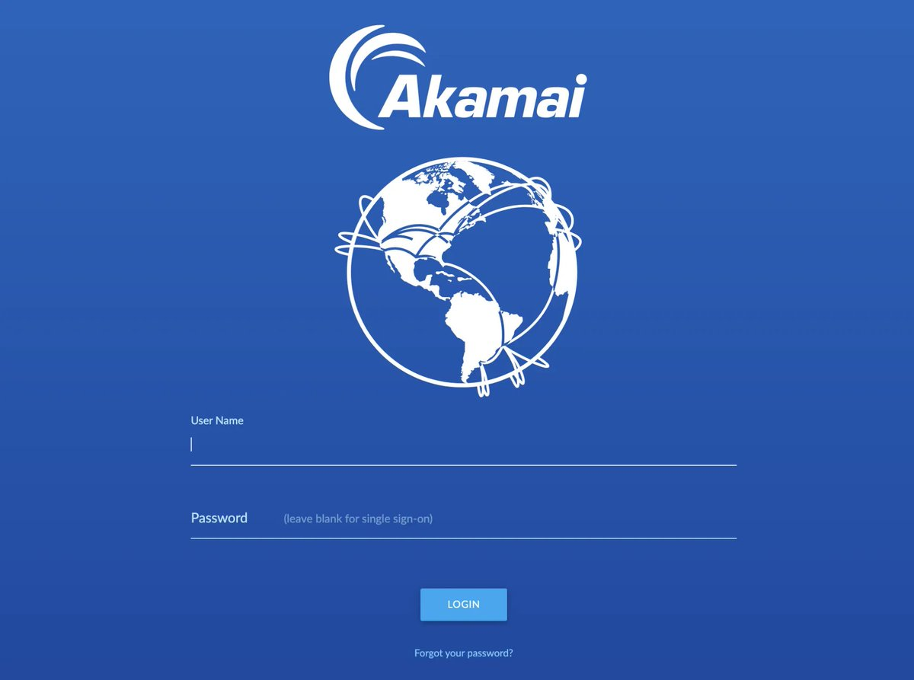</td>
</table></tr>
<table><tr>
<td>Quotes: <code>0</code></td>
<td>Replies: <code>2</code></td>
<td>Retweets: <code>14</code></td>
<td>Favorites: <code>55</code></td>
</tr></table>

---

# H4ckManac
**https://twitter.com/H4ckManac/status/1939981075045917047 _at 2025-07-01, 09:35:06_**
<blockquote>
🚨Chrome Zero-day Alert: PATCH NOW‼️

Google has patched a critical zero-day vulnerability in Chrome, identified as CVE-2025-6554, which was actively exploited in the wild. 

The flaw is a type confusion issue in the V8 JavaScript and WebAssembly engine, allowing remote attackers https://t.co/ErZL2J7Un2
</blockquote>

<table><tr>
<td></td>
</table></tr>
<table><tr>
<td>Quotes: <code>2</code></td>
<td>Replies: <code>2</code></td>
<td>Retweets: <code>46</code></td>
<td>Favorites: <code>73</code></td>
</tr></table>

---

