# buffaloverflow
**https://twitter.com/buffaloverflow/status/1961488505252598098 _at 2025-08-29, 17:57:57_**
<blockquote>
Finishing off the week with a writeup of CVE-2025-0309 - Netskope Windows Client LPE 

This was one of the bugs we demo’d in our DEF CON #ZeroTrustTotalBust talk.

Also releasing a NachoVPN plugin and our 🆙skope PoC. Details on the @AmberWolfSec blog:

https://t.co/HJQCVbBpbk https://t.co/Orl0X3SuFK
</blockquote>

* https://blog.amberwolf.com/blog/2025/august/advisory---netskope-client-for-windows---local-privilege-escalation-via-rogue-server/

<table><tr>
<td>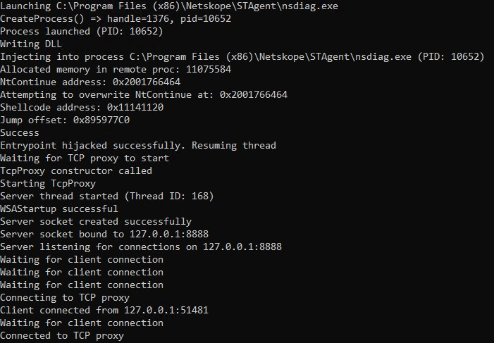</td>
</table></tr>
<table><tr>
<td>Quotes: <code>2</code></td>
<td>Replies: <code>1</code></td>
<td>Retweets: <code>56</code></td>
<td>Favorites: <code>157</code></td>
</tr></table>

---

# HunterMapping
**https://twitter.com/HunterMapping/status/1960529344516018482 _at 2025-08-27, 02:26:35_**
<blockquote>
🚨Alert🚨CVE-2025-7775 (CVSS 9.2) : Memory Overflow Vulnerability Leading to Remote Code Execution and/or Denial-of-Service
📊183.9K+Services are found on the https://t.co/ysWb28Crld yearly.
🔗Hunter Link:https://t.co/PwOLy9qwQ4
👇Query
HUNTER : https://t.co/q9rtuGgxk7="NetScaler https://t.co/9OZNelFGnY
</blockquote>

* http://hunter.how
* https://hunter.how/list?searchValue=product.name%3D%22NetScaler%20Gateway%22%7C%7Cproduct.name%3D%22NetScaler%20ADC%22
* http://product.name

<table><tr>
<td></td>
</table></tr>
<table><tr>
<td>Quotes: <code>0</code></td>
<td>Replies: <code>0</code></td>
<td>Retweets: <code>7</code></td>
<td>Favorites: <code>40</code></td>
</tr></table>

---

# 0xor0ne
**https://twitter.com/0xor0ne/status/1960364169296781666 _at 2025-08-26, 15:30:14_**
<blockquote>
Zero day in Linux kernel’s SMB (CVE-2025-37899) using LLMs (OpenAI’s o3)

https://t.co/1UdtbL2MhZ

Credits @seanhn

#infosec #llm https://t.co/7h6OCBHHjG
</blockquote>

* https://sean.heelan.io/2025/05/22/how-i-used-o3-to-find-cve-2025-37899-a-remote-zeroday-vulnerability-in-the-linux-kernels-smb-implementation/

<table><tr>
<td>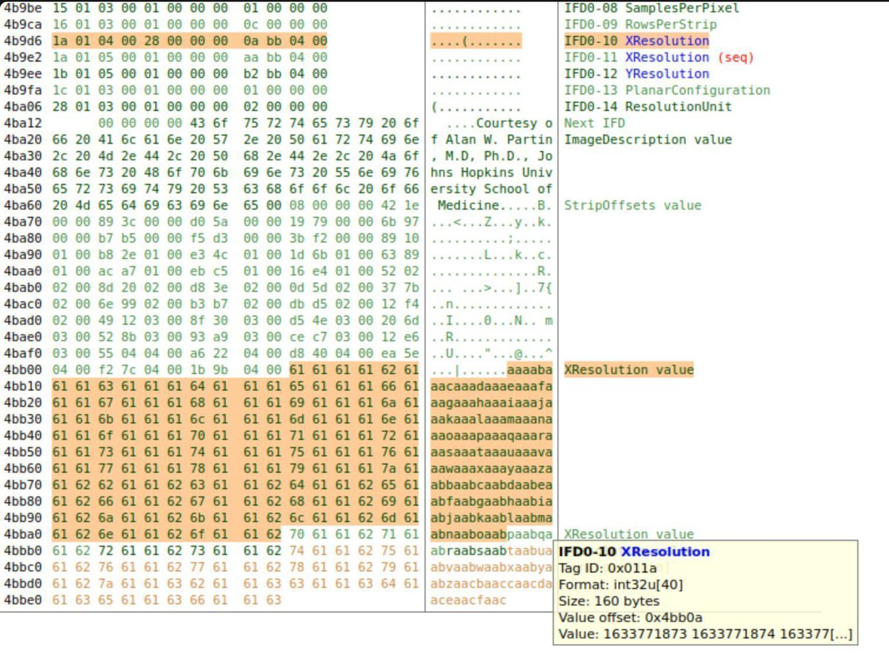</td>
<td></td>
</table></tr>
<table><tr>
<td>Quotes: <code>0</code></td>
<td>Replies: <code>1</code></td>
<td>Retweets: <code>61</code></td>
<td>Favorites: <code>298</code></td>
</tr></table>

---

# _JohnHammond
**https://twitter.com/_JohnHammond/status/1960326379615990093 _at 2025-08-26, 13:00:04_**
<blockquote>
Video showcase of the recent WinRAR 0-day, CVE-2025-8088, uncovered by ESET after threat actor RomCom exploited it in the wild leveraging alternate data streams &amp; path traversal on Windows -- we examine the uncovered RAR file and a proof-of-concept demo! https://t.co/38pMK6rlrO https://t.co/4VYg1g8hNO
</blockquote>

* https://youtu.be/rkMNOC8fhUQ

<table><tr>
<td></td>
</table></tr>
<table><tr>
<td>Quotes: <code>7</code></td>
<td>Replies: <code>6</code></td>
<td>Retweets: <code>81</code></td>
<td>Favorites: <code>386</code></td>
</tr></table>

---

# win3zz
**https://twitter.com/win3zz/status/1959518434792014307 _at 2025-08-24, 07:29:35_**
<blockquote>
Remote Code Execution in Adobe AEM Forms via CVE-2025-54253 (Struts2 DevMode misconfig: auth bypass + OGNL eval) and CVE-2025-49533 (Insecure Deserialization). 

Both rated critical, identified in a VDP (now patched). 

Original research: https://t.co/uJoFgzyDk0 https://t.co/H3SC8ytLhI
</blockquote>

* https://tinyurl.com/mprcjp9b

<table><tr>
<td></td>
<td>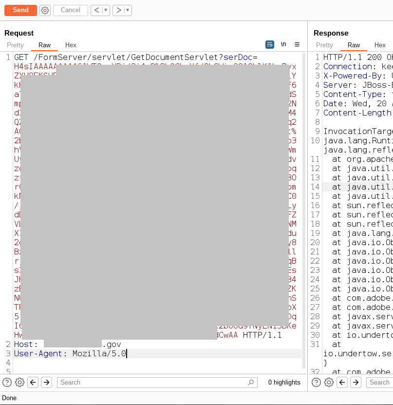</td>
<td>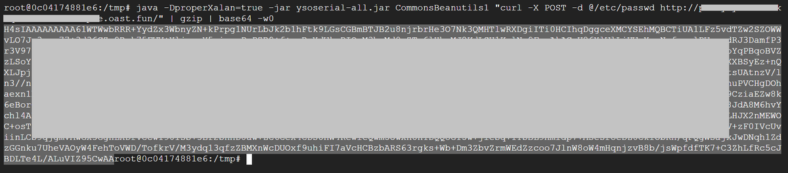</td>
<td>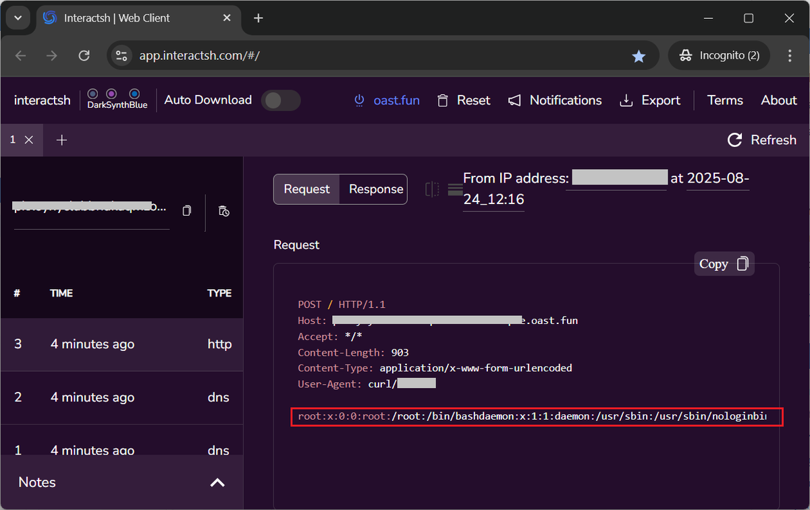</td>
</table></tr>
<table><tr>
<td>Quotes: <code>0</code></td>
<td>Replies: <code>3</code></td>
<td>Retweets: <code>45</code></td>
<td>Favorites: <code>234</code></td>
</tr></table>

---

# linkersec
**https://twitter.com/linkersec/status/1959393539194044501 _at 2025-08-23, 23:13:18_**
<blockquote>
From Chrome renderer code exec to kernel with MSG_OOB

Jann Horn @tehjh posted an article about exploiting CVE-2025-38236, a UAF in the UNIX domain sockets:
https://t.co/xRBYnLAU8X
</blockquote>

* https://googleprojectzero.blogspot.com/2025/08/from-chrome-renderer-code-exec-to-kernel.html

<table><tr>
<td>Quotes: <code>1</code></td>
<td>Replies: <code>1</code></td>
<td>Retweets: <code>35</code></td>
<td>Favorites: <code>135</code></td>
</tr></table>

---

# 0xor0ne
**https://twitter.com/0xor0ne/status/1958786336212611250 _at 2025-08-22, 07:00:29_**
<blockquote>
Exploiting a CAN BCM subsystem vulnerability to allow unprivileged users to read data from kernel space (CVE-2023-52922)

https://t.co/cmsuw8m8Fp

#infosec #Linux https://t.co/AHpYw5XfjK
</blockquote>

* https://allelesecurity.com/use-after-free-vulnerability-in-can-bcm-subsystem-leading-to-information-disclosure-cve-2023-52922/

<table><tr>
<td>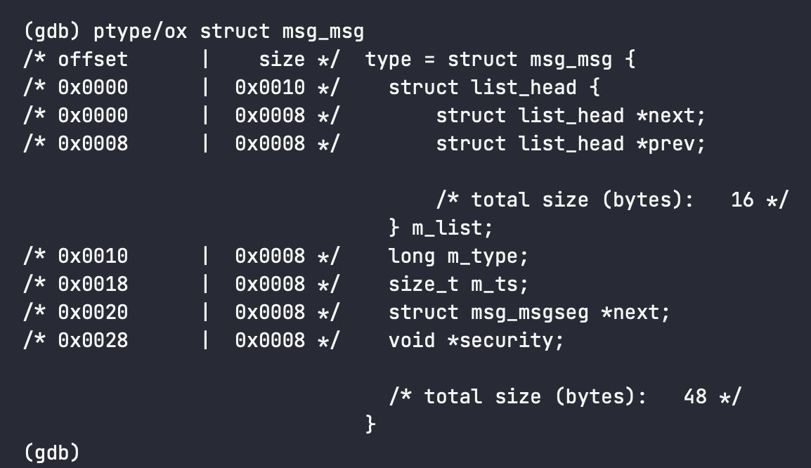</td>
<td>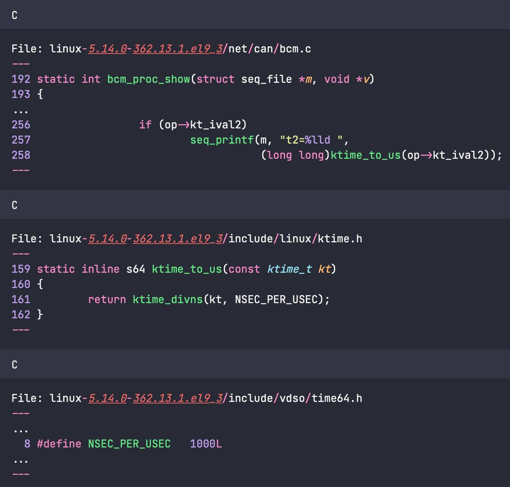</td>
</table></tr>
<table><tr>
<td>Quotes: <code>0</code></td>
<td>Replies: <code>1</code></td>
<td>Retweets: <code>29</code></td>
<td>Favorites: <code>132</code></td>
</tr></table>

---

# noperator
**https://twitter.com/noperator/status/1958171402353221657 _at 2025-08-20, 14:16:58_**
<blockquote>
A new tool: Slice 🔪 With the help of build-free CodeQL and Tree-Sitter, Slice can help GPT-5 can reliably reproduce discovery of CVE-2025-37778: use-after-free vulnerability in the Linux kernel! https://t.co/J2na8iX4hv https://t.co/JvTTXx4nEB
</blockquote>

* https://noperator.dev/posts/slice/

<table><tr>
<td>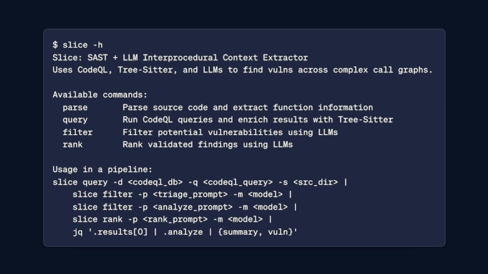</td>
</table></tr>
<table><tr>
<td>Quotes: <code>2</code></td>
<td>Replies: <code>4</code></td>
<td>Retweets: <code>51</code></td>
<td>Favorites: <code>168</code></td>
</tr></table>

---

# LetsDefendIO
**https://twitter.com/LetsDefendIO/status/1956702568718995655 _at 2025-08-16, 13:00:20_**
<blockquote>
🔥 The team is cooking

New Alert: WinRAR Zero-Day Path Traversal Vulnerability

CVE-2025-8088 is a WinRAR zero-day path traversal flaw in Windows versions, allowing attackers to execute arbitrary code by crafting malicious archives that place files in unauthorized locations, https://t.co/Mm7LMyQO7b
</blockquote>

<table><tr>
<td>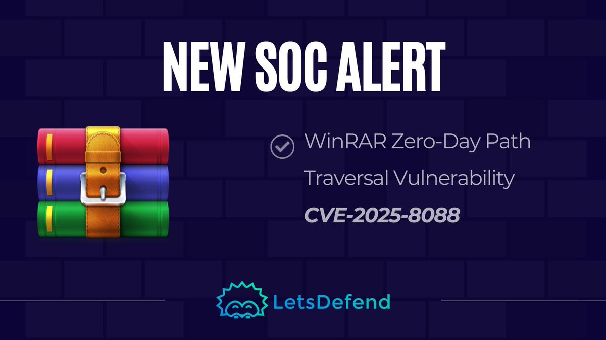</td>
</table></tr>
<table><tr>
<td>Quotes: <code>0</code></td>
<td>Replies: <code>1</code></td>
<td>Retweets: <code>19</code></td>
<td>Favorites: <code>118</code></td>
</tr></table>

---

# 0xor0ne
**https://twitter.com/0xor0ne/status/1956008762554118274 _at 2025-08-14, 15:03:24_**
<blockquote>
Use after free exploitation (CVE-2025-1050) in the Sonos Era 300 (Pwn2Own 2024)

https://t.co/pBGDQtN87Q

Credits Jack Dates &amp; Markus Gaasedelen

#infosec #embedded https://t.co/pniwfKgwfp
</blockquote>

* https://blog.ret2.io/2025/06/11/pwn2own-soho-2024-sonos-exploit/

<table><tr>
<td>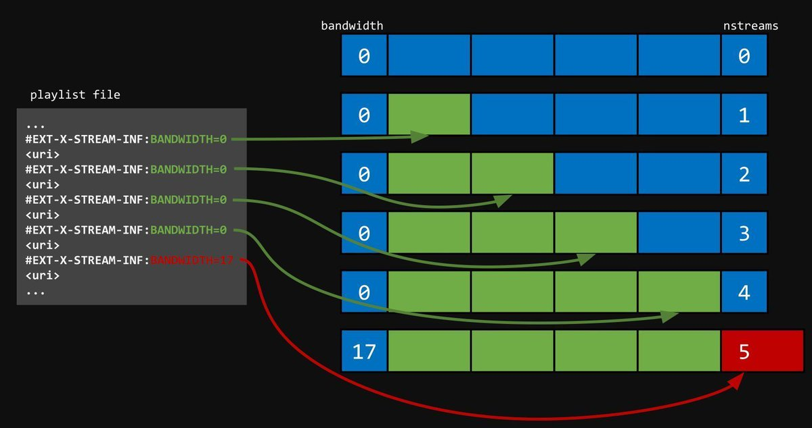</td>
<td>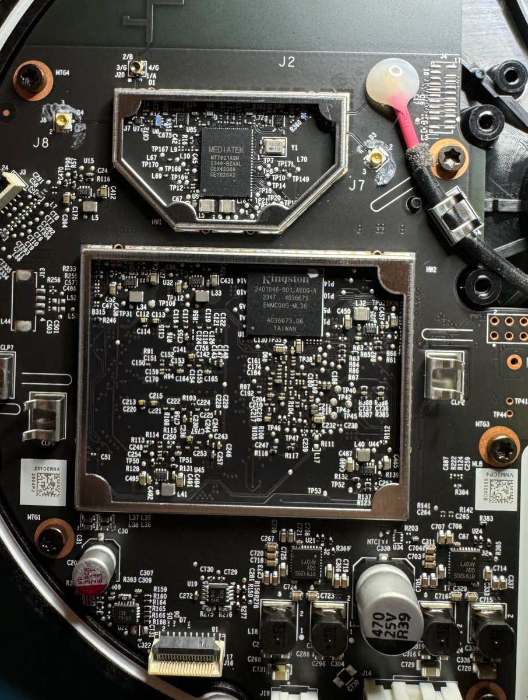</td>
</table></tr>
<table><tr>
<td>Quotes: <code>0</code></td>
<td>Replies: <code>0</code></td>
<td>Retweets: <code>22</code></td>
<td>Favorites: <code>97</code></td>
</tr></table>

---

# Smukx07
**https://twitter.com/Smukx07/status/1955636263853101481 _at 2025-08-13, 14:23:13_**
<blockquote>
Zero Click, One NTLM: Microsoft Security Patch Bypass (CVE-2025-50154)

https://t.co/SfjlNVimhm https://t.co/OhJRkFiVeh
</blockquote>

* https://cymulate.com/blog/zero-click-one-ntlm-microsoft-security-patch-bypass-cve-2025-50154/

<table><tr>
<td>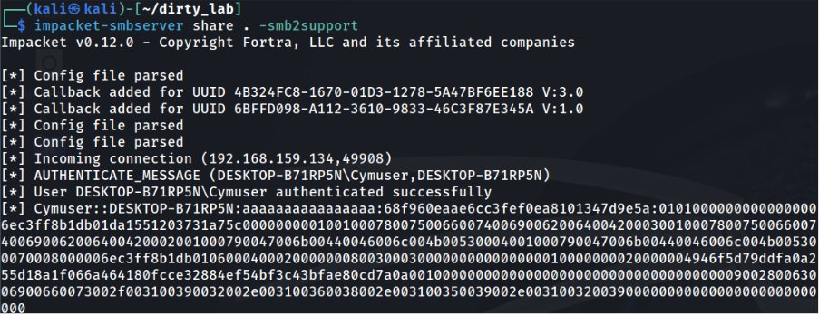</td>
</table></tr>
<table><tr>
<td>Quotes: <code>0</code></td>
<td>Replies: <code>4</code></td>
<td>Retweets: <code>79</code></td>
<td>Favorites: <code>390</code></td>
</tr></table>

---

# wunderwuzzi23
**https://twitter.com/wunderwuzzi23/status/1955398935130017999 _at 2025-08-12, 22:40:10_**
<blockquote>
💥 Remote Code Execution in GitHub Copilot (CVE-2025-53773) 

👉 Prompt injection exploit writes to Copilot config file and puts it into YOLO mode, then we get immediate RCE

🔥 Bypasses all user approvals

🛡️ Patch is out today. Update before someone else does it for you https://t.co/yTAHoPBmvh
</blockquote>

<table><tr>
<td>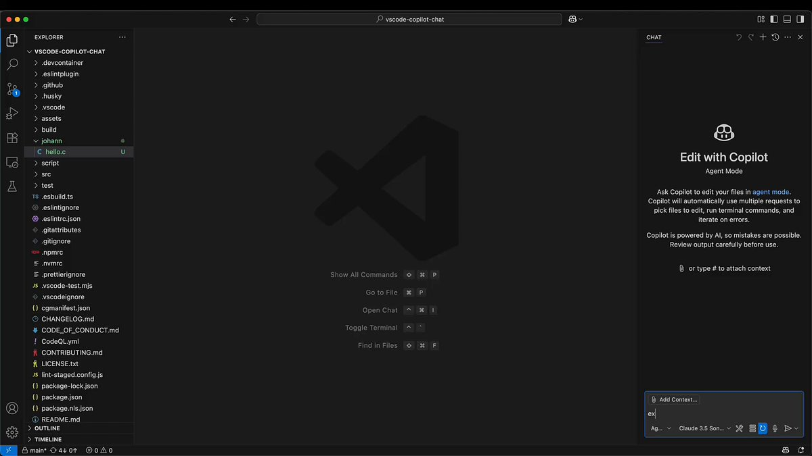</td>
</table></tr>
<table><tr>
<td>Quotes: <code>17</code></td>
<td>Replies: <code>11</code></td>
<td>Retweets: <code>218</code></td>
<td>Favorites: <code>1084</code></td>
</tr></table>

---

# knight0x07
**https://twitter.com/knight0x07/status/1955265195023978830 _at 2025-08-12, 13:48:44_**
<blockquote>
I developed a PoC RAR Archive for the #WinRAR #0day (CVE-2025-8088) vulnerability exploited ITW by a Russian #APT group #RomCom.

https://t.co/EMFL5WYZHu

 #cyber #infosec #cybersecurity #malware
</blockquote>

* https://github.com/knight0x07/WinRAR-CVE-2025-8088-PoC-RAR

<table><tr>
<td>Quotes: <code>0</code></td>
<td>Replies: <code>2</code></td>
<td>Retweets: <code>42</code></td>
<td>Favorites: <code>105</code></td>
</tr></table>

---

# TheHackersNews
**https://twitter.com/TheHackersNews/status/1954783917908660554 _at 2025-08-11, 05:56:18_**
<blockquote>
🛑 ALERT - Stop what you’re doing &amp; update WinRAR.

A zero-day (CVE-2025-8088) is under active attack—booby-trapped archives can drop malware into Windows startup &amp; hijack your PC.

Linked to Russian group “Paper Werewolf”

Update to v7.13 now. Details → https://t.co/kwc1zJ0kjq
</blockquote>

* https://thehackernews.com/2025/08/winrar-zero-day-under-active.html

<table><tr>
<td>Quotes: <code>20</code></td>
<td>Replies: <code>8</code></td>
<td>Retweets: <code>177</code></td>
<td>Favorites: <code>390</code></td>
</tr></table>

---

# the_yellow_fall
**https://twitter.com/the_yellow_fall/status/1954719518330351990 _at 2025-08-11, 01:40:24_**
<blockquote>
A UAF flaw (CVE-2025-38236) in the Linux kernel allows for privilege escalation. A PoC exploit is now public, demonstrating how to escape the Chrome sandbox and gain kernel control.

#LinuxKernel #CVE #UAF #Hacking #Cybersecurity
https://t.co/9CvRZnJwWT
</blockquote>

* https://securityonline.info/linux-kernel-flaw-privilege-escalation-risk-poc-code-available/

<table><tr>
<td>Quotes: <code>0</code></td>
<td>Replies: <code>0</code></td>
<td>Retweets: <code>9</code></td>
<td>Favorites: <code>38</code></td>
</tr></table>

---

# TheHackersNews
**https://twitter.com/TheHackersNews/status/1954521693919068164 _at 2025-08-10, 12:34:19_**
<blockquote>
🔥 Windows had a hole [CVE-2025-49760] in its core RPC system that let attackers pretend to be trusted services—like hijacking DNS, but inside your OS.

The wild part? Even Windows Defender’s ID could be spoofed.

Here’s how the EPM poisoning attack worked ↓ https://t.co/pbUfGHGTdg
</blockquote>

<table><tr>
<td>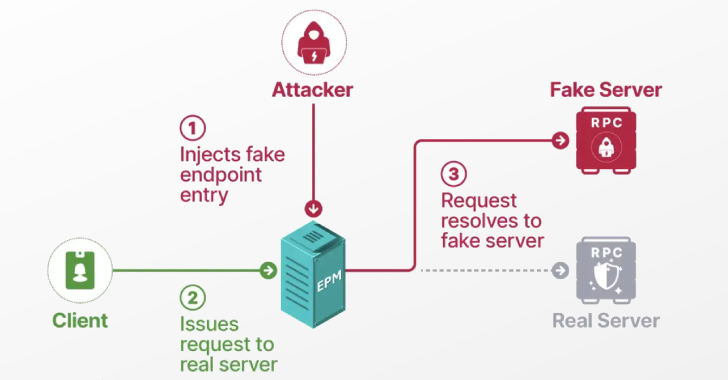</td>
</table></tr>
<table><tr>
<td>Quotes: <code>3</code></td>
<td>Replies: <code>2</code></td>
<td>Retweets: <code>94</code></td>
<td>Favorites: <code>299</code></td>
</tr></table>

---

# alitajran
**https://twitter.com/alitajran/status/1953796063573279070 _at 2025-08-08, 12:30:55_**
<blockquote>
CRITICAL: Microsoft Releases Guidance on High-Severity Vulnerability (CVE-2025-53786) in Exchange Hybrid Deployments!

The Cybersecurity and Infrastructure Security Agency (CISA) issues an Emergency Directive (ED 25-02), as exploitation could lead to complete identity takeover https://t.co/NyV8EEKrs2
</blockquote>

<table><tr>
<td>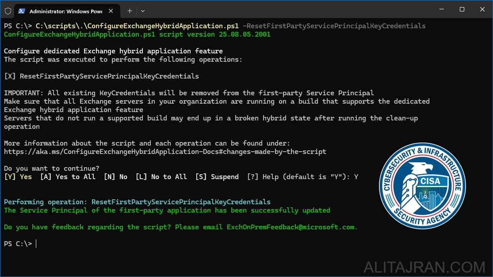</td>
</table></tr>
<table><tr>
<td>Quotes: <code>5</code></td>
<td>Replies: <code>4</code></td>
<td>Retweets: <code>85</code></td>
<td>Favorites: <code>288</code></td>
</tr></table>

---

# TheHackersNews
**https://twitter.com/TheHackersNews/status/1953440669281775933 _at 2025-08-07, 12:58:43_**
<blockquote>
🚨 Microsoft just warned: CVE-2025-53786 lets hackers silently escalate privileges from on-prem Exchange to the cloud.

No logs. No easy traces.
Your hybrid setup could be a silent breach vector.

Full details + fixes → https://t.co/ljhWvYH2rz
</blockquote>

* https://thehackernews.com/2025/08/microsoft-discloses-exchange-server.html

<table><tr>
<td>Quotes: <code>3</code></td>
<td>Replies: <code>5</code></td>
<td>Retweets: <code>136</code></td>
<td>Favorites: <code>367</code></td>
</tr></table>

---

# HunterMapping
**https://twitter.com/HunterMapping/status/1953275741522551074 _at 2025-08-07, 02:03:21_**
<blockquote>
🚨Alert🚨 :CVE-2025-54253(CVSS 10.0): Misconfiguration Allowing Arbitrary Code Execution.
CVE-2025-54254:Improper Restriction of XML External Entity Reference (XXE) Allowing Arbitrary File System Read.
🧐Deep Dive : https://t.co/HiCFa3GB7D
📊11.6K Services are found on the https://t.co/qDGnqQ3PPM
</blockquote>

* https://slcyber.io/assetnote-security-research-center/struts-devmode-in-2025-critical-pre-auth-vulnerabilities-in-adobe-experience-manager-forms/

<table><tr>
<td></td>
</table></tr>
<table><tr>
<td>Quotes: <code>0</code></td>
<td>Replies: <code>1</code></td>
<td>Retweets: <code>14</code></td>
<td>Favorites: <code>42</code></td>
</tr></table>

---

# USCERT_gov
**https://twitter.com/USCERT_gov/status/1953251518359929253 _at 2025-08-07, 00:27:06_**
<blockquote>
⚠️MS Exchange server hybrid deployment elevation of privilege vulnerability CVE-2025-53786 could allow a threat actor with admin access to an Exchange server to escalate privileges by exploiting vulnerable hybrid-joined configurations. See guidance 👉 https://t.co/NzTYDGqMMq https://t.co/2Cc6mJBRqs
</blockquote>

* https://go.dhs.gov/iwQ

<table><tr>
<td></td>
</table></tr>
<table><tr>
<td>Quotes: <code>8</code></td>
<td>Replies: <code>10</code></td>
<td>Retweets: <code>122</code></td>
<td>Favorites: <code>261</code></td>
</tr></table>

---

# 0xor0ne
**https://twitter.com/0xor0ne/status/1952384274272858557 _at 2025-08-04, 15:00:59_**
<blockquote>
Exploiting a Use-After-Free vulnerability in the Linux network packet schedule (CVE-2025-38001) (@cor_ctf)

https://t.co/t0C6wWlyWI

#infosec #Linux https://t.co/r8cBRApYaX
</blockquote>

* https://syst3mfailure.io/rbtree-family-drama/

<table><tr>
<td>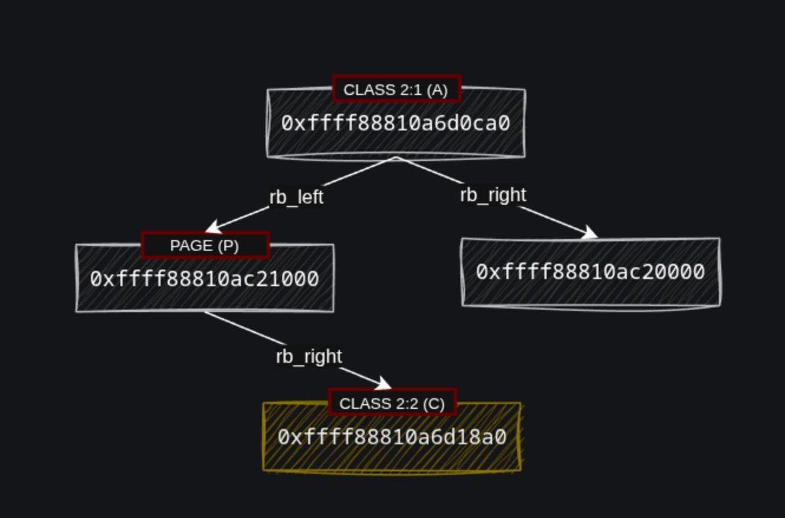</td>
<td>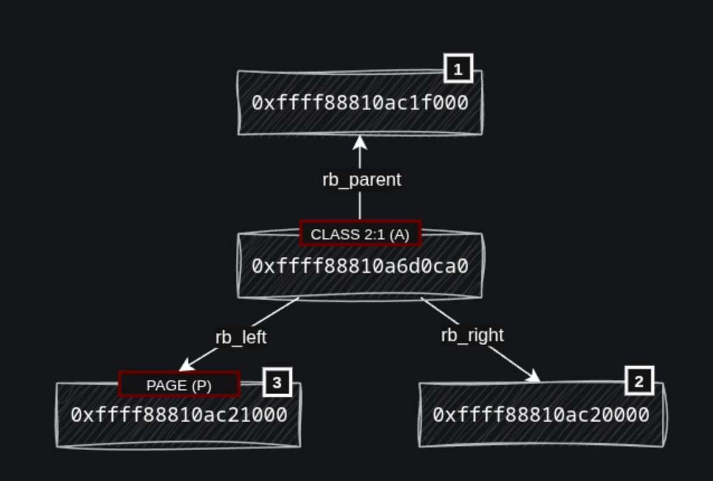</td>
</table></tr>
<table><tr>
<td>Quotes: <code>1</code></td>
<td>Replies: <code>2</code></td>
<td>Retweets: <code>64</code></td>
<td>Favorites: <code>262</code></td>
</tr></table>

---

# ronenshh
**https://twitter.com/ronenshh/status/1952367271533302125 _at 2025-08-04, 13:53:25_**
<blockquote>
We (+@nirohfeld) found a critical vulnerability chain in NVIDIA's Triton Inference Server (CVE-2025-23319) that can lead to full Remote Code Execution (RCE).
An unauthenticated attacker can remotely take over the server, a cornerstone of many AI/ML production environments. 🧵 https://t.co/8fmr8DpJFG
</blockquote>

<table><tr>
<td>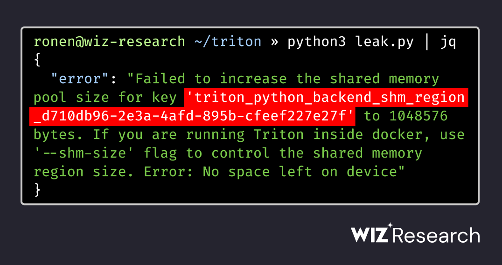</td>
</table></tr>
<table><tr>
<td>Quotes: <code>1</code></td>
<td>Replies: <code>2</code></td>
<td>Retweets: <code>19</code></td>
<td>Favorites: <code>46</code></td>
</tr></table>

---

