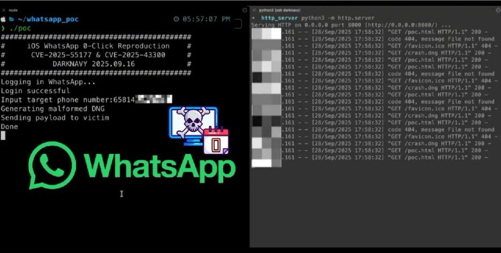
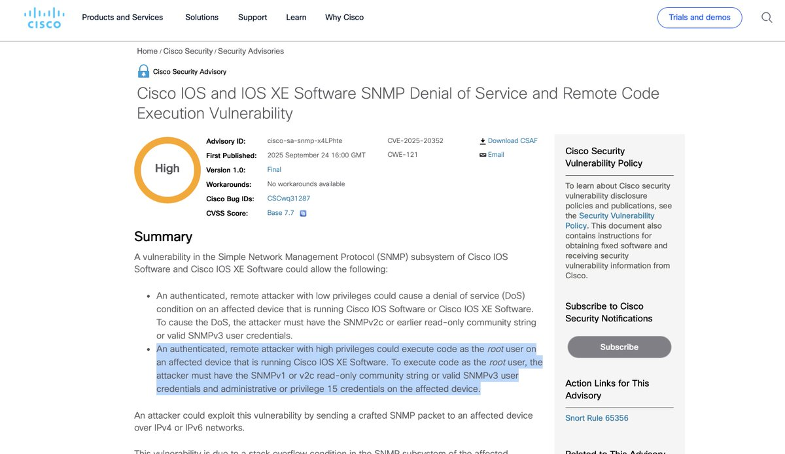
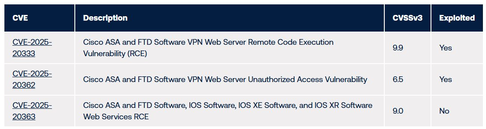
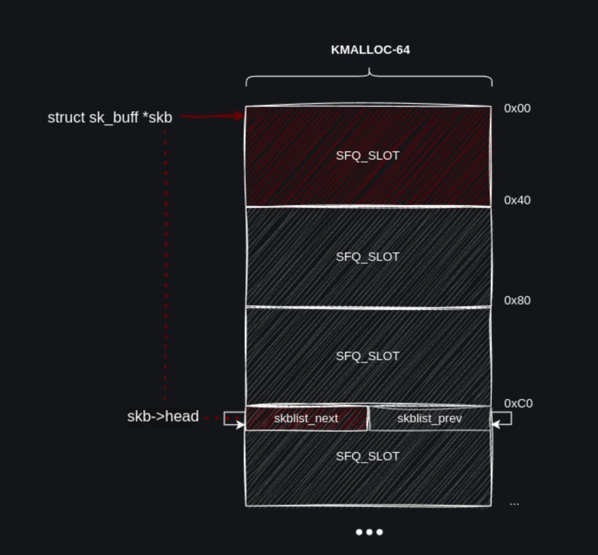
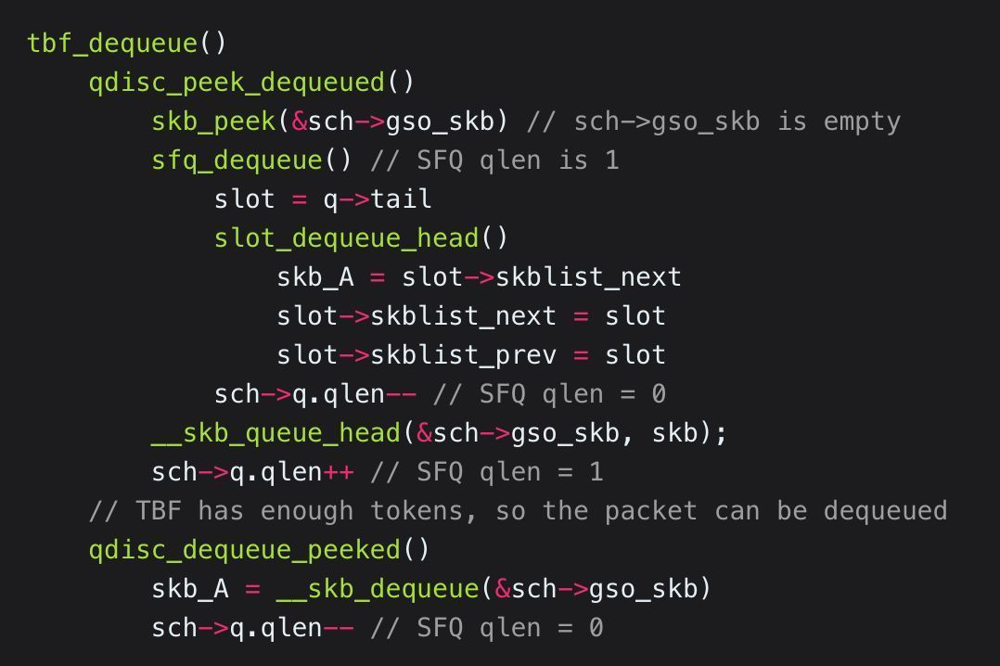
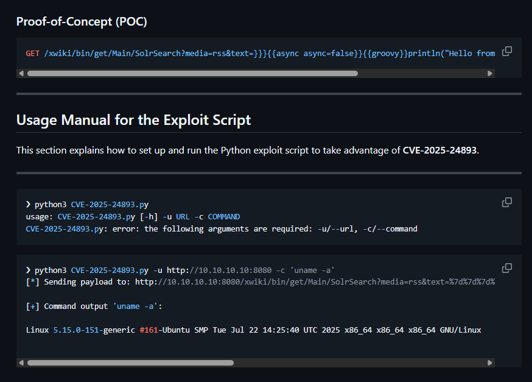
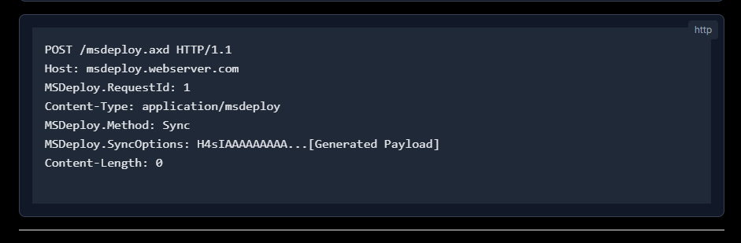
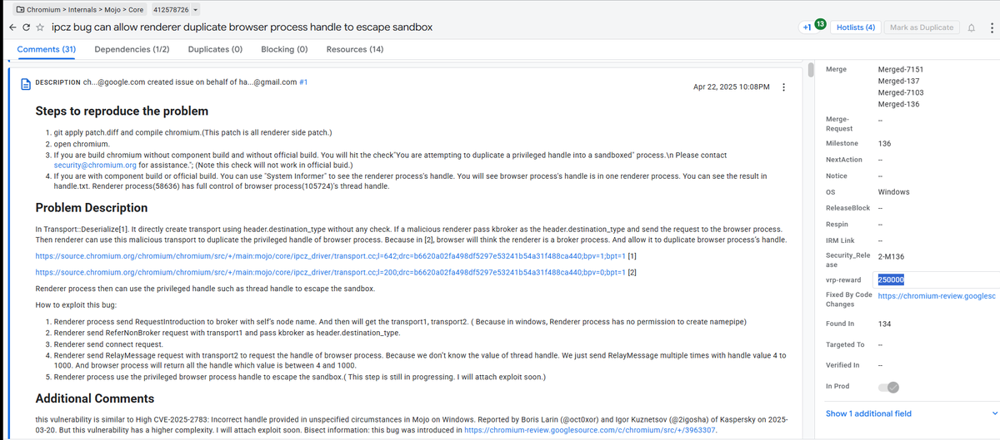

# HackingTeam1
**https://twitter.com/HackingTeam1/status/1973091197301211525 _at 2025-09-30, 18:22:54_**
<blockquote>
🕵‍♂WhatsApp: 0-Click RCE por DNG malicioso
• Investigadores publicaron PoC que combina dos vulnerabilidades (CVE-2025-55177 y CVE-2025-43300) permitiendo ejecución remota sin interacción en iOS/macOS/iPadOS.
• El exploit se entrega mediante un archivo DNG malformado enviado https://t.co/8R4K31yvYA
</blockquote>

<table><tr>
<td></td>
</table></tr>
<table><tr>
<td>Quotes: <code>2</code></td>
<td>Replies: <code>5</code></td>
<td>Retweets: <code>68</code></td>
<td>Favorites: <code>287</code></td>
</tr></table>

---

# UK_Daniel_Card
**https://twitter.com/UK_Daniel_Card/status/1971610701602095369 _at 2025-09-26, 16:19:56_**
<blockquote>
Sorry gang, CVE-2025-20352 is DoS + RCE

my bad! I haven't slept well!

So if you could also patch this ASAP as well.

To execute code you need to know the community string... the READ ONLY one (LOL)

which is normally: 'public' (lowercase if memory serves) https://t.co/8glm8noBMB
</blockquote>

<table><tr>
<td></td>
</table></tr>
<table><tr>
<td>Quotes: <code>0</code></td>
<td>Replies: <code>5</code></td>
<td>Retweets: <code>2</code></td>
<td>Favorites: <code>37</code></td>
</tr></table>

---

# zoomeye_team
**https://twitter.com/zoomeye_team/status/1971505370578419746 _at 2025-09-26, 09:21:23_**
<blockquote>
🚨🚨Cisco drops 3 critical vuln advisories — 2 already exploited in the wild!
CVE-2025-20333 (CVSS 9.9): Authenticated attacker can exploit via crafted HTTP(S) for RCE
CVE-2025-20362: Unauthenticated attacker bypasses auth with crafted HTTP(S)
ZoomEye Dork👉app="Cisco ASA"  || https://t.co/hcM1hjcib7
</blockquote>

<table><tr>
<td></td>
</table></tr>
<table><tr>
<td>Quotes: <code>1</code></td>
<td>Replies: <code>0</code></td>
<td>Retweets: <code>20</code></td>
<td>Favorites: <code>46</code></td>
</tr></table>

---

# The_Cyber_News
**https://twitter.com/The_Cyber_News/status/1970101682471350626 _at 2025-09-22, 12:23:38_**
<blockquote>
🚨 Chrome Type Confusion 0-Day Vulnerability Code Analysis Released 

Read more: https://t.co/kpepf1HvW3

Google Chrome’s V8 JavaScript engine has been compromised by a critical type confusion zero-day vulnerability, designated CVE-2025-10585, marking the sixth actively exploited https://t.co/QX9oAG0SNI
</blockquote>

* https://cybersecuritynews.com/chrome-0-day-vulnerability-analysis/

<table><tr>
<td></td>
</table></tr>
<table><tr>
<td>Quotes: <code>2</code></td>
<td>Replies: <code>0</code></td>
<td>Retweets: <code>12</code></td>
<td>Favorites: <code>37</code></td>
</tr></table>

---

# H4ckManac
**https://twitter.com/H4ckManac/status/1968595183030653073 _at 2025-09-18, 08:37:21_**
<blockquote>
🚨New Chrome Zero-Day Under Attack. PATCH NOW

Edge, Brave, Opera, and Vivaldi users are also advised to update as soon as patches are available.

Google patched four Chrome vulnerabilities, including the actively exploited zero-day CVE-2025-10585, a type confusion bug in the V8 https://t.co/RIn31xu8BD
</blockquote>

<table><tr>
<td></td>
</table></tr>
<table><tr>
<td>Quotes: <code>3</code></td>
<td>Replies: <code>7</code></td>
<td>Retweets: <code>93</code></td>
<td>Favorites: <code>221</code></td>
</tr></table>

---

# TheHackersNews
**https://twitter.com/TheHackersNews/status/1968553554190209069 _at 2025-09-18, 05:51:55_**
<blockquote>
🚨 Chrome users: a new zero-day is under active attack.

CVE-2025-10585 targets Chrome’s V8 engine—Chrome’s 6th zero-day of 2025.

Details → https://t.co/Vs2OH8SQeJ

⚡ Update now: 140.0.7339.185/.186 (Win/macOS), 140.0.7339.185 (Linux).

If you use Edge/Brave/Opera/Vivaldi, https://t.co/5H2bgLLLd2
</blockquote>

* https://thehackernews.com/2025/09/google-patches-chrome-zero-day-cve-2025.html

<table><tr>
<td></td>
</table></tr>
<table><tr>
<td>Quotes: <code>15</code></td>
<td>Replies: <code>16</code></td>
<td>Retweets: <code>237</code></td>
<td>Favorites: <code>576</code></td>
</tr></table>

---

# andreyknvl
**https://twitter.com/andreyknvl/status/1966164323488981155 _at 2025-09-11, 15:37:58_**
<blockquote>
Wrote a trigger for CVE-2025-38494/5 (an integer underflow in the HID subsystem) that leaks 64 KB of OOB memory over USB.

Still works on Pixels and Ubuntus (but the bug is fixed in stable kernels).

https://t.co/4IvvqcVs4Q https://t.co/BDzfspHViO
</blockquote>

* https://github.com/xairy/kernel-exploits/tree/master/CVE-2025-38494

<table><tr>
<td></td>
<td></td>
</table></tr>
<table><tr>
<td>Quotes: <code>5</code></td>
<td>Replies: <code>5</code></td>
<td>Retweets: <code>81</code></td>
<td>Favorites: <code>509</code></td>
</tr></table>

---

# 0xor0ne
**https://twitter.com/0xor0ne/status/1965067867969216536 _at 2025-09-08, 15:01:03_**
<blockquote>
Exploiting an array-Out-Of-Bounds vulnerability in the Linux network packet scheduler (CVE-2025-37752)

https://t.co/UdEJrQyekL

#infosec #Linux https://t.co/snHo6lHNwo
</blockquote>

* https://syst3mfailure.io/two-bytes-of-madness/

<table><tr>
<td></td>
<td></td>
</table></tr>
<table><tr>
<td>Quotes: <code>1</code></td>
<td>Replies: <code>3</code></td>
<td>Retweets: <code>59</code></td>
<td>Favorites: <code>404</code></td>
</tr></table>

---

# cyber_advising
**https://twitter.com/cyber_advising/status/1963537349783998900 _at 2025-09-04, 09:39:19_**
<blockquote>
CVE-2025-24893 is a critical unauthenticated remote code execution (RCE) vulnerability affecting the XWiki Platform.

https://t.co/n2GGpZXvxH https://t.co/KjcnrjFv9x
</blockquote>

* https://github.com/b0ySie7e/CVE-2025-24893

<table><tr>
<td></td>
</table></tr>
<table><tr>
<td>Quotes: <code>0</code></td>
<td>Replies: <code>0</code></td>
<td>Retweets: <code>40</code></td>
<td>Favorites: <code>124</code></td>
</tr></table>

---

# cyber_advising
**https://twitter.com/cyber_advising/status/1963240666349142425 _at 2025-09-03, 14:00:24_**
<blockquote>
CVE-2025-53772 IIS WebDeploy RCE
vulnerability in msdeployagentservice and msdeploy.axd endpoints of Microsoft Web Deploy, where unsafe deserialization of HTTP header contents allows an authenticated attacker (RCE).

https://t.co/pcu08yldyg https://t.co/cDAJer1ZRS
</blockquote>

* https://hawktrace.com/blog/cve-2025-53772

<table><tr>
<td></td>
</table></tr>
<table><tr>
<td>Quotes: <code>0</code></td>
<td>Replies: <code>0</code></td>
<td>Retweets: <code>32</code></td>
<td>Favorites: <code>118</code></td>
</tr></table>

---

# zoomeye_team
**https://twitter.com/zoomeye_team/status/1963127835788443860 _at 2025-09-03, 06:32:03_**
<blockquote>
🚨🚨CVE-2025-53772(CVSS 8.8): Critical RCE in Microsoft IIS WebDeploy!  Authenticated attackers can exploit untrusted data deserialization via HTTP headers to execute code remotely. 
🔥PoC: https://t.co/R4ZbT8BhvG

Search by vul.cve Filter👉vul.cve="CVE-2025-53772"
ZoomEye https://t.co/RJZFjLsXkT
</blockquote>

* https://gist.github.com/hawktrace/67836c7e9f35b72077b50f220349cd73

<table><tr>
<td></td>
</table></tr>
<table><tr>
<td>Quotes: <code>0</code></td>
<td>Replies: <code>0</code></td>
<td>Retweets: <code>97</code></td>
<td>Favorites: <code>253</code></td>
</tr></table>

---

# payloadartist
**https://twitter.com/payloadartist/status/1962523339563659618 _at 2025-09-01, 14:30:00_**
<blockquote>
Google paid out $250,000 bounty for this bug. That's how it's done.

A bug in Chromium's Mojo component (CVE-2025-4609) allowed for a full sandbox escape. 🤯

A malicious renderer could basically trick the browser into handing over privileged process handles. Congrats to the https://t.co/VuihqvRLfv
</blockquote>

<table><tr>
<td></td>
</table></tr>
<table><tr>
<td>Quotes: <code>0</code></td>
<td>Replies: <code>6</code></td>
<td>Retweets: <code>44</code></td>
<td>Favorites: <code>445</code></td>
</tr></table>

---

