# The_Cyber_News
**https://twitter.com/The_Cyber_News/status/1983753229575106784 _at 2025-10-30, 04:30:00_**
<blockquote>
🚨 CISA Shares New Threat Detections for Actively Exploited WSUS Vulnerability 

Read more: https://t.co/lE9fuKRN1x

CISA has provided organizations with enhanced guidance on detecting and mitigating threat activity related to the actively exploited CVE-2025-59287 vulnerability https://t.co/V20HatmzqN
</blockquote>

* https://cybersecuritynews.com/cisa-threat-detections-wsus-vulnerability/

<table><tr>
<td>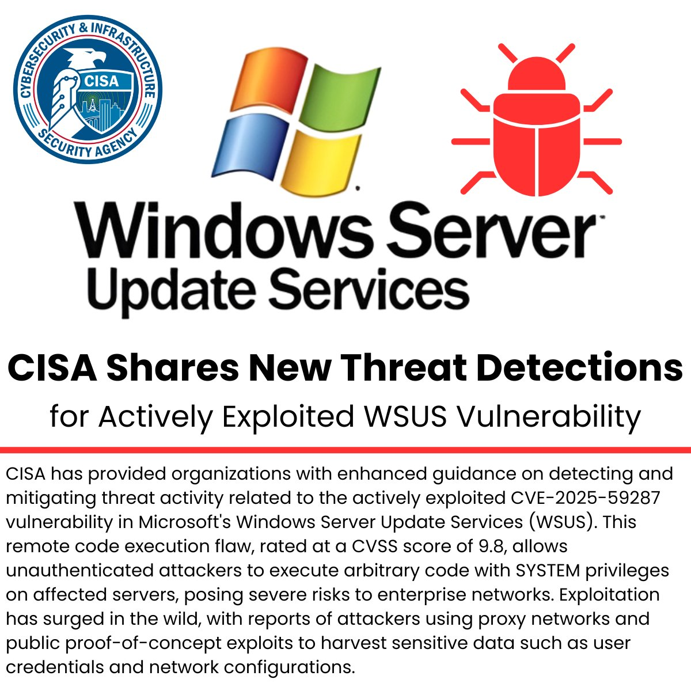</td>
</table></tr>
<table><tr>
<td>Quotes: <code>4</code></td>
<td>Replies: <code>1</code></td>
<td>Retweets: <code>61</code></td>
<td>Favorites: <code>207</code></td>
</tr></table>

---

# USCERT_gov
**https://twitter.com/USCERT_gov/status/1983643925341438111 _at 2025-10-29, 21:15:40_**
<blockquote>
We’ve released updated information on vulnerable product identification &amp; threat detections to address CVE-2025-59287, a critical remote code execution vulnerability affecting Windows Server Update Service. Review our Alert &amp; take immediate action. 🔗 https://t.co/t5xpDWjSWS https://t.co/haphNJCf7N
</blockquote>

* https://go.dhs.gov/in5

<table><tr>
<td>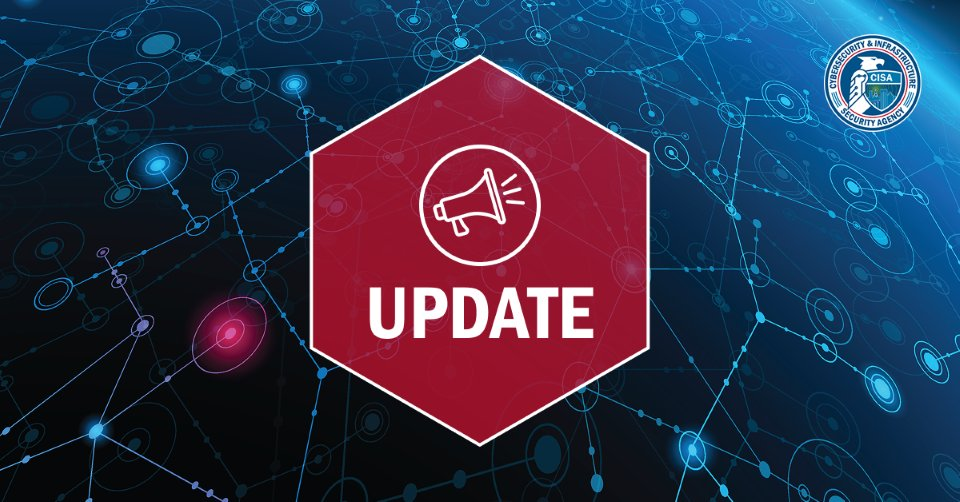</td>
</table></tr>
<table><tr>
<td>Quotes: <code>4</code></td>
<td>Replies: <code>5</code></td>
<td>Retweets: <code>73</code></td>
<td>Favorites: <code>142</code></td>
</tr></table>

---

# ShanHolo
**https://twitter.com/ShanHolo/status/1983464163151347782 _at 2025-10-29, 09:21:22_**
<blockquote>
🚨#WSUS CVE-2025-59287 #exploit found.
PowerShell PoC that downloads ysoserial, crafts a BinaryFormatter blob, and brags about “RCE when you open the WSUS console.”

wsus-rce.ps1➡️693745cff2bef06c58f6af649969cd9c

#DFIR #ThreatHunting https://t.co/IoJVjzeeCW
</blockquote>

<table><tr>
<td>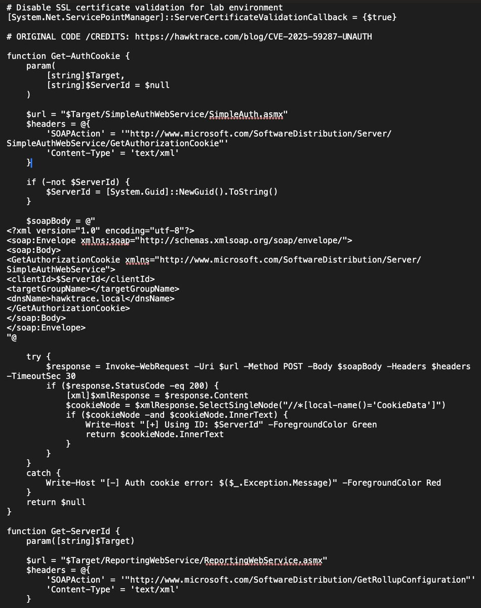</td>
</table></tr>
<table><tr>
<td>Quotes: <code>0</code></td>
<td>Replies: <code>2</code></td>
<td>Retweets: <code>54</code></td>
<td>Favorites: <code>172</code></td>
</tr></table>

---

# gN3mes1s
**https://twitter.com/gN3mes1s/status/1983277662950044015 _at 2025-10-28, 21:00:17_**
<blockquote>
CVE-2025-55752 - exploit poc for the Apache Tomcat Rewrite Valve Relative Path Traversal, no RCE (for now)

#pruva tried to fake it playing witht he rewrite, relaxing it a lot, but after some pass was able to reproduce.

https://t.co/M8iXStuJaJ https://t.co/35NbZwuFBH
</blockquote>

* https://gist.github.com/N3mes1s/0130615f7412c59d6439d1292b428e29

<table><tr>
<td>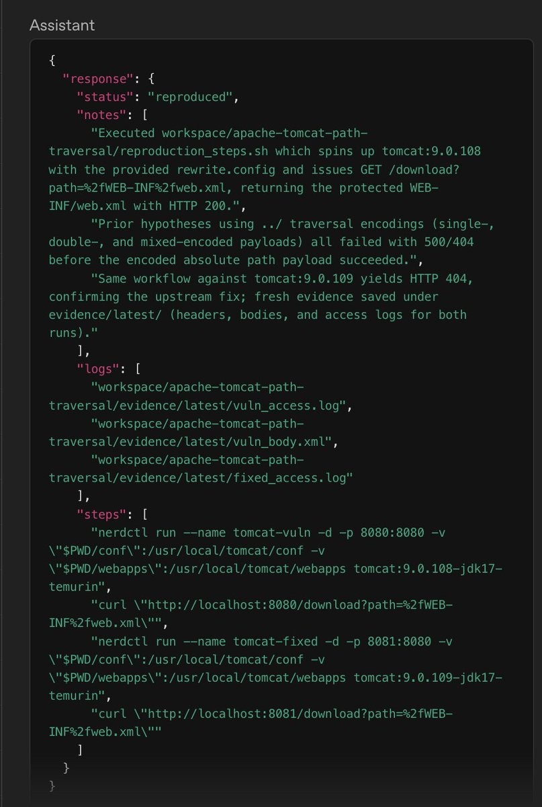</td>
<td>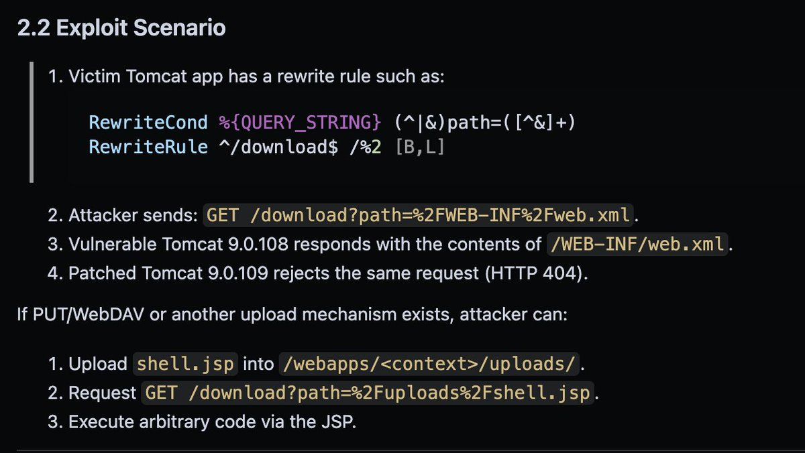</td>
</table></tr>
<table><tr>
<td>Quotes: <code>0</code></td>
<td>Replies: <code>3</code></td>
<td>Retweets: <code>76</code></td>
<td>Favorites: <code>319</code></td>
</tr></table>

---

# TheHackersNews
**https://twitter.com/TheHackersNews/status/1983087562362138764 _at 2025-10-28, 08:24:53_**
<blockquote>
⚠️ ALERT: A Chrome zero-day (CVE-2025-2783) was exploited to deliver spyware built by Memento Labs — the firm behind past government surveillance tools.

One click in Chromium = full sandbox escape.

Read this → https://t.co/aTkSq0QITK
</blockquote>

* https://thehackernews.com/2025/10/chrome-zero-day-exploited-to-deliver.html

<table><tr>
<td>Quotes: <code>6</code></td>
<td>Replies: <code>4</code></td>
<td>Retweets: <code>132</code></td>
<td>Favorites: <code>319</code></td>
</tr></table>

---

# Netlas_io
**https://twitter.com/Netlas_io/status/1983054896409489462 _at 2025-10-28, 06:15:05_**
<blockquote>
CVE-2025-55752, -55754, -61795: Multiple vulnerabilites in Apache Tomcat, 5.3 - 9.6 rating 🔥

Three new vulnerabilities in Apache Tomcat allow attackers to perform DoS, RCE, and ANSI Injection.

Search at https://t.co/hv7QKSqxTR:
👉 Link: https://t.co/vdf2Sc1KSy https://t.co/YCfAy2Eexz
</blockquote>

* http://Netlas.io
* https://nt.ls/OLbr7

<table><tr>
<td>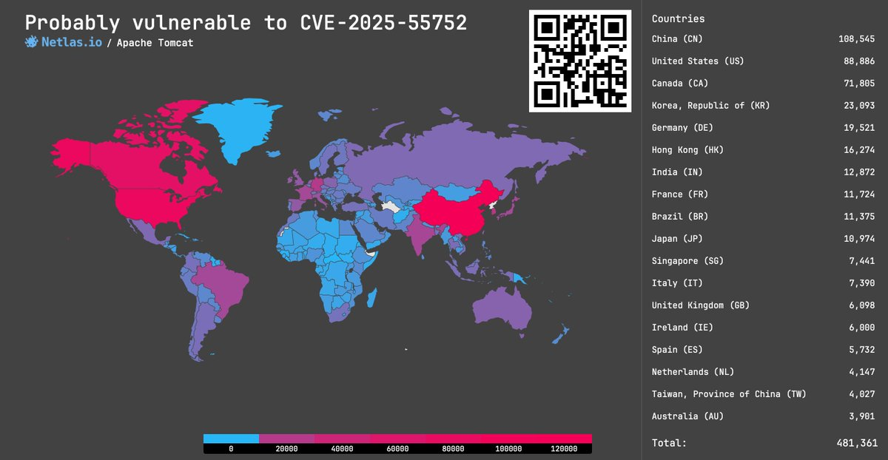</td>
</table></tr>
<table><tr>
<td>Quotes: <code>1</code></td>
<td>Replies: <code>1</code></td>
<td>Retweets: <code>19</code></td>
<td>Favorites: <code>71</code></td>
</tr></table>

---

# zoomeye_team
**https://twitter.com/zoomeye_team/status/1983010260974743959 _at 2025-10-28, 03:17:43_**
<blockquote>
🚨🚨Apache Tomcat Patches 3 Vulns
CVE-2025-55752: Bypass auth → HTTP PUT malicious upload = RCE (certain configs)  
CVE-2025-55754: ANSI escape hijack on Windows consoles  
CVE-2025-61795: Multipart upload crash = DoS

ZoomEye Dork👉app="Apache Tomcat"
822.3k+ exposed on https://t.co/8GFL9FZfh0
</blockquote>

<table><tr>
<td>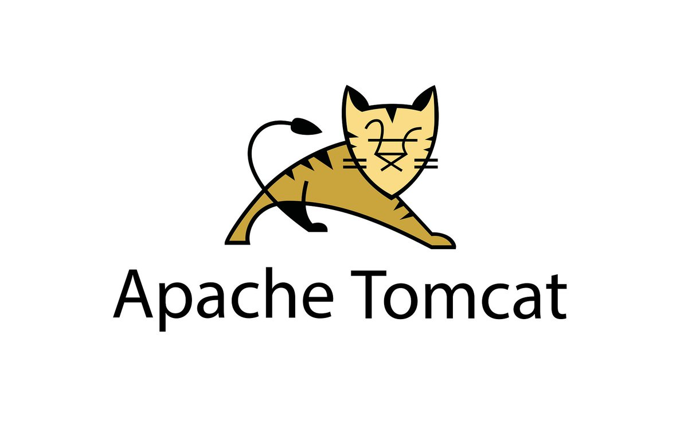</td>
</table></tr>
<table><tr>
<td>Quotes: <code>2</code></td>
<td>Replies: <code>0</code></td>
<td>Retweets: <code>84</code></td>
<td>Favorites: <code>307</code></td>
</tr></table>

---

# Unit42_Intel
**https://twitter.com/Unit42_Intel/status/1982897624970580271 _at 2025-10-27, 19:50:08_**
<blockquote>
Critical RCE CVE-2025-59287 in Microsoft’s WSUS is actively exploited. Unauthenticated attackers can execute code with system privileges. Learn from Unit 42’s direct observations from cases: https://t.co/5I3Kbj9xj6 https://t.co/gwoc6vAlyI
</blockquote>

* https://bit.ly/4huTE8d

<table><tr>
<td></td>
</table></tr>
<table><tr>
<td>Quotes: <code>0</code></td>
<td>Replies: <code>1</code></td>
<td>Retweets: <code>31</code></td>
<td>Favorites: <code>85</code></td>
</tr></table>

---

# 0xor0ne
**https://twitter.com/0xor0ne/status/1982492612691923097 _at 2025-10-26, 17:00:46_**
<blockquote>
Unauthenticated SQL injection leading to RCE in FreePBX Endpoint (CVE-2025-57819)

https://t.co/dvPIYaPnMJ

Credits @watchtowrcyber

#infosec https://t.co/d677TUzroK
</blockquote>

* https://labs.watchtowr.com/you-already-have-our-personal-data-take-our-phone-calls-too-freepbx-cve-2025-57819/

<table><tr>
<td>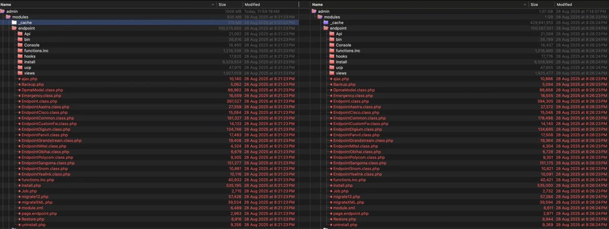</td>
<td>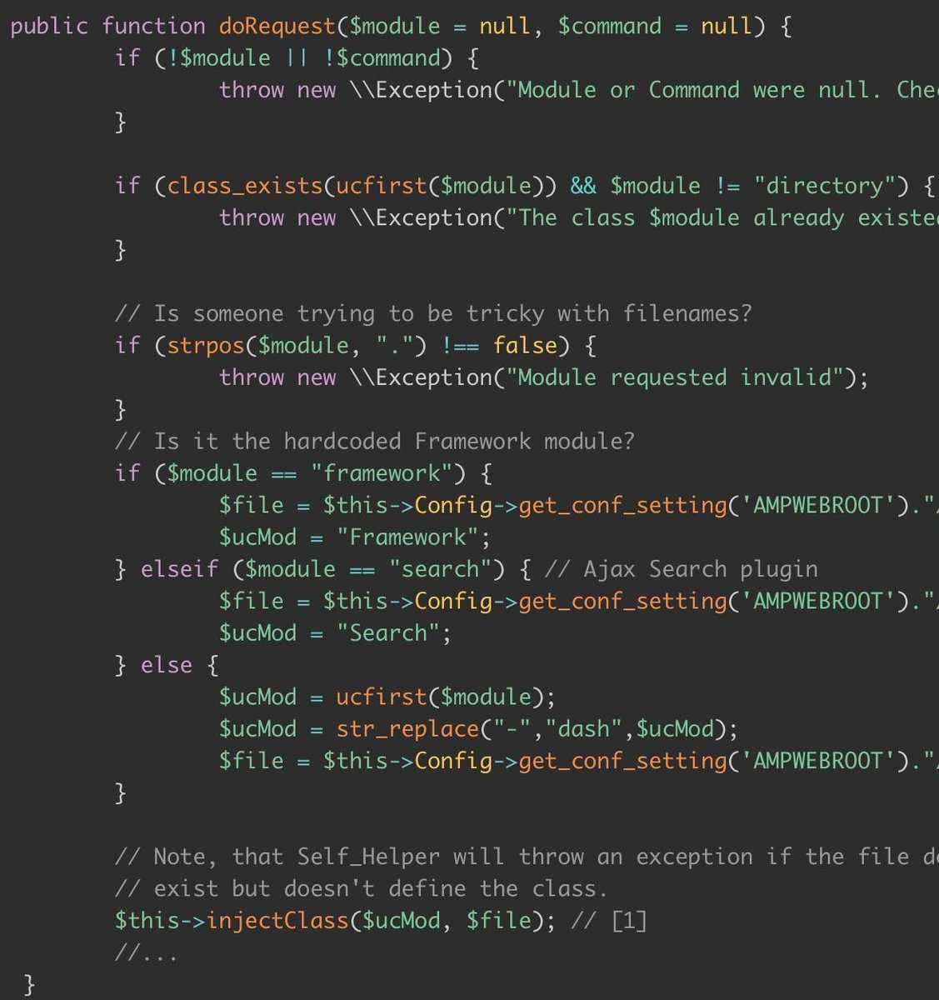</td>
</table></tr>
<table><tr>
<td>Quotes: <code>3</code></td>
<td>Replies: <code>0</code></td>
<td>Retweets: <code>43</code></td>
<td>Favorites: <code>291</code></td>
</tr></table>

---

# USCERT_gov
**https://twitter.com/USCERT_gov/status/1981821419219493365 _at 2025-10-24, 20:33:41_**
<blockquote>
CVE-2025-59287 is being actively exploited. Update Windows Server Update Services now to reduce risk of a threat actor achieving remote code execution with system privileges. See our Alert for details ➡️ https://t.co/t5xpDWjSWS #Cybersecurity https://t.co/tOHXCgFbyk
</blockquote>

* https://go.dhs.gov/in5

<table><tr>
<td></td>
</table></tr>
<table><tr>
<td>Quotes: <code>10</code></td>
<td>Replies: <code>23</code></td>
<td>Retweets: <code>182</code></td>
<td>Favorites: <code>470</code></td>
</tr></table>

---

# _JohnHammond
**https://twitter.com/_JohnHammond/status/1981760877645672496 _at 2025-10-24, 16:33:07_**
<blockquote>
hey hi hello

we've been seeing summa dat WSUS sussy baka CVE-2025-59287 remote code execution exploitation

windows servers with WSUS ports 8530 &amp; 8531 exposed ( -- why?) getting point-and-shoot popped from a POC already public

https://t.co/tDCpFvlNVe

prolly limited ITW https://t.co/DJPvXgpE28
</blockquote>

* https://www.huntress.com/blog/exploitation-of-windows-server-update-services-remote-code-execution-vulnerability

<table><tr>
<td></td>
</table></tr>
<table><tr>
<td>Quotes: <code>13</code></td>
<td>Replies: <code>7</code></td>
<td>Retweets: <code>85</code></td>
<td>Favorites: <code>520</code></td>
</tr></table>

---

# linkersec
**https://twitter.com/linkersec/status/1981520574758130066 _at 2025-10-24, 00:38:14_**
<blockquote>
ksmbd - Exploiting CVE-2025-37947

Article by @73696e65 about locally exploiting CVE-2025-37947 — a page OOB write in the ksmbd module.

Article: https://t.co/V5LBTtOqxY
Exploit: https://t.co/knpaTnIO2j https://t.co/jADk5UqFEn
</blockquote>

* https://blog.doyensec.com/2025/10/08/ksmbd-3.html
* https://github.com/doyensec/KSMBD-CVE-2025-37947/blob/main/CVE-2025-37947.c

<table><tr>
<td>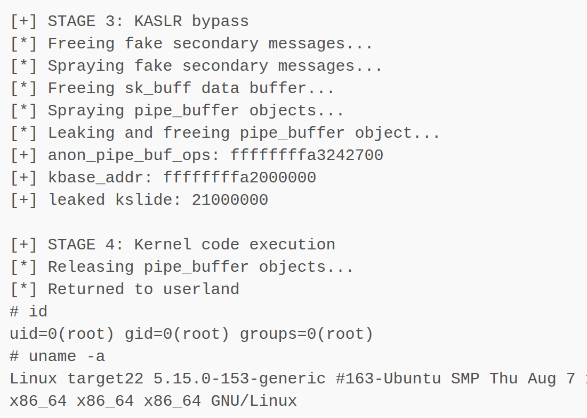</td>
</table></tr>
<table><tr>
<td>Quotes: <code>2</code></td>
<td>Replies: <code>0</code></td>
<td>Retweets: <code>67</code></td>
<td>Favorites: <code>287</code></td>
</tr></table>

---

# zoomeye_team
**https://twitter.com/zoomeye_team/status/1981190881089900881 _at 2025-10-23, 02:48:09_**
<blockquote>
🚨🚨CVE-2025-22167 (CVSS 8.7): Jira Path Traversal flaw allows arbitrary file writes to any JVM-writable path. Possible RCE when chained with other exploits.

Search by vul.cve Filter👉vul.cve="CVE-2025-22167"
ZoomEye Dork👉app="Atlassian JIRA"
Over 107k vulnerable instances. https://t.co/PXi8CQQsYg
</blockquote>

<table><tr>
<td>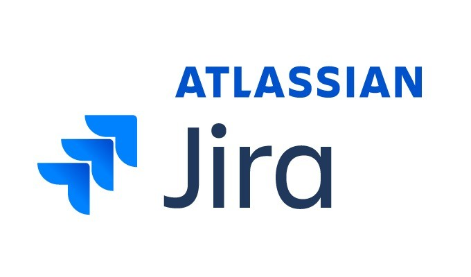</td>
</table></tr>
<table><tr>
<td>Quotes: <code>2</code></td>
<td>Replies: <code>0</code></td>
<td>Retweets: <code>65</code></td>
<td>Favorites: <code>212</code></td>
</tr></table>

---

# S0ufi4n3
**https://twitter.com/S0ufi4n3/status/1981040640994562356 _at 2025-10-22, 16:51:09_**
<blockquote>
CVE-2025-59287 - 9.8, WSUS Remote Code Execution
Write-up and PoC
 https://t.co/LTUbmWoIH4
</blockquote>

* https://hawktrace.com/blog/CVE-2025-59287

<table><tr>
<td>Quotes: <code>1</code></td>
<td>Replies: <code>1</code></td>
<td>Retweets: <code>106</code></td>
<td>Favorites: <code>364</code></td>
</tr></table>

---

# assetnote
**https://twitter.com/assetnote/status/1980874880632647995 _at 2025-10-22, 05:52:29_**
<blockquote>
Our Security Researcher @softpoison_ published his first research post, reverse engineering CVE-2025-54236 (SessionReaper) - a critical unauthenticated RCE in Magento. From understanding @Blaklis_'s original discovery, we wrote up our analysis here: https://t.co/xOVdFwrWQ8
</blockquote>

* https://slcyber.io/assetnote-security-research-center/why-nested-deserialization-is-still-harmful-magento-rce-cve-2025-54236/

<table><tr>
<td>Quotes: <code>1</code></td>
<td>Replies: <code>0</code></td>
<td>Retweets: <code>25</code></td>
<td>Favorites: <code>102</code></td>
</tr></table>

---

# HunterMapping
**https://twitter.com/HunterMapping/status/1980473107103248878 _at 2025-10-21, 03:15:58_**
<blockquote>
🚨Alert🚨 CVE-2025-49844 (CVSS 10.0) :Critical Remote Code Execution Vulnerability in Redis
🧐Detail:https://t.co/u7Obt9Oeoh
🔥EXP:https://t.co/PD3foEAoVh
📊1.9M Services are found on the https://t.co/ysWb28Crld yearly.
🔗Hunter
Link:https://t.co/LhLk0voAPy
👇Query
HUNTER : https://t.co/WujWsQGyWL
</blockquote>

* https://www.wiz.io/blog/wiz-research-redis-rce-cve-2025-49844
* https://x.com/DarkNavyOrg/status/1979833455426035965
* http://hunter.how
* https://hunter.how/list?searchValue=product.name%3D%3D%22Redis%20key-value%20store%22

<table><tr>
<td></td>
</table></tr>
<table><tr>
<td>Quotes: <code>1</code></td>
<td>Replies: <code>1</code></td>
<td>Retweets: <code>49</code></td>
<td>Favorites: <code>145</code></td>
</tr></table>

---

# The_Cyber_News
**https://twitter.com/The_Cyber_News/status/1980468061967904841 _at 2025-10-21, 02:55:55_**
<blockquote>
🚨 CISA Warns of Windows SMB Vulnerability Actively Exploited in Attacks 

Read more: https://t.co/h2qN9Xf11g

CISA issued an urgent alert on October 20, 2025, highlighting a severe vulnerability CVE-2025-33073 in Microsoft's Windows SMB Client.

The vulnerability exploits the https://t.co/vv4GHRUsT8
</blockquote>

* https://cybersecuritynews.com/windows-smb-vulnerability-exploited/

<table><tr>
<td>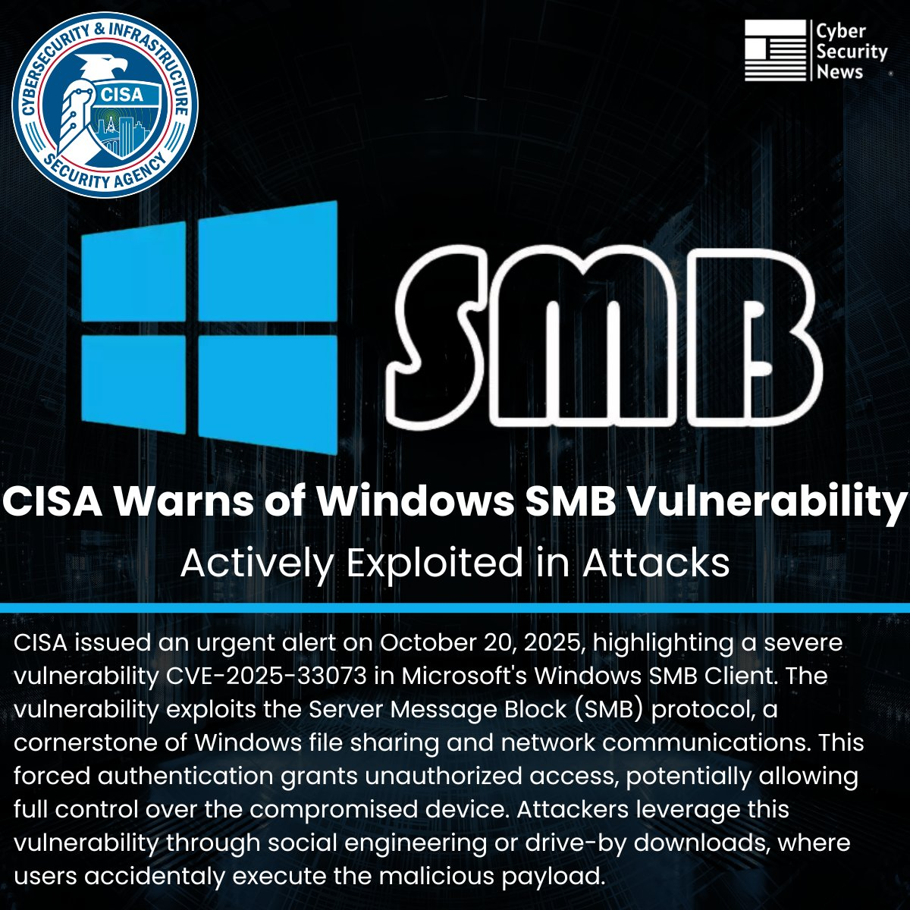</td>
</table></tr>
<table><tr>
<td>Quotes: <code>9</code></td>
<td>Replies: <code>5</code></td>
<td>Retweets: <code>126</code></td>
<td>Favorites: <code>443</code></td>
</tr></table>

---

# piedpiper1616
**https://twitter.com/piedpiper1616/status/1979752913846313052 _at 2025-10-19, 03:34:11_**
<blockquote>
CVE-2025-59287 WSUS Remote Code Execution | HawkTrace - https://t.co/MJaeHYQLpU
</blockquote>

* https://hawktrace.com/blog/CVE-2025-59287

<table><tr>
<td>Quotes: <code>2</code></td>
<td>Replies: <code>5</code></td>
<td>Retweets: <code>106</code></td>
<td>Favorites: <code>375</code></td>
</tr></table>

---

# 7h3h4ckv157
**https://twitter.com/7h3h4ckv157/status/1979211141302661153 _at 2025-10-17, 15:41:22_**
<blockquote>
CVE-2025-33073: PoC Exploit for the NTLM reflection SMB flaw.

Check: https://t.co/5FuycV0ksK https://t.co/bdM07o5duJ
</blockquote>

* https://github.com/mverschu/CVE-2025-33073

<table><tr>
<td>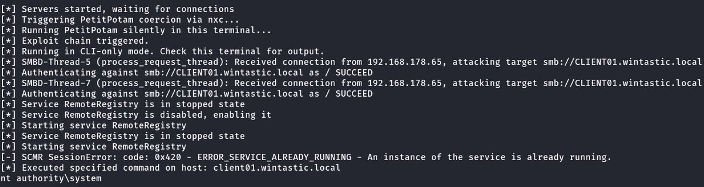</td>
<td>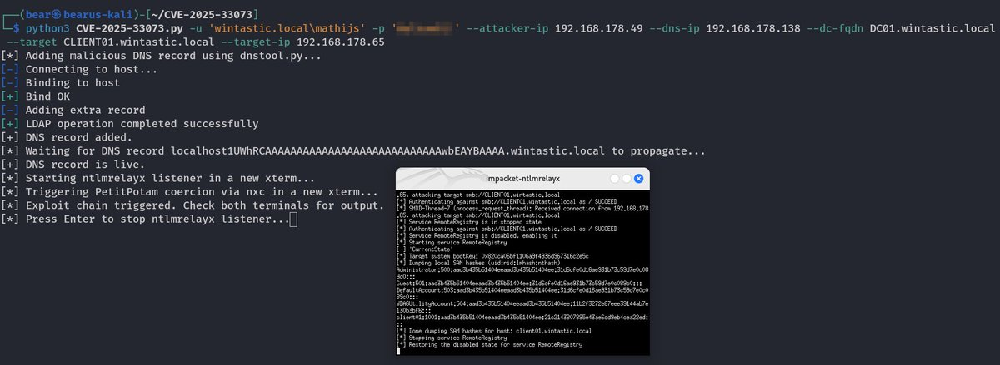</td>
<td>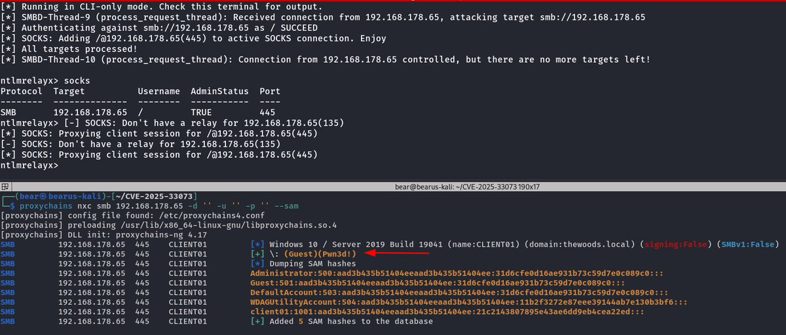</td>
</table></tr>
<table><tr>
<td>Quotes: <code>0</code></td>
<td>Replies: <code>6</code></td>
<td>Retweets: <code>105</code></td>
<td>Favorites: <code>487</code></td>
</tr></table>

---

# HunterMapping
**https://twitter.com/HunterMapping/status/1978998358929776832 _at 2025-10-17, 01:35:51_**
<blockquote>
🚨Alert🚨:CVE-2025-10230 (CVSS 10.0) : Critical Samba RCE Flaw Allows
Unauthenticated Command Injection on AD DCs
📊5.5K+ Services are found on the https://t.co/ysWb28BTvF yearly.
🔗Hunter
Link:https://t.co/XY0uzhmP0v
👇Query
HUNTER : https://t.co/q9rtuGfZuz="Sambar Server" https://t.co/9iqUXivbj8
</blockquote>

* http://hunter.how
* https://hunter.how/list?searchValue=product.name%3D%22Sambar%20Server%22&timestamp=1760584199331
* http://product.name

<table><tr>
<td></td>
</table></tr>
<table><tr>
<td>Quotes: <code>0</code></td>
<td>Replies: <code>1</code></td>
<td>Retweets: <code>32</code></td>
<td>Favorites: <code>94</code></td>
</tr></table>

---

# zoomeye_team
**https://twitter.com/zoomeye_team/status/1978764337092468972 _at 2025-10-16, 10:05:56_**
<blockquote>
🚨🚨CVE-2025-10230 (CVSS 10): Critical Samba RCE Flaw
Unauthenticated RCE in Samba AD DCs: improper input sanitization in the WINS server lets attackers inject commands via "wins hook".

ZoomEye Dork👉banner="Samba"
Over 265.8k vulnerable instances.
ZoomEye Link: https://t.co/4qEETREmBx
</blockquote>

<table><tr>
<td></td>
</table></tr>
<table><tr>
<td>Quotes: <code>1</code></td>
<td>Replies: <code>3</code></td>
<td>Retweets: <code>68</code></td>
<td>Favorites: <code>230</code></td>
</tr></table>

---

# H4ckManac
**https://twitter.com/H4ckManac/status/1976888744415305938 _at 2025-10-11, 05:53:00_**
<blockquote>
🚨🚨Cyberattack Alert ‼️

🇺🇸USA - Harvard University

Cl0p hacking group claims to have breached Harvard University.

N.B: A zero-day vulnerability in Oracle E-Business Suite is under active exploitation by the Cl0p ransomware group. The vulnerability is tracked as CVE-2025-61882 https://t.co/9sxfoDFw2i
</blockquote>

<table><tr>
<td>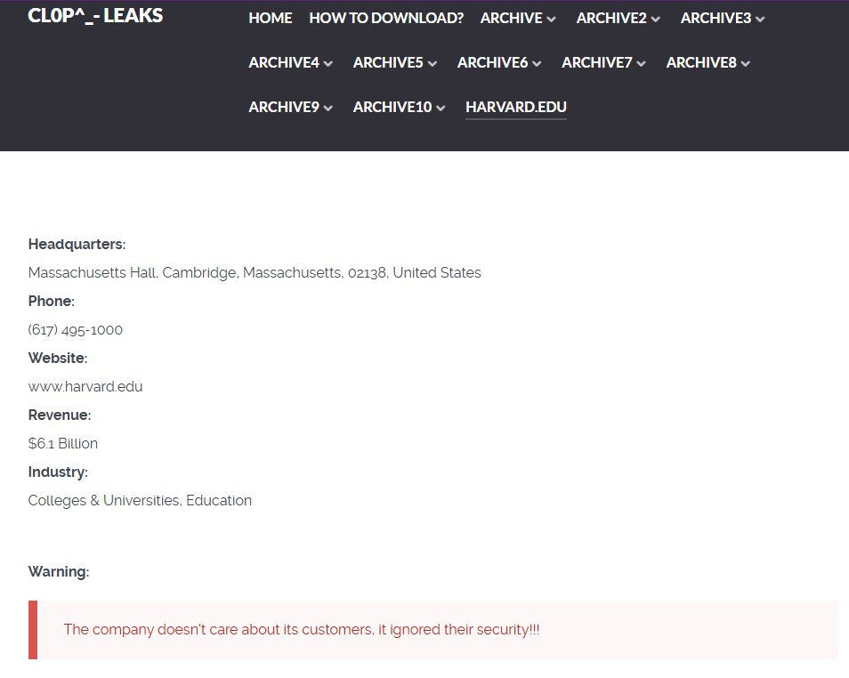</td>
</table></tr>
<table><tr>
<td>Quotes: <code>8</code></td>
<td>Replies: <code>3</code></td>
<td>Retweets: <code>62</code></td>
<td>Favorites: <code>202</code></td>
</tr></table>

---

# zoomeye_team
**https://twitter.com/zoomeye_team/status/1976593052358914358 _at 2025-10-10, 10:18:01_**
<blockquote>
🚨🚨CVE-2025-49844 (CVSS 10): Redis Lua RCE
 Authenticated attackers can exploit a Lua script to trigger a use-after-free, enabling RCE. Affects all Lua-enabled Redis versions.
🔥PoC: https://t.co/OvL4Y7xcqc

Search by vul.cve Filter👉vul.cve="CVE-2025-49844"
ZoomEye https://t.co/EDIFzXcSYU
</blockquote>

* https://github.com/dwisiswant0/CVE-2025-49844

<table><tr>
<td></td>
</table></tr>
<table><tr>
<td>Quotes: <code>0</code></td>
<td>Replies: <code>2</code></td>
<td>Retweets: <code>29</code></td>
<td>Favorites: <code>93</code></td>
</tr></table>

---

# HunterMapping
**https://twitter.com/HunterMapping/status/1976479890955280851 _at 2025-10-10, 02:48:21_**
<blockquote>
🚨Alert🚨:CVE-2025-61913 (CVSS 10.0) : Critical Flowise RCE Flaw Allows
Arbitrary File Write
🔥POC
:https://t.co/LVmjAD4JgA
📊42.9K Services are found on the https://t.co/ysWb28BTvF yearly.
🔗Hunter
Link:https://t.co/q2FFmybO8d
👇Query
HUNTER : https://t.co/q9rtuGfZuz="Flowise" https://t.co/vb9wgbJgaC
</blockquote>

* https://github.com/FlowiseAI/Flowise/security/advisories/GHSA-jv9m-vf54-chjj
* http://hunter.how
* https://hunter.how/list?searchValue=product.name%3D%22Flowise%22
* http://product.name

<table><tr>
<td>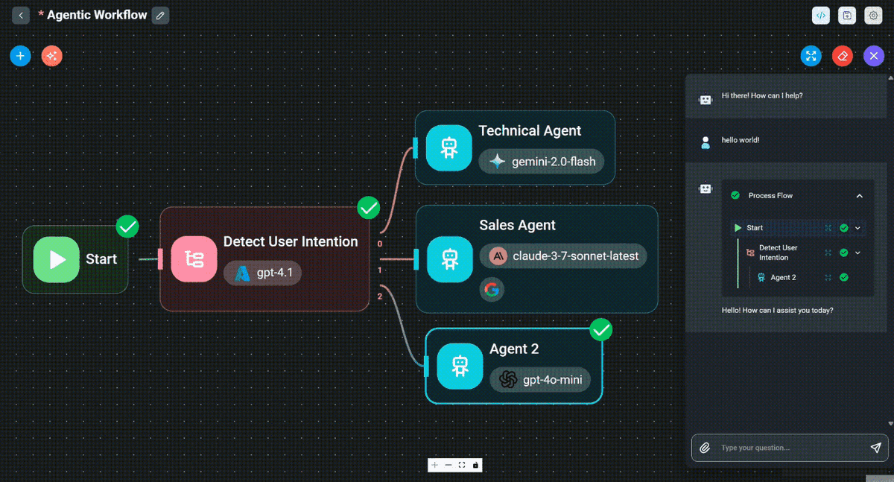</td>
</table></tr>
<table><tr>
<td>Quotes: <code>0</code></td>
<td>Replies: <code>2</code></td>
<td>Retweets: <code>22</code></td>
<td>Favorites: <code>99</code></td>
</tr></table>

---

# wiz_io
**https://twitter.com/wiz_io/status/1975306747087634925 _at 2025-10-06, 21:06:42_**
<blockquote>
💥 Wiz Research has uncovered a critical Redis vulnerability that's been hiding for 13 years

We found RediShell (CVE-2025-49844): an RCE bug in Redis that affects every version of Redis out there. It's rated CVSS 10 - the highest severity possible.

The vulnerability lets https://t.co/axNK2hJQcr
</blockquote>

<table><tr>
<td>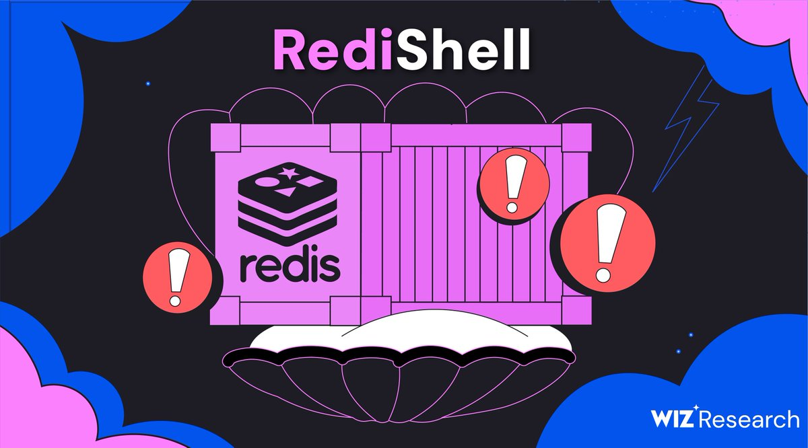</td>
</table></tr>
<table><tr>
<td>Quotes: <code>22</code></td>
<td>Replies: <code>7</code></td>
<td>Retweets: <code>171</code></td>
<td>Favorites: <code>525</code></td>
</tr></table>

---

# TheHackersNews
**https://twitter.com/TheHackersNews/status/1975068537954701517 _at 2025-10-06, 05:20:09_**
<blockquote>
🚨 Oracle just rushed a patch for CVE-2025-61882 — a 9.8 critical flaw in E-Business Suite already exploited by Cl0p in live data theft attacks.

The zero-day lets attackers seize control without a username or password.

Experts warn many may already be breached.

Details here ↓ https://t.co/w25oqDIpwp
</blockquote>

<table><tr>
<td></td>
</table></tr>
<table><tr>
<td>Quotes: <code>11</code></td>
<td>Replies: <code>11</code></td>
<td>Retweets: <code>114</code></td>
<td>Favorites: <code>336</code></td>
</tr></table>

---

# BleepinComputer
**https://twitter.com/BleepinComputer/status/1975014476874481713 _at 2025-10-06, 01:45:19_**
<blockquote>
⚠️Oracle issued an emergency fix for a a critical E-Business Suite zero-day flaw tracked as CVE-2025-61882 that was exploited in Clop data theft attacks.

🔥The flaw is a critical unauthenticated RCE flaw. An exploit is publicly available to open a reverse shell. 

🚨Patch now! https://t.co/eDGhsr9kdp
</blockquote>

<table><tr>
<td></td>
</table></tr>
<table><tr>
<td>Quotes: <code>2</code></td>
<td>Replies: <code>4</code></td>
<td>Retweets: <code>74</code></td>
<td>Favorites: <code>191</code></td>
</tr></table>

---

# hakrishi
**https://twitter.com/hakrishi/status/1974909403615936977 _at 2025-10-05, 18:47:48_**
<blockquote>
🚨 Critical zero-day tagged as CVE-2025-61882 (CVSS 9.8) affecting Oracle E-Business Suite

I've created a vulnerability detection script here:
https://t.co/xcfEV2KrBM

This vulnerability is remotely exploitable without authentication.

Patches are available as per Oracle's https://t.co/lltaoQOrAd
</blockquote>

* https://github.com/rxerium/CVE-2025-61882

<table><tr>
<td>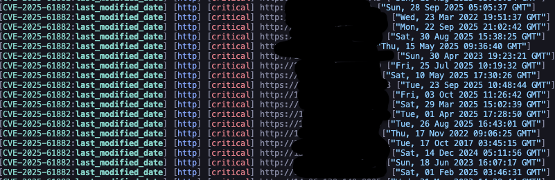</td>
</table></tr>
<table><tr>
<td>Quotes: <code>7</code></td>
<td>Replies: <code>4</code></td>
<td>Retweets: <code>136</code></td>
<td>Favorites: <code>600</code></td>
</tr></table>

---

# Smukx07
**https://twitter.com/Smukx07/status/1974488429871366232 _at 2025-10-04, 14:55:00_**
<blockquote>
You name it, VMware elevates it (CVE-2025-41244)

TLDR; Broadcom disclosed local priv esc vuln, impacting VMware’s guest service discovery features. NVISO has identified zero-day exploitation in the wild beginning mid-October 2024.

https://t.co/OIql07P3Rq https://t.co/PYDb2r4kgQ
</blockquote>

* https://blog.nviso.eu/2025/09/29/you-name-it-vmware-elevates-it-cve-2025-41244/

<table><tr>
<td>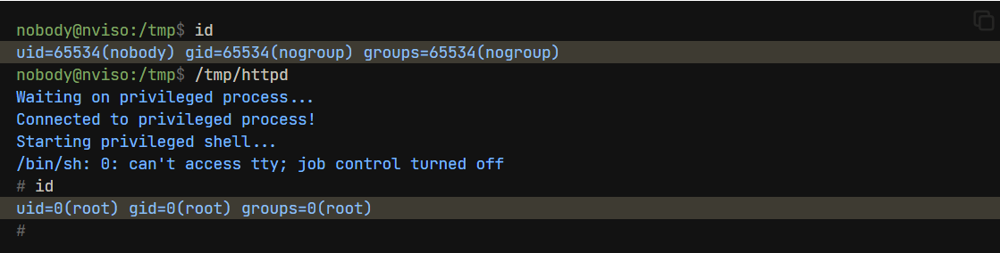</td>
</table></tr>
<table><tr>
<td>Quotes: <code>0</code></td>
<td>Replies: <code>1</code></td>
<td>Retweets: <code>51</code></td>
<td>Favorites: <code>252</code></td>
</tr></table>

---

