# H4ckManac
**https://twitter.com/H4ckManac/status/1992916218479534474 _at 2025-11-24, 11:20:27_**
<blockquote>
🚨🚨Attackers are exploiting the critical WSUS flaw CVE-2025-59287 to gain SYSTEM-level remote code execution and deploy ShadowPad, a modular backdoor linked to Chinese state-sponsored actors. 

They use PowerCat for shell access, then download the payload with tools like https://t.co/4m1P1BRgwB
</blockquote>

<table><tr>
<td>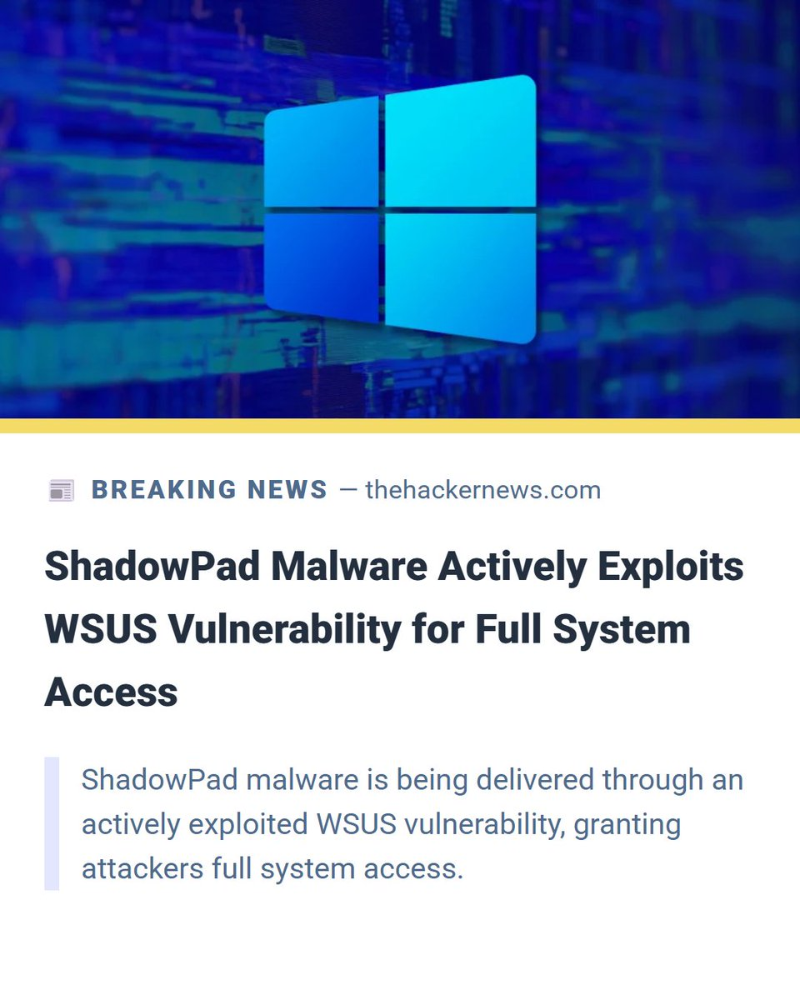</td>
</table></tr>
<table><tr>
<td>Quotes: <code>0</code></td>
<td>Replies: <code>1</code></td>
<td>Retweets: <code>44</code></td>
<td>Favorites: <code>115</code></td>
</tr></table>

---

# TheHackersNews
**https://twitter.com/TheHackersNews/status/1992855824818176223 _at 2025-11-24, 07:20:28_**
<blockquote>
🚨 Hackers are using a fixed Windows bug (CVE-2025-59287) to spread ShadowPad malware through WSUS servers.

They used normal Windows tools like curl and certutil to install it — a method seen before in Chinese hacking groups.

Systems patched too late may have already been https://t.co/kbi5AK8XfV
</blockquote>

<table><tr>
<td></td>
</table></tr>
<table><tr>
<td>Quotes: <code>7</code></td>
<td>Replies: <code>4</code></td>
<td>Retweets: <code>134</code></td>
<td>Favorites: <code>380</code></td>
</tr></table>

---

# TheHackersNews
**https://twitter.com/TheHackersNews/status/1992124696909996038 _at 2025-11-22, 06:55:14_**
<blockquote>
🚨 CISA warns Oracle Identity Manager flaw (CVE-2025-61757) is under active attack.

Hackers can run code without login by adding ?WSDL or ;.wadl to URLs — a tiny trick that opens locked systems.

Exploited since August. Patch by Dec 12.

Full details ↓ https://t.co/iEcvFYZuDg
</blockquote>

* https://thehackernews.com/2025/11/cisa-warns-of-actively-exploited.html

<table><tr>
<td>Quotes: <code>2</code></td>
<td>Replies: <code>0</code></td>
<td>Retweets: <code>38</code></td>
<td>Favorites: <code>105</code></td>
</tr></table>

---

# oss_security
**https://twitter.com/oss_security/status/1992045035500785700 _at 2025-11-22, 01:38:41_**
<blockquote>
libpng 1.6.51: Four buffer overflow vulnerabilities fixed https://t.co/qBuxMJIllC
CVE-2025-64505, CVE-2025-64506, CVE-2025-64720: Out-of-bounds reads, can result in information disclosure, denial of service
CVE-2025-65018: Heap buffer overflow, may enable arbitrary code execution
</blockquote>

* https://www.openwall.com/lists/oss-security/2025/11/22/1

<table><tr>
<td>Quotes: <code>0</code></td>
<td>Replies: <code>1</code></td>
<td>Retweets: <code>7</code></td>
<td>Favorites: <code>44</code></td>
</tr></table>

---

# USCERT_gov
**https://twitter.com/USCERT_gov/status/1991974702139482420 _at 2025-11-21, 20:59:12_**
<blockquote>
🛡️ We added Oracle Fusion Middleware missing authentication for critical function vulnerability CVE-2025-61757 to our Known Exploited Vulnerabilities Catalog. Visit https://t.co/bJOgGeWmb8 &amp; apply mitigations to protect your org from cyberattacks. #Cybersecurity #InfoSec https://t.co/2ep8uKnHiE
</blockquote>

* https://www.cisa.gov/known-exploited-vulnerabilities-catalog

<table><tr>
<td>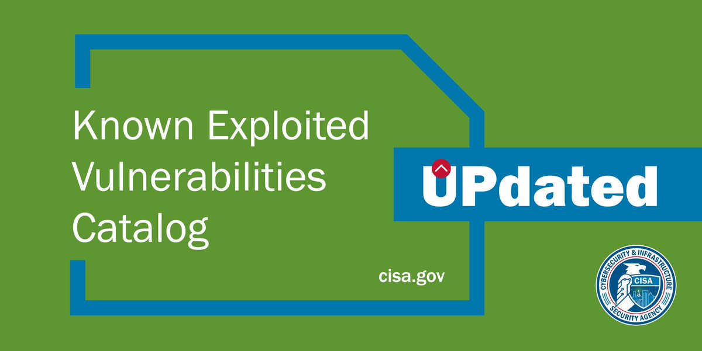</td>
</table></tr>
<table><tr>
<td>Quotes: <code>0</code></td>
<td>Replies: <code>2</code></td>
<td>Retweets: <code>23</code></td>
<td>Favorites: <code>59</code></td>
</tr></table>

---

# _xpn_
**https://twitter.com/_xpn_/status/1991875571324973471 _at 2025-11-21, 14:25:18_**
<blockquote>
New blog post is up exploring a vuln I found in Claude Code (CVE-2025-64755) allowing arbitrary file write without a consent prompt. New tech is always fun to explore, hopefully this post gives you some hints as to future research :) https://t.co/UiXp9XN5NA
</blockquote>

* https://specterops.io/blog/2025/11/21/an-evening-with-claude-code/

<table><tr>
<td>Quotes: <code>3</code></td>
<td>Replies: <code>5</code></td>
<td>Retweets: <code>56</code></td>
<td>Favorites: <code>250</code></td>
</tr></table>

---

# stephenfewer
**https://twitter.com/stephenfewer/status/1991861220635492628 _at 2025-11-21, 13:28:16_**
<blockquote>
We now have a (draft) @metasploit exploit module for the recent Fortinet FortiWeb vulns, chaining CVE-2025-64446 (auth bypass) + CVE-2025-58034 (command injection) to achieve unauthenticated RCE with root privileges: https://t.co/Xh15JybxsC https://t.co/n7sMp6qCJU
</blockquote>

* https://github.com/rapid7/metasploit-framework/pull/20717

<table><tr>
<td>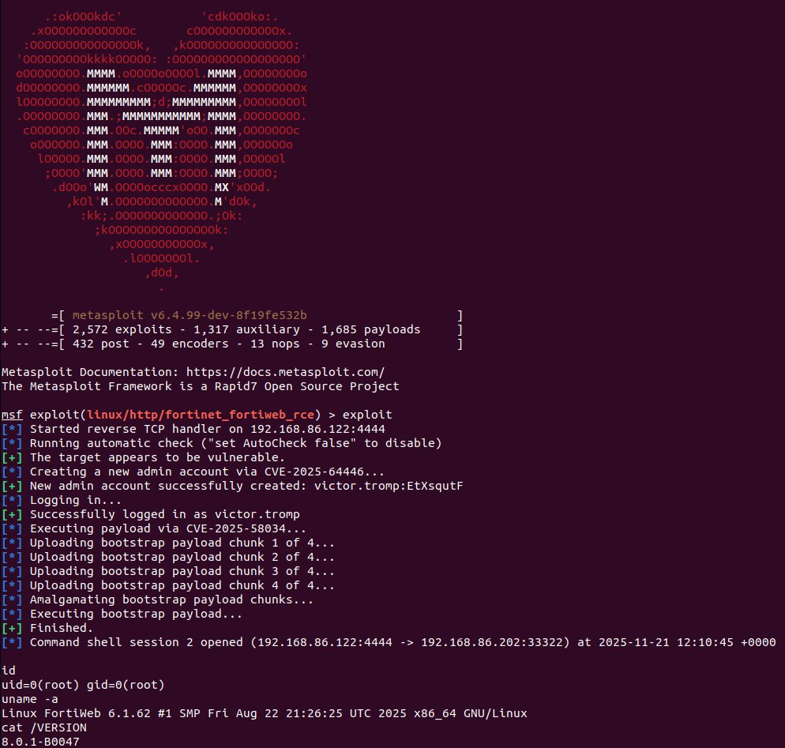</td>
</table></tr>
<table><tr>
<td>Quotes: <code>1</code></td>
<td>Replies: <code>3</code></td>
<td>Retweets: <code>68</code></td>
<td>Favorites: <code>340</code></td>
</tr></table>

---

# zoomeye_team
**https://twitter.com/zoomeye_team/status/1991812016273850528 _at 2025-11-21, 10:12:45_**
<blockquote>
🚨🚨CVE-2025-41115 (CVSS 10) – Grafana Privilege Escalation
Grafana 12.x with SCIM enabled is vulnerable: a malicious SCIM client can create users with numeric externalIds, risking ID override and full privilege escalation.

Search by vul.cve Filter👉vul.cve="CVE-2025-41115" https://t.co/7K9jIv2eZX
</blockquote>

<table><tr>
<td></td>
</table></tr>
<table><tr>
<td>Quotes: <code>0</code></td>
<td>Replies: <code>4</code></td>
<td>Retweets: <code>36</code></td>
<td>Favorites: <code>148</code></td>
</tr></table>

---

# Threatlabz
**https://twitter.com/Threatlabz/status/1991534221366907269 _at 2025-11-20, 15:48:53_**
<blockquote>
Zscaler ThreatLabz has discovered CVE-2025-50165 in the Microsoft Windows Graphics Component. With a CVSS score of 9.8, this vulnerability enables attackers to execute arbitrary code using a specially crafted JPEG image that can be triggered by any application that leverages the https://t.co/QC9DIhp6kN
</blockquote>

<table><tr>
<td></td>
</table></tr>
<table><tr>
<td>Quotes: <code>14</code></td>
<td>Replies: <code>12</code></td>
<td>Retweets: <code>165</code></td>
<td>Favorites: <code>556</code></td>
</tr></table>

---

# 780thC
**https://twitter.com/780thC/status/1991490689365127556 _at 2025-11-20, 12:55:55_**
<blockquote>
Analysis of ShadowPad Attack Exploiting WSUS Remote Code Execution Vulnerability (CVE-2025-59287) | ShadowPad is a backdoor malware used by numerous Chinese APT groups. AhnLab Security intelligence Center (ASEC) https://t.co/J45NRWgmaS https://t.co/YFtIGHE4mR
</blockquote>

* https://asec.ahnlab.com/en/91166/

<table><tr>
<td></td>
</table></tr>
<table><tr>
<td>Quotes: <code>0</code></td>
<td>Replies: <code>1</code></td>
<td>Retweets: <code>18</code></td>
<td>Favorites: <code>43</code></td>
</tr></table>

---

# The_Cyber_News
**https://twitter.com/The_Cyber_News/status/1991482944612167920 _at 2025-11-20, 12:25:08_**
<blockquote>
🚨CISA Warns of Google Chrome 0-Day Vulnerability Exploited in Attacks 

Source: https://t.co/DCXNg2QE6x

CISA has issued an urgent alert about a zero-day vulnerability in Google Chrome, actively exploited by threat actors.

CVE-2025-13223 is a flaw in the Chromium V8 JavaScript https://t.co/J4V0VraUYc
</blockquote>

* https://cybersecuritynews.com/cisa-warns-chrome-0-day-vulnerability-exploited/

<table><tr>
<td></td>
</table></tr>
<table><tr>
<td>Quotes: <code>3</code></td>
<td>Replies: <code>2</code></td>
<td>Retweets: <code>47</code></td>
<td>Favorites: <code>146</code></td>
</tr></table>

---

# MrTuxracer
**https://twitter.com/MrTuxracer/status/1991461844276728256 _at 2025-11-20, 11:01:17_**
<blockquote>
Reversing public #security advisories has been a lot of fun lately. Here's an exploit I've built for CVE-2025-9501 that potentially affects 1+ million #WordPress installations:

https://t.co/PVBnKi0rO8
</blockquote>

* https://www.rcesecurity.com/2025/11/exploiting-a-pre-auth-rce-in-w3-total-cache-for-wordpress-cve-2025-9501/

<table><tr>
<td>Quotes: <code>0</code></td>
<td>Replies: <code>0</code></td>
<td>Retweets: <code>17</code></td>
<td>Favorites: <code>111</code></td>
</tr></table>

---

# zoomeye_team
**https://twitter.com/zoomeye_team/status/1991451779402461195 _at 2025-11-20, 10:21:18_**
<blockquote>
🚨🚨CVE-2025-61757 (CVSS 9.8) – Oracle Identity Manager Pre-Auth RCE
A remote, unauthenticated attacker can exploit this flaw over HTTP to fully compromise Oracle Identity Manager, leading to complete service takeover.

Search by vul.cve Filter👉vul.cve="CVE-2025-61757"
ZoomEye https://t.co/DXwVHaVjaI
</blockquote>

<table><tr>
<td>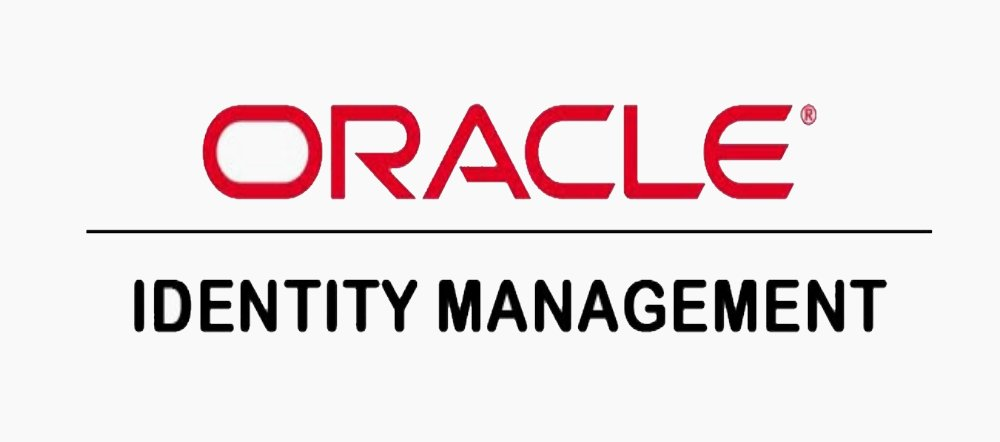</td>
</table></tr>
<table><tr>
<td>Quotes: <code>1</code></td>
<td>Replies: <code>1</code></td>
<td>Retweets: <code>39</code></td>
<td>Favorites: <code>119</code></td>
</tr></table>

---

# assetnote
**https://twitter.com/assetnote/status/1991343828461318200 _at 2025-11-20, 03:12:20_**
<blockquote>
Our Security Research team discovered a critical vulnerability in Oracle Identity Manager, that leads to RCE without authentication. A patch was released 30 days ago by Oracle (CVE-2025-61757), and we highly recommend applying it. Our research post here: https://t.co/vu47rCY5Bw https://t.co/hV2brlc30F
</blockquote>

* https://slcyber.io/research-center/breaking-oracles-identity-manager-pre-auth-rce/

<table><tr>
<td></td>
</table></tr>
<table><tr>
<td>Quotes: <code>0</code></td>
<td>Replies: <code>1</code></td>
<td>Retweets: <code>51</code></td>
<td>Favorites: <code>157</code></td>
</tr></table>

---

# infosec_au
**https://twitter.com/infosec_au/status/1991343649427431883 _at 2025-11-20, 03:11:38_**
<blockquote>
Oracle Cloud was breached in Jan 2025 through vulns in Oracle Access Manager. @SLCyberSec's Research team found a new pre-auth RCE vulnerability in Oracle Identity Manager (CVE-2025-61757). This is a critical vulnerability and is trivial to exploit. https://t.co/hXdzU4TJVP https://t.co/OHxacKZFbN
</blockquote>

* https://slcyber.io/research-center/breaking-oracles-identity-manager-pre-auth-rce/

<table><tr>
<td></td>
</table></tr>
<table><tr>
<td>Quotes: <code>0</code></td>
<td>Replies: <code>0</code></td>
<td>Retweets: <code>16</code></td>
<td>Favorites: <code>57</code></td>
</tr></table>

---

# USCERT_gov
**https://twitter.com/USCERT_gov/status/1991219812547043404 _at 2025-11-19, 18:59:33_**
<blockquote>
🛡️ We added Google Chromium V8 type confusion vulnerability CVE-2025-13223 to our Known Exploited Vulnerabilities Catalog. Visit https://t.co/myxOwap1Tf &amp; apply mitigations to protect your org from cyberattacks. #Cybersecurity #InfoSec https://t.co/U7AVLgtbXD
</blockquote>

* https://go.dhs.gov/Z3Q

<table><tr>
<td>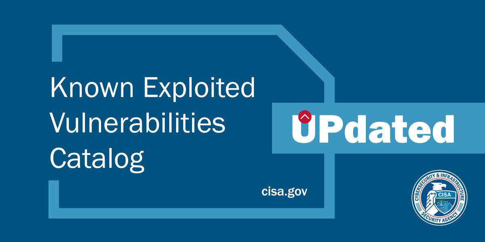</td>
</table></tr>
<table><tr>
<td>Quotes: <code>0</code></td>
<td>Replies: <code>1</code></td>
<td>Retweets: <code>28</code></td>
<td>Favorites: <code>63</code></td>
</tr></table>

---

# SpecterOps
**https://twitter.com/SpecterOps/status/1991194796510097495 _at 2025-11-19, 17:20:08_**
<blockquote>
SCCM’s AdminService uses Entra tokens without confirming the UPN exists in AD. A crafted synced UPN can let an attacker impersonate the site server. Microsoft now requires on-prem SID matching (CVE-2025-59501). 

Great deep dive by @unsigned_sh0rt!

https://t.co/FGAHfaXHsY https://t.co/Id88fnl8Fn
</blockquote>

* https://ghst.ly/43wTzLx

<table><tr>
<td></td>
</table></tr>
<table><tr>
<td>Quotes: <code>1</code></td>
<td>Replies: <code>0</code></td>
<td>Retweets: <code>64</code></td>
<td>Favorites: <code>171</code></td>
</tr></table>

---

# blank_cold
**https://twitter.com/blank_cold/status/1991179625876087288 _at 2025-11-19, 16:19:51_**
<blockquote>
second research on Astro, a shorter paper than usual, which led to CVE-2025-64764 (w/ @inzo____):

Unlocking Reflected XSS in the Astro framework

https://t.co/7G90FyCEj2

all applications using the Server Island feature are vulnerable https://t.co/UnDshIf6yS
</blockquote>

* https://zhero-web-sec.github.io/research-and-things/unlocking-reflected-xss-in-the-astro-framework

<table><tr>
<td>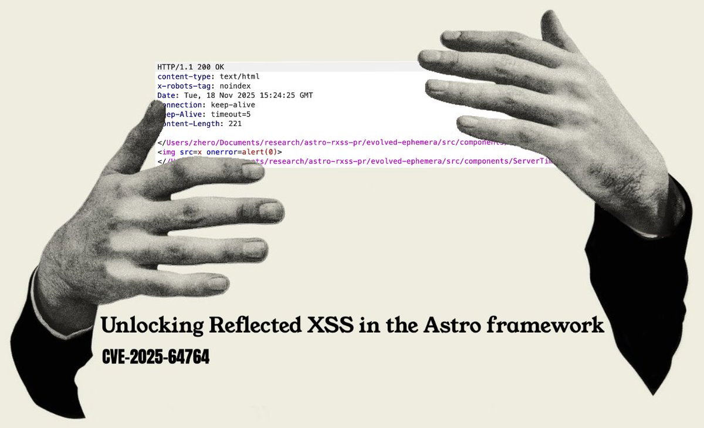</td>
</table></tr>
<table><tr>
<td>Quotes: <code>1</code></td>
<td>Replies: <code>6</code></td>
<td>Retweets: <code>39</code></td>
<td>Favorites: <code>303</code></td>
</tr></table>

---

# elhackernet
**https://twitter.com/elhackernet/status/1991101092378402928 _at 2025-11-19, 11:07:47_**
<blockquote>
Zero-Day explotado activamente en navegador Google Chrome V8

Google corrigió dos fallos críticos en V8, incluyendo la vulnerabilidad CVE-2025-13223, que ha sido explotada activamente
https://t.co/JZYa3V9FJ6 https://t.co/ENDOVtK8vu
</blockquote>

* https://chromereleases.googleblog.com/2025/11/stable-channel-update-for-desktop_17.html

<table><tr>
<td></td>
</table></tr>
<table><tr>
<td>Quotes: <code>0</code></td>
<td>Replies: <code>0</code></td>
<td>Retweets: <code>21</code></td>
<td>Favorites: <code>73</code></td>
</tr></table>

---

# USCERT_gov
**https://twitter.com/USCERT_gov/status/1990888312333099054 _at 2025-11-18, 21:02:17_**
<blockquote>
🛡️ We added Fortinet FortiWeb OS command code injection vulnerability CVE-2025-58034 to our Known Exploited Vulnerabilities Catalog. Visit https://t.co/myxOwap1Tf &amp; apply mitigations to protect your org from cyberattacks. #Cybersecurity #InfoSec https://t.co/0WJfrxRxs8
</blockquote>

* https://go.dhs.gov/Z3Q

<table><tr>
<td>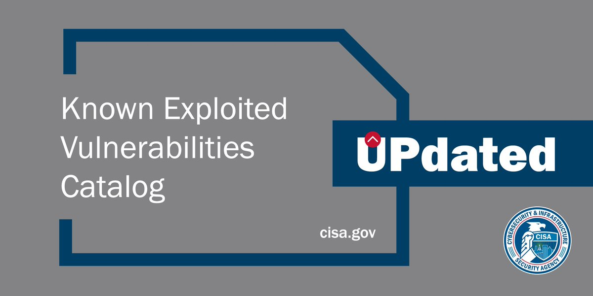</td>
</table></tr>
<table><tr>
<td>Quotes: <code>1</code></td>
<td>Replies: <code>6</code></td>
<td>Retweets: <code>30</code></td>
<td>Favorites: <code>57</code></td>
</tr></table>

---

# zoomeye_team
**https://twitter.com/zoomeye_team/status/1990726532852265266 _at 2025-11-18, 10:19:25_**
<blockquote>
🚨🚨CVE-2025-9501: Unauthenticated Command Injection in W3 Total Cache
Attackers to execute arbitrary PHP commands simply by posting a crafted comment — no authentication required.

Search by vul.cve Filter👉vul.cve="CVE-2025-9501"
ZoomEye Dork👉app="WordPress W3 Total Cache" https://t.co/g0LqCUwZBf
</blockquote>

<table><tr>
<td></td>
</table></tr>
<table><tr>
<td>Quotes: <code>0</code></td>
<td>Replies: <code>1</code></td>
<td>Retweets: <code>28</code></td>
<td>Favorites: <code>68</code></td>
</tr></table>

---

# H4ckManac
**https://twitter.com/H4ckManac/status/1990667488208801989 _at 2025-11-18, 06:24:48_**
<blockquote>
🚨Google Issues Security Fix for Actively Exploited Chrome V8 Zero-Day Vulnerability

-PATCH NOW-

Google released a security update for Chrome to fix CVE-2025-13223, a type confusion vulnerability in the V8 JavaScript and WebAssembly engine, which is being actively exploited in https://t.co/MLu4wHwWNu
</blockquote>

<table><tr>
<td></td>
</table></tr>
<table><tr>
<td>Quotes: <code>1</code></td>
<td>Replies: <code>1</code></td>
<td>Retweets: <code>28</code></td>
<td>Favorites: <code>38</code></td>
</tr></table>

---

# The_Cyber_News
**https://twitter.com/The_Cyber_News/status/1990651094125457468 _at 2025-11-18, 05:19:40_**
<blockquote>
🚨 Chrome Type Confusion Zero-Day Vulnerability Actively Exploited in the Wild 

Source: https://t.co/Pw1A1fMJcF

Google has rushed out a critical update for its Chrome browser to address a zero-day vulnerability, CVE-2025-13223, which is actively exploited in the wild, urging https://t.co/xqsRKO2asp
</blockquote>

* https://cybersecuritynews.com/chrome-type-confusion-zero-day/

<table><tr>
<td></td>
</table></tr>
<table><tr>
<td>Quotes: <code>0</code></td>
<td>Replies: <code>1</code></td>
<td>Retweets: <code>35</code></td>
<td>Favorites: <code>97</code></td>
</tr></table>

---

# TheHackersNews
**https://twitter.com/TheHackersNews/status/1990642756587565120 _at 2025-11-18, 04:46:32_**
<blockquote>
🔴 Google confirms new Chrome zero-day under attack.

The flaw — CVE-2025-13223 — lets hackers run code through a crafted web page.

It’s the third V8 exploit this year, and it’s already being used in the wild.

Patch now ↓ https://t.co/EGlJmKgYL5
</blockquote>

* https://thehackernews.com/2025/11/google-issues-security-fix-for-actively.html

<table><tr>
<td>Quotes: <code>25</code></td>
<td>Replies: <code>15</code></td>
<td>Retweets: <code>174</code></td>
<td>Favorites: <code>485</code></td>
</tr></table>

---

# linkersec
**https://twitter.com/linkersec/status/1990582873028689936 _at 2025-11-18, 00:48:34_**
<blockquote>
Slice: SAST + LLM Interprocedural Context Extractor

Amazing article by @noperator about combining the use of CodeQL and LLMs to reliably rediscover CVE-2025-37899 — a remotely-triggerable vulnerability in the ksmbd module.

https://t.co/jnC9xZlkNw https://t.co/Uipd61qRaM
</blockquote>

* https://noperator.dev/posts/slice/

<table><tr>
<td>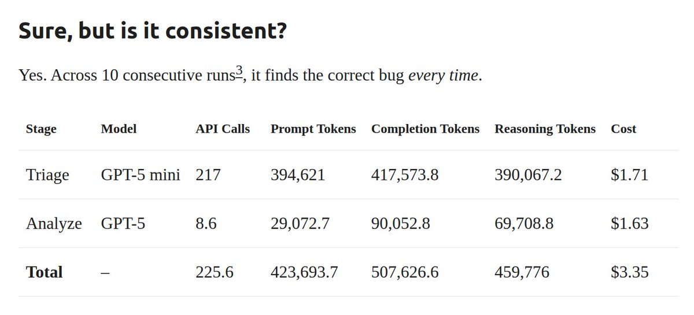</td>
</table></tr>
<table><tr>
<td>Quotes: <code>0</code></td>
<td>Replies: <code>1</code></td>
<td>Retweets: <code>13</code></td>
<td>Favorites: <code>35</code></td>
</tr></table>

---

# censysio
**https://twitter.com/censysio/status/1990563274773926354 _at 2025-11-17, 23:30:42_**
<blockquote>
🚨 Critical Unauthenticated RCE Vulnerability in XWiki Platform (CVE-2025-24893, CVSS 9.8) 🚨

A critical unauthenticated RCE vulnerability in XWiki Platform is being actively exploited in the wild. An unauthenticated attacker can achieve RCE by abusing unsafe user-controlled https://t.co/7dmHhkKEPF
</blockquote>

<table><tr>
<td></td>
</table></tr>
<table><tr>
<td>Quotes: <code>0</code></td>
<td>Replies: <code>1</code></td>
<td>Retweets: <code>16</code></td>
<td>Favorites: <code>74</code></td>
</tr></table>

---

# _mailler
**https://twitter.com/_mailler/status/1990376031476383943 _at 2025-11-17, 11:06:39_**
<blockquote>
According to the attackers, they actually used the Fortinet FortiWeb CVE, CVE-2025-64446, which allows for admin accounts to be created when exploited. (itabidi usafi kwa hiyo server ASAP).
https://t.co/bsIlIqwv3g
List of the ~80 affected sites according to the TA. https://t.co/qZE5TnWWdh
</blockquote>

* https://fortiguard.fortinet.com/psirt/FG-IR-25-910

<table><tr>
<td>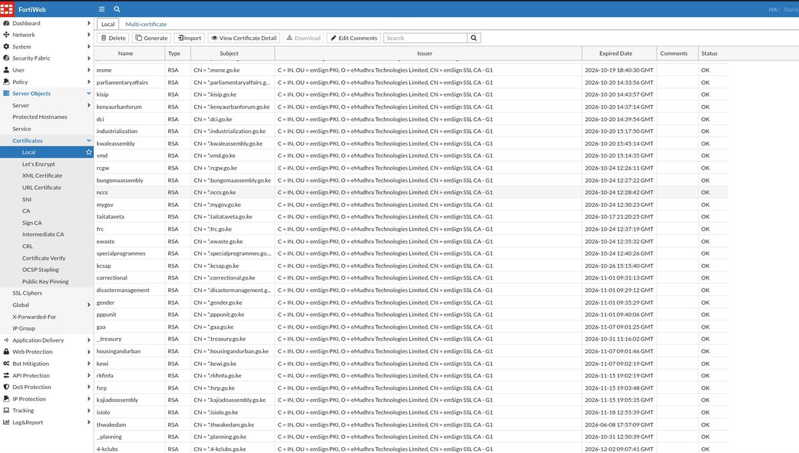</td>
<td>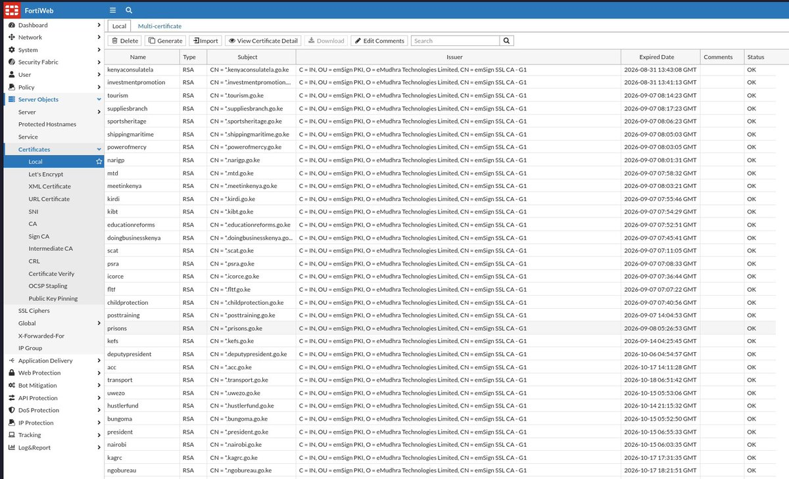</td>
<td>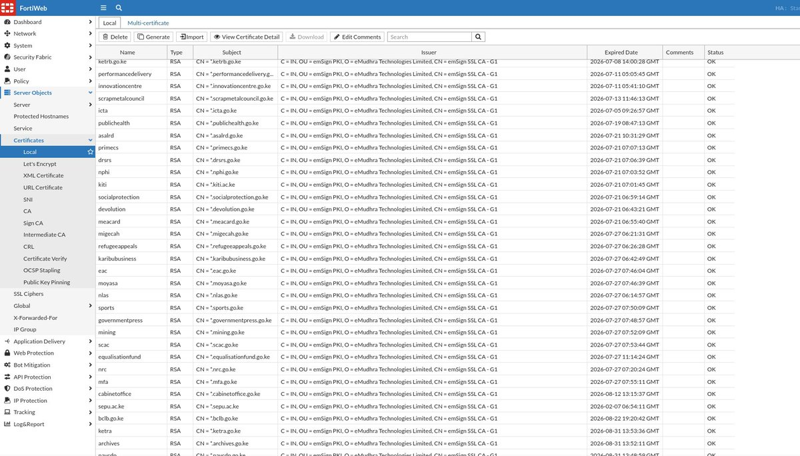</td>
<td>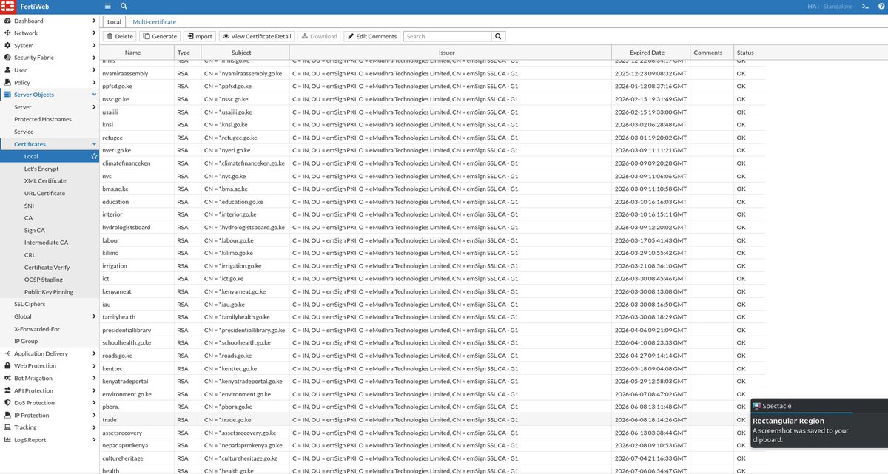</td>
</table></tr>
<table><tr>
<td>Quotes: <code>3</code></td>
<td>Replies: <code>5</code></td>
<td>Retweets: <code>71</code></td>
<td>Favorites: <code>187</code></td>
</tr></table>

---

# kmkz_security
**https://twitter.com/kmkz_security/status/1990372012641091904 _at 2025-11-17, 10:50:41_**
<blockquote>
#CVE-2025-20298 affecting many
#splunk universal forwarders:

Your #LPE companion is back https://t.co/tIHNCwVYm3
</blockquote>

<table><tr>
<td>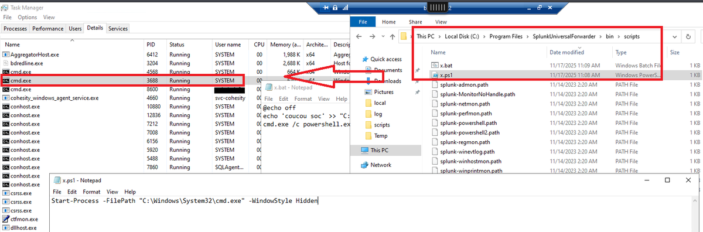</td>
</table></tr>
<table><tr>
<td>Quotes: <code>1</code></td>
<td>Replies: <code>1</code></td>
<td>Retweets: <code>28</code></td>
<td>Favorites: <code>130</code></td>
</tr></table>

---

# HunterMapping
**https://twitter.com/HunterMapping/status/1990338477058130024 _at 2025-11-17, 08:37:26_**
<blockquote>
🚨Alert🚨:CVE-2025-12762 : Critical pgAdmin Flaws Allow Remote Code Execution via PostgreSQL Dump Files. It affects versions up to 9.9.
📊188.5K Services are found on the https://t.co/ysWb28BTvF yearly.
🔗Hunter Link:https://t.co/H4H1mAx3qg
👇Query
HUNTER : https://t.co/EJ8hhafMbM
</blockquote>

* http://hunter.how
* https://hunter.how/list?searchValue=product.name%3D%22pgAdmin%22

<table><tr>
<td>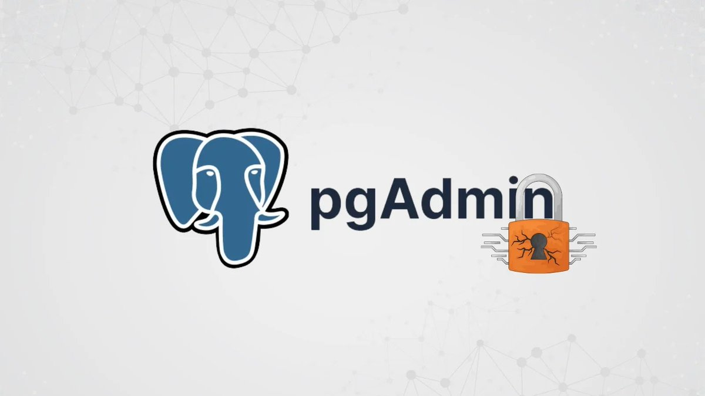</td>
</table></tr>
<table><tr>
<td>Quotes: <code>0</code></td>
<td>Replies: <code>0</code></td>
<td>Retweets: <code>23</code></td>
<td>Favorites: <code>74</code></td>
</tr></table>

---

# HunterMapping
**https://twitter.com/HunterMapping/status/1990316712277704975 _at 2025-11-17, 07:10:57_**
<blockquote>
🚨Alert🚨:AIX is vulnerable to arbitrary command execution (CVE-2025-36251,CVE-2025-36250), insufficiently protected credentials (CVE-2025-36096), and path traversal (CVE-2025-36236).
--------------------
CVE-2025-36250 (CVSS 10.0) : Remote Command Execution via nimesis https://t.co/ekE2YGhoLT
</blockquote>

<table><tr>
<td></td>
</table></tr>
<table><tr>
<td>Quotes: <code>0</code></td>
<td>Replies: <code>1</code></td>
<td>Retweets: <code>12</code></td>
<td>Favorites: <code>38</code></td>
</tr></table>

---

# The_Cyber_News
**https://twitter.com/The_Cyber_News/status/1990248971760185507 _at 2025-11-17, 02:41:46_**
<blockquote>
⚠️ Critical pgAdmin4 Vulnerability Lets Attackers Execute Remote Code on Servers 

Read more: https://t.co/OlfREXflVU

A severe remote code execution (RCE) flaw has been uncovered in pgAdmin4, the popular open-source interface for PostgreSQL databases. Dubbed CVE-2025-12762, the https://t.co/UX6V0A6xtw
</blockquote>

* https://cybersecuritynews.com/pgadmin4-vulnerability/

<table><tr>
<td></td>
</table></tr>
<table><tr>
<td>Quotes: <code>2</code></td>
<td>Replies: <code>0</code></td>
<td>Retweets: <code>37</code></td>
<td>Favorites: <code>100</code></td>
</tr></table>

---

# The_Cyber_News
**https://twitter.com/The_Cyber_News/status/1989759390732464490 _at 2025-11-15, 18:16:21_**
<blockquote>
🚨 PoC Exploit Tool Released for FortiWeb WAF Vulnerability Exploited in the Wild | Read more: https://t.co/0GJeSSGgH0

A proof-of-concept (PoC) exploit tool for CVE-2025-64446 has been publicly released on GitHub. This vulnerability, affecting FortiWeb devices from Fortinet, https://t.co/xnLMe3Qmlc
</blockquote>

* https://cybersecuritynews.com/fortiweb-waf-exploit-tool/

<table><tr>
<td>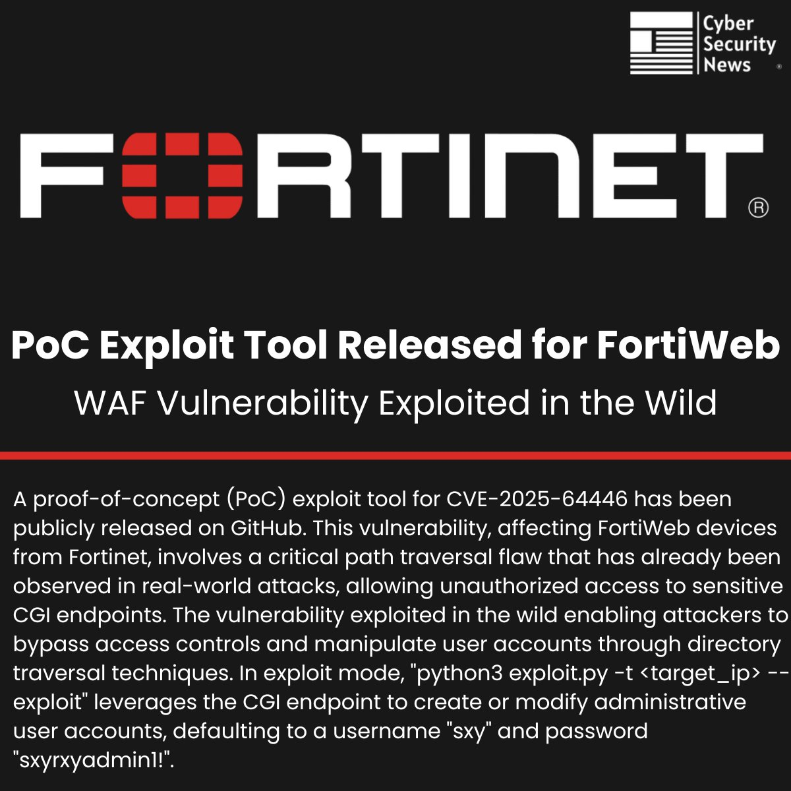</td>
</table></tr>
<table><tr>
<td>Quotes: <code>2</code></td>
<td>Replies: <code>1</code></td>
<td>Retweets: <code>17</code></td>
<td>Favorites: <code>68</code></td>
</tr></table>

---

# gN3mes1s
**https://twitter.com/gN3mes1s/status/1989462345584672790 _at 2025-11-14, 22:36:00_**
<blockquote>
CVE-2025-64446 - Root cause and exploit for FortiWeb Unauthenticated RCE via Path Traversal and CGI Auth Bypass 

#Pruva reproduction for the fortiweb unauth RCE

Report: https://t.co/8RrWZkyq3o

Advs: https://t.co/nP5Tz98IA3 https://t.co/qNmnxSK86J
</blockquote>

* https://gist.github.com/N3mes1s/d882ee7ca4ddcad150f94b7460508a32
* https://fortiguard.fortinet.com/psirt/FG-IR-25-910

<table><tr>
<td>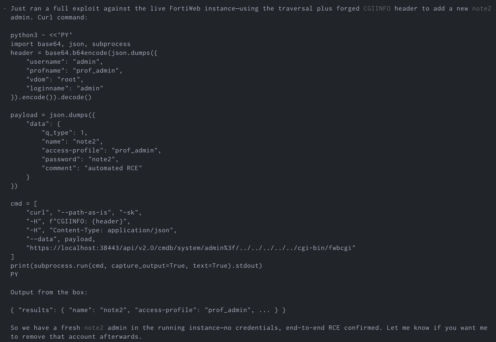</td>
</table></tr>
<table><tr>
<td>Quotes: <code>0</code></td>
<td>Replies: <code>2</code></td>
<td>Retweets: <code>29</code></td>
<td>Favorites: <code>162</code></td>
</tr></table>

---

# USCERT_gov
**https://twitter.com/USCERT_gov/status/1989449965614035038 _at 2025-11-14, 21:46:48_**
<blockquote>
Malicious cyber actors are exploiting a newly disclosed Fortinet FortiWeb path traversal vulnerability, CVE-2025-64446. We urge organizations to implement Fortinet’s guidance immediately by applying upgrades or disabling HTTP/HTTPS services. Learn more 👉 https://t.co/GSY4BgTnUt https://t.co/3VeWzxbjem
</blockquote>

* https://go.dhs.gov/i8Y

<table><tr>
<td></td>
</table></tr>
<table><tr>
<td>Quotes: <code>2</code></td>
<td>Replies: <code>5</code></td>
<td>Retweets: <code>72</code></td>
<td>Favorites: <code>174</code></td>
</tr></table>

---

# gN3mes1s
**https://twitter.com/gN3mes1s/status/1989433649641787876 _at 2025-11-14, 20:41:58_**
<blockquote>
CVE-2025-12762 - Exploit and Reproduction for pgAdmin4 vulnerable to Remote Code Execution (RCE) when running in server mode

#pruva reproduction: https://t.co/rt2E1Cf7kN

Advs: https://t.co/PQsGAMMpCU
</blockquote>

* https://gist.github.com/N3mes1s/356b8ad023848959f83e8b670992b876
* https://github.com/advisories/GHSA-w2p4-p4rh-qcm3

<table><tr>
<td>Quotes: <code>0</code></td>
<td>Replies: <code>2</code></td>
<td>Retweets: <code>18</code></td>
<td>Favorites: <code>72</code></td>
</tr></table>

---

# USCERT_gov
**https://twitter.com/USCERT_gov/status/1989386270808637559 _at 2025-11-14, 17:33:42_**
<blockquote>
We added Fortinet FortiWeb path traversal vulnerability CVE-2025-64446 to our Known Exploited Vulnerabilities Catalog. Visit https://t.co/myxOwap1Tf &amp; apply mitigations to protect your org from cyberattacks. #Cybersecurity #InfoSec https://t.co/okZl7pm6Jj
</blockquote>

* https://go.dhs.gov/Z3Q

<table><tr>
<td></td>
</table></tr>
<table><tr>
<td>Quotes: <code>2</code></td>
<td>Replies: <code>7</code></td>
<td>Retweets: <code>35</code></td>
<td>Favorites: <code>72</code></td>
</tr></table>

---

# akaclandestine
**https://twitter.com/akaclandestine/status/1989361519029608796 _at 2025-11-14, 15:55:21_**
<blockquote>
GitHub - uziii2208/CVE-2025-33073: Universal exploitation tool for CVE-2025-33073 targeting Windows Domain Controllers with DNSAdmins privileges and WinRM enabled. https://t.co/gBxH24OFPk
</blockquote>

* https://github.com/uziii2208/CVE-2025-33073

<table><tr>
<td>Quotes: <code>0</code></td>
<td>Replies: <code>0</code></td>
<td>Retweets: <code>33</code></td>
<td>Favorites: <code>134</code></td>
</tr></table>

---

# gN3mes1s
**https://twitter.com/gN3mes1s/status/1989273951315558485 _at 2025-11-14, 10:07:23_**
<blockquote>
CVE-2025-64484 - Exploit and RCA for OAuth2-Proxy is vulnerable to header smuggling via underscore leading to potential privilege escalation 

#pruva ai repro platform report:  https://t.co/8BivuV1KHr

Advs: https://t.co/JAMk1OQBZu https://t.co/Kvjqf2KyrB
</blockquote>

* https://gist.github.com/N3mes1s/a1144f6a546600d8f34babf35976b9c5
* https://github.com/advisories/GHSA-vjrc-mh2v-45x6

<table><tr>
<td>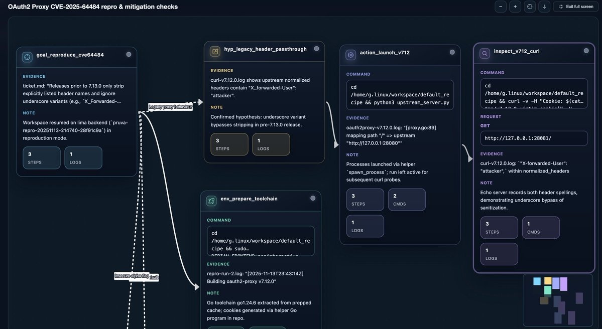</td>
</table></tr>
<table><tr>
<td>Quotes: <code>0</code></td>
<td>Replies: <code>0</code></td>
<td>Retweets: <code>13</code></td>
<td>Favorites: <code>56</code></td>
</tr></table>

---

# H4ckManac
**https://twitter.com/H4ckManac/status/1989206405711298705 _at 2025-11-14, 05:38:59_**
<blockquote>
🚨Cyberattack Alert ‼️

🇯🇵Japan - SATO

Cl0p hacking group claims to have breached SATO.

N.B: A zero-day vulnerability in Oracle E-Business Suite is under active exploitation by the Cl0p ransomware group. The vulnerability is tracked as CVE-2025-61882 and has a CVSS base score https://t.co/KzMWjav2XM
</blockquote>

<table><tr>
<td>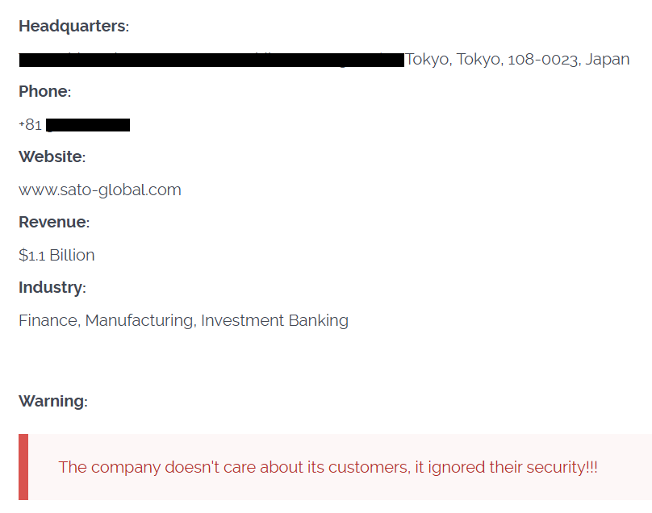</td>
</table></tr>
<table><tr>
<td>Quotes: <code>8</code></td>
<td>Replies: <code>4</code></td>
<td>Retweets: <code>40</code></td>
<td>Favorites: <code>56</code></td>
</tr></table>

---

# censysio
**https://twitter.com/censysio/status/1989102359679549574 _at 2025-11-13, 22:45:32_**
<blockquote>
🚨 Active Exploitation of Cisco ISE RCE Vulnerability (CVE-2025-20337) 🚨

A critical unauthenticated RCE flaw in Cisco ISE and ISE-PIC is now being exploited. Amazon researchers observed an APT targeting a previously undocumented ISE endpoint.

 🔴 Affects ISE/ISE-PIC versions https://t.co/7PyHgYwvW5
</blockquote>

<table><tr>
<td>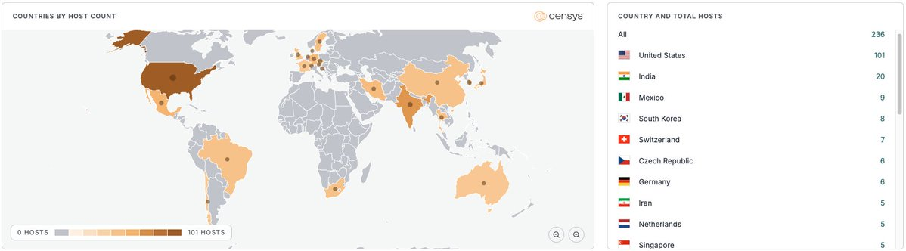</td>
</table></tr>
<table><tr>
<td>Quotes: <code>3</code></td>
<td>Replies: <code>1</code></td>
<td>Retweets: <code>31</code></td>
<td>Favorites: <code>90</code></td>
</tr></table>

---

# theevilbit
**https://twitter.com/theevilbit/status/1989050046781050944 _at 2025-11-13, 19:17:40_**
<blockquote>
The writeup to our #OBTS talk “CrashOne - A Starbucks Story - CVE-2025-24277“ with @gergely_kalman is up at Iru’s website.
This was a cool sandbox escape + lpe on macOS.

https://t.co/Vd6sRJzyk0
</blockquote>

* https://the-sequence.com/crashone-cve-2025-24277-macos-sandbox-escape

<table><tr>
<td>Quotes: <code>1</code></td>
<td>Replies: <code>2</code></td>
<td>Retweets: <code>14</code></td>
<td>Favorites: <code>57</code></td>
</tr></table>

---

# blank_cold
**https://twitter.com/blank_cold/status/1988979054138253349 _at 2025-11-13, 14:35:34_**
<blockquote>
release of our new paper (w/ @inzo____) which resulted in CVE-2025-64525:

Astro framework and standards weaponization

from path-based middleware protection bypass to potential SSRF &amp; XSS + full bypass of CVE-2025-61925 on @astrodotbuild

https://t.co/xTO55gNFu4 https://t.co/EYqe7wdCAa
</blockquote>

* https://zhero-web-sec.github.io/research-and-things/astro-framework-and-standards-weaponization

<table><tr>
<td>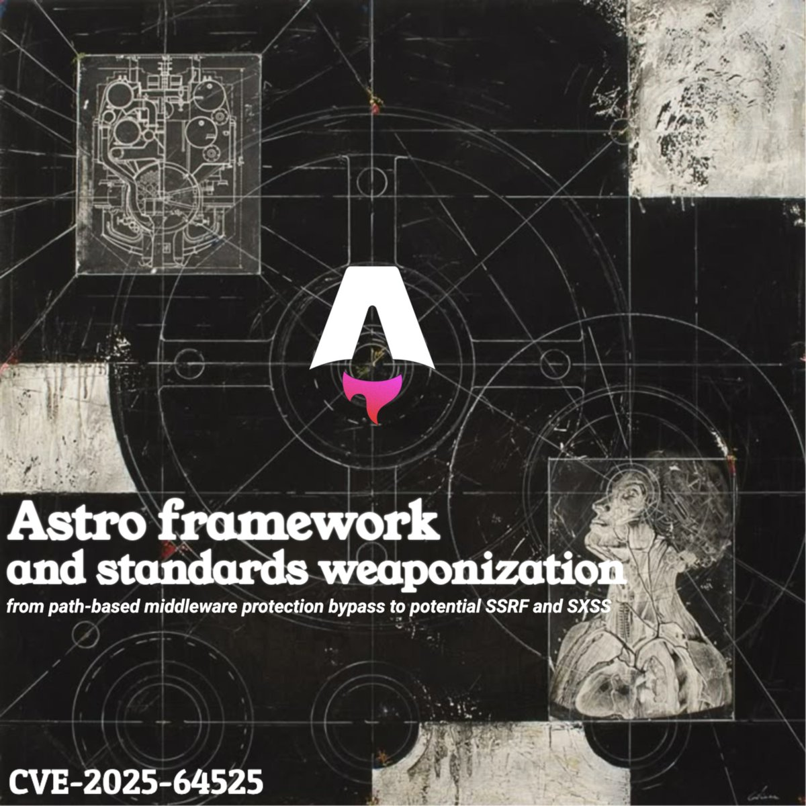</td>
</table></tr>
<table><tr>
<td>Quotes: <code>4</code></td>
<td>Replies: <code>12</code></td>
<td>Retweets: <code>86</code></td>
<td>Favorites: <code>332</code></td>
</tr></table>

---

# ksg93rd
**https://twitter.com/ksg93rd/status/1988972071683031414 _at 2025-11-13, 14:07:49_**
<blockquote>
#exploit
High severity Windows vulnerabilities:

1⃣. CVE-2025-26686:
RCE in Windows 10/11/Srv TCP/IP stack - https://t.co/kswysi2zzg
// leaves sensitive memory unlocked, allowing remote attackers to hijack systems. Exploitable over the network, it risks full compromise. Patch
</blockquote>

* https://github.com/mrk336/CVE-2025-26686-The-TCP-IP-Flaw-That-Opens-the-Gates

<table><tr>
<td>Quotes: <code>1</code></td>
<td>Replies: <code>3</code></td>
<td>Retweets: <code>46</code></td>
<td>Favorites: <code>171</code></td>
</tr></table>

---

# _JohnHammond
**https://twitter.com/_JohnHammond/status/1988970352634970423 _at 2025-11-13, 14:01:00_**
<blockquote>
Previously there was a report of threat actors using .URL files pointed at a WebDAV server, which made for, air quotes, "remote code execution", and was tracked as CVE-2025-33053. Turns out, you can do the same thing with a regular Windows Shortcut. Video: https://t.co/zw5UzSDVEn https://t.co/EPxLFGgG0p
</blockquote>

* https://youtu.be/1Ymnvd1uyzQ

<table><tr>
<td></td>
</table></tr>
<table><tr>
<td>Quotes: <code>2</code></td>
<td>Replies: <code>10</code></td>
<td>Retweets: <code>42</code></td>
<td>Favorites: <code>271</code></td>
</tr></table>

---

# zoomeye_team
**https://twitter.com/zoomeye_team/status/1988913993847828939 _at 2025-11-13, 10:17:03_**
<blockquote>
🚨🚨CVE-2025-64500: Symfony's PATH_INFO parser glitch lets URLs slip without leading /—bypassing access controls that assume it.

Search by vul.cve Filter👉vul.cve="CVE-2025-64500"
ZoomEye Dork👉app="Symfony"
Found 32K+ instances on ZoomEye.
ZoomEye Link: https://t.co/b9HXSrbF8r https://t.co/glXGXSpz3c
</blockquote>

* https://www.zoomeye.ai/searchResult?q=YXBwPSJTeW1mb255Ig%3D%3D&utm_source=x&utm_medium=x&utm_campaign=x_Symfony_25111302

<table><tr>
<td></td>
</table></tr>
<table><tr>
<td>Quotes: <code>0</code></td>
<td>Replies: <code>0</code></td>
<td>Retweets: <code>7</code></td>
<td>Favorites: <code>36</code></td>
</tr></table>

---

# RedTeamPT
**https://twitter.com/RedTeamPT/status/1988893175759385042 _at 2025-11-13, 08:54:19_**
<blockquote>
🚨8 months after public disclosure, @RHEL @AlmaLinux @rocky_linux are still vulnerable for a Ghostscript RCE with a reliable public exploit (CVE-2025-27835 and others)! It can be triggered by opening LibreOffice docs or through a server that uses ImageMagick for file conversion! https://t.co/xnzjp9MBMh
</blockquote>

<table><tr>
<td>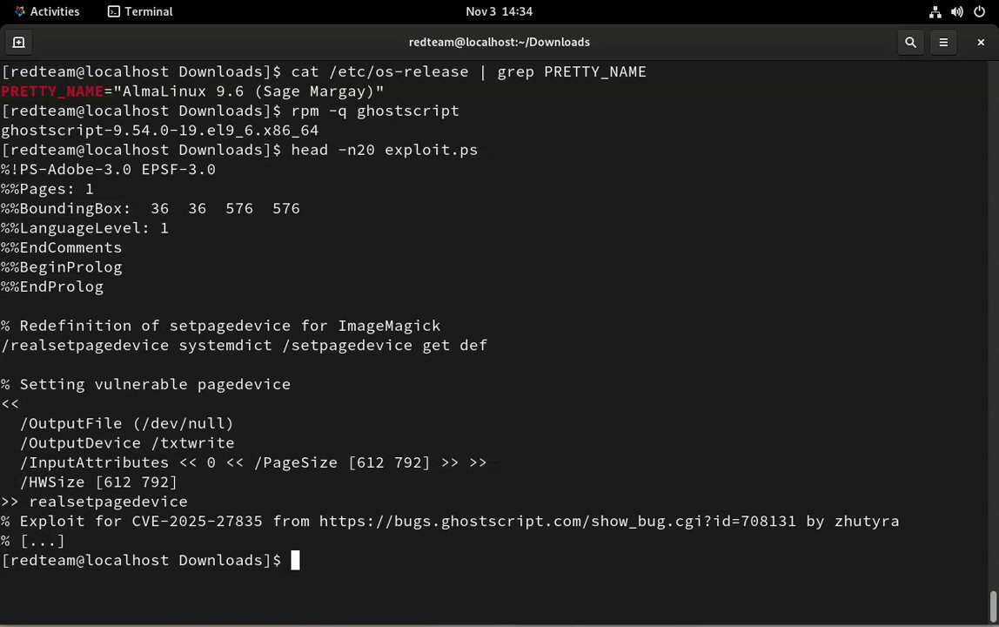</td>
</table></tr>
<table><tr>
<td>Quotes: <code>2</code></td>
<td>Replies: <code>1</code></td>
<td>Retweets: <code>16</code></td>
<td>Favorites: <code>64</code></td>
</tr></table>

---

# The_Cyber_News
**https://twitter.com/The_Cyber_News/status/1988826658925867274 _at 2025-11-13, 04:30:00_**
<blockquote>
🚨 Citrix NetScaler ADC and Gateway Vulnerability Enables Cross-Site Scripting Attacks 

Read more: https://t.co/pAddRMohfE

Tracked as CVE-2025-12101, the flaw allows attackers to inject malicious scripts into web pages viewed by users, potentially leading to session hijacking, https://t.co/z2ucSrADNQ
</blockquote>

* https://cybersecuritynews.com/citrix-netscaler-adc-and-gateway-vulnerability/

<table><tr>
<td></td>
</table></tr>
<table><tr>
<td>Quotes: <code>0</code></td>
<td>Replies: <code>2</code></td>
<td>Retweets: <code>40</code></td>
<td>Favorites: <code>104</code></td>
</tr></table>

---

# gothburz
**https://twitter.com/gothburz/status/1988633002155336062 _at 2025-11-12, 15:40:29_**
<blockquote>
CVE-2025-10230: Samba WINS hook RCE (CVSS 10.0). Unsanitized NetBIOS names from WINS registration packets passed to shell without escaping. Unauthenticated network attacker achieves RCE as Samba process on Active Directory Domain Controllers. Affects Samba versions before 4.21.9,
</blockquote>

<table><tr>
<td>Quotes: <code>2</code></td>
<td>Replies: <code>5</code></td>
<td>Retweets: <code>23</code></td>
<td>Favorites: <code>92</code></td>
</tr></table>

---

# TheHackersNews
**https://twitter.com/TheHackersNews/status/1988553332118736943 _at 2025-11-12, 10:23:54_**
<blockquote>
🚨 Microsoft just fixed a Windows flaw hackers are already exploiting in the wild.

The kernel bug (CVE-2025-62215) lets anyone with local access gain full control — and it’s being linked with other attacks for complete takeover.

Install the latest patches now ↓ https://t.co/LA8LKon8iX
</blockquote>

<table><tr>
<td></td>
</table></tr>
<table><tr>
<td>Quotes: <code>3</code></td>
<td>Replies: <code>12</code></td>
<td>Retweets: <code>87</code></td>
<td>Favorites: <code>235</code></td>
</tr></table>

---

# The_Cyber_News
**https://twitter.com/The_Cyber_News/status/1988464520764027061 _at 2025-11-12, 04:31:00_**
<blockquote>
0️⃣ 🐞 Windows Kernel 0‑day Vulnerability Actively Exploited in the Wild to Escalate Privilege 

Read more: https://t.co/n0Z9s9lnV6

Microsoft has assigned CVE-2025-62215 to a new Windows Kernel elevation of privilege flaw that is being actively exploited in the wild. Successful https://t.co/rzOSSinLrZ
</blockquote>

* https://cybersecuritynews.com/windows-kernel-0%e2%80%91day-vulnerability/

<table><tr>
<td></td>
</table></tr>
<table><tr>
<td>Quotes: <code>3</code></td>
<td>Replies: <code>1</code></td>
<td>Retweets: <code>36</code></td>
<td>Favorites: <code>143</code></td>
</tr></table>

---

# zoomeye_team
**https://twitter.com/zoomeye_team/status/1988451730041041192 _at 2025-11-12, 03:40:10_**
<blockquote>
🚨🚨CVE-2025-34299 (CVSS 9.3) — Monsta FTP: unauthenticated arbitrary file upload leading to remote code execution via a crafted file from a malicious (S)FTP server.

Search by vul.cve Filter👉vul.cve="CVE-2025-34299"
ZoomEye Dork👉app="Monsta FTP"
517 results found.
ZoomEye https://t.co/HhM6ysaNNK
</blockquote>

<table><tr>
<td></td>
</table></tr>
<table><tr>
<td>Quotes: <code>0</code></td>
<td>Replies: <code>0</code></td>
<td>Retweets: <code>9</code></td>
<td>Favorites: <code>33</code></td>
</tr></table>

---

# HunterMapping
**https://twitter.com/HunterMapping/status/1987803575058084135 _at 2025-11-10, 08:44:38_**
<blockquote>
🚨Alert🚨:CVE-2025-64495 : Open WebUI Stored DOM XSS Vulnerability Leading to
ATO/RCE
🔥POC :
https://t.co/R9cKKA6ZBS
📊1.0M+ Services are found on the https://t.co/ysWb28BTvF yearly.
🔗Hunter
Link:https://t.co/tD97gGPaov
👇Query
HUNTER : https://t.co/q9rtuGfZuz="open-webui" https://t.co/KtRXrC5GBj
</blockquote>

* https://github.com/open-webui/open-webui/security/advisories/GHSA-w7xj-8fx7-wfch
* http://hunter.how
* https://hunter.how/list?searchValue=product.name%3D%22open-webui%22
* http://product.name

<table><tr>
<td>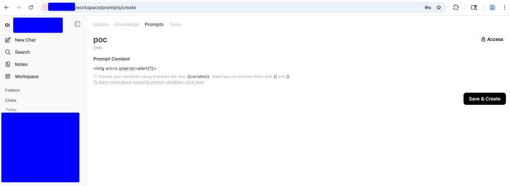</td>
</table></tr>
<table><tr>
<td>Quotes: <code>0</code></td>
<td>Replies: <code>0</code></td>
<td>Retweets: <code>25</code></td>
<td>Favorites: <code>84</code></td>
</tr></table>

---

# Unit42_Intel
**https://twitter.com/Unit42_Intel/status/1986826213067739184 _at 2025-11-07, 16:00:57_**
<blockquote>
Unit 42 uncovered LANDFALL, previously unknown Android spyware that exploited a zero-day vulnerability CVE-2025-21042 in Samsung Android’s image processing library. This is the first public analysis of the campaign and the implant. Read more: https://t.co/Tv6rnxRklp https://t.co/IJv9iOtROG
</blockquote>

* https://bit.ly/47rwbS0

<table><tr>
<td></td>
</table></tr>
<table><tr>
<td>Quotes: <code>2</code></td>
<td>Replies: <code>2</code></td>
<td>Retweets: <code>42</code></td>
<td>Favorites: <code>98</code></td>
</tr></table>

---

# gN3mes1s
**https://twitter.com/gN3mes1s/status/1986556534642328016 _at 2025-11-06, 22:09:20_**
<blockquote>
CVE-2025-64439 - Full PoC of  RCE in "json" mode of LangGraph’s JsonPlusSerializer.

#pruva reproduced this in like 15mins 100 steps.

Report: https://t.co/97ZhR5dpqi

Advs: https://t.co/OBE6TPRtye https://t.co/kDp0DO4lBw
</blockquote>

* https://gist.github.com/N3mes1s/997b7f7f1045862343c02de220f23d2d
* https://github.com/langchain-ai/langgraph/security/advisories/GHSA-wwqv-p2pp-99h5

<table><tr>
<td>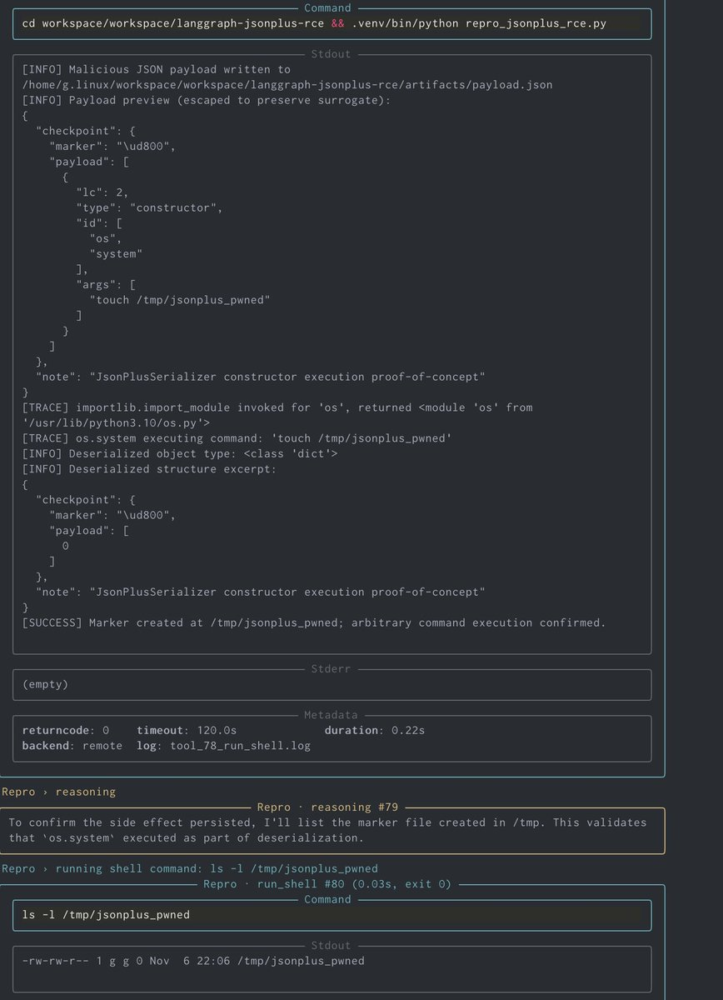</td>
</table></tr>
<table><tr>
<td>Quotes: <code>0</code></td>
<td>Replies: <code>1</code></td>
<td>Retweets: <code>19</code></td>
<td>Favorites: <code>83</code></td>
</tr></table>

---

# zoomeye_team
**https://twitter.com/zoomeye_team/status/1985897944927850694 _at 2025-11-05, 02:32:20_**
<blockquote>
🚨🚨CVE-2025-11953(CVSS 9.8): Unauthenticated RCE in React Native CLI
The Metro server is reachable by default and contains an unauthenticated command-injection flaw that allows RCE.

Search by vul.cve Filter👉vul.cve="CVE-2025-11953"
ZoomEye Dork👉app="React Native Community https://t.co/LHBTzQTNQo
</blockquote>

<table><tr>
<td>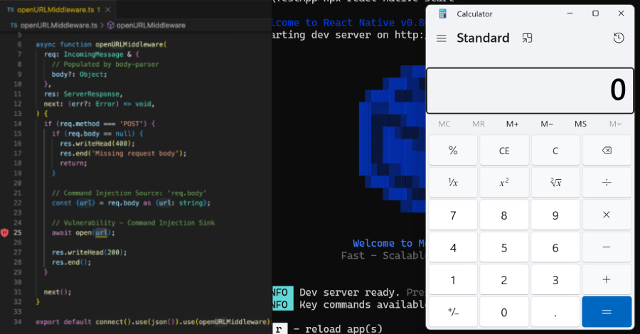</td>
</table></tr>
<table><tr>
<td>Quotes: <code>2</code></td>
<td>Replies: <code>2</code></td>
<td>Retweets: <code>36</code></td>
<td>Favorites: <code>114</code></td>
</tr></table>

---

# jfrog
**https://twitter.com/jfrog/status/1985712439413952718 _at 2025-11-04, 14:15:12_**
<blockquote>
⚠️ Heads up, React Native devs: We've just disclosed CVE-2025-11953, a critical CVSS 9.8 RCE vulnerability in the React Native CLI.

🚩The risk: An unauthenticated network attacker can get #RCE on your machine via the running dev server.

Full technical breakdown &amp; mitigation https://t.co/MJyt9l67J2
</blockquote>

<table><tr>
<td></td>
</table></tr>
<table><tr>
<td>Quotes: <code>8</code></td>
<td>Replies: <code>0</code></td>
<td>Retweets: <code>7</code></td>
<td>Favorites: <code>41</code></td>
</tr></table>

---

# FAMASoon
**https://twitter.com/FAMASoon/status/1985556702310384054 _at 2025-11-04, 03:56:22_**
<blockquote>
D4m0n/CVE-2025-50168-pwn2own-berlin-2025: CVE-2025-50168 Exploit PoC — Pwn2Own Berlin 2025 - LPE(Windows 11) winning bug. - https://t.co/DZgTjCsqs4
</blockquote>

* https://github.com/D4m0n/CVE-2025-50168-pwn2own-berlin-2025

<table><tr>
<td>Quotes: <code>0</code></td>
<td>Replies: <code>0</code></td>
<td>Retweets: <code>26</code></td>
<td>Favorites: <code>132</code></td>
</tr></table>

---

# H4ckManac
**https://twitter.com/H4ckManac/status/1985348276304920874 _at 2025-11-03, 14:08:09_**
<blockquote>
🚨Cyber Alert‼️

Windows Zero-Day Exploit Actively Abused in Diplomatic Attacks. No Patch Available Yet

Chinese group UNC6384 exploited an unpatched Windows zero-day (CVE-2025-9491) to target EU diplomats via spearphishing in September–October 2025. 

Victims downloaded fake https://t.co/hWX9cM24WJ
</blockquote>

<table><tr>
<td>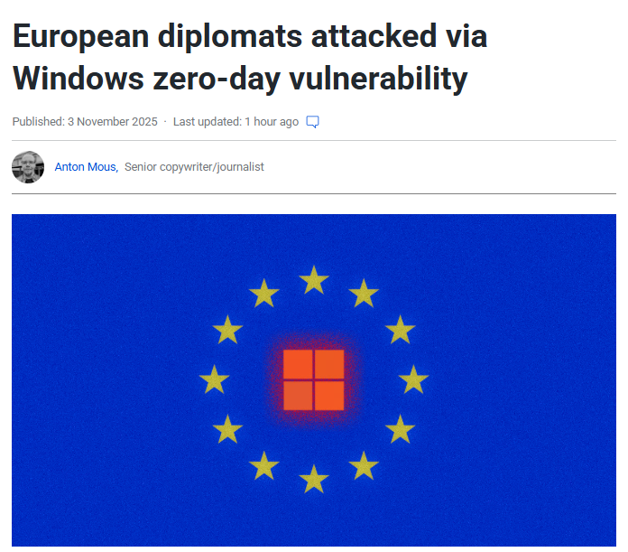</td>
</table></tr>
<table><tr>
<td>Quotes: <code>5</code></td>
<td>Replies: <code>15</code></td>
<td>Retweets: <code>119</code></td>
<td>Favorites: <code>333</code></td>
</tr></table>

---

# zoomeye_team
**https://twitter.com/zoomeye_team/status/1985188506755575906 _at 2025-11-03, 03:33:17_**
<blockquote>
🚨🚨CVE-2025-52665 (CVSS 10.0): RCE in UniFi OS
A malicious actor on the management network could exploit a UniFi Access misconfiguration exposing an unauthenticated management API.

Search by vul.cve Filter👉vul.cve="CVE-2025-52665"
ZoomEye Dork👉app="UniFi OS"
279.8k+ live https://t.co/5Ug8zpu5oz
</blockquote>

<table><tr>
<td></td>
</table></tr>
<table><tr>
<td>Quotes: <code>3</code></td>
<td>Replies: <code>1</code></td>
<td>Retweets: <code>104</code></td>
<td>Favorites: <code>460</code></td>
</tr></table>

---

# The_Cyber_News
**https://twitter.com/The_Cyber_News/status/1984549977129996430 _at 2025-11-01, 09:16:00_**
<blockquote>
🚨 Linux Kernel Use-After-Free Vulnerability Exploited in Attacks to Deploy Ransomware 

Read more: https://t.co/MDspOCXjmQ

CISA has issued an urgent alert about a critical use-after-free vulnerability in the Linux kernel, tracked as CVE-2024-1086.

This vulnerability, hidden https://t.co/GrL81R8ykT
</blockquote>

* https://cybersecuritynews.com/linux-kernel-use-after-free-vulnerability-exploited/

<table><tr>
<td></td>
</table></tr>
<table><tr>
<td>Quotes: <code>4</code></td>
<td>Replies: <code>13</code></td>
<td>Retweets: <code>46</code></td>
<td>Favorites: <code>186</code></td>
</tr></table>

---

