# The_Cyber_News
**https://twitter.com/The_Cyber_News/status/2001001379318608263 _at 2025-12-16, 18:48:00_**
<blockquote>
🛡️ Windows Admin Center Vulnerability (CVE-2025-64669) Let Attackers Escalate Privileges 

Source: https://t.co/Or3UhwZLkq

A new local privilege escalation vulnerability in Microsoft’s Windows Admin Center (WAC), affecting versions up to 2.4.2.1 and environments running WAC 2411 https://t.co/rvgP4yCpEA
</blockquote>

* https://cybersecuritynews.com/windows-admin-center-vulnerability/

<table><tr>
<td></td>
</table></tr>
<table><tr>
<td>Quotes: <code>5</code></td>
<td>Replies: <code>4</code></td>
<td>Retweets: <code>66</code></td>
<td>Favorites: <code>161</code></td>
</tr></table>

---

# ksg93rd
**https://twitter.com/ksg93rd/status/2000982946937794682 _at 2025-12-16, 17:34:45_**
<blockquote>
#exploit
#Kernel_Security
1⃣  Extending Kernel Race Windows Using '/dev/shm'
https://t.co/77Jw3dFPAx
// Ubuntu 25.04 kernel 6.14.11
2⃣  Analysing a 1-day Vulnerability in the Linux Kernel's TLS Subsystem
https://t.co/ZZz8kzQE0N
// CVE-2025-39946
</blockquote>

* https://faith2dxy.xyz/2025-11-28/extending_race_window_fallocate/#poc-and-tldr
* https://faith2dxy.xyz/2025-10-02/kCTF-TLS-nday-analysis

<table><tr>
<td>Quotes: <code>0</code></td>
<td>Replies: <code>0</code></td>
<td>Retweets: <code>7</code></td>
<td>Favorites: <code>31</code></td>
</tr></table>

---

# zoomeye_team
**https://twitter.com/zoomeye_team/status/2000768450202132578 _at 2025-12-16, 03:22:25_**
<blockquote>
🚨🚨 Three Critical Vulnerabilities In FreePBX
CVE-2025-61675: Authenticated SQL Injection - Affects endpoint module
CVE-2025-61678: Authenticated Arbitrary File Upload - Affects endpoint module
CVE-2025-66039: Authentication Bypass - Affects framework module

ZoomEye Dork👉 https://t.co/31mgogv5II
</blockquote>

<table><tr>
<td></td>
</table></tr>
<table><tr>
<td>Quotes: <code>0</code></td>
<td>Replies: <code>1</code></td>
<td>Retweets: <code>11</code></td>
<td>Favorites: <code>32</code></td>
</tr></table>

---

# HunterMapping
**https://twitter.com/HunterMapping/status/2000753097719894170 _at 2025-12-16, 02:21:25_**
<blockquote>
🚨Alert🚨:CVE-2025-13780 : pgAdmin are Affected by A Remote Code Execution (RCE) Vulnerability. It affects versions up to 9.10.
🔥PoC :https://t.co/G6VnT4AarK
📊189.9K Services are found on the https://t.co/ysWb28Crld yearly.
🔗Hunter Link:https://t.co/H4H1mAxBfO
👇Query
HUNTER : https://t.co/Utiduq7ukG
</blockquote>

* https://github.com/zeropwn/pgadmin4-9.10-CVE-2025-13780
* http://hunter.how
* https://hunter.how/list?searchValue=product.name%3D%22pgAdmin%22

<table><tr>
<td></td>
</table></tr>
<table><tr>
<td>Quotes: <code>1</code></td>
<td>Replies: <code>2</code></td>
<td>Retweets: <code>32</code></td>
<td>Favorites: <code>152</code></td>
</tr></table>

---

# MsftSecIntel
**https://twitter.com/MsftSecIntel/status/2000652974595383475 _at 2025-12-15, 19:43:34_**
<blockquote>
Most exploitation activity related to the CVE-2025-55182 vulnerability affecting React Server Components, Next.js, and related frameworks originated from red teams assessments, but observed exploitation attempts by threat actors deliver various payloads. https://t.co/1bdRDguX1b
</blockquote>

* https://msft.it/6011tmKSF

<table><tr>
<td>Quotes: <code>5</code></td>
<td>Replies: <code>2</code></td>
<td>Retweets: <code>47</code></td>
<td>Favorites: <code>121</code></td>
</tr></table>

---

# USCERT_gov
**https://twitter.com/USCERT_gov/status/2000632809472327988 _at 2025-12-15, 18:23:26_**
<blockquote>
🛡️ We added Gladinet &amp; Apple vulnerabilities CVE-2025-14611 &amp; CVE-2025-43529 to our Known Exploited Vulnerabilities Catalog. Visit https://t.co/myxOwap1Tf &amp; apply mitigations to protect your org from cyberattacks. #Cybersecurity #InfoSec https://t.co/BXihRl42AI
</blockquote>

* https://go.dhs.gov/Z3Q

<table><tr>
<td></td>
</table></tr>
<table><tr>
<td>Quotes: <code>0</code></td>
<td>Replies: <code>2</code></td>
<td>Retweets: <code>22</code></td>
<td>Favorites: <code>47</code></td>
</tr></table>

---

# zoomeye_team
**https://twitter.com/zoomeye_team/status/2000506697434239428 _at 2025-12-15, 10:02:18_**
<blockquote>
🚨🚨CVE-2025-66430 (CVSS 9.1): Root Privilege Escalation in Plesk 18.0
A flaw in Plesk's Password-Protected Directories lets any authenticated user inject arbitrary data into Apache config — escalating to full root command execution on the server.

Search by vul.cve https://t.co/tESv2ycLwJ
</blockquote>

<table><tr>
<td>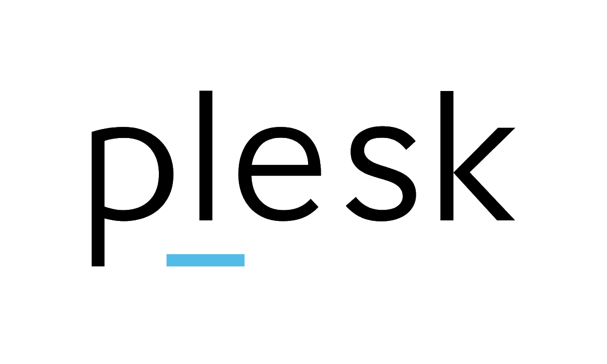</td>
</table></tr>
<table><tr>
<td>Quotes: <code>0</code></td>
<td>Replies: <code>0</code></td>
<td>Retweets: <code>12</code></td>
<td>Favorites: <code>63</code></td>
</tr></table>

---

# zoomeye_team
**https://twitter.com/zoomeye_team/status/2000393159231385886 _at 2025-12-15, 02:31:09_**
<blockquote>
🚨🚨 CVE-2025-13780 (CVSS: 9.1): pgAdmin4 Meta-Command Filter Command Execution
pgAdmin 4 &lt; 9.11 fails to detect meta-commands when a SQL file starts with UTF-8 BOM, leading to remote command execution during restore.
🔥 PoC: https://t.co/XRlUUB3arH

Search by vul.cve https://t.co/qBiX4tGQD4
</blockquote>

* https://github.com/zeropwn/pgadmin4-9.10-CVE-2025-13780

<table><tr>
<td></td>
</table></tr>
<table><tr>
<td>Quotes: <code>3</code></td>
<td>Replies: <code>2</code></td>
<td>Retweets: <code>50</code></td>
<td>Favorites: <code>182</code></td>
</tr></table>

---

# blackorbird
**https://twitter.com/blackorbird/status/2000229752767156644 _at 2025-12-14, 15:41:50_**
<blockquote>
This issue may have been exploited in an extremely sophisticated attack against specific targeted individuals on versions of iOS before iOS 26.

CVE-2025-43529 is a WebKit use-after-free remote code execution flaw that can be exploited by processing maliciously crafted web https://t.co/t8Q30PW6cy
</blockquote>

<table><tr>
<td>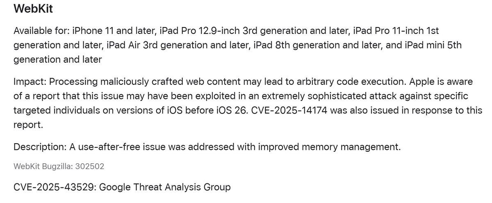</td>
<td>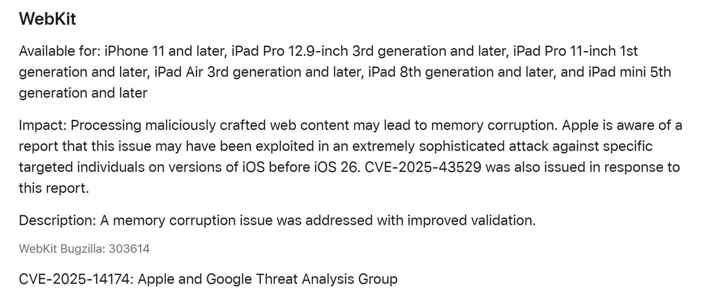</td>
</table></tr>
<table><tr>
<td>Quotes: <code>2</code></td>
<td>Replies: <code>1</code></td>
<td>Retweets: <code>17</code></td>
<td>Favorites: <code>113</code></td>
</tr></table>

---

# TheHackersNews
**https://twitter.com/TheHackersNews/status/1999716360365220055 _at 2025-12-13, 05:41:47_**
<blockquote>
🚨 Update: Chrome’s active zero-day is now CVE-2025-14174 (8.8), a remote out-of-bounds memory bug in the ANGLE graphics engine.

Already used in real attacks. Update now.

🔗 Read: https://t.co/Y5QjvXkyL4
</blockquote>

* https://thehackernews.com/2025/12/chrome-targeted-by-active-in-wild.html

<table><tr>
<td>Quotes: <code>3</code></td>
<td>Replies: <code>4</code></td>
<td>Retweets: <code>46</code></td>
<td>Favorites: <code>139</code></td>
</tr></table>

---

# censysio
**https://twitter.com/censysio/status/1999606010231554148 _at 2025-12-12, 22:23:18_**
<blockquote>
🚨 CVE-2025-10573 | Ivanti Endpoint Manager
Critical stored XSS (CVSS 9.6) → unauth JS in admin sessions.

🔧 Fixed in Ivanti EPM 2024 SU4 SR1 (Dec 9)
📊 Censys sees 1,898 exposed EPM instances, 80 vulnerable
➡️ Upgrade immediately.

🔗https://t.co/4EyNonmMaM

#CVE202510573 https://t.co/ZH0rJZBXFR
</blockquote>

* https://hubs.ly/Q03Y3Ym_0

<table><tr>
<td>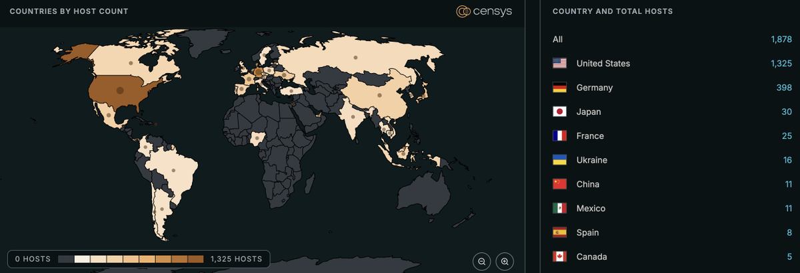</td>
</table></tr>
<table><tr>
<td>Quotes: <code>0</code></td>
<td>Replies: <code>6</code></td>
<td>Retweets: <code>24</code></td>
<td>Favorites: <code>83</code></td>
</tr></table>

---

# USCERT_gov
**https://twitter.com/USCERT_gov/status/1999584169198751846 _at 2025-12-12, 20:56:31_**
<blockquote>
🛡️ We added Google Chrome out-of-bounds memory access vulnerability CVE-2025-14174 to our Known Exploited Vulnerabilities Catalog. Visit https://t.co/myxOwap1Tf &amp; apply mitigations to protect your org from cyberattacks. #Cybersecurity #InfoSec https://t.co/9zaKqUmVJK
</blockquote>

* https://go.dhs.gov/Z3Q

<table><tr>
<td></td>
</table></tr>
<table><tr>
<td>Quotes: <code>0</code></td>
<td>Replies: <code>1</code></td>
<td>Retweets: <code>20</code></td>
<td>Favorites: <code>45</code></td>
</tr></table>

---

# USCERT_gov
**https://twitter.com/USCERT_gov/status/1999551479376396365 _at 2025-12-12, 18:46:37_**
<blockquote>
🛡️ We added Sierra Wireless AirLink ALEOS unrestricted upload of file with dangerous type vulnerability CVE-2018-4063 to our Known Exploited Vulnerabilities Catalog. Visit https://t.co/myxOwap1Tf &amp; apply mitigations to protect your org from cyberattacks. #Cybersecurity #InfoSec https://t.co/0ykegNfGxU
</blockquote>

* https://go.dhs.gov/Z3Q

<table><tr>
<td></td>
</table></tr>
<table><tr>
<td>Quotes: <code>0</code></td>
<td>Replies: <code>2</code></td>
<td>Retweets: <code>17</code></td>
<td>Favorites: <code>44</code></td>
</tr></table>

---

# pentest_swissky
**https://twitter.com/pentest_swissky/status/1999547550471274741 _at 2025-12-12, 18:31:00_**
<blockquote>
CVE-2025-59501 - POC that abuses SCCM's AdminService API when Entra ID integration is enabled to elevate to Full Administrator and takeover an SCCM hierarchy. - @unsigned_sh0rt
https://t.co/5hqHCbDVLi
</blockquote>

* https://github.com/garrettfoster13/CVE-2025-59501

<table><tr>
<td>Quotes: <code>0</code></td>
<td>Replies: <code>1</code></td>
<td>Retweets: <code>32</code></td>
<td>Favorites: <code>129</code></td>
</tr></table>

---

# Horizon3Attack
**https://twitter.com/Horizon3Attack/status/1999477846067281974 _at 2025-12-12, 13:54:01_**
<blockquote>
Check out our new deep dive on CVE-2025-66039 and other related CVEs. We found an authentication bypass, multiple SQL injections, and file upload to RCE in FreePBX.

https://t.co/TuYCn7bHR3
</blockquote>

* https://horizon3.ai/attack-research/the-freepbx-rabbit-hole-cve-2025-66039-and-others/

<table><tr>
<td>Quotes: <code>0</code></td>
<td>Replies: <code>4</code></td>
<td>Retweets: <code>53</code></td>
<td>Favorites: <code>195</code></td>
</tr></table>

---

# ezrak1e
**https://twitter.com/ezrak1e/status/1999371160119914519 _at 2025-12-12, 06:50:05_**
<blockquote>
Some LPE analysis in the December patch

CVE-2025-62472&amp;CVE-2025-59517&amp;CVE-2025-62221

1)CVE-2025-62472:rasmans!QueueCloseConnections.
Write an out-of-bounds conn pointer -&gt; overwrite the user_data linked list -&gt; unlink -&gt; uaf(conn) -&gt; uaf(port) -&gt; lpe https://t.co/QWiFGAusoD
</blockquote>

<table><tr>
<td></td>
<td>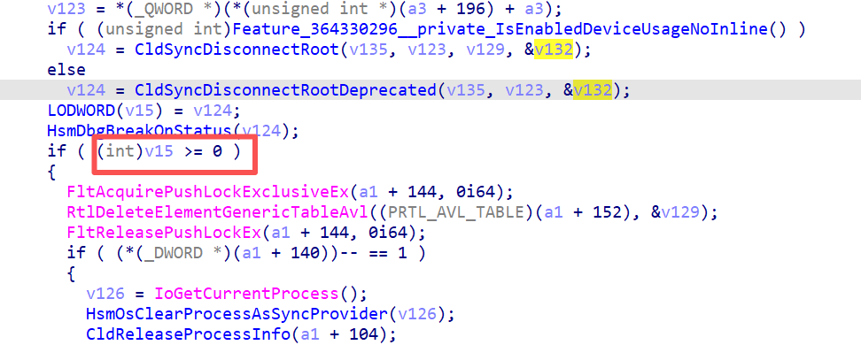</td>
<td></td>
</table></tr>
<table><tr>
<td>Quotes: <code>0</code></td>
<td>Replies: <code>4</code></td>
<td>Retweets: <code>18</code></td>
<td>Favorites: <code>128</code></td>
</tr></table>

---

# ksg93rd
**https://twitter.com/ksg93rd/status/1999324875668824235 _at 2025-12-12, 03:46:10_**
<blockquote>
#exploit
1⃣. Windows Session Hijacking via COM - https://t.co/8KCZObJDgS
// This technique serves as an alternative to remote process injection or LSASS dumping for activities like keylogging, screenshots, or LDAP access
2⃣. CVE-2024-27822:
macOS PackageKit Privilege Escalation -
</blockquote>

* https://github.com/3lp4tr0n/SessionHop/

<table><tr>
<td>Quotes: <code>0</code></td>
<td>Replies: <code>1</code></td>
<td>Retweets: <code>17</code></td>
<td>Favorites: <code>42</code></td>
</tr></table>

---

# gN3mes1s
**https://twitter.com/gN3mes1s/status/1999128861464809618 _at 2025-12-11, 14:47:17_**
<blockquote>
#Pruva reproduction and Detection/Scanner for the CVE-2024-55947 bypass CVE-2025-8110 , but as @wiz_io  said, it could be that the artficats are gone or private.

Gogs Path Traversal Vulnerability

https://t.co/DpoWafsAcq https://t.co/Ii5u1wYR9q
</blockquote>

* https://gist.github.com/N3mes1s/bb4d6077c15c39832d51218622b90650

<table><tr>
<td>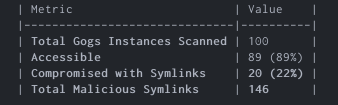</td>
<td>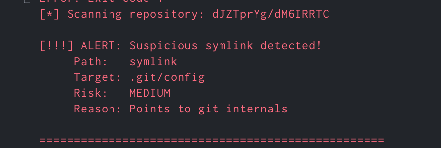</td>
</table></tr>
<table><tr>
<td>Quotes: <code>0</code></td>
<td>Replies: <code>1</code></td>
<td>Retweets: <code>12</code></td>
<td>Favorites: <code>57</code></td>
</tr></table>

---

# hakrishi
**https://twitter.com/hakrishi/status/1999071306537726221 _at 2025-12-11, 10:58:35_**
<blockquote>
🚨 New high severity zero day affecting Gogs (CVE-2025-8110) actively being exploited in the wild!

I’ve created a detection script to detect vulnerable instances at scale:
https://t.co/9si5WNN0BS

Analysis from Wiz:
https://t.co/3bUuRz23rJ https://t.co/30kHCvz1M6
</blockquote>

* https://github.com/rxerium/CVE-2025-8110
* https://www.wiz.io/blog/wiz-research-gogs-cve-2025-8110-rce-exploit

<table><tr>
<td>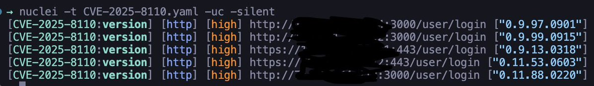</td>
</table></tr>
<table><tr>
<td>Quotes: <code>0</code></td>
<td>Replies: <code>6</code></td>
<td>Retweets: <code>60</code></td>
<td>Favorites: <code>313</code></td>
</tr></table>

---

# TheHackersNews
**https://twitter.com/TheHackersNews/status/1999064812433690758 _at 2025-12-11, 10:32:46_**
<blockquote>
🚨 700+ Gogs servers hacked — no patch yet.

New flaw (CVE-2025-8110) lets attackers overwrite files and run code through symbolic links, bypassing last year’s fix.

Wiz found Supershell malware — often used by Chinese groups — on many hacked servers.

🔗 Read: https://t.co/pEbmbKXWaG
</blockquote>

<table><tr>
<td></td>
</table></tr>
<table><tr>
<td>Quotes: <code>4</code></td>
<td>Replies: <code>4</code></td>
<td>Retweets: <code>34</code></td>
<td>Favorites: <code>92</code></td>
</tr></table>

---

# _JohnHammond
**https://twitter.com/_JohnHammond/status/1998876419384865264 _at 2025-12-10, 22:04:10_**
<blockquote>
Before React exploded I was helping chase some more shenanigans with Gladinet CentreStack &amp; Triofox-- another LFI vulnerability that led (again) to the .NET ViewState deserialization CVE-2025-30406 remote code execution. Patch is available but we're seeing active exploitation: https://t.co/d2RhfYnCW0
</blockquote>

<table><tr>
<td>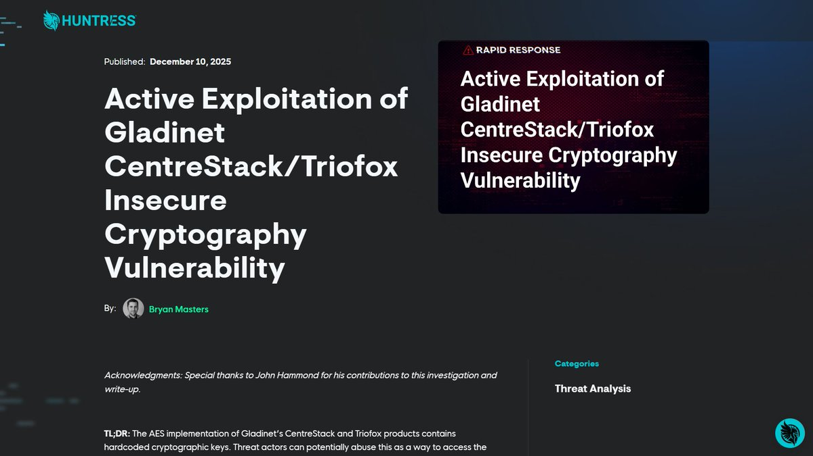</td>
</table></tr>
<table><tr>
<td>Quotes: <code>0</code></td>
<td>Replies: <code>1</code></td>
<td>Retweets: <code>8</code></td>
<td>Favorites: <code>91</code></td>
</tr></table>

---

# h4x0r_dz
**https://twitter.com/h4x0r_dz/status/1998712968842981606 _at 2025-12-10, 11:14:40_**
<blockquote>
Here we go, another crits on fori. 
Authentication bypass on FortiOS, FortiWeb, FortiProxy, and FortiSwitchManager when SAML is on 
CVE-2025-59718 CVE-2025-59719
https://t.co/F8lCILYD8t https://t.co/sEGuCaVqU2
</blockquote>

* https://www.fortiguard.com/psirt/FG-IR-25-647

<table><tr>
<td>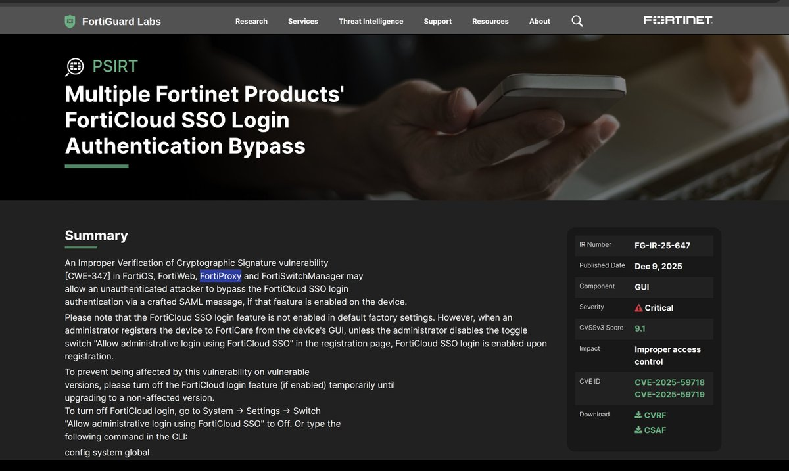</td>
</table></tr>
<table><tr>
<td>Quotes: <code>1</code></td>
<td>Replies: <code>1</code></td>
<td>Retweets: <code>26</code></td>
<td>Favorites: <code>201</code></td>
</tr></table>

---

# KeyZ3r0
**https://twitter.com/KeyZ3r0/status/1998619416444190747 _at 2025-12-10, 05:02:56_**
<blockquote>
This month MSRC fixed my Windows Defender info leak vulnerability CVE-2025-62468, but all acknowledgments are incorrect. First, I provided a working exploit, so it’s not “exploitable unlikely.”😅https://t.co/TXNxu8XPjU https://t.co/ZjF7redx9w
</blockquote>

* https://msrc.microsoft.com/update-guide/vulnerability/CVE-2025-62468

<table><tr>
<td>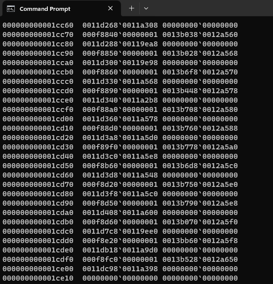</td>
</table></tr>
<table><tr>
<td>Quotes: <code>0</code></td>
<td>Replies: <code>4</code></td>
<td>Retweets: <code>15</code></td>
<td>Favorites: <code>175</code></td>
</tr></table>

---

# abuse_ch
**https://twitter.com/abuse_ch/status/1998617280922501566 _at 2025-12-10, 04:54:26_**
<blockquote>
Exploitation of recent React RCE vul (CVE-2025-55182 - #React2Shell) leading to #Mirai infection ⤵️

Botnet Mirai C2 domains 📡:
effeminate.fuckphillipthegerman .ru
trap.fuckphillipthegerman .ru
tranny.fuckphillipthegerman .ru 

Botnet Mirai C2 servers , all hosted at FORTIS 🇷🇺: https://t.co/1spHQh10rq
</blockquote>

<table><tr>
<td>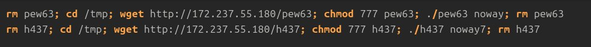</td>
</table></tr>
<table><tr>
<td>Quotes: <code>5</code></td>
<td>Replies: <code>3</code></td>
<td>Retweets: <code>22</code></td>
<td>Favorites: <code>89</code></td>
</tr></table>

---

# osman1337_
**https://twitter.com/osman1337_/status/1998494447483400373 _at 2025-12-09, 20:46:21_**
<blockquote>
Glad to share the technical blog post for the vulnerability we collaborated on with @luminaryxd 

📝 Technical write-up: https://t.co/dhyIqdCddk
📎 MSRC advisory: https://t.co/477jLsXXu9
The vulnerability has been assigned the CVE ID: CVE-2025-54100 (CVE number updated)
</blockquote>

* https://github.com/osman1337-security/CVE-2025-54100/
* https://msrc.microsoft.com/update-guide/vulnerability/CVE-2025-54100

<table><tr>
<td>Quotes: <code>1</code></td>
<td>Replies: <code>2</code></td>
<td>Retweets: <code>6</code></td>
<td>Favorites: <code>42</code></td>
</tr></table>

---

# HaifeiLi
**https://twitter.com/HaifeiLi/status/1998479616449953900 _at 2025-12-09, 19:47:25_**
<blockquote>
A fun fact: CVE-2025-62562 (https://t.co/qQ4rWn3L4B) was an Outlook RCE/UAF that can be only triggered by.. replying to a crafted email. A very close to a "0-click Outlook RCE".. of course, I found that by accident.. :)
https://t.co/Wb4kgP3AAE
</blockquote>

* https://msrc.microsoft.com/update-guide/vulnerability/CVE-2025-62562
* https://x.com/HaifeiLi/status/1998478383504830856

<table><tr>
<td>Quotes: <code>0</code></td>
<td>Replies: <code>2</code></td>
<td>Retweets: <code>4</code></td>
<td>Favorites: <code>67</code></td>
</tr></table>

---

# USCERT_gov
**https://twitter.com/USCERT_gov/status/1998470555670810643 _at 2025-12-09, 19:11:24_**
<blockquote>
🛡️ We added RARLAB WinRAR path traversal vulnerability CVE-2025-6218 &amp; Microsoft Windows use after free vulnerability CVE-2025-62221 to our Known Exploited Vulnerabilities Catalog. Visit https://t.co/myxOwap1Tf &amp; apply mitigations to protect your org from cyberattacks. https://t.co/YICJDnTmdQ
</blockquote>

* https://go.dhs.gov/Z3Q

<table><tr>
<td></td>
</table></tr>
<table><tr>
<td>Quotes: <code>1</code></td>
<td>Replies: <code>1</code></td>
<td>Retweets: <code>28</code></td>
<td>Favorites: <code>41</code></td>
</tr></table>

---

# 33y0re
**https://twitter.com/33y0re/status/1998465481485734222 _at 2025-12-09, 18:51:15_**
<blockquote>
Myself and @HackyBoiiiii  were credited with CVE-2025-62567 in Hyper-V! Submitted as a DOS, but fun nonetheless to root cause!

https://t.co/mPxWijA9Xg
</blockquote>

* https://msrc.microsoft.com/update-guide/en-US/vulnerability/CVE-2025-62567

<table><tr>
<td>Quotes: <code>1</code></td>
<td>Replies: <code>5</code></td>
<td>Retweets: <code>7</code></td>
<td>Favorites: <code>73</code></td>
</tr></table>

---

# rapid7
**https://twitter.com/rapid7/status/1998445516087074912 _at 2025-12-09, 17:31:55_**
<blockquote>
🚨 Earlier this year, Rapid7 researchers discovered a stored cross-site scripting (XSS) vuln. in #Ivanti Endpoint Manager (EPM) – affecting versions 2024 SU4 and below.

Now patched, CVE-2025-10573 has been assigned a CVSS score of 9.6. More in our blog: https://t.co/FtdADlLLee https://t.co/5OFzb4pu9x
</blockquote>

* https://r-7.co/4rN6TWo

<table><tr>
<td>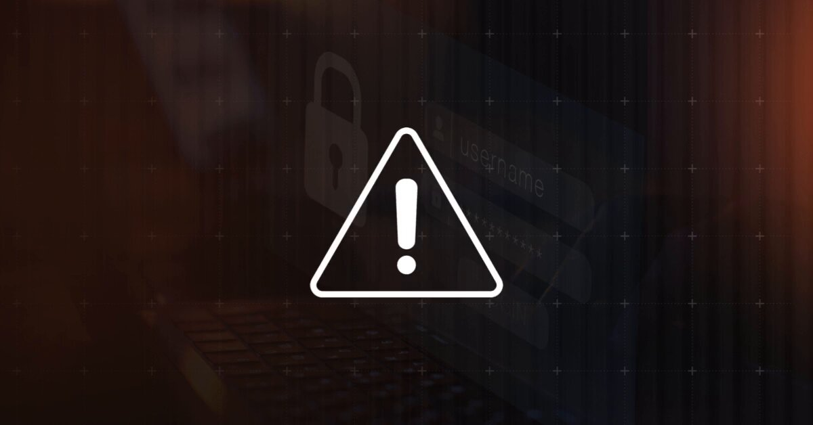</td>
</table></tr>
<table><tr>
<td>Quotes: <code>0</code></td>
<td>Replies: <code>2</code></td>
<td>Retweets: <code>22</code></td>
<td>Favorites: <code>58</code></td>
</tr></table>

---

# gN3mes1s
**https://twitter.com/gN3mes1s/status/1998440820056223844 _at 2025-12-09, 17:13:15_**
<blockquote>
CVE-2025-66489 - https://t.co/nBfOsZLCJp Authentication Bypass via TOTP Code Presence

Another #Pruva reproduction for today

https://t.co/x28Stcilan

curl -X POST http://localhost:3001/api/auth/callback/credentials \
  -H "Content-Type: application/x-www-form-urlencoded" \
  -b https://t.co/1ofp0PtUZe
</blockquote>

* http://Cal.com
* https://gist.github.com/N3mes1s/727c2d8f90858bc96853ad427b6ff532

<table><tr>
<td>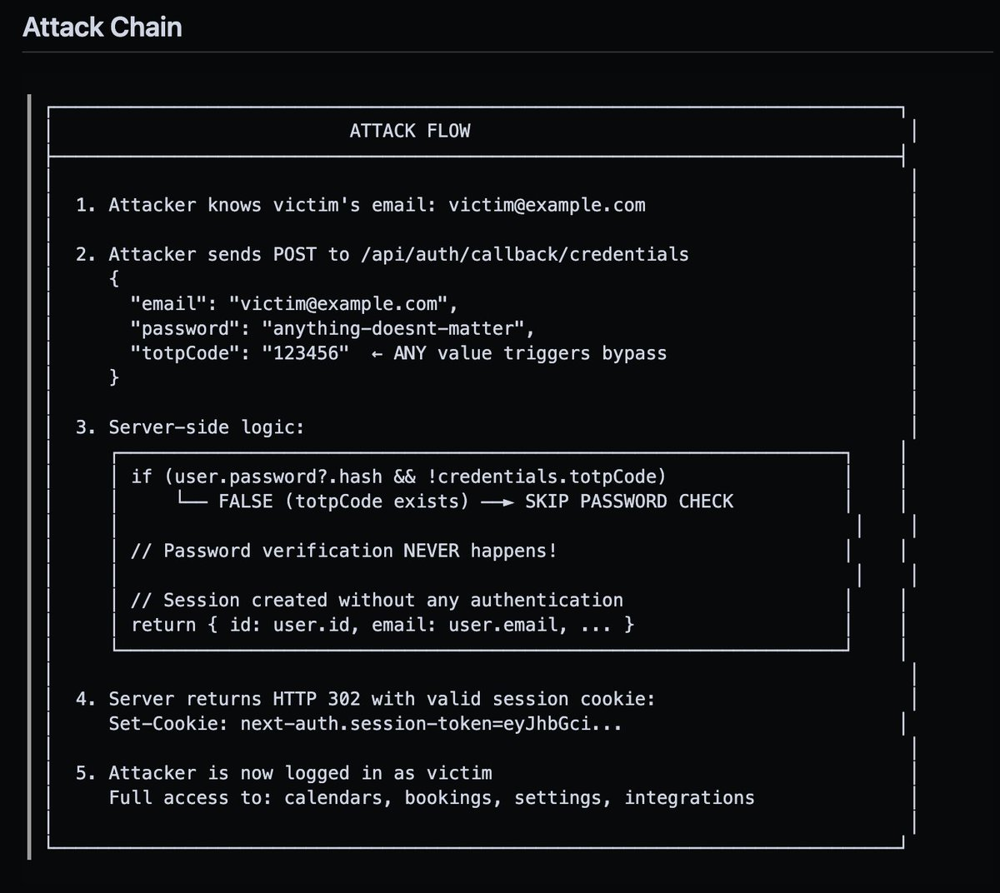</td>
<td>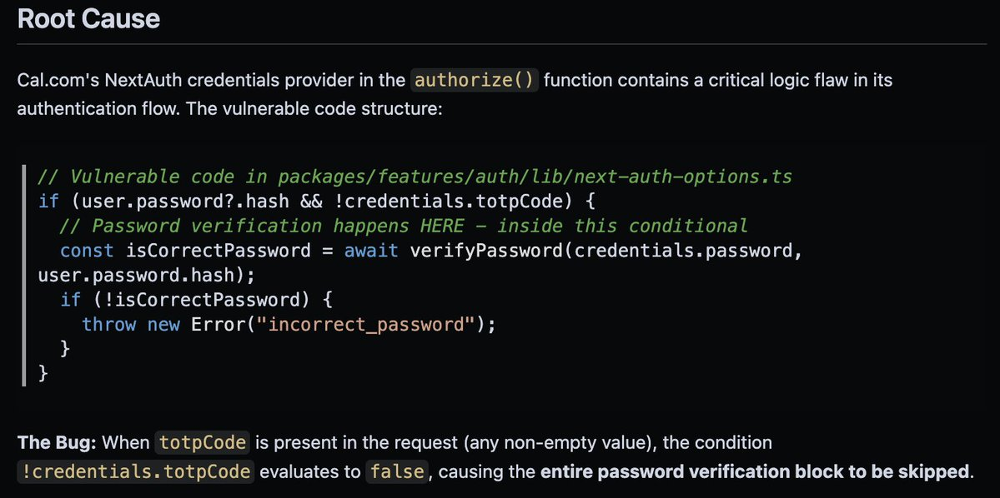</td>
</table></tr>
<table><tr>
<td>Quotes: <code>0</code></td>
<td>Replies: <code>0</code></td>
<td>Retweets: <code>15</code></td>
<td>Favorites: <code>109</code></td>
</tr></table>

---

# gothburz
**https://twitter.com/gothburz/status/1998438624010924453 _at 2025-12-09, 17:04:31_**
<blockquote>
I found an RCE on someone's website yesterday.

CVE-2025-55182.

React2Shell.

They don't have a bug bounty program.

Nobody asked me to test their site.

I didn't even know who owned it until I had shell.

I woke up at 2 AM because that's when real hackers work.

I put on my Mr.
</blockquote>

<table><tr>
<td>Quotes: <code>3</code></td>
<td>Replies: <code>14</code></td>
<td>Retweets: <code>8</code></td>
<td>Favorites: <code>81</code></td>
</tr></table>

---

# osman1337_
**https://twitter.com/osman1337_/status/1998436599890153859 _at 2025-12-09, 16:56:29_**
<blockquote>
We had a great collab with @luminaryxd , and we were awarded $5000 bounty by MSRC.

We will talk about our findings once it is disclosed by Microsoft

CVE-2026-0386 👀 https://t.co/g2BkKNskUi
</blockquote>

<table><tr>
<td>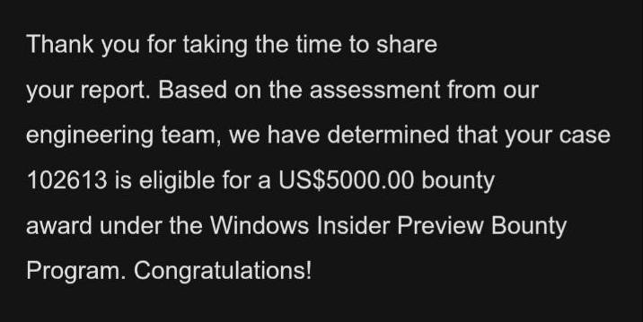</td>
</table></tr>
<table><tr>
<td>Quotes: <code>2</code></td>
<td>Replies: <code>4</code></td>
<td>Retweets: <code>2</code></td>
<td>Favorites: <code>38</code></td>
</tr></table>

---

# pyn3rd
**https://twitter.com/pyn3rd/status/1998425479284654420 _at 2025-12-09, 16:12:17_**
<blockquote>
#CVE-2025-55182 #React2Shell 
Let me walk you through the technical path of the WAF bypass.
When a request is sent as multipart/form-data, Next.js hands the raw body stream to Busboy. The bypass comes from Busboy’s charset logic: it cleanly accepts UTF‑16LE (and legacy UCS‑2) and https://t.co/ac8Lj7yXpA
</blockquote>

<table><tr>
<td>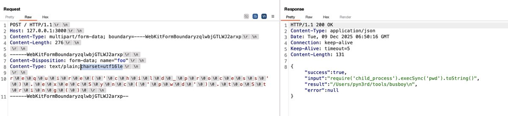</td>
<td>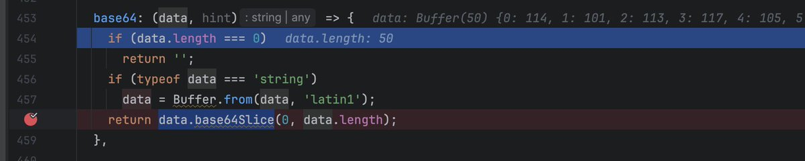</td>
<td>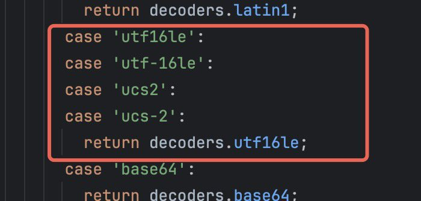</td>
<td>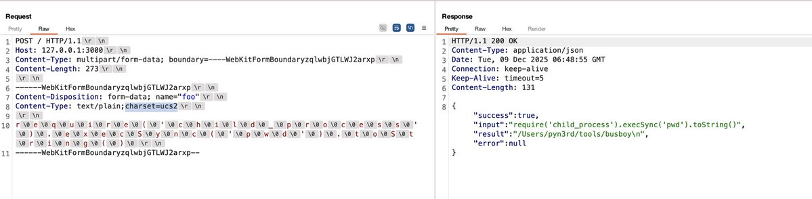</td>
</table></tr>
<table><tr>
<td>Quotes: <code>3</code></td>
<td>Replies: <code>16</code></td>
<td>Retweets: <code>124</code></td>
<td>Favorites: <code>560</code></td>
</tr></table>

---

# zoomeye_team
**https://twitter.com/zoomeye_team/status/1998299685241663881 _at 2025-12-09, 07:52:26_**
<blockquote>
🚨🚨 #React2Shell (CVE-2025-55182) continues to heat up globally — and what's really sending bounty hunters' heart rates through the roof is:
• RCE + no auth + super short exploit chain
• Hunters already landing successful exploits in high-value bounty programs
• Massive https://t.co/S8Mxo3t1dQ
</blockquote>

<table><tr>
<td>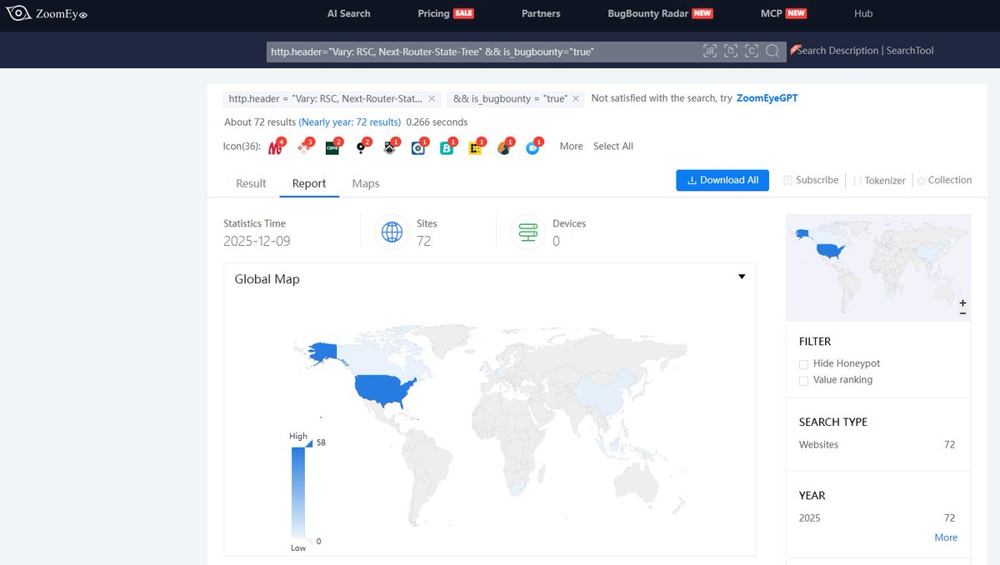</td>
</table></tr>
<table><tr>
<td>Quotes: <code>0</code></td>
<td>Replies: <code>3</code></td>
<td>Retweets: <code>28</code></td>
<td>Favorites: <code>176</code></td>
</tr></table>

---

# HunterMapping
**https://twitter.com/HunterMapping/status/1998210786842624332 _at 2025-12-09, 01:59:11_**
<blockquote>
🚨Alert🚨:CVE-2025-66516 (CVSS 10.0): Critical XXE Bug Hits Apache Tika
🔥PoC :https://t.co/AgUg8hKP9l
📊12.6K+ Services are found on the https://t.co/ysWb28Crld yearly.
🔗Hunter
Link:https://t.co/xZZGyc6J6L
👇Query
HUNTER : https://t.co/q9rtuGgxk7="Apache Tika" https://t.co/l3fqmSeHLL
</blockquote>

* https://github.com/Ashwesker/Blackash-CVE-2025-66516
* http://hunter.how
* https://hunter.how/list?searchValue=product.name%3D%22Apache%20Tika%22
* http://product.name

<table><tr>
<td>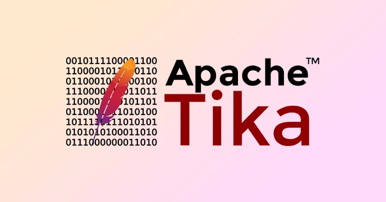</td>
</table></tr>
<table><tr>
<td>Quotes: <code>0</code></td>
<td>Replies: <code>5</code></td>
<td>Retweets: <code>32</code></td>
<td>Favorites: <code>154</code></td>
</tr></table>

---

# gothburz
**https://twitter.com/gothburz/status/1998124302177112470 _at 2025-12-08, 20:15:31_**
<blockquote>
Someone found an RCE on my website yesterday.

CVE-2025-55182.

React2Shell.

I don't have a bug bounty program.

I never asked for a security assessment.

I woke up to a DM: "Hey I found a critical vulnerability in your site. I only ran the exploit to verify it worked. Here's my
</blockquote>

<table><tr>
<td>Quotes: <code>77</code></td>
<td>Replies: <code>279</code></td>
<td>Retweets: <code>303</code></td>
<td>Favorites: <code>4018</code></td>
</tr></table>

---

# objective_see
**https://twitter.com/objective_see/status/1998118531213533683 _at 2025-12-08, 19:52:35_**
<blockquote>
🔥 New (guest) blog just dropped!

“When Good /bins Go Bad: A Remote Pre-Auth Overflow in LLDB’s debugserver”
https://t.co/GtQJuWseLO

Mahalo to Nathan (@calysteon) for detailing his discovery of this bug, which has since been patched by Apple as CVE-2025-43504 🙏🏽
</blockquote>

* https://objective-see.org/blog/blog_0x83.html

<table><tr>
<td>Quotes: <code>0</code></td>
<td>Replies: <code>2</code></td>
<td>Retweets: <code>12</code></td>
<td>Favorites: <code>51</code></td>
</tr></table>

---

# USCERT_gov
**https://twitter.com/USCERT_gov/status/1998103558592376938 _at 2025-12-08, 18:53:05_**
<blockquote>
🛡️We added D-Link routers and Array Networks vulnerabilities CVE-2022-37055 &amp; CVE-2025-66644 to our Known Exploited Vulnerabilities Catalog. Visit https://t.co/myxOwap1Tf &amp; apply mitigations to protect your org from cyberattacks. #Cybersecurity #InfoSec https://t.co/eFFWeGdTVJ
</blockquote>

* https://go.dhs.gov/Z3Q

<table><tr>
<td></td>
</table></tr>
<table><tr>
<td>Quotes: <code>0</code></td>
<td>Replies: <code>3</code></td>
<td>Retweets: <code>30</code></td>
<td>Favorites: <code>62</code></td>
</tr></table>

---

# offsectraining
**https://twitter.com/offsectraining/status/1998014991186698643 _at 2025-12-08, 13:01:09_**
<blockquote>
🚨 A new CVSS 10.0 vulnerability (CVE-2025-55182) in RSC and the Flight protocol enables unauthenticated remote code execution. If you run RSC or a framework that ships it, this is a patch-now moment. In our latest OffSec blog, we break down how the exploit works, what’s
</blockquote>

<table><tr>
<td>Quotes: <code>2</code></td>
<td>Replies: <code>4</code></td>
<td>Retweets: <code>73</code></td>
<td>Favorites: <code>269</code></td>
</tr></table>

---

# zoomeye_team
**https://twitter.com/zoomeye_team/status/1997973611446161828 _at 2025-12-08, 10:16:44_**
<blockquote>
🚨🚨CVE-2025-66516 (CVSS 10): Apache Tika Critical XXE
Attackers can carry out XML External Entity (XXE) injection via a crafted XFA file inside a PDF.

Search by vul.cve Filter👉vul.cve="CVE-2025-66516"
ZoomEye Dork👉app="Apache Tika"
Over 1.4k exposed instances.
ZoomEye Link: https://t.co/p0U8H3kyMn
</blockquote>

<table><tr>
<td></td>
</table></tr>
<table><tr>
<td>Quotes: <code>0</code></td>
<td>Replies: <code>1</code></td>
<td>Retweets: <code>22</code></td>
<td>Favorites: <code>151</code></td>
</tr></table>

---

# TheHackersNews
**https://twitter.com/TheHackersNews/status/1997958786284392654 _at 2025-12-08, 09:17:49_**
<blockquote>
⚠️ Hackers are exploiting a bug in the Sneeit Framework plugin (CVE-2025-6389) to run code on servers and create admin accounts on WordPress sites.

⚠️ Separately, a flaw in ICTBroadcast (CVE-2025-2611) lets attackers use the BROADCAST cookie for unauthenticated remote shell https://t.co/VpAkRoIq0l
</blockquote>

<table><tr>
<td></td>
</table></tr>
<table><tr>
<td>Quotes: <code>2</code></td>
<td>Replies: <code>7</code></td>
<td>Retweets: <code>58</code></td>
<td>Favorites: <code>190</code></td>
</tr></table>

---

# The_Cyber_News
**https://twitter.com/The_Cyber_News/status/1997911075933843913 _at 2025-12-08, 06:08:14_**
<blockquote>
🚨 React2Shell RCE Vulnerability Exploited in the Wild to Execute Malicious Code 

Source: https://t.co/EqIo5TTZy5

A critical remote code execution vulnerability, tracked as CVE-2025-55182 and dubbed “React2Shell,” is now under active exploitation in the wild.

A largely https://t.co/bMEN8Jc1Ij
</blockquote>

* https://cybersecuritynews.com/react2shell-rce-vulnerability/

<table><tr>
<td></td>
</table></tr>
<table><tr>
<td>Quotes: <code>0</code></td>
<td>Replies: <code>1</code></td>
<td>Retweets: <code>27</code></td>
<td>Favorites: <code>48</code></td>
</tr></table>

---

# hunter0x1
**https://twitter.com/hunter0x1/status/1997661266379178325 _at 2025-12-07, 13:35:35_**
<blockquote>
During my research on CVE-2025-55182 and CVE-2025-66478. I managed to find 4 instances to be vulnerable. The thing that helped me most:

Research link - https://t.co/gNZK6Bf6vX

Assetnote Checker - https://t.co/hsc3MANsy3

If you want to increase impact - https://t.co/gakt6kCGum https://t.co/pBEDvG1tnB
</blockquote>

* https://slcyber.io/research-center/high-fidelity-detection-mechanism-for-rsc-next-js-rce-cve-2025-55182-cve-2025-66478
* https://github.com/assetnote/react2shell-scanner
* https://github.com/zack0x01/CVE-2025-55182-advanced-scanner-

<table><tr>
<td>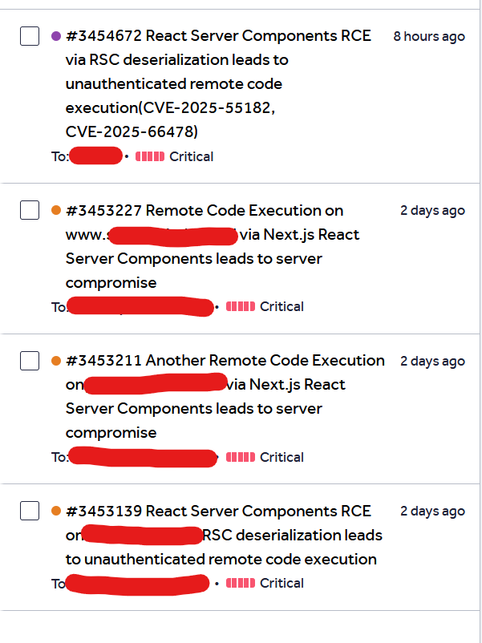</td>
</table></tr>
<table><tr>
<td>Quotes: <code>2</code></td>
<td>Replies: <code>14</code></td>
<td>Retweets: <code>53</code></td>
<td>Favorites: <code>496</code></td>
</tr></table>

---

# pyn3rd
**https://twitter.com/pyn3rd/status/1997365282344677807 _at 2025-12-06, 17:59:27_**
<blockquote>
#CVE-2025-55182 React4Shell — How about Akamai WAF? Even more straightforward: toss a giant junk blob upfront and the parser taps out on sight. Bloody brute force. Go verify it on your own endpoint—again and again.

Figure 1:  shows the payload validity check.
Figure 2: https://t.co/pAzxoWNPCj
</blockquote>

<table><tr>
<td></td>
<td></td>
</table></tr>
<table><tr>
<td>Quotes: <code>1</code></td>
<td>Replies: <code>7</code></td>
<td>Retweets: <code>50</code></td>
<td>Favorites: <code>320</code></td>
</tr></table>

---

# payloadartist
**https://twitter.com/payloadartist/status/1997316951585280018 _at 2025-12-06, 14:47:24_**
<blockquote>
PoC for React2Shell (CVE-2025-55182) by @maple3142 

#bugbounty #bugbountytips #cybersecurity https://t.co/5Lpq1OuKqz
</blockquote>

<table><tr>
<td>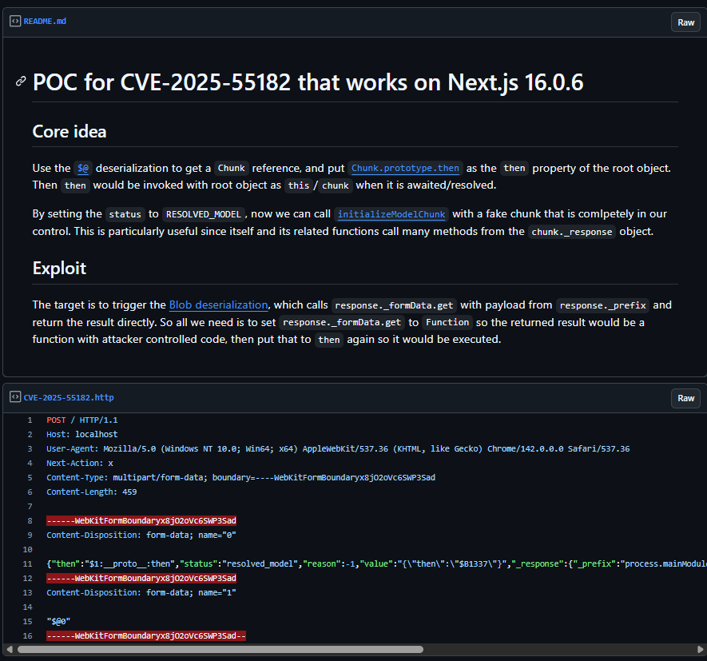</td>
</table></tr>
<table><tr>
<td>Quotes: <code>0</code></td>
<td>Replies: <code>1</code></td>
<td>Retweets: <code>7</code></td>
<td>Favorites: <code>61</code></td>
</tr></table>

---

# cramforce
**https://twitter.com/cramforce/status/1997152588253614425 _at 2025-12-06, 03:54:16_**
<blockquote>
We introduced a dedicated HackerOne program for Vercel WAF bypasses for CVE-2025-55182 / react2shell
Critical bypass: $50K
https://t.co/90NnL06Vnx https://t.co/KDgcEPmVUl
</blockquote>

* https://hackerone.com/vercel_platform_protection

<table><tr>
<td></td>
</table></tr>
<table><tr>
<td>Quotes: <code>25</code></td>
<td>Replies: <code>32</code></td>
<td>Retweets: <code>76</code></td>
<td>Favorites: <code>837</code></td>
</tr></table>

---

# linkersec
**https://twitter.com/linkersec/status/1997104881392378302 _at 2025-12-06, 00:44:42_**
<blockquote>
Déjà Vu in Linux io_uring

Talk by @u1f383 about exploiting CVE-2025-21836 — a race condition that leads to a use-after-free in the io_uring subsystem.

Slides: https://t.co/IsW8Nx8kyA
Video: https://t.co/kZ21botEkB
</blockquote>

* https://u1f383.github.io/slides/talks/2025_Hexacon-Deja_Vu_in_Linux_io_uring_Breaking_Memory_Sharing_Again_After_Generations_of_Fixes.pdf
* https://www.youtube.com/watch?v=Ry4eOgLCo90

<table><tr>
<td>Quotes: <code>0</code></td>
<td>Replies: <code>0</code></td>
<td>Retweets: <code>21</code></td>
<td>Favorites: <code>118</code></td>
</tr></table>

---

# CyberRaiju
**https://twitter.com/CyberRaiju/status/1997100937744470457 _at 2025-12-06, 00:29:02_**
<blockquote>
CVE-2025-55182 (React2Shell) pre-auth RCE is likely to have a long tail time similar to Log4Shell Log4j injection and Telerik deserialisation vulnerabilities have in the past. This is already being weaponised by threat actors with public POCs available.

https://t.co/DbrEsfTSrS https://t.co/y2nNRg7JWj
</blockquote>

* https://react2shell.com/

<table><tr>
<td></td>
</table></tr>
<table><tr>
<td>Quotes: <code>1</code></td>
<td>Replies: <code>3</code></td>
<td>Retweets: <code>14</code></td>
<td>Favorites: <code>87</code></td>
</tr></table>

---

# Gi7w0rm
**https://twitter.com/Gi7w0rm/status/1996988412650233964 _at 2025-12-05, 17:01:54_**
<blockquote>
Well, thanks to @leak_ix I have a list of 60.000 React webapps vulnerable to CVE-2025-55182 (#RCE in #React).
And thanks to my friend @Chocapikk_ we have a working #PoC for it as well.
That's a lot of power at my hands now...
Let's see what we can legally breach 😈 https://t.co/sv27bIJuDx
</blockquote>

<table><tr>
<td></td>
</table></tr>
<table><tr>
<td>Quotes: <code>1</code></td>
<td>Replies: <code>8</code></td>
<td>Retweets: <code>7</code></td>
<td>Favorites: <code>86</code></td>
</tr></table>

---

# securityshell
**https://twitter.com/securityshell/status/1996976033069670548 _at 2025-12-05, 16:12:42_**
<blockquote>
Holy shit… the exploitation of CVE-2025-55182 has reached a new level. There’s now a publicly available Chrome extension on GitHub that automatically scans for and exploits vulnerable sites as you browse. Absolutely wild. 🤦‍♂️ https://t.co/Owpzb1llEr
</blockquote>

<table><tr>
<td></td>
</table></tr>
<table><tr>
<td>Quotes: <code>70</code></td>
<td>Replies: <code>63</code></td>
<td>Retweets: <code>422</code></td>
<td>Favorites: <code>3508</code></td>
</tr></table>

---

# 0xor0ne
**https://twitter.com/0xor0ne/status/1996973360450768999 _at 2025-12-05, 16:02:05_**
<blockquote>
pre-auth RCE (CVE-2025-9242) stack buffer overflow vulnerability in WatchGuard Fireware OS

https://t.co/8gUrO3steS

Credits @watchtowrcyber

#infosec https://t.co/v4ft0JravA
</blockquote>

* https://labs.watchtowr.com/yikes-watchguard-fireware-os-ikev2-out-of-bounds-write-cve-2025-9242

<table><tr>
<td></td>
<td></td>
</table></tr>
<table><tr>
<td>Quotes: <code>0</code></td>
<td>Replies: <code>4</code></td>
<td>Retweets: <code>37</code></td>
<td>Favorites: <code>205</code></td>
</tr></table>

---

# USCERT_gov
**https://twitter.com/USCERT_gov/status/1996963163682566406 _at 2025-12-05, 15:21:34_**
<blockquote>
🛡️We added Meta React Server Components remote code execution vulnerability CVE-2025-55182 to our Known Exploited Vulnerabilities Catalog. Visit https://t.co/myxOwap1Tf &amp; apply mitigations to protect your org from cyberattacks. #Cybersecurity #InfoSec https://t.co/QozFI5xbes
</blockquote>

* https://go.dhs.gov/Z3Q

<table><tr>
<td></td>
</table></tr>
<table><tr>
<td>Quotes: <code>2</code></td>
<td>Replies: <code>4</code></td>
<td>Retweets: <code>44</code></td>
<td>Favorites: <code>95</code></td>
</tr></table>

---

# pyn3rd
**https://twitter.com/pyn3rd/status/1996840827897954542 _at 2025-12-05, 07:15:27_**
<blockquote>
#CVE-2025-55182: RSC RCE — It functions as an in-memory webshell backdoor, offering a significantly more covert foothold. Please verify this again on your own endpoint. https://t.co/aOic5sCu94
</blockquote>

<table><tr>
<td></td>
</table></tr>
<table><tr>
<td>Quotes: <code>6</code></td>
<td>Replies: <code>7</code></td>
<td>Retweets: <code>71</code></td>
<td>Favorites: <code>597</code></td>
</tr></table>

---

# pyn3rd
**https://twitter.com/pyn3rd/status/1996788502386909539 _at 2025-12-05, 03:47:32_**
<blockquote>
#CVE-2025-55182: RSC RCE — Full Unicode encoding can bypass certain WAFs that lack proper decoding or normalization capabilities. Please verify this on your end. https://t.co/70Ovx7lu5g
</blockquote>

<table><tr>
<td></td>
</table></tr>
<table><tr>
<td>Quotes: <code>5</code></td>
<td>Replies: <code>6</code></td>
<td>Retweets: <code>66</code></td>
<td>Favorites: <code>506</code></td>
</tr></table>

---

# zoomeye_team
**https://twitter.com/zoomeye_team/status/1996783486737539282 _at 2025-12-05, 03:27:36_**
<blockquote>
🚨Latest Update🚨RCE in React Server Components(CVE-2025-55182)
An insecure deserialization flaw in RSC's Flight data handling enables unauthenticated RCE. It affects default create-next-app projects and the latest version of Dify.
🔥PoC: https://t.co/qEhjjfVqZE

⚠️Note: Only https://t.co/B9WAnmlBev
</blockquote>

* https://gist.github.com/maple3142/48bc9393f45e068cf8c90ab865c0f5f3

<table><tr>
<td></td>
</table></tr>
<table><tr>
<td>Quotes: <code>2</code></td>
<td>Replies: <code>1</code></td>
<td>Retweets: <code>23</code></td>
<td>Favorites: <code>93</code></td>
</tr></table>

---

# AabyssZG
**https://twitter.com/AabyssZG/status/1996773126433366225 _at 2025-12-05, 02:46:26_**
<blockquote>
CVE-2025-55182这个漏洞，公网可以直接打，已经成功了，成功率不低！👿
​真正利用场景下，是没有回显结果的，直接RCE就行了😎
目前测试来看还能打Dify😱 https://t.co/KV6j8vLOAj
</blockquote>

<table><tr>
<td></td>
<td></td>
</table></tr>
<table><tr>
<td>Quotes: <code>0</code></td>
<td>Replies: <code>15</code></td>
<td>Retweets: <code>28</code></td>
<td>Favorites: <code>347</code></td>
</tr></table>

---

# stephenfewer
**https://twitter.com/stephenfewer/status/1996697494525264219 _at 2025-12-04, 21:45:54_**
<blockquote>
An unauthenticated RCE PoC for the React vuln (CVE-2025-55182) is now public. Confirmed to work on my test setup (Next.js 16.0.6 with React 19.2.0).
</blockquote>

<table><tr>
<td>Quotes: <code>0</code></td>
<td>Replies: <code>8</code></td>
<td>Retweets: <code>78</code></td>
<td>Favorites: <code>636</code></td>
</tr></table>

---

# Bugcrowd
**https://twitter.com/Bugcrowd/status/1996612405829480823 _at 2025-12-04, 16:07:47_**
<blockquote>
A critical RCE vulnerability (CVE-2025-55182) in React Server Components was disclosed on December 3. Early signs show meaningful exposure across monitored environments.

Bugcrowd has activated its zero-day workflow, formed a dedicated triage group, and is validating submissions. https://t.co/o4Z6b3ZLIK
</blockquote>

<table><tr>
<td></td>
</table></tr>
<table><tr>
<td>Quotes: <code>0</code></td>
<td>Replies: <code>4</code></td>
<td>Retweets: <code>10</code></td>
<td>Favorites: <code>78</code></td>
</tr></table>

---

# akaclandestine
**https://twitter.com/akaclandestine/status/1996518405323534761 _at 2025-12-04, 09:54:16_**
<blockquote>
GitHub - moscovium-mc/Tor-0day-JavaScript-Exploit: CVE-2024-9680 A UAF (use-after-free) vulnerability in Animation timelines allowed to achieve code execution in the content process in order to be potentially deanonymized.  https://t.co/KISRg0nVwr
</blockquote>

* https://github.com/moscovium-mc/Tor-0day-JavaScript-Exploit

<table><tr>
<td>Quotes: <code>0</code></td>
<td>Replies: <code>0</code></td>
<td>Retweets: <code>13</code></td>
<td>Favorites: <code>39</code></td>
</tr></table>

---

# Kostastsale
**https://twitter.com/Kostastsale/status/1996485704218521920 _at 2025-12-04, 07:44:19_**
<blockquote>
Heads-up on CVE-2025-55182: a CVSS 10.0 pre-auth RCE affecting React Server Components 19.x. Can be triggered through malicious HTTP payloads, so there will be chaos when a POC comes out.

On that note...there are many fake POCs circulating. Be careful what you run. A POC is not https://t.co/q9RjLzw7lO
</blockquote>

<table><tr>
<td></td>
</table></tr>
<table><tr>
<td>Quotes: <code>2</code></td>
<td>Replies: <code>4</code></td>
<td>Retweets: <code>17</code></td>
<td>Favorites: <code>91</code></td>
</tr></table>

---

# TheHackersNews
**https://twitter.com/TheHackersNews/status/1996438456747307153 _at 2025-12-04, 04:36:34_**
<blockquote>
🚨 UPDATE: The RCE flaw in React Server Components now has a name — React2shell (CVE-2025-55182).

Experts warn it’s a “master key” exploit — attackers can run any code just by sending a crafted HTTP request.

No login needed.

🔗 Read: https://t.co/9pG1bxMlCw
</blockquote>

* https://thehackernews.com/2025/12/critical-rsc-bugs-in-react-and-nextjs.html

<table><tr>
<td>Quotes: <code>6</code></td>
<td>Replies: <code>4</code></td>
<td>Retweets: <code>44</code></td>
<td>Favorites: <code>148</code></td>
</tr></table>

---

# pyn3rd
**https://twitter.com/pyn3rd/status/1996431921736519886 _at 2025-12-04, 04:10:36_**
<blockquote>
#CVE-2025-55182: Remote Code Execution in React Server Components via a Unicode-based WAF bypass https://t.co/JEVDKrd9nz
</blockquote>

<table><tr>
<td></td>
</table></tr>
<table><tr>
<td>Quotes: <code>1</code></td>
<td>Replies: <code>4</code></td>
<td>Retweets: <code>52</code></td>
<td>Favorites: <code>439</code></td>
</tr></table>

---

# HunterMapping
**https://twitter.com/HunterMapping/status/1996407037672968257 _at 2025-12-04, 02:31:43_**
<blockquote>
🚨Alert🚨:Critical RSC Bugs in React and Next.js Allow Unauthenticated Remote
Code Execution(CVE-2025-55182&amp;CVE-2025-66478)
🔥PoC :
https://t.co/RG8kg59GfU
https://t.co/fg5Qdjrzy1
🧐Detail :
https://t.co/MyU68wMNZ7
-----------------------------------------
CVE-2025-55182(CVSS https://t.co/1vhUBYiQqY
</blockquote>

* https://github.com/ejpir/CVE-2025-55182-poc
* https://github.com/BankkRoll/Quickcheck-CVE-2025-55182-React-and-CVE-2025-66478-Next.js
* https://www.wiz.io/blog/critical-vulnerability-in-react-cve-2025-55182

<table><tr>
<td></td>
</table></tr>
<table><tr>
<td>Quotes: <code>1</code></td>
<td>Replies: <code>0</code></td>
<td>Retweets: <code>50</code></td>
<td>Favorites: <code>155</code></td>
</tr></table>

---

# zoomeye_team
**https://twitter.com/zoomeye_team/status/1996405871631589451 _at 2025-12-04, 02:27:05_**
<blockquote>
🚨🚨CVE-2025-55182 (CVSS 10.0): RCE in React Server Components
A decoding bug in React Server Function payloads enables full unauthenticated RCE on vulnerable RSC backends.
🔥PoC: https://t.co/4yHxpp9RPc

Search by vul.cve Filter👉vul.cve="CVE-2025-55182"
ZoomEye https://t.co/0f44l2v5JW
</blockquote>

* https://github.com/ejpir/CVE-2025-55182-poc/blob/main/exploit-rce-v4.js

<table><tr>
<td></td>
</table></tr>
<table><tr>
<td>Quotes: <code>2</code></td>
<td>Replies: <code>4</code></td>
<td>Retweets: <code>49</code></td>
<td>Favorites: <code>236</code></td>
</tr></table>

---

# USCERT_gov
**https://twitter.com/USCERT_gov/status/1996295531610390588 _at 2025-12-03, 19:08:38_**
<blockquote>
🛡️We added OpenPLC ScadaBR vulnerability CVE-2021-26828 to our Known Exploited Vulnerabilities Catalog. Visit https://t.co/myxOwap1Tf &amp; apply mitigations to protect your org from cyberattacks. #Cybersecurity #InfoSec https://t.co/cUimHeit92
</blockquote>

* https://go.dhs.gov/Z3Q

<table><tr>
<td></td>
</table></tr>
<table><tr>
<td>Quotes: <code>0</code></td>
<td>Replies: <code>0</code></td>
<td>Retweets: <code>18</code></td>
<td>Favorites: <code>40</code></td>
</tr></table>

---

# h4x0r_dz
**https://twitter.com/h4x0r_dz/status/1996289988078510464 _at 2025-12-03, 18:46:37_**
<blockquote>
CVE-2025-55182 RCE in React Server Components 💀

https://t.co/tKKyd9WljA https://t.co/DEt9nHFC1f
</blockquote>

* https://github.com/vercel/next.js/security/advisories/GHSA-9qr9-h5gf-34mp

<table><tr>
<td></td>
</table></tr>
<table><tr>
<td>Quotes: <code>7</code></td>
<td>Replies: <code>9</code></td>
<td>Retweets: <code>61</code></td>
<td>Favorites: <code>496</code></td>
</tr></table>

---

# wiz_io
**https://twitter.com/wiz_io/status/1996251528512893026 _at 2025-12-03, 16:13:47_**
<blockquote>
🚨 CRITICAL RCE ALERT: React &amp; Next.js Vulnerability ↓

Critical remote code execution (RCE) vulnerabilities have been published affecting the React 19 ecosystem and Next.js.

These vulnerabilities (CVE-2025-55182 &amp; CVE-2025-66478) reside in the React Server Components (RSC) https://t.co/DwIAjXJ0h2
</blockquote>

<table><tr>
<td></td>
</table></tr>
<table><tr>
<td>Quotes: <code>16</code></td>
<td>Replies: <code>3</code></td>
<td>Retweets: <code>71</code></td>
<td>Favorites: <code>262</code></td>
</tr></table>

---

# AmitaiCo
**https://twitter.com/AmitaiCo/status/1996250852563239198 _at 2025-12-03, 16:11:06_**
<blockquote>
Here's our initial analysis of CVE-2025-55182 and CVE-2025-66478, critical RCE vulnerabilities in React and Next.js - these bugs allow for unauthenticated RCE on default configurations - patch ASAP:
https://t.co/EQaPopth22
</blockquote>

* https://www.wiz.io/blog/critical-vulnerability-in-react-cve-2025-55182

<table><tr>
<td>Quotes: <code>6</code></td>
<td>Replies: <code>6</code></td>
<td>Retweets: <code>42</code></td>
<td>Favorites: <code>150</code></td>
</tr></table>

---

# 0xor0ne
**https://twitter.com/0xor0ne/status/1996248552842961247 _at 2025-12-03, 16:01:58_**
<blockquote>
Analysis and exploitation of an integer underflow in the Bluetooth GATT protocol (CVE-2023-40129)

https://t.co/NfIMAlnxN6

Credits Mehdi Talbi and Etienne Helluy-Lafont (@Synacktiv)

#infosec #Android https://t.co/XyYPQjCJbb
</blockquote>

* https://www.synacktiv.com/en/publications/paint-it-blue-attacking-the-bluetooth-stack

<table><tr>
<td></td>
<td></td>
</table></tr>
<table><tr>
<td>Quotes: <code>0</code></td>
<td>Replies: <code>1</code></td>
<td>Retweets: <code>13</code></td>
<td>Favorites: <code>100</code></td>
</tr></table>

---

# rwincey
**https://twitter.com/rwincey/status/1996195135093371334 _at 2025-12-03, 12:29:42_**
<blockquote>
Just uncovered and disclosed a .NET Remoting RCE 0day (CVE-2025-11367) in N-able (formerly SolarWinds MSP) Windows Software Probe during a pentest using Reverge. Worth a look. https://t.co/nxGj2GiRdS
</blockquote>

* https://www.securifera.com/blog/2025/12/02/n-able-formerly-solarwinds-msp-windows-software-probe-remote-code-execution-cve-2025-11367/

<table><tr>
<td>Quotes: <code>1</code></td>
<td>Replies: <code>2</code></td>
<td>Retweets: <code>20</code></td>
<td>Favorites: <code>68</code></td>
</tr></table>

---

# f00fc7c800
**https://twitter.com/f00fc7c800/status/1995967720610037856 _at 2025-12-02, 21:26:02_**
<blockquote>
Releasing a 3 linux kernel bugs chains to do secure comm app using side channel to establish key and establish covert channe: CVE-2023-1206+CVE-2025-40040+CVE-2024-49882 https://t.co/PklpQLbjrZ 
Anyways a little thread about this later this week :1/n https://t.co/f6dMet1EFd
</blockquote>

* https://github.com/SpiralBL0CK/CVE-2023-1206-CVE-2025-40040-CVE-2024-49882/tree/main

<table><tr>
<td></td>
<td></td>
</table></tr>
<table><tr>
<td>Quotes: <code>0</code></td>
<td>Replies: <code>3</code></td>
<td>Retweets: <code>18</code></td>
<td>Favorites: <code>105</code></td>
</tr></table>

---

# 0xor0ne
**https://twitter.com/0xor0ne/status/1995765077895532828 _at 2025-12-02, 08:00:48_**
<blockquote>
Analysis and exploitation of a Use-After-Free vulnerability in the Linux network packet schedule (CVE-2025-38001)

https://t.co/t0C6wWlyWI

#infosec #Linux https://t.co/wsIxrGgwWo
</blockquote>

* https://syst3mfailure.io/rbtree-family-drama/

<table><tr>
<td></td>
</table></tr>
<table><tr>
<td>Quotes: <code>0</code></td>
<td>Replies: <code>1</code></td>
<td>Retweets: <code>54</code></td>
<td>Favorites: <code>240</code></td>
</tr></table>

---

# The_Cyber_News
**https://twitter.com/The_Cyber_News/status/1995377636772864286 _at 2025-12-01, 06:21:15_**
<blockquote>
🚨 PoC Exploit Released For Outlook 0-Click Remote Code Execution Vulnerability 

Source: https://t.co/zpeuGMQuHa

A Proof-of-Concept (PoC) exploit code has been released for a critical remote code execution (RCE) vulnerability in Microsoft Outlook, identified as CVE-2024-21413. https://t.co/GZAl0rTJOp
</blockquote>

* https://cybersecuritynews.com/outlook-remote-code-execution-vulnerability-2/

<table><tr>
<td></td>
</table></tr>
<table><tr>
<td>Quotes: <code>0</code></td>
<td>Replies: <code>7</code></td>
<td>Retweets: <code>154</code></td>
<td>Favorites: <code>453</code></td>
</tr></table>

---

