# gothburz
**https://twitter.com/gothburz/status/1998124302177112470 _at 2025-12-08, 20:15:31_**
<blockquote>
Someone found an RCE on my website yesterday.

CVE-2025-55182.

React2Shell.

I don't have a bug bounty program.

I never asked for a security assessment.

I woke up to a DM: "Hey I found a critical vulnerability in your site. I only ran the exploit to verify it worked. Here's my
</blockquote>

<table><tr>
<td>Quotes: <code>38</code></td>
<td>Replies: <code>157</code></td>
<td>Retweets: <code>133</code></td>
<td>Favorites: <code>1765</code></td>
</tr></table>

---

# offsectraining
**https://twitter.com/offsectraining/status/1998014991186698643 _at 2025-12-08, 13:01:09_**
<blockquote>
🚨 A new CVSS 10.0 vulnerability (CVE-2025-55182) in RSC and the Flight protocol enables unauthenticated remote code execution. If you run RSC or a framework that ships it, this is a patch-now moment. In our latest OffSec blog, we break down how the exploit works, what’s
</blockquote>

<table><tr>
<td>Quotes: <code>2</code></td>
<td>Replies: <code>3</code></td>
<td>Retweets: <code>58</code></td>
<td>Favorites: <code>233</code></td>
</tr></table>

---

# TheHackersNews
**https://twitter.com/TheHackersNews/status/1997958786284392654 _at 2025-12-08, 09:17:49_**
<blockquote>
⚠️ Hackers are exploiting a bug in the Sneeit Framework plugin (CVE-2025-6389) to run code on servers and create admin accounts on WordPress sites.

⚠️ Separately, a flaw in ICTBroadcast (CVE-2025-2611) lets attackers use the BROADCAST cookie for unauthenticated remote shell https://t.co/VpAkRoIq0l
</blockquote>

<table><tr>
<td></td>
</table></tr>
<table><tr>
<td>Quotes: <code>2</code></td>
<td>Replies: <code>3</code></td>
<td>Retweets: <code>53</code></td>
<td>Favorites: <code>170</code></td>
</tr></table>

---

# pyn3rd
**https://twitter.com/pyn3rd/status/1997365282344677807 _at 2025-12-06, 17:59:27_**
<blockquote>
#CVE-2025-55182 React4Shell — How about Akamai WAF? Even more straightforward: toss a giant junk blob upfront and the parser taps out on sight. Bloody brute force. Go verify it on your own endpoint—again and again.

Figure 1:  shows the payload validity check.
Figure 2: https://t.co/pAzxoWNPCj
</blockquote>

<table><tr>
<td>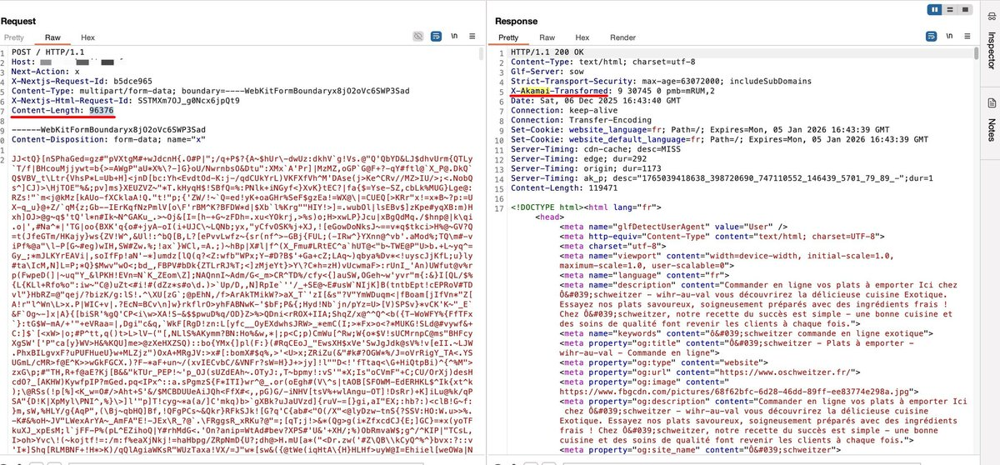</td>
<td>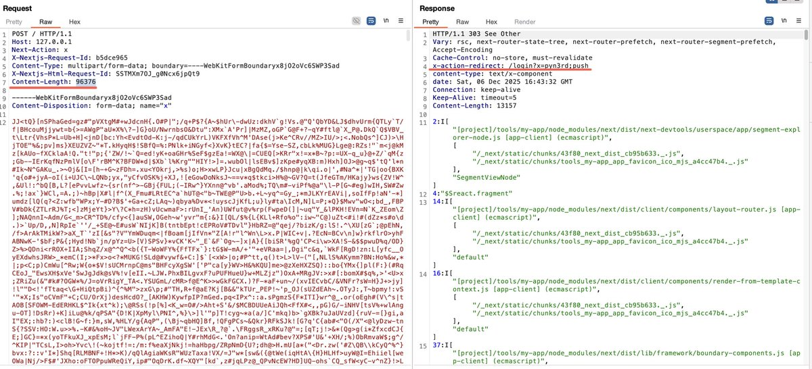</td>
</table></tr>
<table><tr>
<td>Quotes: <code>1</code></td>
<td>Replies: <code>7</code></td>
<td>Retweets: <code>48</code></td>
<td>Favorites: <code>315</code></td>
</tr></table>

---

# cramforce
**https://twitter.com/cramforce/status/1997152588253614425 _at 2025-12-06, 03:54:16_**
<blockquote>
We introduced a dedicated HackerOne program for Vercel WAF bypasses for CVE-2025-55182 / react2shell
Critical bypass: $50K
https://t.co/90NnL06Vnx https://t.co/KDgcEPmVUl
</blockquote>

* https://hackerone.com/vercel_platform_protection

<table><tr>
<td>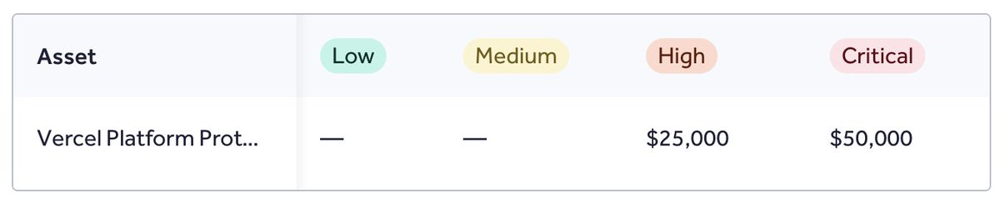</td>
</table></tr>
<table><tr>
<td>Quotes: <code>25</code></td>
<td>Replies: <code>31</code></td>
<td>Retweets: <code>76</code></td>
<td>Favorites: <code>827</code></td>
</tr></table>

---

# linkersec
**https://twitter.com/linkersec/status/1997104881392378302 _at 2025-12-06, 00:44:42_**
<blockquote>
Déjà Vu in Linux io_uring

Talk by @u1f383 about exploiting CVE-2025-21836 — a race condition that leads to a use-after-free in the io_uring subsystem.

Slides: https://t.co/IsW8Nx8kyA
Video: https://t.co/kZ21botEkB
</blockquote>

* https://u1f383.github.io/slides/talks/2025_Hexacon-Deja_Vu_in_Linux_io_uring_Breaking_Memory_Sharing_Again_After_Generations_of_Fixes.pdf
* https://www.youtube.com/watch?v=Ry4eOgLCo90

<table><tr>
<td>Quotes: <code>0</code></td>
<td>Replies: <code>0</code></td>
<td>Retweets: <code>21</code></td>
<td>Favorites: <code>115</code></td>
</tr></table>

---

# CyberRaiju
**https://twitter.com/CyberRaiju/status/1997100937744470457 _at 2025-12-06, 00:29:02_**
<blockquote>
CVE-2025-55182 (React2Shell) pre-auth RCE is likely to have a long tail time similar to Log4Shell Log4j injection and Telerik deserialisation vulnerabilities have in the past. This is already being weaponised by threat actors with public POCs available.

https://t.co/DbrEsfTSrS https://t.co/y2nNRg7JWj
</blockquote>

* https://react2shell.com/

<table><tr>
<td>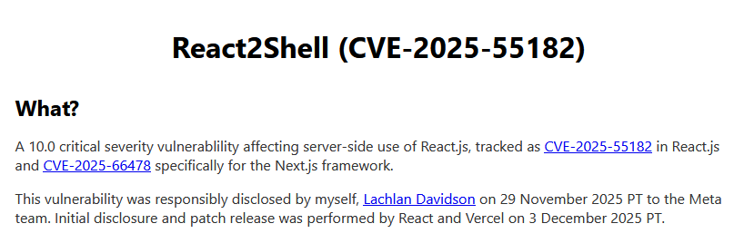</td>
</table></tr>
<table><tr>
<td>Quotes: <code>1</code></td>
<td>Replies: <code>3</code></td>
<td>Retweets: <code>14</code></td>
<td>Favorites: <code>87</code></td>
</tr></table>

---

# Gi7w0rm
**https://twitter.com/Gi7w0rm/status/1996988412650233964 _at 2025-12-05, 17:01:54_**
<blockquote>
Well, thanks to @leak_ix I have a list of 60.000 React webapps vulnerable to CVE-2025-55182 (#RCE in #React).
And thanks to my friend @Chocapikk_ we have a working #PoC for it as well.
That's a lot of power at my hands now...
Let's see what we can legally breach 😈 https://t.co/sv27bIJuDx
</blockquote>

<table><tr>
<td></td>
</table></tr>
<table><tr>
<td>Quotes: <code>1</code></td>
<td>Replies: <code>8</code></td>
<td>Retweets: <code>7</code></td>
<td>Favorites: <code>86</code></td>
</tr></table>

---

# securityshell
**https://twitter.com/securityshell/status/1996976033069670548 _at 2025-12-05, 16:12:42_**
<blockquote>
Holy shit… the exploitation of CVE-2025-55182 has reached a new level. There’s now a publicly available Chrome extension on GitHub that automatically scans for and exploits vulnerable sites as you browse. Absolutely wild. 🤦‍♂️ https://t.co/Owpzb1llEr
</blockquote>

<table><tr>
<td>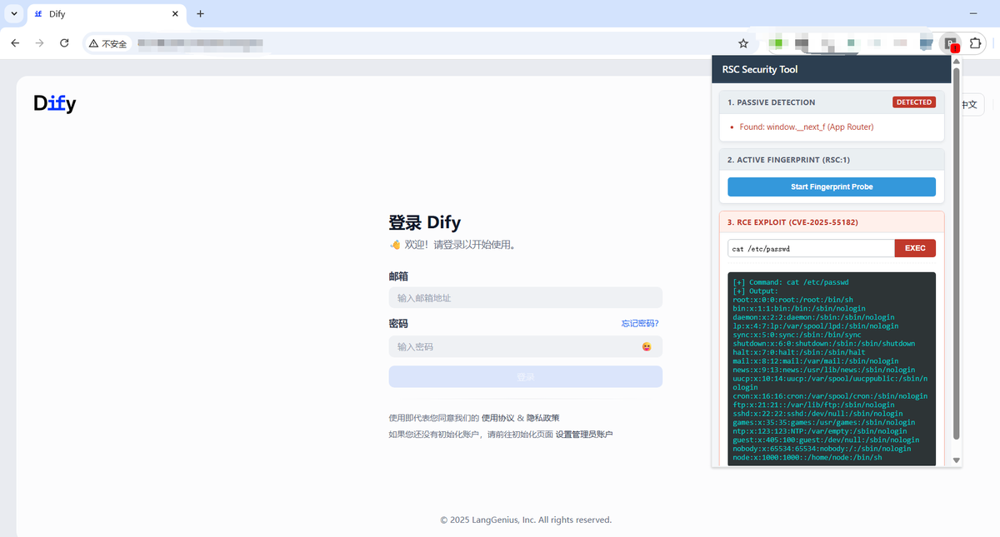</td>
</table></tr>
<table><tr>
<td>Quotes: <code>67</code></td>
<td>Replies: <code>62</code></td>
<td>Retweets: <code>412</code></td>
<td>Favorites: <code>3468</code></td>
</tr></table>

---

# 0xor0ne
**https://twitter.com/0xor0ne/status/1996973360450768999 _at 2025-12-05, 16:02:05_**
<blockquote>
pre-auth RCE (CVE-2025-9242) stack buffer overflow vulnerability in WatchGuard Fireware OS

https://t.co/8gUrO3steS

Credits @watchtowrcyber

#infosec https://t.co/v4ft0JravA
</blockquote>

* https://labs.watchtowr.com/yikes-watchguard-fireware-os-ikev2-out-of-bounds-write-cve-2025-9242

<table><tr>
<td>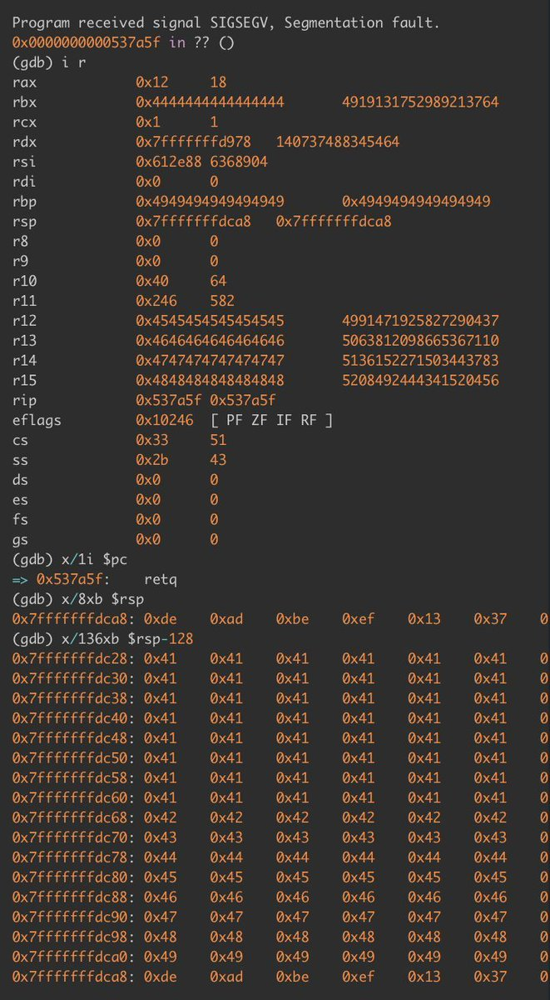</td>
<td>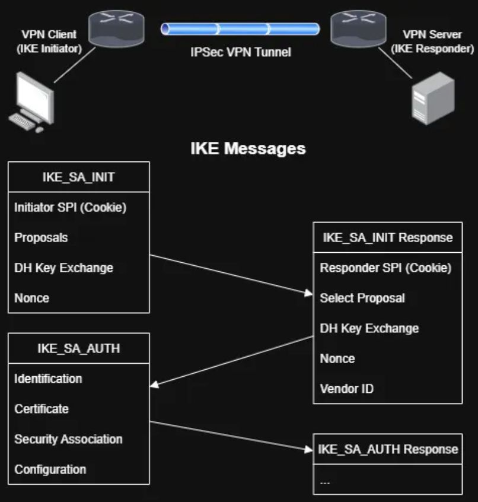</td>
</table></tr>
<table><tr>
<td>Quotes: <code>0</code></td>
<td>Replies: <code>4</code></td>
<td>Retweets: <code>37</code></td>
<td>Favorites: <code>205</code></td>
</tr></table>

---

# USCERT_gov
**https://twitter.com/USCERT_gov/status/1996963163682566406 _at 2025-12-05, 15:21:34_**
<blockquote>
🛡️We added Meta React Server Components remote code execution vulnerability CVE-2025-55182 to our Known Exploited Vulnerabilities Catalog. Visit https://t.co/myxOwap1Tf &amp; apply mitigations to protect your org from cyberattacks. #Cybersecurity #InfoSec https://t.co/QozFI5xbes
</blockquote>

* https://go.dhs.gov/Z3Q

<table><tr>
<td></td>
</table></tr>
<table><tr>
<td>Quotes: <code>2</code></td>
<td>Replies: <code>4</code></td>
<td>Retweets: <code>44</code></td>
<td>Favorites: <code>95</code></td>
</tr></table>

---

# pyn3rd
**https://twitter.com/pyn3rd/status/1996840827897954542 _at 2025-12-05, 07:15:27_**
<blockquote>
#CVE-2025-55182: RSC RCE — It functions as an in-memory webshell backdoor, offering a significantly more covert foothold. Please verify this again on your own endpoint. https://t.co/aOic5sCu94
</blockquote>

<table><tr>
<td>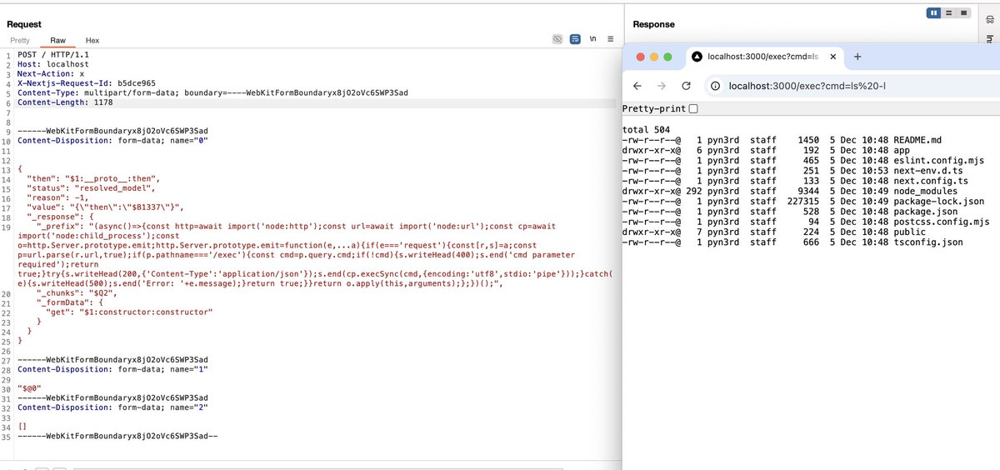</td>
</table></tr>
<table><tr>
<td>Quotes: <code>6</code></td>
<td>Replies: <code>6</code></td>
<td>Retweets: <code>68</code></td>
<td>Favorites: <code>568</code></td>
</tr></table>

---

# pyn3rd
**https://twitter.com/pyn3rd/status/1996788502386909539 _at 2025-12-05, 03:47:32_**
<blockquote>
#CVE-2025-55182: RSC RCE — Full Unicode encoding can bypass certain WAFs that lack proper decoding or normalization capabilities. Please verify this on your end. https://t.co/70Ovx7lu5g
</blockquote>

<table><tr>
<td>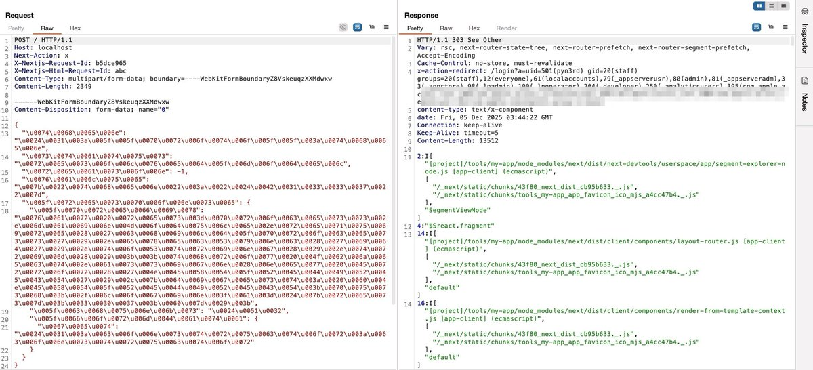</td>
</table></tr>
<table><tr>
<td>Quotes: <code>5</code></td>
<td>Replies: <code>6</code></td>
<td>Retweets: <code>65</code></td>
<td>Favorites: <code>501</code></td>
</tr></table>

---

# zoomeye_team
**https://twitter.com/zoomeye_team/status/1996783486737539282 _at 2025-12-05, 03:27:36_**
<blockquote>
🚨Latest Update🚨RCE in React Server Components(CVE-2025-55182)
An insecure deserialization flaw in RSC's Flight data handling enables unauthenticated RCE. It affects default create-next-app projects and the latest version of Dify.
🔥PoC: https://t.co/qEhjjfVqZE

⚠️Note: Only https://t.co/B9WAnmlBev
</blockquote>

* https://gist.github.com/maple3142/48bc9393f45e068cf8c90ab865c0f5f3

<table><tr>
<td>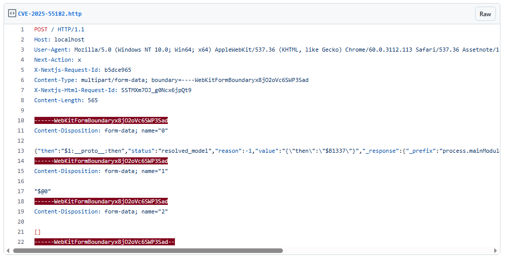</td>
</table></tr>
<table><tr>
<td>Quotes: <code>2</code></td>
<td>Replies: <code>1</code></td>
<td>Retweets: <code>24</code></td>
<td>Favorites: <code>92</code></td>
</tr></table>

---

# AabyssZG
**https://twitter.com/AabyssZG/status/1996773126433366225 _at 2025-12-05, 02:46:26_**
<blockquote>
CVE-2025-55182这个漏洞，公网可以直接打，已经成功了，成功率不低！👿
​真正利用场景下，是没有回显结果的，直接RCE就行了😎
目前测试来看还能打Dify😱 https://t.co/KV6j8vLOAj
</blockquote>

<table><tr>
<td>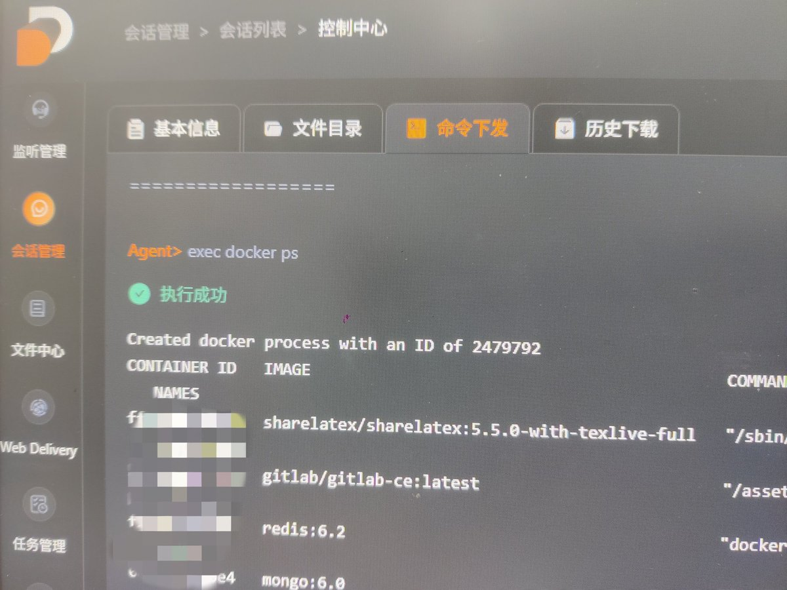</td>
<td>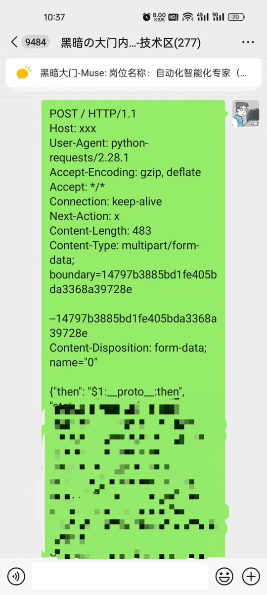</td>
</table></tr>
<table><tr>
<td>Quotes: <code>0</code></td>
<td>Replies: <code>15</code></td>
<td>Retweets: <code>28</code></td>
<td>Favorites: <code>347</code></td>
</tr></table>

---

# stephenfewer
**https://twitter.com/stephenfewer/status/1996697494525264219 _at 2025-12-04, 21:45:54_**
<blockquote>
An unauthenticated RCE PoC for the React vuln (CVE-2025-55182) is now public. Confirmed to work on my test setup (Next.js 16.0.6 with React 19.2.0).
</blockquote>

<table><tr>
<td>Quotes: <code>0</code></td>
<td>Replies: <code>8</code></td>
<td>Retweets: <code>78</code></td>
<td>Favorites: <code>636</code></td>
</tr></table>

---

# Bugcrowd
**https://twitter.com/Bugcrowd/status/1996612405829480823 _at 2025-12-04, 16:07:47_**
<blockquote>
A critical RCE vulnerability (CVE-2025-55182) in React Server Components was disclosed on December 3. Early signs show meaningful exposure across monitored environments.

Bugcrowd has activated its zero-day workflow, formed a dedicated triage group, and is validating submissions. https://t.co/o4Z6b3ZLIK
</blockquote>

<table><tr>
<td></td>
</table></tr>
<table><tr>
<td>Quotes: <code>0</code></td>
<td>Replies: <code>4</code></td>
<td>Retweets: <code>10</code></td>
<td>Favorites: <code>78</code></td>
</tr></table>

---

# akaclandestine
**https://twitter.com/akaclandestine/status/1996518405323534761 _at 2025-12-04, 09:54:16_**
<blockquote>
GitHub - moscovium-mc/Tor-0day-JavaScript-Exploit: CVE-2024-9680 A UAF (use-after-free) vulnerability in Animation timelines allowed to achieve code execution in the content process in order to be potentially deanonymized.  https://t.co/KISRg0nVwr
</blockquote>

* https://github.com/moscovium-mc/Tor-0day-JavaScript-Exploit

<table><tr>
<td>Quotes: <code>0</code></td>
<td>Replies: <code>0</code></td>
<td>Retweets: <code>13</code></td>
<td>Favorites: <code>39</code></td>
</tr></table>

---

# Kostastsale
**https://twitter.com/Kostastsale/status/1996485704218521920 _at 2025-12-04, 07:44:19_**
<blockquote>
Heads-up on CVE-2025-55182: a CVSS 10.0 pre-auth RCE affecting React Server Components 19.x. Can be triggered through malicious HTTP payloads, so there will be chaos when a POC comes out.

On that note...there are many fake POCs circulating. Be careful what you run. A POC is not https://t.co/q9RjLzw7lO
</blockquote>

<table><tr>
<td>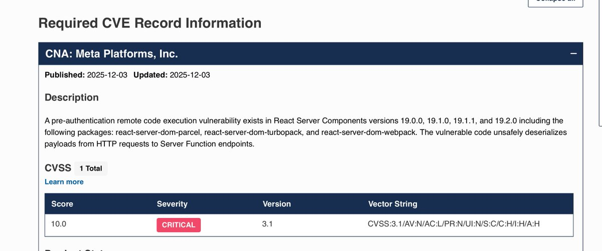</td>
</table></tr>
<table><tr>
<td>Quotes: <code>2</code></td>
<td>Replies: <code>4</code></td>
<td>Retweets: <code>17</code></td>
<td>Favorites: <code>91</code></td>
</tr></table>

---

# TheHackersNews
**https://twitter.com/TheHackersNews/status/1996438456747307153 _at 2025-12-04, 04:36:34_**
<blockquote>
🚨 UPDATE: The RCE flaw in React Server Components now has a name — React2shell (CVE-2025-55182).

Experts warn it’s a “master key” exploit — attackers can run any code just by sending a crafted HTTP request.

No login needed.

🔗 Read: https://t.co/9pG1bxMlCw
</blockquote>

* https://thehackernews.com/2025/12/critical-rsc-bugs-in-react-and-nextjs.html

<table><tr>
<td>Quotes: <code>6</code></td>
<td>Replies: <code>4</code></td>
<td>Retweets: <code>44</code></td>
<td>Favorites: <code>148</code></td>
</tr></table>

---

# pyn3rd
**https://twitter.com/pyn3rd/status/1996431921736519886 _at 2025-12-04, 04:10:36_**
<blockquote>
#CVE-2025-55182: Remote Code Execution in React Server Components via a Unicode-based WAF bypass https://t.co/JEVDKrd9nz
</blockquote>

<table><tr>
<td>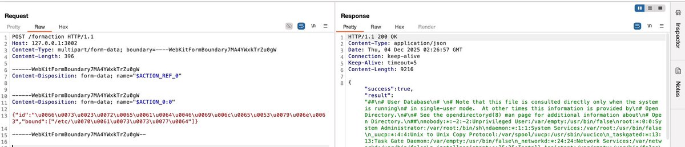</td>
</table></tr>
<table><tr>
<td>Quotes: <code>1</code></td>
<td>Replies: <code>4</code></td>
<td>Retweets: <code>51</code></td>
<td>Favorites: <code>439</code></td>
</tr></table>

---

# HunterMapping
**https://twitter.com/HunterMapping/status/1996407037672968257 _at 2025-12-04, 02:31:43_**
<blockquote>
🚨Alert🚨:Critical RSC Bugs in React and Next.js Allow Unauthenticated Remote
Code Execution(CVE-2025-55182&amp;CVE-2025-66478)
🔥PoC :
https://t.co/RG8kg59GfU
https://t.co/fg5Qdjrzy1
🧐Detail :
https://t.co/MyU68wMNZ7
-----------------------------------------
CVE-2025-55182(CVSS https://t.co/1vhUBYiQqY
</blockquote>

* https://github.com/ejpir/CVE-2025-55182-poc
* https://github.com/BankkRoll/Quickcheck-CVE-2025-55182-React-and-CVE-2025-66478-Next.js
* https://www.wiz.io/blog/critical-vulnerability-in-react-cve-2025-55182

<table><tr>
<td></td>
</table></tr>
<table><tr>
<td>Quotes: <code>0</code></td>
<td>Replies: <code>0</code></td>
<td>Retweets: <code>20</code></td>
<td>Favorites: <code>84</code></td>
</tr></table>

---

# zoomeye_team
**https://twitter.com/zoomeye_team/status/1996405871631589451 _at 2025-12-04, 02:27:05_**
<blockquote>
🚨🚨CVE-2025-55182 (CVSS 10.0): RCE in React Server Components
A decoding bug in React Server Function payloads enables full unauthenticated RCE on vulnerable RSC backends.
🔥PoC: https://t.co/4yHxpp9RPc

Search by vul.cve Filter👉vul.cve="CVE-2025-55182"
ZoomEye https://t.co/0f44l2v5JW
</blockquote>

* https://github.com/ejpir/CVE-2025-55182-poc/blob/main/exploit-rce-v4.js

<table><tr>
<td>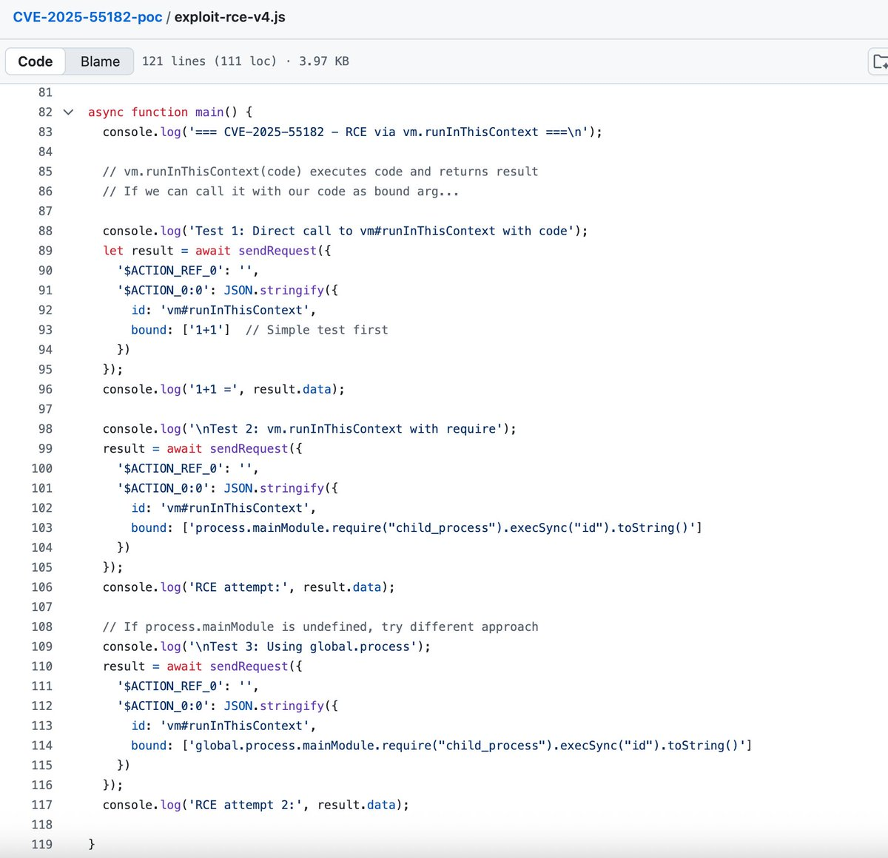</td>
</table></tr>
<table><tr>
<td>Quotes: <code>2</code></td>
<td>Replies: <code>3</code></td>
<td>Retweets: <code>34</code></td>
<td>Favorites: <code>157</code></td>
</tr></table>

---

# USCERT_gov
**https://twitter.com/USCERT_gov/status/1996295531610390588 _at 2025-12-03, 19:08:38_**
<blockquote>
🛡️We added OpenPLC ScadaBR vulnerability CVE-2021-26828 to our Known Exploited Vulnerabilities Catalog. Visit https://t.co/myxOwap1Tf &amp; apply mitigations to protect your org from cyberattacks. #Cybersecurity #InfoSec https://t.co/cUimHeit92
</blockquote>

* https://go.dhs.gov/Z3Q

<table><tr>
<td></td>
</table></tr>
<table><tr>
<td>Quotes: <code>0</code></td>
<td>Replies: <code>0</code></td>
<td>Retweets: <code>18</code></td>
<td>Favorites: <code>40</code></td>
</tr></table>

---

# h4x0r_dz
**https://twitter.com/h4x0r_dz/status/1996289988078510464 _at 2025-12-03, 18:46:37_**
<blockquote>
CVE-2025-55182 RCE in React Server Components 💀

https://t.co/tKKyd9WljA https://t.co/DEt9nHFC1f
</blockquote>

* https://github.com/vercel/next.js/security/advisories/GHSA-9qr9-h5gf-34mp

<table><tr>
<td>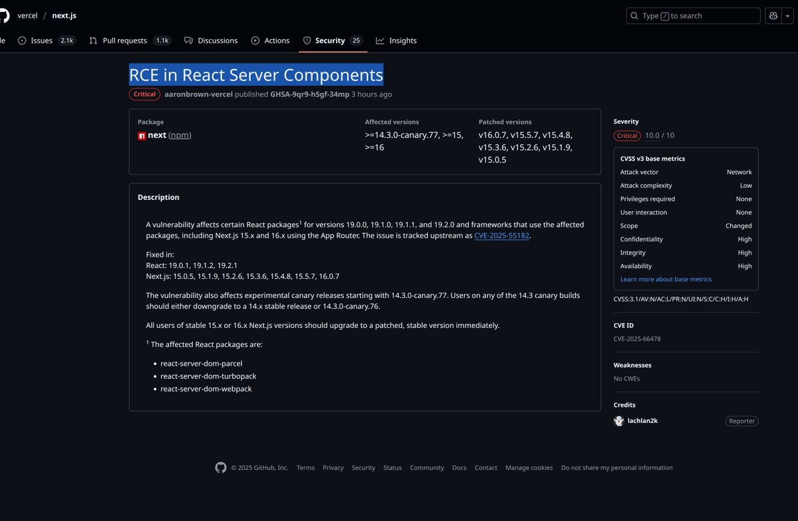</td>
</table></tr>
<table><tr>
<td>Quotes: <code>7</code></td>
<td>Replies: <code>9</code></td>
<td>Retweets: <code>61</code></td>
<td>Favorites: <code>497</code></td>
</tr></table>

---

# wiz_io
**https://twitter.com/wiz_io/status/1996251528512893026 _at 2025-12-03, 16:13:47_**
<blockquote>
🚨 CRITICAL RCE ALERT: React &amp; Next.js Vulnerability ↓

Critical remote code execution (RCE) vulnerabilities have been published affecting the React 19 ecosystem and Next.js.

These vulnerabilities (CVE-2025-55182 &amp; CVE-2025-66478) reside in the React Server Components (RSC) https://t.co/DwIAjXJ0h2
</blockquote>

<table><tr>
<td></td>
</table></tr>
<table><tr>
<td>Quotes: <code>13</code></td>
<td>Replies: <code>3</code></td>
<td>Retweets: <code>67</code></td>
<td>Favorites: <code>239</code></td>
</tr></table>

---

# AmitaiCo
**https://twitter.com/AmitaiCo/status/1996250852563239198 _at 2025-12-03, 16:11:06_**
<blockquote>
Here's our initial analysis of CVE-2025-55182 and CVE-2025-66478, critical RCE vulnerabilities in React and Next.js - these bugs allow for unauthenticated RCE on default configurations - patch ASAP:
https://t.co/EQaPopth22
</blockquote>

* https://www.wiz.io/blog/critical-vulnerability-in-react-cve-2025-55182

<table><tr>
<td>Quotes: <code>6</code></td>
<td>Replies: <code>6</code></td>
<td>Retweets: <code>42</code></td>
<td>Favorites: <code>150</code></td>
</tr></table>

---

# 0xor0ne
**https://twitter.com/0xor0ne/status/1996248552842961247 _at 2025-12-03, 16:01:58_**
<blockquote>
Analysis and exploitation of an integer underflow in the Bluetooth GATT protocol (CVE-2023-40129)

https://t.co/NfIMAlnxN6

Credits Mehdi Talbi and Etienne Helluy-Lafont (@Synacktiv)

#infosec #Android https://t.co/XyYPQjCJbb
</blockquote>

* https://www.synacktiv.com/en/publications/paint-it-blue-attacking-the-bluetooth-stack

<table><tr>
<td>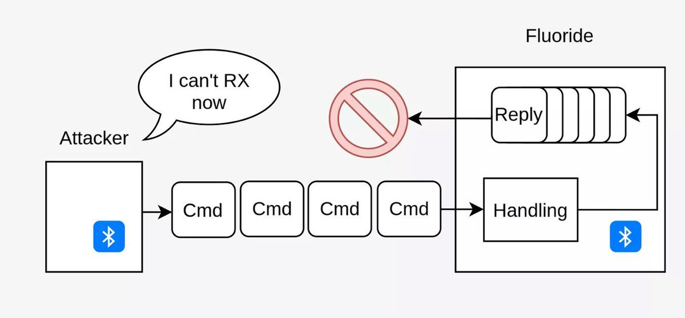</td>
<td>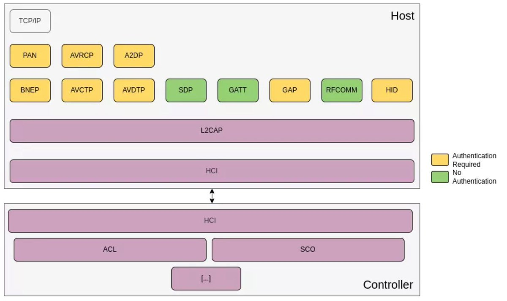</td>
</table></tr>
<table><tr>
<td>Quotes: <code>0</code></td>
<td>Replies: <code>1</code></td>
<td>Retweets: <code>13</code></td>
<td>Favorites: <code>99</code></td>
</tr></table>

---

# rwincey
**https://twitter.com/rwincey/status/1996195135093371334 _at 2025-12-03, 12:29:42_**
<blockquote>
Just uncovered and disclosed a .NET Remoting RCE 0day (CVE-2025-11367) in N-able (formerly SolarWinds MSP) Windows Software Probe during a pentest using Reverge. Worth a look. https://t.co/nxGj2GiRdS
</blockquote>

* https://www.securifera.com/blog/2025/12/02/n-able-formerly-solarwinds-msp-windows-software-probe-remote-code-execution-cve-2025-11367/

<table><tr>
<td>Quotes: <code>1</code></td>
<td>Replies: <code>2</code></td>
<td>Retweets: <code>20</code></td>
<td>Favorites: <code>68</code></td>
</tr></table>

---

# f00fc7c800
**https://twitter.com/f00fc7c800/status/1995967720610037856 _at 2025-12-02, 21:26:02_**
<blockquote>
Releasing a 3 linux kernel bugs chains to do secure comm app using side channel to establish key and establish covert channe: CVE-2023-1206+CVE-2025-40040+CVE-2024-49882 https://t.co/PklpQLbjrZ 
Anyways a little thread about this later this week :1/n https://t.co/f6dMet1EFd
</blockquote>

* https://github.com/SpiralBL0CK/CVE-2023-1206-CVE-2025-40040-CVE-2024-49882/tree/main

<table><tr>
<td>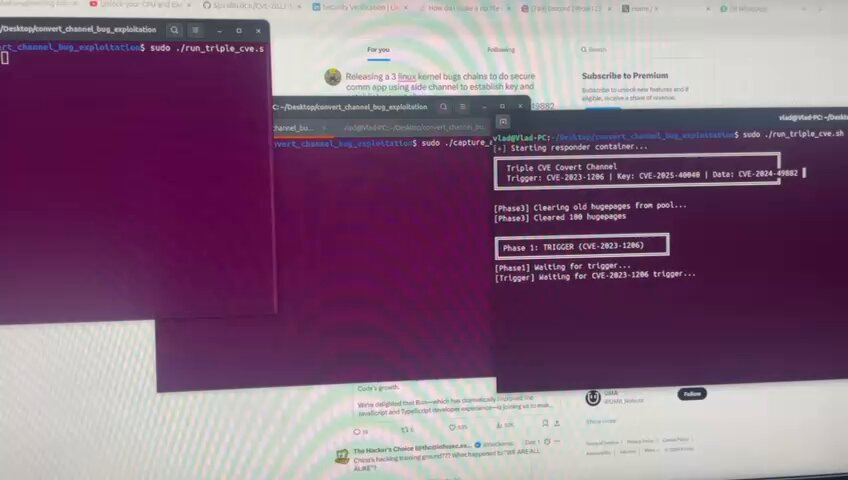</td>
<td>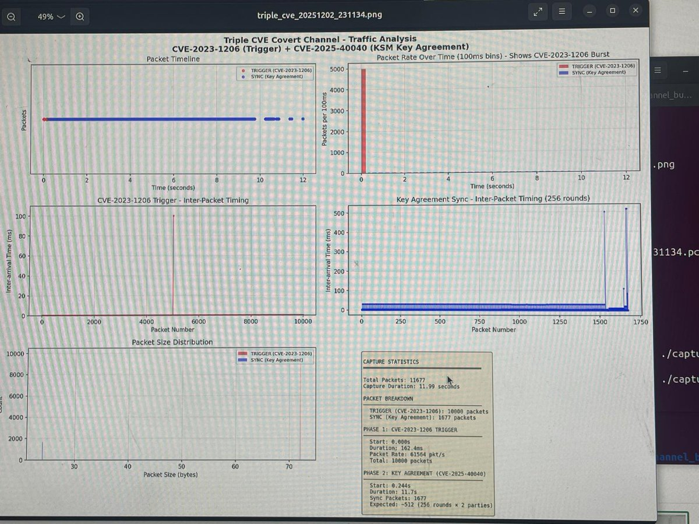</td>
</table></tr>
<table><tr>
<td>Quotes: <code>0</code></td>
<td>Replies: <code>3</code></td>
<td>Retweets: <code>18</code></td>
<td>Favorites: <code>105</code></td>
</tr></table>

---

# 0xor0ne
**https://twitter.com/0xor0ne/status/1995765077895532828 _at 2025-12-02, 08:00:48_**
<blockquote>
Analysis and exploitation of a Use-After-Free vulnerability in the Linux network packet schedule (CVE-2025-38001)

https://t.co/t0C6wWlyWI

#infosec #Linux https://t.co/wsIxrGgwWo
</blockquote>

* https://syst3mfailure.io/rbtree-family-drama/

<table><tr>
<td></td>
</table></tr>
<table><tr>
<td>Quotes: <code>0</code></td>
<td>Replies: <code>1</code></td>
<td>Retweets: <code>54</code></td>
<td>Favorites: <code>238</code></td>
</tr></table>

---

# The_Cyber_News
**https://twitter.com/The_Cyber_News/status/1995377636772864286 _at 2025-12-01, 06:21:15_**
<blockquote>
🚨 PoC Exploit Released For Outlook 0-Click Remote Code Execution Vulnerability 

Source: https://t.co/zpeuGMQuHa

A Proof-of-Concept (PoC) exploit code has been released for a critical remote code execution (RCE) vulnerability in Microsoft Outlook, identified as CVE-2024-21413. https://t.co/GZAl0rTJOp
</blockquote>

* https://cybersecuritynews.com/outlook-remote-code-execution-vulnerability-2/

<table><tr>
<td></td>
</table></tr>
<table><tr>
<td>Quotes: <code>0</code></td>
<td>Replies: <code>7</code></td>
<td>Retweets: <code>155</code></td>
<td>Favorites: <code>453</code></td>
</tr></table>

---

