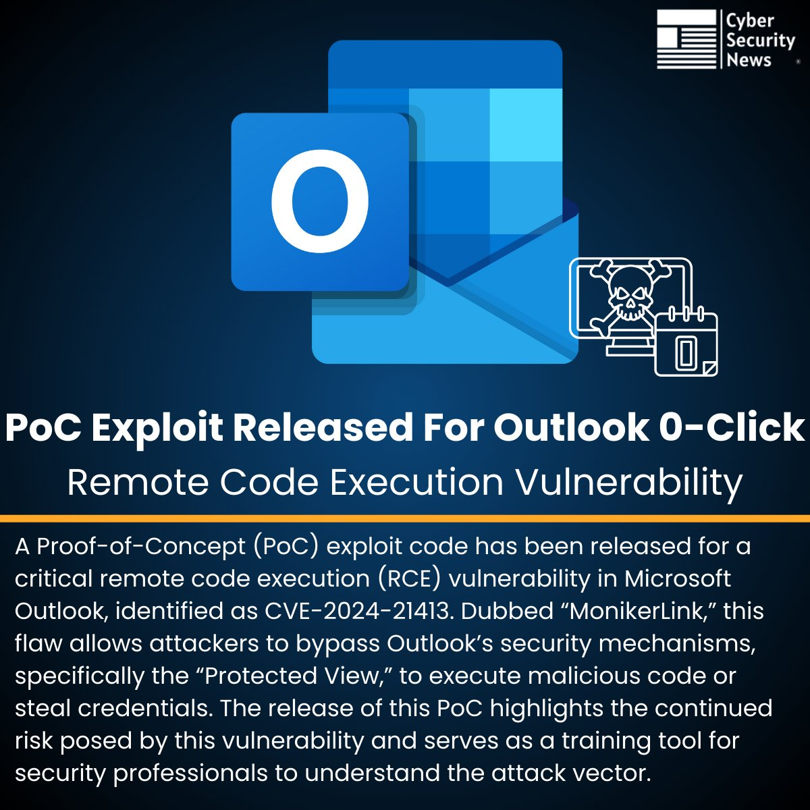

# The_Cyber_News
**https://twitter.com/The_Cyber_News/status/1995377636772864286 _at 2025-12-01, 06:21:15_**
<blockquote>
🚨 PoC Exploit Released For Outlook 0-Click Remote Code Execution Vulnerability 

Source: https://t.co/zpeuGMQuHa

A Proof-of-Concept (PoC) exploit code has been released for a critical remote code execution (RCE) vulnerability in Microsoft Outlook, identified as CVE-2024-21413. https://t.co/GZAl0rTJOp
</blockquote>

* https://cybersecuritynews.com/outlook-remote-code-execution-vulnerability-2/

<table><tr>
<td></td>
</table></tr>
<table><tr>
<td>Quotes: <code>0</code></td>
<td>Replies: <code>6</code></td>
<td>Retweets: <code>134</code></td>
<td>Favorites: <code>378</code></td>
</tr></table>

---

